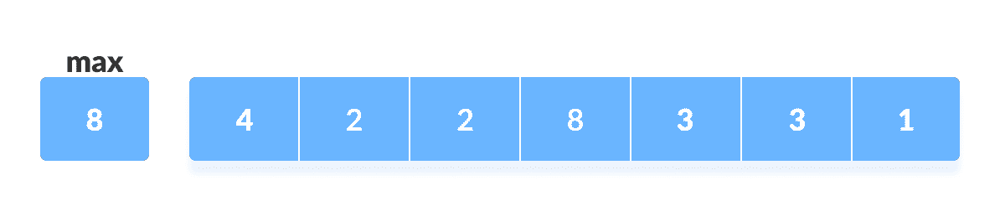
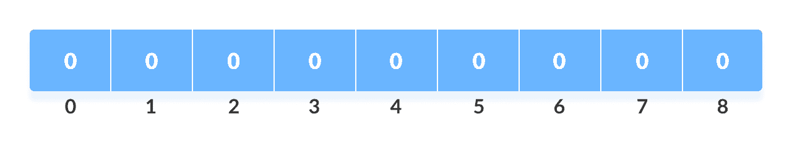
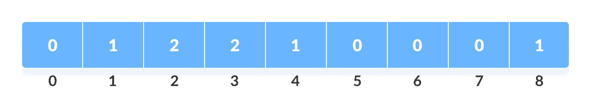
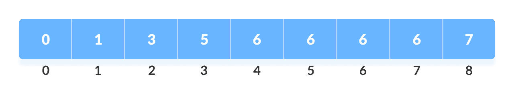
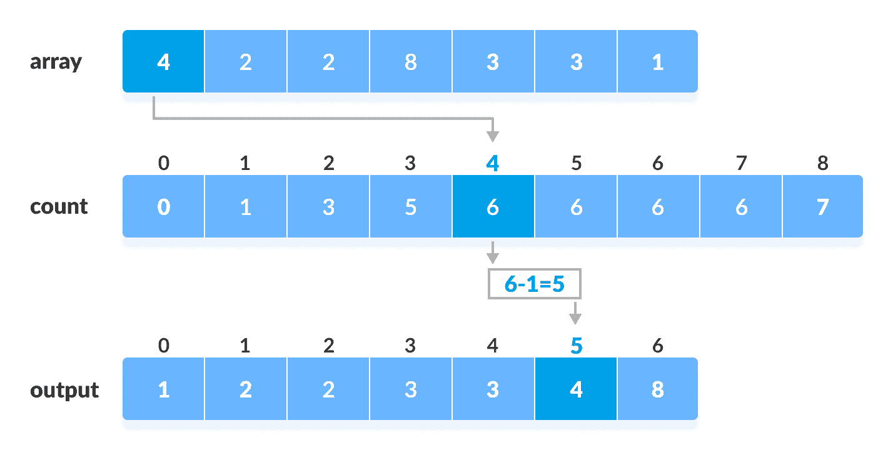

# 计数排序算法

> 原文： [https://www.programiz.com/dsa/counting-sort](https://www.programiz.com/dsa/counting-sort)

#### 在本教程中，您将学习计数排序的工作原理。 此外，您还将找到 C，C++ ，Java 和 Python 中计数排序的工作示例。

计数排序是一种排序算法，它通过计算数组中每个唯一元素的出现次数来对数组的元素进行排序。 计数存储在辅助数组中，并通过将计数映射为辅助数组的索引来完成排序。

* * *

## 计数排序如何工作？

1.  从给定数组中找出最大元素（将其设为`max`）。

    

    给定数组

    

2.  使用所有元素 0 初始化长度为`max+1`的数组。此数组用于存储数组中元素的计数。

    

    计数数组

    

3.  将每个元素的计数存储在`count`数组

    中它们各自的索引处，例如：如果元素 3 的计数为 2，则将 2 存储在`count`数组的第 3 位 。 如果数组中不存在元素“5”，则在第 5 个位置存储 0。

    

    存储的每个元素的计数

    

4.  存储计数数组元素的累积和。 它有助于将元素放入已排序数组的正确索引中。

    

    累计计数

    

5.  在`count`数组中找到原始数组的每个元素的索引。 这给出了累计计数。 将元素放置在计算出的索引处，如下图所示。

    

    计数类别

    

6.  将每个元素放置在正确位置后，将其数量减少一。

* * *

## 计数排序算法

```
countingSort(array, size)
  max <- find largest element in array
  initialize count array with all zeros
  for j <- 0 to size
    find the total count of each unique element and 
    store the count at jth index in count array
  for i <- 1 to max
    find the cumulative sum and store it in count array itself
  for j <- size down to 1
    restore the elements to array
    decrease count of each element restored by 1
```

* * *

## Python，Java 和 C/C++ 示例


```py
# Counting sort in Python programming

def countingSort(array):
    size = len(array)
    output = [0] * size

    # Initialize count array
    count = [0] * 10

    # Store the count of each elements in count array
    for i in range(0, size):
        count[array[i]] += 1

    # Store the cummulative count
    for i in range(1, 10):
        count[i] += count[i - 1]

    # Find the index of each element of the original array in count array
    # place the elements in output array
    i = size - 1
    while i >= 0:
        output[count[array[i]] - 1] = array[i]
        count[array[i]] -= 1
        i -= 1

    # Copy the sorted elements into original array
    for i in range(0, size):
        array[i] = output[i]

data = [4, 2, 2, 8, 3, 3, 1]
countingSort(data)
print("Sorted Array in Ascending Order: ")
print(data)
```

```java
// Counting sort in Java programming

import java.util.Arrays;

class CountingSort {
  void countSort(int array[], int size) {
    int[] output = new int[size + 1];

    // Find the largest element of the array
    int max = array[0];
    for (int i = 1; i < size; i++) {
      if (array[i] > max)
        max = array[i];
    }
    int[] count = new int[max + 1];

    // Initialize count array with all zeros.
    for (int i = 0; i < max; ++i) {
      count[i] = 0;
    }

    // Store the count of each element
    for (int i = 0; i < size; i++) {
      count[array[i]]++;
    }

    // Store the cummulative count of each array
    for (int i = 1; i <= max; i++) {
      count[i] += count[i - 1];
    }

    // Find the index of each element of the original array in count array, and
    // place the elements in output array
    for (int i = size - 1; i >= 0; i--) {
      output[count[array[i]] - 1] = array[i];
      count[array[i]]--;
    }

    // Copy the sorted elements into original array
    for (int i = 0; i < size; i++) {
      array[i] = output[i];
    }
  }

  // Driver code
  public static void main(String args[]) {
    int[] data = { 4, 2, 2, 8, 3, 3, 1 };
    int size = data.length;
    CountingSort cs = new CountingSort();
    cs.countSort(data, size);
    System.out.println("Sorted Array in Ascending Order: ");
    System.out.println(Arrays.toString(data));
  }
}
```

```c
// Counting sort in C programming

#include <stdio.h>

void countingSort(int array[], int size) {
  int output[10];

  // Find the largest element of the array
  int max = array[0];
  for (int i = 1; i < size; i++) {
    if (array[i] > max)
      max = array[i];
  }

  // The size of count must be at least (max+1) but
  // we cannot declare it as int count(max+1) in C as
  // it does not support dynamic memory allocation.
  // So, its size is provided statically.
  int count[10];

  // Initialize count array with all zeros.
  for (int i = 0; i <= max; ++i) {
    count[i] = 0;
  }

  // Store the count of each element
  for (int i = 0; i < size; i++) {
    count[array[i]]++;
  }

  // Store the cummulative count of each array
  for (int i = 1; i <= max; i++) {
    count[i] += count[i - 1];
  }

  // Find the index of each element of the original array in count array, and
  // place the elements in output array
  for (int i = size - 1; i >= 0; i--) {
    output[count[array[i]] - 1] = array[i];
    count[array[i]]--;
  }

  // Copy the sorted elements into original array
  for (int i = 0; i < size; i++) {
    array[i] = output[i];
  }
}

// Function to print an array
void printArray(int array[], int size) {
  for (int i = 0; i < size; ++i) {
    printf("%d  ", array[i]);
  }
  printf("\n");
}

// Driver code
int main() {
  int array[] = {4, 2, 2, 8, 3, 3, 1};
  int n = sizeof(array) / sizeof(array[0]);
  countingSort(array, n);
  printArray(array, n);
}
```

```cpp
// Counting sort in C++ programming

#include <iostream>
using namespace std;

void countSort(int array[], int size) {
  // The size of count must be at least the (max+1) but
  // we cannot assign declare it as int count(max+1) in C++ as
  // it does not support dynamic memory allocation.
  // So, its size is provided statically.
  int output[10];
  int count[10];
  int max = array[0];

  // Find the largest element of the array
  for (int i = 1; i < size; i++) {
    if (array[i] > max)
      max = array[i];
  }

  // Initialize count array with all zeros.
  for (int i = 0; i <= max; ++i) {
    count[i] = 0;
  }

  // Store the count of each element
  for (int i = 0; i < size; i++) {
    count[array[i]]++;
  }

  // Store the cummulative count of each array
  for (int i = 1; i <= max; i++) {
    count[i] += count[i - 1];
  }

  // Find the index of each element of the original array in count array, and
  // place the elements in output array
  for (int i = size - 1; i >= 0; i--) {
    output[count[array[i]] - 1] = array[i];
    count[array[i]]--;
  }

  // Copy the sorted elements into original array
  for (int i = 0; i < size; i++) {
    array[i] = output[i];
  }
}

// Function to print an array
void printArray(int array[], int size) {
  for (int i = 0; i < size; i++)
    cout << array[i] << " ";
  cout << endl;
}

// Driver code
int main() {
  int array[] = {4, 2, 2, 8, 3, 3, 1};
  int n = sizeof(array) / sizeof(array[0]);
  countSort(array, n);
  printArray(array, n);
}
```

* * *

## 复杂度

**时间复杂度**：

主要有四个主要循环。 （可以在函数之外找到最大值。）

| 循环 | 计数时间 |
| --- | --- |
| 第一 | `O(max)` |
| 第二 | `O(size)` |
| 第三 | `O(max)` |
| 第四 | `O(size)` |

总体复杂度= `O(max)+O(size)+O(max)+O(size)` = `O(max+size)`

*   **最坏情况**： `O(n+k)`
*   **最佳情况复杂度**： `O(n+k)`
*   **平均情况复杂度**： `O(n+k)`

在上述所有情况下，复杂度都是相同的，因为无论元素如何放置在数组中，算法都会经历`n+k`次。

没有任何元素之间的比较，因此它比基于比较的排序技术要好。 但是，如果整数很大，那是不好的，因为应该制作该大小的数组。

**空间复杂度**：

计数排序的空间复杂度为`O(max)`。 元素范围越大，空间复杂度越大。

* * *

## 计算排序应用

在以下情况下使用计数排序：

*   有多个较小的整数。
*   线性复杂度是必要的。