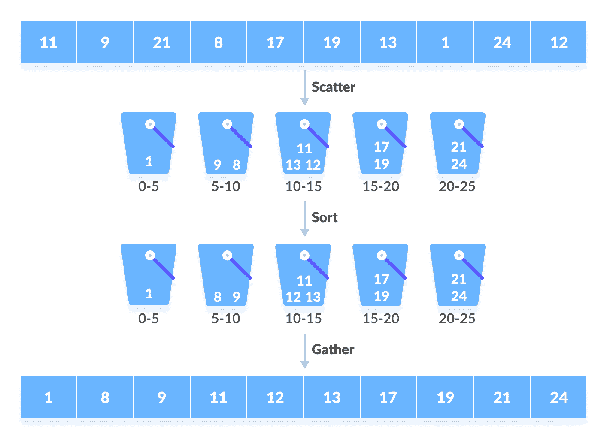
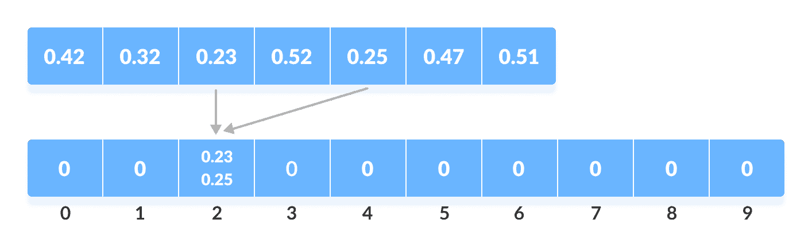
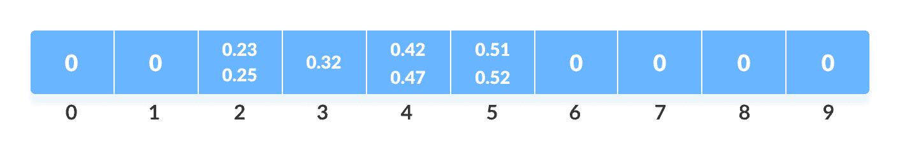
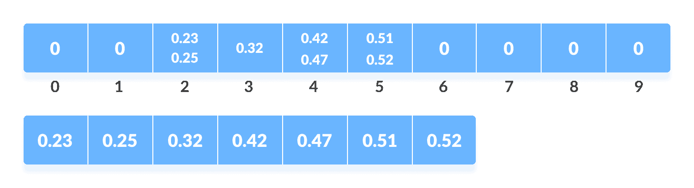

# 桶排序算法

> 原文： [https://www.programiz.com/dsa/bucket-sort](https://www.programiz.com/dsa/bucket-sort)

#### 在本教程中，您将学习存储桶排序的工作方式。 此外，您还将找到使用 C，C++ ，Java 和 Python 进行存储桶排序的工作示例。

存储桶排序是一种排序技术，它通过首先将元素划分为几个称为**存储桶**的组来对元素进行排序。 每个**存储桶**内部的元素都可以使用任何合适的排序算法进行排序，也可以递归调用同一算法。

创建了几个存储桶。 每个存储桶都填充有特定范围的元素。 存储桶中的元素使用任何其他算法进行排序。 最后，收集存储桶中的元素以获取排序后的数组。

桶分类的过程可以理解为**，分散收集**方法。 首先将元素分散到存储桶中，然后对存储桶的元素进行排序。 最后，元素按顺序收集。



Working of Bucket Sort


* * *

## 桶分类如何工作？

1.  假设输入数组为：

    

    输入数组

    

    创建一个大小为 10 的数组。此数组的每个插槽用作存储元素的存储桶。

    

    每个位置是一个存储区的数组

    

2.  将元素插入数组中的存储桶。 根据铲斗的范围插入元素。

    在我们的示例代码中，我们有每个范围从 0 到 1、1 到 2、2 到 3，...（n-1）到 n 的存储桶。
    假设输入元素为`.23`。 它乘以`size = 10`（即`.23*10=2.3`）。 然后，将其转换为整数（即​​`2.3≈2`）。 最后，将.23 插入 **bucket-2** 中。

    

    将元素从数组

    

    插入到存储桶中。同样，.25 也插入到同一存储桶中。 每次都采用浮点数的下限值。

    **如果我们使用整数作为输入，则必须将其除以间隔（此处为 10）以获得下限值。**

    同样，其他元素也插入各自的存储桶中。

    

    将所有元素从数组

    

    插入存储桶中
3.  使用任何稳定的排序算法对每个存储桶的元素进行排序。 在这里，我们使用了 quicksort（内置函数）。

    

    对每个存储区中的元素进行排序

    

4.  收集每个存储桶中的元素。

    通过遍历存储桶并在每个循环中将单个元素插入原始数组来完成。 一旦将存储桶中的元素复制到原始数组中，该元素将被擦除。

    

    从每个存储桶中收集元素

    

* * *

## 桶排序算法

```
bucketSort()
  create N buckets each of which can hold a range of values
  for all the buckets
    initialize each bucket with 0 values
  for all the buckets
    put elements into buckets matching the range
  for all the buckets 
    sort elements in each bucket
  gather elements from each bucket
end bucketSort
```

* * *

## Python，Java 和 C / C++ 示例

[Python](#python-code)[Java](#java-code)[C](#c-code)[C++](#cpp-code)

```
# Bucket Sort in Python

def bucketSort(array):
    bucket = []

    # Create empty buckets
    for i in range(len(array)):
        bucket.append([])

    # Insert elements into their respective buckets
    for j in array:
        index_b = int(10 * j)
        bucket[index_b].append(j)

    # Sort the elements of each bucket
    for i in range(len(array)):
        bucket[i] = sorted(bucket[i])

    # Get the sorted elements
    k = 0
    for i in range(len(array)):
        for j in range(len(bucket[i])):
            array[k] = bucket[i][j]
            k += 1
    return array

array = [.42, .32, .33, .52, .37, .47, .51]
print("Sorted Array in descending order is")
print(bucketSort(array)) 
```

```
// Bucket sort in Java

import java.util.ArrayList;
import java.util.Collections;

public class BucketSort {
  public void bucketSort(float[] arr, int n) {
    if (n <= 0)
      return;
    @SuppressWarnings("unchecked")
    ArrayList<Float>[] bucket = new ArrayList[n];

    // Create empty buckets
    for (int i = 0; i < n; i++)
      bucket[i] = new ArrayList<Float>();

    // Add elements into the buckets
    for (int i = 0; i < n; i++) {
      int bucketIndex = (int) arr[i] * n;
      bucket[bucketIndex].add(arr[i]);
    }

    // Sort the elements of each bucket
    for (int i = 0; i < n; i++) {
      Collections.sort((bucket[i]));
    }

    // Get the sorted array
    int index = 0;
    for (int i = 0; i < n; i++) {
      for (int j = 0, size = bucket[i].size(); j < size; j++) {
        arr[index++] = bucket[i].get(j);
      }
    }
  }

  // Driver code
  public static void main(String[] args) {
    BucketSort b = new BucketSort();
    float[] arr = { (float) 0.42, (float) 0.32, (float) 0.33, (float) 0.52, (float) 0.37, (float) 0.47,
        (float) 0.51 };
    b.bucketSort(arr, 7);

    for (float i : arr)
      System.out.print(i + "  ");
  }
}
```

```
// Bucket sort in C

#include <stdio.h>
#include <stdlib.h>

#define NARRAY 7   // Array size
#define NBUCKET 6  // Number of buckets
#define INTERVAL 10  // Each bucket capacity

struct Node {
  int data;
  struct Node *next;
};

void BucketSort(int arr[]);
struct Node *InsertionSort(struct Node *list);
void print(int arr[]);
void printBuckets(struct Node *list);
int getBucketIndex(int value);

// Sorting function
void BucketSort(int arr[]) {
  int i, j;
  struct Node **buckets;

  // Create buckets and allocate memory size
  buckets = (struct Node **)malloc(sizeof(struct Node *) * NBUCKET);

  // Initialize empty buckets
  for (i = 0; i < NBUCKET; ++i) {
    buckets[i] = NULL;
  }

  // Fill the buckets with respective elements
  for (i = 0; i < NARRAY; ++i) {
    struct Node *current;
    int pos = getBucketIndex(arr[i]);
    current = (struct Node *)malloc(sizeof(struct Node));
    current->data = arr[i];
    current->next = buckets[pos];
    buckets[pos] = current;
  }

  // Print the buckets along with their elements
  for (i = 0; i < NBUCKET; i++) {
    printf("Bucket[%d]: ", i);
    printBuckets(buckets[i]);
    printf("\n");
  }

  // Sort the elements of each bucket
  for (i = 0; i < NBUCKET; ++i) {
    buckets[i] = InsertionSort(buckets[i]);
  }

  printf("-------------\n");
  printf("Bucktets after sorting\n");
  for (i = 0; i < NBUCKET; i++) {
    printf("Bucket[%d]: ", i);
    printBuckets(buckets[i]);
    printf("\n");
  }

  // Put sorted elements on arr
  for (j = 0, i = 0; i < NBUCKET; ++i) {
    struct Node *node;
    node = buckets[i];
    while (node) {
      arr[j++] = node->data;
      node = node->next;
    }
  }

  return;
}

// Function to sort the elements of each bucket
struct Node *InsertionSort(struct Node *list) {
  struct Node *k, *nodeList;
  if (list == 0 || list->next == 0) {
    return list;
  }

  nodeList = list;
  k = list->next;
  nodeList->next = 0;
  while (k != 0) {
    struct Node *ptr;
    if (nodeList->data > k->data) {
      struct Node *tmp;
      tmp = k;
      k = k->next;
      tmp->next = nodeList;
      nodeList = tmp;
      continue;
    }

    for (ptr = nodeList; ptr->next != 0; ptr = ptr->next) {
      if (ptr->next->data > k->data)
        break;
    }

    if (ptr->next != 0) {
      struct Node *tmp;
      tmp = k;
      k = k->next;
      tmp->next = ptr->next;
      ptr->next = tmp;
      continue;
    } else {
      ptr->next = k;
      k = k->next;
      ptr->next->next = 0;
      continue;
    }
  }
  return nodeList;
}

int getBucketIndex(int value) {
  return value / INTERVAL;
}

void print(int ar[]) {
  int i;
  for (i = 0; i < NARRAY; ++i) {
    printf("%d ", ar[i]);
  }
  printf("\n");
}

// Print buckets
void printBuckets(struct Node *list) {
  struct Node *cur = list;
  while (cur) {
    printf("%d ", cur->data);
    cur = cur->next;
  }
}

// Driver code
int main(void) {
  int array[NARRAY] = {42, 32, 33, 52, 37, 47, 51};

  printf("Initial array: ");
  print(array);
  printf("-------------\n");

  BucketSort(array);
  printf("-------------\n");
  printf("Sorted array: ");
  print(array);
  return 0;
}
```

```
// Bucket sort in C++

#include <iomanip>
#include <iostream>
using namespace std;

#define NARRAY 7   // Array size
#define NBUCKET 6  // Number of buckets
#define INTERVAL 10  // Each bucket capacity

struct Node {
  int data;
  struct Node *next;
};

void BucketSort(int arr[]);
struct Node *InsertionSort(struct Node *list);
void print(int arr[]);
void printBuckets(struct Node *list);
int getBucketIndex(int value);

// Sorting function
void BucketSort(int arr[]) {
  int i, j;
  struct Node **buckets;

  // Create buckets and allocate memory size
  buckets = (struct Node **)malloc(sizeof(struct Node *) * NBUCKET);

  // Initialize empty buckets
  for (i = 0; i < NBUCKET; ++i) {
    buckets[i] = NULL;
  }

  // Fill the buckets with respective elements
  for (i = 0; i < NARRAY; ++i) {
    struct Node *current;
    int pos = getBucketIndex(arr[i]);
    current = (struct Node *)malloc(sizeof(struct Node));
    current->data = arr[i];
    current->next = buckets[pos];
    buckets[pos] = current;
  }

  // Print the buckets along with their elements
  for (i = 0; i < NBUCKET; i++) {
    cout << "Bucket[" << i << "] : ";
    printBuckets(buckets[i]);
    cout << endl;
  }

  // Sort the elements of each bucket
  for (i = 0; i < NBUCKET; ++i) {
    buckets[i] = InsertionSort(buckets[i]);
  }

  cout << "-------------" << endl;
  cout << "Bucktets after sorted" << endl;
  for (i = 0; i < NBUCKET; i++) {
    cout << "Bucket[" << i << "] : ";
    printBuckets(buckets[i]);
    cout << endl;
  }

  // Put sorted elements on arr
  for (j = 0, i = 0; i < NBUCKET; ++i) {
    struct Node *node;
    node = buckets[i];
    while (node) {
      arr[j++] = node->data;
      node = node->next;
    }
  }

  for (i = 0; i < NBUCKET; ++i) {
    struct Node *node;
    node = buckets[i];
    while (node) {
      struct Node *tmp;
      tmp = node;
      node = node->next;
      free(tmp);
    }
  }
  free(buckets);
  return;
}

// Function to sort the elements of each bucket
struct Node *InsertionSort(struct Node *list) {
  struct Node *k, *nodeList;
  if (list == 0 || list->next == 0) {
    return list;
  }

  nodeList = list;
  k = list->next;
  nodeList->next = 0;
  while (k != 0) {
    struct Node *ptr;
    if (nodeList->data > k->data) {
      struct Node *tmp;
      tmp = k;
      k = k->next;
      tmp->next = nodeList;
      nodeList = tmp;
      continue;
    }

    for (ptr = nodeList; ptr->next != 0; ptr = ptr->next) {
      if (ptr->next->data > k->data)
        break;
    }

    if (ptr->next != 0) {
      struct Node *tmp;
      tmp = k;
      k = k->next;
      tmp->next = ptr->next;
      ptr->next = tmp;
      continue;
    } else {
      ptr->next = k;
      k = k->next;
      ptr->next->next = 0;
      continue;
    }
  }
  return nodeList;
}

int getBucketIndex(int value) {
  return value / INTERVAL;
}

// Print buckets
void print(int ar[]) {
  int i;
  for (i = 0; i < NARRAY; ++i) {
    cout << setw(3) << ar[i];
  }
  cout << endl;
}

void printBuckets(struct Node *list) {
  struct Node *cur = list;
  while (cur) {
    cout << setw(3) << cur->data;
    cur = cur->next;
  }
}

// Driver code
int main(void) {
  int array[NARRAY] = {42, 32, 33, 52, 37, 47, 51};

  cout << "Initial array: " << endl;
  print(array);
  cout << "-------------" << endl;

  BucketSort(array);
  cout << "-------------" << endl;
  cout << "Sorted array: " << endl;
  print(array);
}
```

* * *

## 复杂

*   **最坏情况的复杂度：** `O(n<sup>2</sup>)`
    当数组中有近距离的元素时，它们很可能放在同一存储桶中。 这可能会导致某些存储桶中的元素数量比其他存储桶更多。
    它使复杂度取决于用于对存储区元素进行排序的排序算法。
    当元素的顺序相反时，复杂性将变得更加糟糕。 如果使用插入排序对存储桶中的元素进行排序，则时间复杂度变为`O(n<sup>2</sup>)`。
*   **最佳情况复杂度：** `O(n+k)`
    当元素在桶中均匀分布且每个桶中元素数量几乎相等时，会发生这种情况。
    如果存储桶中的元素已经被分类，那么复杂性就会变得更好。
    如果使用插入排序对存储桶中的元素进行排序，则最佳情况下的总体复杂度将是线性的，即。`O(n+k)`。`O(n)`是制造存储桶的复杂度，`O(k)`是使用在最佳情况下具有线性时间复杂度的算法对存储桶的元素进行分类的复杂度。
*   **平均大小写复杂度：** `O(n)`
    当元素在数组中随机分布时发生。 即使元素分布不均匀，存储桶排序也会在线性时间内运行。 直到铲斗尺寸的平方和在元素总数中呈线性关系时，它才成立。

* * *

## 桶分类应用

在以下情况下使用存储桶排序：

*   输入均匀地分布在一个范围内。
*   有浮点值