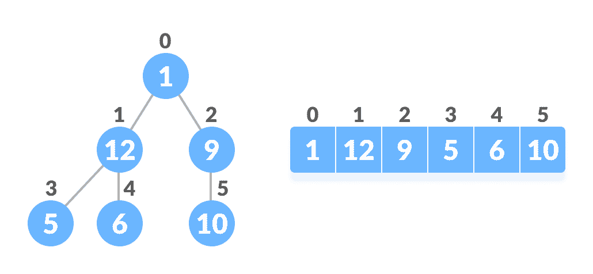
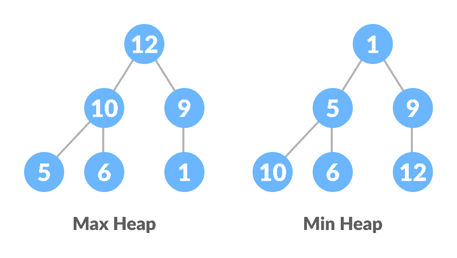
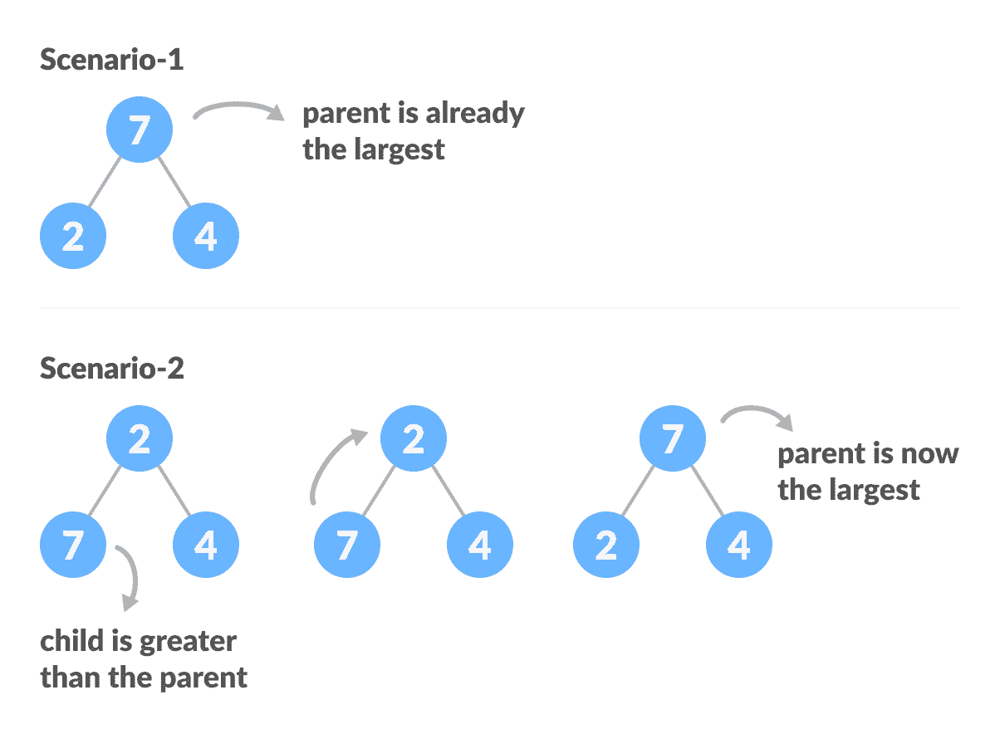
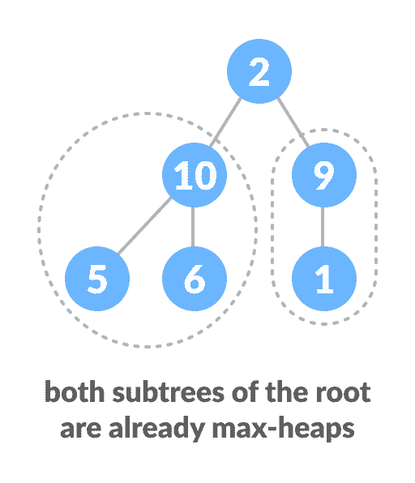
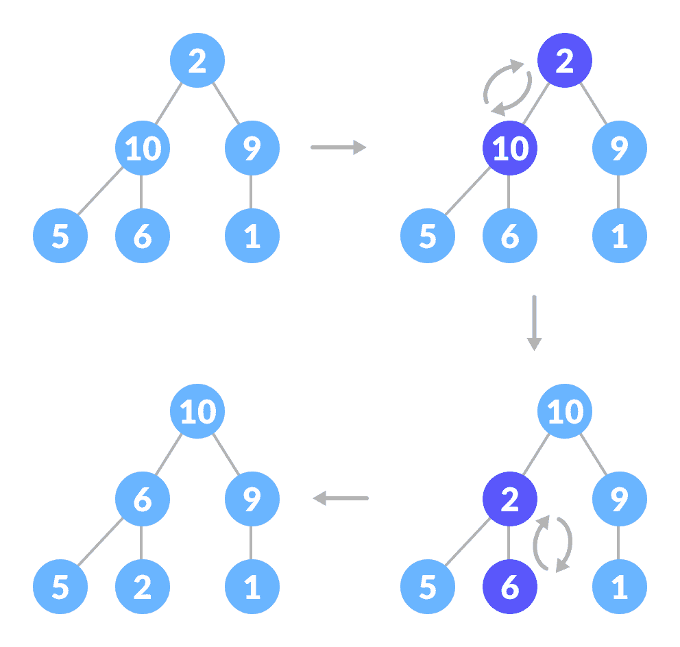
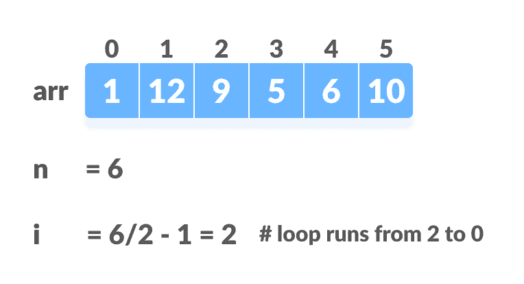
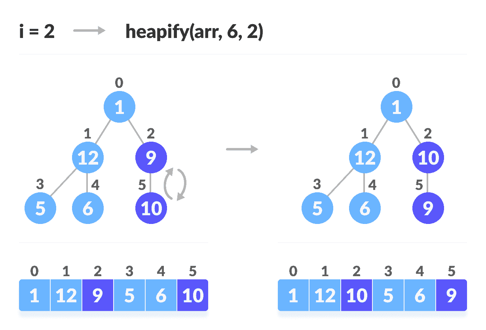
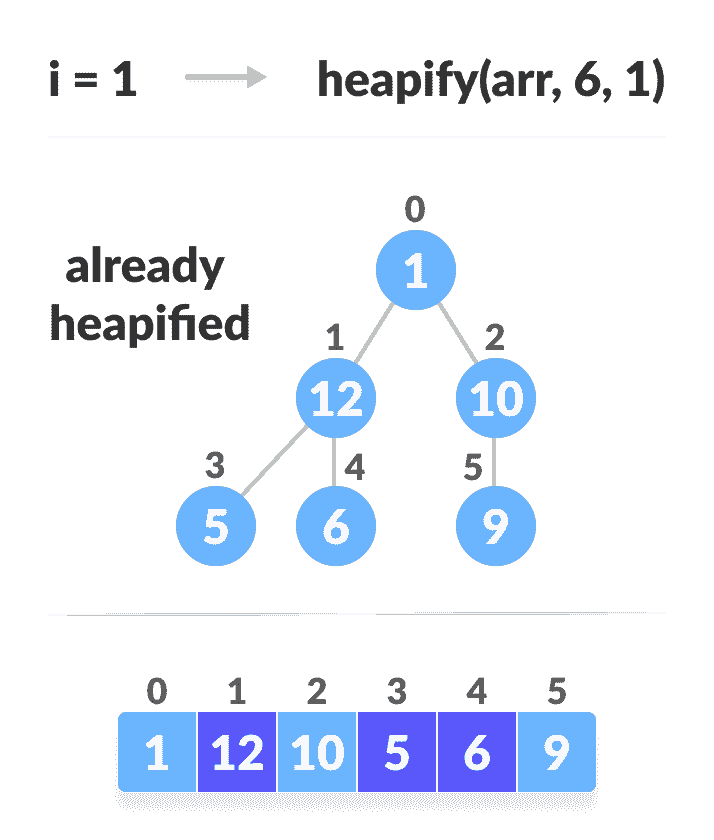
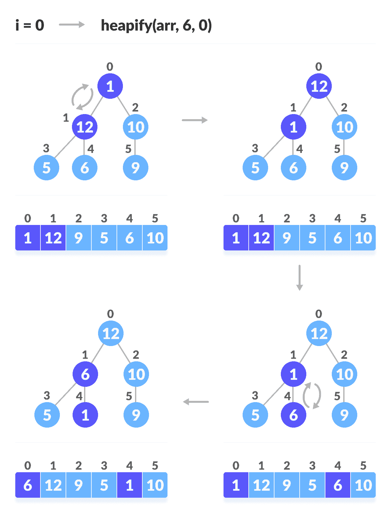
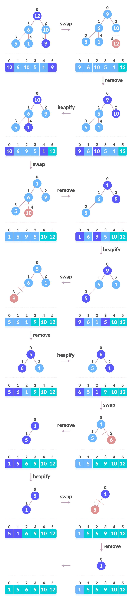

# 堆排序算法

> 原文： [https://www.programiz.com/dsa/heap-sort](https://www.programiz.com/dsa/heap-sort)

#### 在本教程中，您将学习堆排序算法的工作原理。 此外，您还将找到使用 C，C++ ，Java 和 Python 进行堆排序的工作示例。

堆排序是计算机编程中一种流行且高效的排序算法。 学习如何编写堆排序算法需要了解两种类型的数据结构-数组和树。

我们要排序的初始数字集存储在一个数组中，例如`[10, 3, 76, 34, 23, 32]`，排序后，我们得到一个排序数组`[3,10,23,32,34,76]`

堆排序的工作原理是将数组的元素可视化为一种特殊的完整二叉树，称为堆。

前提条件是，您必须了解[完整的二叉树](/dsa/complete-binary-tree)和[堆数据结构](/dsa/heap-data-structure)。

* * *

## 数组索引和树元素之间的关系

完整的二叉树具有一个有趣的属性，我们可以用来查找任何节点的子代和父代。

如果数组中任何元素的索引为`i`，则索引`2i+1`中的元素将成为左子元素，而`2i+2`索引中的元素将成为右子元素。 同样，索引为`i`的任何元素的父级都由`(i-1)/2`的下限给出。



Relationship between array and heap indices


让我们测试一下

```
Left child of 1 (index 0)
= element in (2*0+1) index 
= element in 1 index 
= 12

Right child of 1
= element in (2*0+2) index
= element in 2 index 
= 9

Similarly,
Left child of 12 (index 1)
= element in (2*1+1) index
= element in 3 index
= 5

Right child of 12
= element in (2*1+2) index
= element in 4 index
= 6
```

我们还要确认规则是否适用于寻找任何节点的父节点

```
Parent of 9 (position 2) 
= (2-1)/2 
= ½ 
= 0.5
~ 0 index 
= 1

Parent of 12 (position 1) 
= (1-1)/2 
= 0 index 
= 1
```

了解数组索引到树位置的这种映射对于了解堆数据结构如何工作以及如何用于实现堆排序至关重要。

* * *

## 什么是堆数据结构？

堆是一种特殊的基于树的数据结构。 如果满足以下条件，则据说二叉树遵循堆数据结构：

*   它是[完整的二叉树](/dsa/complete-binary-tree)
*   树中的所有节点都遵循其大于子节点的属性，即最大元素位于根及其子节点且小于根，依此类推。 这样的堆称为最大堆。 相反，如果所有节点都小于其子节点，则称为最小堆

以下示例图显示了最大堆和最小堆。



Max Heap and Min Heap


要了解更多信息，请访问[堆数据结构](/dsa/heap-data-structure)。

* * *

## 如何“堆肥”一棵树

从完整的二叉树开始，我们可以通过在堆的所有非叶元素上运行一个称为`heapify`的函数，将其修改为最大堆。

由于`heapify`使用递归，因此可能很难掌握。 因此，让我们首先考虑如何只用三个元素堆放一棵树。

```
heapify(array)
    Root = array[0]
    Largest = largest( array[0] , array[2*0 + 1]. array[2*0+2])
    if(Root != Largest)
          Swap(Root, Largest)
```



Heapify base cases


上面的示例显示了两种情况-一种是根是最大的元素，而我们不需要做任何事情。 另一个根中有一个较大的子元素，我们需要交换以维护最大堆属性。

如果您以前使用过递归算法，则可能已经确定这必须是基本情况。

现在让我们考虑另一个场景，其中存在多个级别。



How to heapify root element when its subtrees are already max heaps


顶部元素不是最大堆，但是所有子树都是最大堆。

为了保持整个树的最大堆属性，我们将不得不继续向下推 2 直到它到达正确的位置。



How to heapify root element when its subtrees are max-heaps


因此，要在两个子树都是最大堆的树中维护最大堆属性，我们需要在根元素上重复运行`heapify`，直到它大于其子元素或成为叶节点为止。

我们可以将这两个条件合并到一个`heapify`函数中

```
void heapify(int arr[], int n, int i) {
  // Find largest among root, left child and right child
  int largest = i;
  int left = 2 * i + 1;
  int right = 2 * i + 2;

  if (left < n && arr[left] > arr[largest])
    largest = left;

  if (right < n && arr[right] > arr[largest])
    largest = right;

    // Swap and continue heapifying if root is not largest
    if (largest != i) {
      swap(&arr[i], &arr[largest]);
      heapify(arr, n, largest);
  }
}
```

此功能适用于基本情况和任何大小的树。 因此，只要子树是最大堆，我们就可以将根元素移动到正确的位置，以保持任何树大小的最大堆状态。

* * *

## 建立最大堆

要从任何树构建最大堆，我们可以从下至上开始对每个子树进行堆放，并在将函数应用于包括根元素的所有元素后以最大堆结束。

在完整树的情况下，非叶节点的第一个索引由`n/2 - 1`给出。 之后的所有其他节点都是叶节点，因此不需要进行堆放。

因此，我们可以建立一个最大堆

```
 // Build heap (rearrange array)
    for (int i = n / 2 - 1; i >= 0; i--)
      heapify(arr, n, i);
```



Create array and calculate i




Steps to build max heap for heap sort




Steps to build max heap for heap sort




Steps to build max heap for heap sort


如上图所示，我们首先堆放最小的最小树，然后逐渐向上移动直到到达根元素。

恭喜，如果您到此为止都已经了解了所有内容，那么您就可以掌握堆方法了。

* * *

## 堆排序如何工作？

1.  由于树满足最大堆属性，因此最大的项存储在根节点上。
2.  **交换**：删除根元素，并将其放在数组的末尾（第`n`个位置）。将树的最后一项（堆）放在空白处。
3.  **删除**：将堆大小减小 1。
4.  **堆化**：再次堆堆化根元素，以使我们的根元素最高。
5.  重复此过程，直到对列表中的所有项目进行排序为止。



Swap, Remove, and Heapify


下面的代码显示了该操作。

```
 // Heap sort
    for (int i = n - 1; i >= 0; i--) {
      swap(&arr[0], &arr[i]);

      // Heapify root element to get highest element at root again
      heapify(arr, i, 0);
    }
```

* * *

## Python，Java 和 C/C++ 示例

[Python](#python-code)[Java](#java-code)[C](#c-code)[C++](#cpp-code)

```
# Heap Sort in python

  def heapify(arr, n, i):
      # Find largest among root and children
      largest = i
      l = 2 * i + 1
      r = 2 * i + 2

      if l < n and arr[i] < arr[l]:
          largest = l

      if r < n and arr[largest] < arr[r]:
          largest = r

      # If root is not largest, swap with largest and continue heapifying
      if largest != i:
          arr[i], arr[largest] = arr[largest], arr[i]
          heapify(arr, n, largest)

  def heapSort(arr):
      n = len(arr)

      # Build max heap
      for i in range(n//2, -1, -1):
          heapify(arr, n, i)

      for i in range(n-1, 0, -1):
          # Swap
          arr[i], arr[0] = arr[0], arr[i]

          # Heapify root element
          heapify(arr, i, 0)

  arr = [1, 12, 9, 5, 6, 10]
  heapSort(arr)
  n = len(arr)
  print("Sorted array is")
  for i in range(n):
      print("%d " % arr[i], end='') 
```

```
// Heap Sort in Java

  public class HeapSort {

    public void sort(int arr[]) {
      int n = arr.length;

      // Build max heap
      for (int i = n / 2 - 1; i >= 0; i--) {
        heapify(arr, n, i);
      }

      // Heap sort
      for (int i = n - 1; i >= 0; i--) {
        int temp = arr[0];
        arr[0] = arr[i];
        arr[i] = temp;

        // Heapify root element
        heapify(arr, i, 0);
      }
    }

    void heapify(int arr[], int n, int i) {
      // Find largest among root, left child and right child
      int largest = i;
      int l = 2 * i + 1;
      int r = 2 * i + 2;

      if (l < n && arr[l] > arr[largest])
        largest = l;

      if (r < n && arr[r] > arr[largest])
        largest = r;

      // Swap and continue heapifying if root is not largest
      if (largest != i) {
        int swap = arr[i];
        arr[i] = arr[largest];
        arr[largest] = swap;

        heapify(arr, n, largest);
      }
    }

    // Function to print an array
    static void printArray(int arr[]) {
      int n = arr.length;
      for (int i = 0; i < n; ++i)
        System.out.print(arr[i] + " ");
      System.out.println();
    }

    // Driver code
    public static void main(String args[]) {
      int arr[] = { 1, 12, 9, 5, 6, 10 };

      HeapSort hs = new HeapSort();
      hs.sort(arr);

      System.out.println("Sorted array is");
      printArray(arr);
    }
  }
```

```
// Heap Sort in C

  #include <stdio.h>

  // Function to swap the the position of two elements
  void swap(int *a, int *b) {
    int temp = *a;
    *a = *b;
    *b = temp;
  }

  void heapify(int arr[], int n, int i) {
    // Find largest among root, left child and right child
    int largest = i;
    int left = 2 * i + 1;
    int right = 2 * i + 2;

    if (left < n && arr[left] > arr[largest])
      largest = left;

    if (right < n && arr[right] > arr[largest])
      largest = right;

    // Swap and continue heapifying if root is not largest
    if (largest != i) {
      swap(&arr[i], &arr[largest]);
      heapify(arr, n, largest);
    }
  }

  // Main function to do heap sort
  void heapSort(int arr[], int n) {
    // Build max heap
    for (int i = n / 2 - 1; i >= 0; i--)
      heapify(arr, n, i);

    // Heap sort
    for (int i = n - 1; i >= 0; i--) {
      swap(&arr[0], &arr[i]);

      // Heapify root element to get highest element at root again
      heapify(arr, i, 0);
    }
  }

  // Print an array
  void printArray(int arr[], int n) {
    for (int i = 0; i < n; ++i)
      printf("%d ", arr[i]);
    printf("\n");
  }

  // Driver code
  int main() {
    int arr[] = {1, 12, 9, 5, 6, 10};
    int n = sizeof(arr) / sizeof(arr[0]);

    heapSort(arr, n);

    printf("Sorted array is \n");
    printArray(arr, n);
  }
```

```
// Heap Sort in C++

  #include <iostream>
  using namespace std;

  void heapify(int arr[], int n, int i) {
    // Find largest among root, left child and right child
    int largest = i;
    int left = 2 * i + 1;
    int right = 2 * i + 2;

    if (left < n && arr[left] > arr[largest])
      largest = left;

    if (right < n && arr[right] > arr[largest])
      largest = right;

    // Swap and continue heapifying if root is not largest
    if (largest != i) {
      swap(arr[i], arr[largest]);
      heapify(arr, n, largest);
    }
  }

  // main function to do heap sort
  void heapSort(int arr[], int n) {
    // Build max heap
    for (int i = n / 2 - 1; i >= 0; i--)
      heapify(arr, n, i);

    // Heap sort
    for (int i = n - 1; i >= 0; i--) {
      swap(arr[0], arr[i]);

      // Heapify root element to get highest element at root again
      heapify(arr, i, 0);
    }
  }

  // Print an array
  void printArray(int arr[], int n) {
    for (int i = 0; i < n; ++i)
      cout << arr[i] << " ";
    cout << "\n";
  }

  // Driver code
  int main() {
    int arr[] = {1, 12, 9, 5, 6, 10};
    int n = sizeof(arr) / sizeof(arr[0]);
    heapSort(arr, n);

    cout << "Sorted array is \n";
    printArray(arr, n);
  }
```

* * *

## 堆排序复杂度

对于所有情况（最佳情况，平均情况和最坏情况），堆排序都具有`O(nlog n)`时间复杂度。

让我们了解原因。 包含`n`个元素的完整二叉树的高度为`log n`

如我们先前所见，要完全堆积其子树已经是最大堆的元素，我们需要继续比较该元素及其左，右子元素，并将其向下推，直到其两个子元素均小于其大小。

在最坏的情况下，我们需要将元素从根节点移到叶节点，进行多次`log(n)`比较和交换。

在`build_max_heap`阶段，我们对`n/2`元素执行此操作，因此`build_heap`步骤的最坏情况复杂度为`n/2*log n ~ nlog n`。

在排序步骤中，我们将根元素与最后一个元素交换并堆放根元素。 对于每个元素，这又要花费`log n`最坏的时间，因为我们可能必须将元素从根到叶一直带到最远。 由于我们将此`重复`次，因此`heap_sort`步骤也是`nlog n`。

同样，由于`build_max_heap`和`heap_sort`步骤是一个接一个地执行的，因此算法复杂度不会增加，而是保持在`nlog n`的顺序。

它还在`O(1)`空间复杂度中执行排序。 与快速排序相比，它具有更好的最坏情况`( O(nlog n) )`。 对于最坏的情况，快速排序具有复杂性`O(n^2)`。 但是在其他情况下，快速排序速度很快。 `Introsort`是堆排序的替代方案，它结合了快速排序和堆排序以保留两者的优势：最坏情况下的堆排序速度和平均速度。

* * *

## 堆分类应用

涉及安全性的系统和嵌入式系统（例如 Linux Kernel）使用堆排序，因为堆排序的运行时间上限为`O(n log n)`，辅助存储的上限为`O(1)`上限。

尽管即使在最坏的情况下，堆排序也具有`O(n log n)`时间复杂度，但它没有更多的应用程序（与其他排序算法（如快速排序，合并排序）相比）。 但是，如果我们要从项目列表中提取最小（或最大）的数据，而无需保持其余项目按排序顺序的开销，则可以有效地使用其基础数据结构堆。 例如，优先队列。