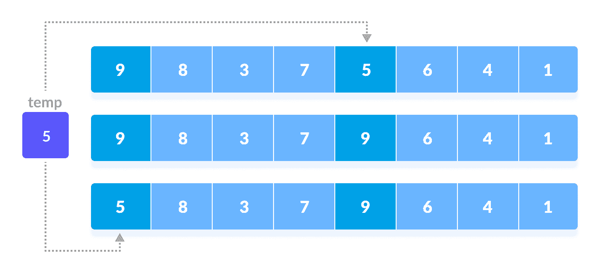
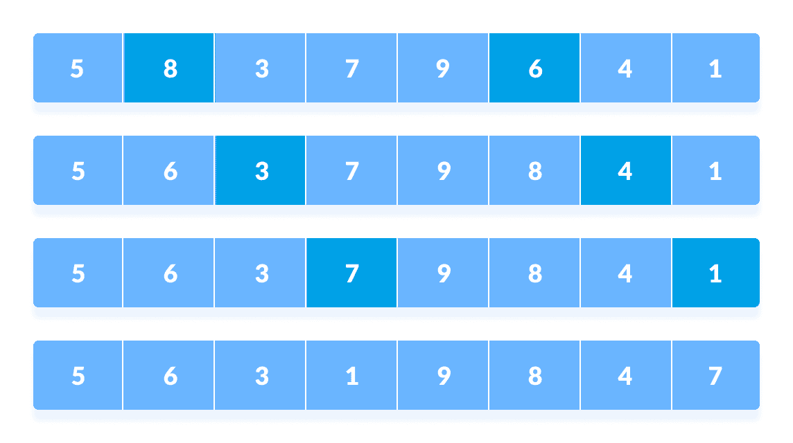
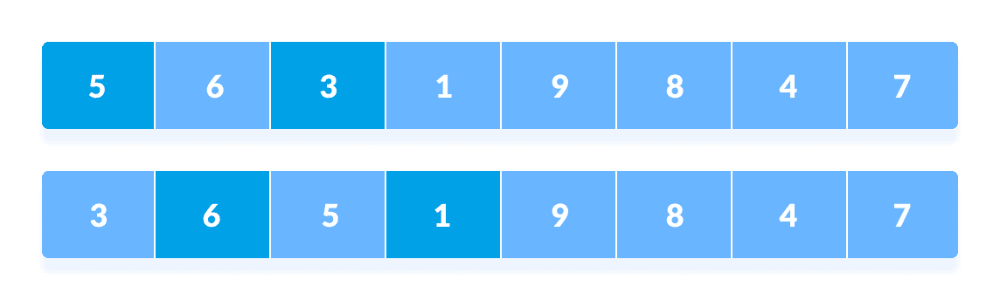
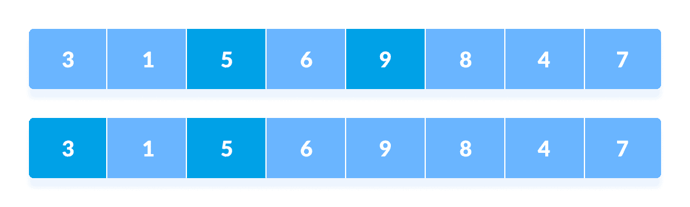
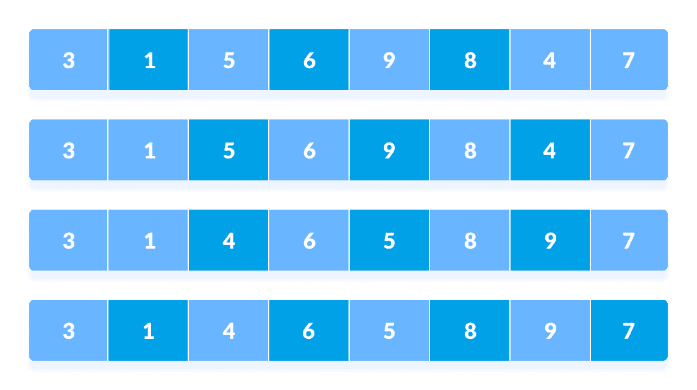
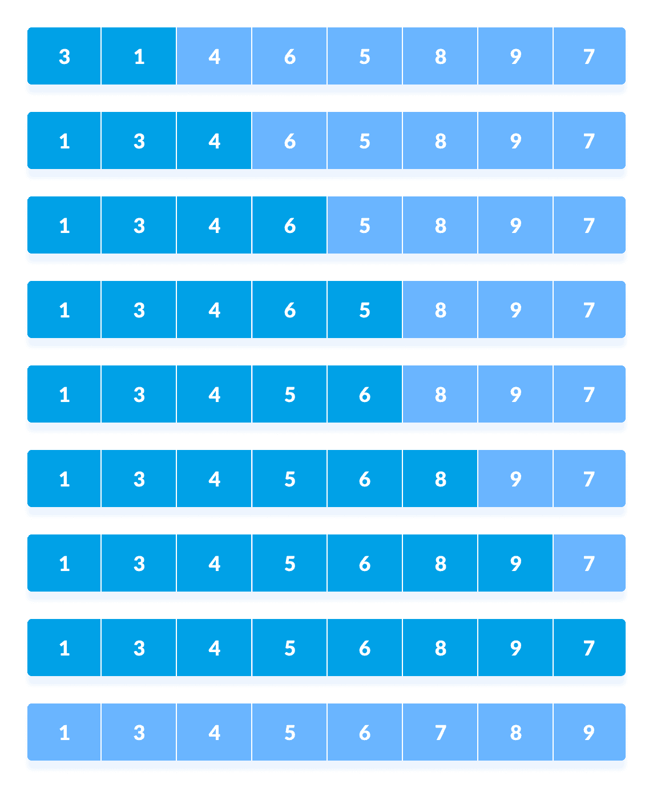

# Shell 排序算法

> 原文： [https://www.programiz.com/dsa/shell-sort](https://www.programiz.com/dsa/shell-sort)

#### 在本教程中，您将学习 shell 排序的工作方式。 此外，您还将找到使用 C，C++ ，Java 和 Python 进行 shell 排序的工作示例。

Shell 排序是一种算法，该算法首先对彼此分开的元素进行排序，然后依次减小要排序的元素之间的间隔。 它是插入排序的通用版本。

在 Shell 排序中，将按特定间隔对元素进行排序。 元素之间的间隔根据使用的顺序逐渐减小。 shell 排序的性能取决于给定输入数组使用的序列类型。

使用的一些最佳顺序是：

*   Shell 的原始顺序：`N/2 , N/4 , …, 1`
*   Knuth 的增量：`1, 4, 13, …, (3k – 1) / 2`
*   Sedgewick 的增量：`1, 8, 23, 77, 281, 1073, 4193, 16577...4j+1+ 3·2j+ 1`
*   希伯德的增幅：`1, 3, 7, 15, 31, 63, 127, 255, 511…`
*   Papernov & Stasevich 增量：`1, 3, 5, 9, 17, 33, 65,...`
*   普拉特：`1, 2, 3, 4, 6, 9, 8, 12, 18, 27, 16, 24, 36, 54, 81....`

* * *

## Shell 排序如何工作？

1.  假设我们需要对以下数组进行排序。

    

    初始数组

    

2.  我们在算法中使用了外壳的原始序列`(N/2, N/4, ...1)`作为间隔。

    在第一个循环中，如果数组大小为`N = 8`，则比较`N/2 = 4`间隔的元素，如果顺序不对则交换它们。
    1.  将第 0 个元素与第 4 个元素进行比较。
    2.  如果第 0 个元素大于第 4 个，则首先将第 4 个元素存储在`temp`变量中，并将第 0 个元素（即更大的元素）存储在第 4 个位置和存储在`temp`中的元素存储在第 0 个位置。

        

        以`n / 2`的间隔重新排列元素。

        

        对于所有其余元素，此过程将继续进行。

        

        以`n / 2`间隔重新排列所有元素

        

3.  在第二个循环中，采用`N/4 = 8/4 = 2`的间隔，并再次对位于这些间隔的元素进行排序。

    

    以`n / 4`的间隔重新排列元素

    

    此时，您可能会感到困惑。

    

    比较当前间隔中数组中的所有元素。 比较第 4 个和第 2 个位置的元素。 还比较了第 2 个和第 0 个位置的元素。 比较当前间隔中数组中的所有元素。
4.  其余元素的处理相同。

    

    以`n / 4`间隔重新排列所有元素

    

5.  最后，当间隔为`N/8 = 8/8 =1`时，将对间隔为 1 的数组元素进行排序。 数组现在已完全排序。

    

    以`n / 8`间隔重新排列元素

    

* * *

## Shell 排序算法

```
shellSort(array, size)
  for interval i <- size/2n down to 1
    for each interval "i" in array
        sort all the elements at interval "i"
end shellSort
```

* * *

## Python，Java 和 C/C++ 示例

[Python](#python-code)[Java](#java-code)[C](#c-code)[C++](#cpp-code)

```
# Shell sort in python

def shellSort(array, n):

    # Rearrange elements at each n/2, n/4, n/8, ... intervals
    interval = n // 2
    while interval > 0:
        for i in range(interval, n):
            temp = array[i]
            j = i
            while j >= interval and array[j - interval] > temp:
                array[j] = array[j - interval]
                j -= interval

            array[j] = temp
        interval //= 2

data = [9, 8, 3, 7, 5, 6, 4, 1]
size = len(data)
shellSort(data, size)
print('Sorted Array in Ascending Order:')
print(data)
```

```
// Shell sort in Java programming

import java.util.Arrays;

// Shell sort
class ShellSort {

  // Rearrange elements at each n/2, n/4, n/8, ... intervals
  void shellSort(int array[], int n) {
  for (int interval = n / 2; interval > 0; interval /= 2) {
    for (int i = interval; i < n; i += 1) {
    int temp = array[i];
    int j;
    for (j = i; j >= interval && array[j - interval] > temp; j -= interval) {
      array[j] = array[j - interval];
    }
    array[j] = temp;
    }
  }
  }

  // Driver code
  public static void main(String args[]) {
  int[] data = { 9, 8, 3, 7, 5, 6, 4, 1 };
  int size = data.length;
  ShellSort ss = new ShellSort();
  ss.shellSort(data, size);
  System.out.println("Sorted Array in Ascending Order: ");
  System.out.println(Arrays.toString(data));
  }
}
```

```
// Shell Sort in C programming

#include <stdio.h>

// Shell sort
void shellSort(int array[], int n) {
  // Rearrange elements at each n/2, n/4, n/8, ... intervals
  for (int interval = n / 2; interval > 0; interval /= 2) {
    for (int i = interval; i < n; i += 1) {
      int temp = array[i];
      int j;
      for (j = i; j >= interval && array[j - interval] > temp; j -= interval) {
        array[j] = array[j - interval];
      }
      array[j] = temp;
    }
  }
}

// Print an array
void printArray(int array[], int size) {
  for (int i = 0; i < size; ++i) {
    printf("%d  ", array[i]);
  }
  printf("\n");
}

// Driver code
int main() {
  int data[] = {9, 8, 3, 7, 5, 6, 4, 1};
  int size = sizeof(data) / sizeof(data[0]);
  shellSort(data, size);
  printf("Sorted array: \n");
  printArray(data, size);
}
```

```
// Shell Sort in C++ programming

#include <iostream>
using namespace std;

// Shell sort
void shellSort(int array[], int n) {
  // Rearrange elements at each n/2, n/4, n/8, ... intervals
  for (int interval = n / 2; interval > 0; interval /= 2) {
    for (int i = interval; i < n; i += 1) {
      int temp = array[i];
      int j;
      for (j = i; j >= interval && array[j - interval] > temp; j -= interval) {
        array[j] = array[j - interval];
      }
      array[j] = temp;
    }
  }
}

// Print an array
void printArray(int array[], int size) {
  int i;
  for (i = 0; i < size; i++)
    cout << array[i] << " ";
  cout << endl;
}

// Driver code
int main() {
  int data[] = {9, 8, 3, 7, 5, 6, 4, 1};
  int size = sizeof(data) / sizeof(data[0]);
  shellSort(data, size);
  cout << "Sorted array: \n";
  printArray(data, size);
}
```

* * *

## 复杂度

Shell 排序是一种不稳定的排序算法，因为该算法不会检查间隔之间的元素。

### 时间复杂度

*   **最坏情况复杂度**：小于或等于`O(n^2)`
    外Shell 排序的最坏情况复杂度始终小于或等于`O(n^2)`。

    根据 Poonen 定理，Shell 排序的最坏情况复杂度是`Θ(Nlog N)^2/(log log N)^2)`或`Θ(Nlog N)^2/log log N)`或`Θ(N(log N)^2)`或介于两者之间。
*   **最佳情况复杂度**：`O(n*log n)`
    对数组进行排序后，每个时间间隔（或增量）的比较总数等于数组的大小。
*   **平均情况复杂度**：`O(n*log n)`
    在`O(n^1.25)`附近。

复杂程度取决于选择的间隔。 对于选择的不同增量序列，上述复杂度有所不同。 最佳递增顺序未知。

### 空间复杂度：

外Shell 排序的空间复杂度为`O(1)`。

* * *

## Shell 排序应用

在以下情况下使用 Shell 排序：

*   调用栈是开销。 uClibc 库使用这种排序。
*   递归超出限制。 bzip2 压缩器使用它。
*   当接近的元素相距很远时，插入排序的效果不佳。 Shell 排序有助于缩短封闭元素之间的距离。 因此，将执行的交换次数将更少。