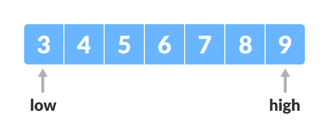
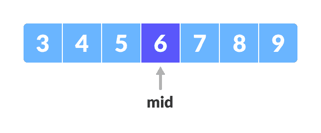
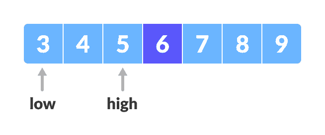
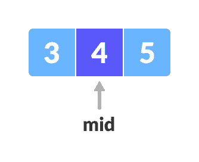
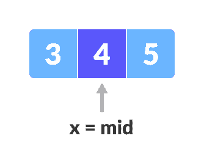

# 二元搜寻

> 原文： [https://www.programiz.com/dsa/binary-search](https://www.programiz.com/dsa/binary-search)

#### 在本教程中，您将学习二进制搜索排序的工作方式。 此外，您还将找到 C，C ++，Java 和 Python 中的 Binary Search 的工作示例。

二进制搜索是一种搜索算法，用于在排序数组中查找元素的位置。

在这种方法中，总是在数组的一部分中间搜索元素。

二进制搜索只能在项目的排序列表上实现。 如果元素尚未排序，则需要首先对其进行排序。

* * *

## 二进制搜索工作

二进制搜索算法可以通过以下两种方式实现。

1.  迭代法
2.  递归方法

递归方法遵循[分而治之](/dsa/divide-and-conquer)方法。

这两种方法的一般步骤将在下面讨论。

1.  将在其中执行搜索的数组为：

    

    初始数组

    

    令`x = 4`为要搜索的元素。
2.  将两个指针分别在最低和最高位置设置为低和高。

    

    设置指针

    

3.  找到数组中间的中间元素`，即。 `(arr[low + high]) / 2 = 6`。

    

    中间元素

    ` 
4.  如果 x == mid，则返回 mid，否则将要搜索的元素与 m 进行比较。
5.  如果为`x > mid`，则将 `x` 与`右侧`右侧元素的中间元素进行比较。 这是通过将`的`设置为`low = mid + 1`来实现的。
6.  否则，将 `x` 与`中间`左侧元素的中间元素进行比较。 这可以通过将`高`设置为`high = mid - 1`来完成。

    

    寻找中间元素

    

7.  重复步骤 3 到 6，直到低点遇到高点为止。

    

    中间元素

    

8.  找到`x = 4`。 找到

    

    

    

* * *

## 二进制搜索算法

### 迭代方法

```
do until the pointers low and high meet each other.
    mid = (low + high)/2
    if (x == arr[mid])
        return mid
    else if (x > A[mid]) // x is on the right side
        low = mid + 1
    else                       // x is on the left side
        high = mid - 1
```

### 递归方法

```
binarySearch(arr, x, low, high)
    if low > high
        return False 
    else
        mid = (low + high) / 2 
        if x == arr[mid]
            return mid
        else if x < data[mid]        // x is on the right side
            return binarySearch(arr, x, mid + 1, high)
        else                               // x is on the right side
            return binarySearch(arr, x, low, mid - 1)
```

* * *

## Python，Java，C / C ++示例（迭代方法）

[Python](#python-code)[Java](#java-code)[C](#c-code)[C++](#cpp-code)

```
# Binary Search in python

def binarySearch(array, x, low, high):

    # Repeat until the pointers low and high meet each other
    while low <= high:

        mid = low + (high - low)//2

        if array[mid] == x:
            return mid

        elif array[mid] < x:
            low = mid + 1

        else:
            high = mid - 1

    return -1

array = [3, 4, 5, 6, 7, 8, 9]
x = 4

result = binarySearch(array, x, 0, len(array)-1)

if result != -1:
    print("Element is present at index " + str(result))
else:
    print("Not found")
```

```
// Binary Search in Java

class BinarySearch {
  int binarySearch(int array[], int x, int low, int high) {

    // Repeat until the pointers low and high meet each other
    while (low <= high) {
      int mid = low + (high - low) / 2;

      if (array[mid] == x)
        return mid;

      if (array[mid] < x)
        low = mid + 1;

      else
        high = mid - 1;
    }

    return -1;
  }

  public static void main(String args[]) {
    BinarySearch ob = new BinarySearch();
    int array[] = { 3, 4, 5, 6, 7, 8, 9 };
    int n = array.length;
    int x = 4;
    int result = ob.binarySearch(array, x, 0, n - 1);
    if (result == -1)
      System.out.println("Not found");
    else
      System.out.println("Element found at index " + result);
  }
}
```

```
// Binary Search in C

#include <stdio.h>

int binarySearch(int array[], int x, int low, int high) {
  // Repeat until the pointers low and high meet each other
  while (low <= high) {
    int mid = low + (high - low) / 2;

    if (array[mid] == x)
      return mid;

    if (array[mid] < x)
      low = mid + 1;

    else
      high = mid - 1;
  }

  return -1;
}

int main(void) {
  int array[] = {3, 4, 5, 6, 7, 8, 9};
  int n = sizeof(array) / sizeof(array[0]);
  int x = 4;
  int result = binarySearch(array, x, 0, n - 1);
  if (result == -1)
    printf("Not found");
  else
    printf("Element is found at index %d", result);
  return 0;
}
```

```
// Binary Search in C++

#include <iostream>
using namespace std;

int binarySearch(int array[], int x, int low, int high) {

	// Repeat until the pointers low and high meet each other
  while (low <= high) {
    int mid = low + (high - low) / 2;

    if (array[mid] == x)
      return mid;

    if (array[mid] < x)
      low = mid + 1;

    else
      high = mid - 1;
  }

  return -1;
}

int main(void) {
  int array[] = {3, 4, 5, 6, 7, 8, 9};
  int x = 4;
  int n = sizeof(array) / sizeof(array[0]);
  int result = binarySearch(array, x, 0, n - 1);
  if (result == -1)
    printf("Not found");
  else
    printf("Element is found at index %d", result);
}
```

* * *

## Python，Java，C / C ++示例（递归方法）

[Python](#python-code)[Java](#java-code)[C](#c-code)[C++](#cpp-code)

```
# Binary Search in python

def binarySearch(array, x, low, high):

    if high >= low:

        mid = low + (high - low)//2

        # If found at mid, then return it
        if array[mid] == x:
            return mid

        # Search the left half
        elif array[mid] > x:
            return binarySearch(array, x, low, mid-1)

        # Search the right half
        else:
            return binarySearch(array, x, mid + 1, high)

    else:
        return -1

array = [3, 4, 5, 6, 7, 8, 9]
x = 4

result = binarySearch(array, x, 0, len(array)-1)

if result != -1:
    print("Element is present at index " + str(result))
else:
    print("Not found")
```

```
// Binary Search in Java

class BinarySearch {
  int binarySearch(int array[], int x, int low, int high) {

    if (high >= low) {
      int mid = low + (high - low) / 2;

      // If found at mid, then return it
      if (array[mid] == x)
        return mid;

      // Search the left half
      if (array[mid] > x)
        return binarySearch(array, x, low, mid - 1);

      // Search the right half
      return binarySearch(array, x, mid + 1, high);
    }

    return -1;
  }

  public static void main(String args[]) {
    BinarySearch ob = new BinarySearch();
    int array[] = { 3, 4, 5, 6, 7, 8, 9 };
    int n = array.length;
    int x = 4;
    int result = ob.binarySearch(array, x, 0, n - 1);
    if (result == -1)
      System.out.println("Not found");
    else
      System.out.println("Element found at index " + result);
  }
}
```

```
// Binary Search in C

#include <stdio.h>

int binarySearch(int array[], int x, int low, int high) {
  if (high >= low) {
    int mid = low + (high - low) / 2;

    // If found at mid, then return it
    if (array[mid] == x)
      return mid;

    // Search the left half
    if (array[mid] > x)
      return binarySearch(array, x, low, mid - 1);

    // Search the right half
    return binarySearch(array, x, mid + 1, high);
  }

  return -1;
}

int main(void) {
  int array[] = {3, 4, 5, 6, 7, 8, 9};
  int n = sizeof(array) / sizeof(array[0]);
  int x = 4;
  int result = binarySearch(array, x, 0, n - 1);
  if (result == -1)
    printf("Not found");
  else
    printf("Element is found at index %d", result);
}
```

```
// Binary Search in C++

#include <iostream>
using namespace std;

int binarySearch(int array[], int x, int low, int high) {
  if (high >= low) {
    int mid = low + (high - low) / 2;

    // If found at mid, then return it
    if (array[mid] == x)
      return mid;

    // Search the left half
    if (array[mid] > x)
      return binarySearch(array, x, low, mid - 1);

    // Search the right half
    return binarySearch(array, x, mid + 1, high);
  }

  return -1;
}

int main(void) {
  int array[] = {3, 4, 5, 6, 7, 8, 9};
  int x = 4;
  int n = sizeof(array) / sizeof(array[0]);
  int result = binarySearch(array, x, 0, n - 1);
  if (result == -1)
    printf("Not found");
  else
    printf("Element is found at index %d", result);
}
```

* * *

## 二元搜索的复杂度

**时间复杂度**

*   **最佳情况复杂度**：`O(1)`
*   **平均案件复杂度**：`O(log n)`
*   **最坏情况的复杂性**：`O(log n)`

**空间复杂度**

二分查找的空间复杂度为`O(n)`。

* * *

## 二进制搜索应用

*   在 Java，.Net，C ++ STL 库中
*   在调试时，二进制搜索用于查明错误发生的位置。