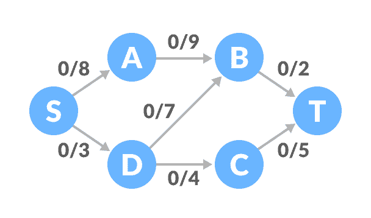
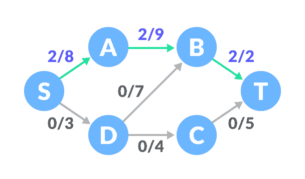
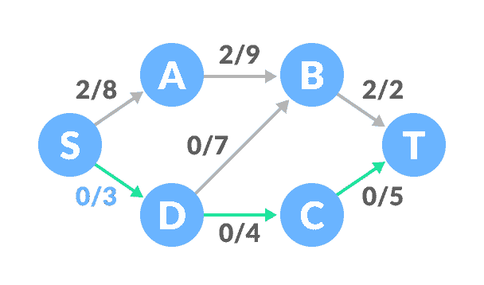
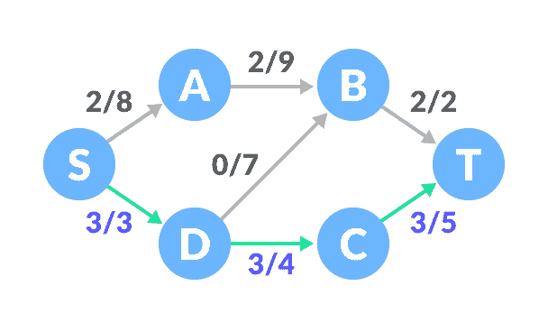
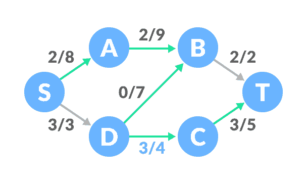
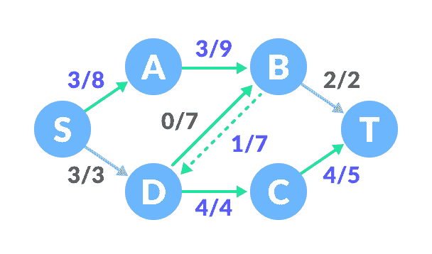

# Ford-Fulkerson 算法

> 原文： [https://www.programiz.com/dsa/ford-fulkerson-algorithm](https://www.programiz.com/dsa/ford-fulkerson-algorithm)

#### 在本教程中，您将学习什么是 Ford-Fulkerson 算法。 此外，您还将找到在 C，C++ ，Java 和 Python 中找到流网络中最大流的工作示例。

Ford-Fulkerson 算法是一种[贪婪方法](http://programiz.com/dsa/greedy-algorithm)，用于计算网络或图形中的最大可能流量。

术语**网络流**用于描述具有源（`S`）和宿（`T`）的顶点和边的网络。 除了`S`和`T`之外，每个顶点都可以通过它接收和发送相同数量的东西。 `S`只能发送，`T`只能接收东西。

我们可以使用不同容量的管网内部的液体流动来可视化对算法的理解。 每个管道在特定情况下都可以传输一定容量的液体。 对于此算法，我们将查找使用网络在实例处可以从源流向水槽的液体量。


图的网络流


* * *

## 使用的术语

### 增广路径

它是流网络中可用的路径。

### 剩余图

它表示具有其他可能流量的网络流。

### 剩余容量

从最大容量中减去流量后的边容量。

* * *

## Ford-Fulkerson 算法如何工作？

该算法如下：

1.  将所有边中的流初始化为 0。
2.  当源和接收器之间存在增加路径时，将此路径添加到流中。
3.  更新剩余图。

如果需要，我们还可以考虑反向路径，因为如果不考虑反向路径，则可能永远找不到最大流量。

通过以下示例可以理解上述概念。

* * *

## Ford-Fulkerson 的例子

开始时所有边的流为 0。



图的网络流示例


1.  选择从`S`到`T`的任意路径。在此步骤中，我们选择了路径`S-A-B-T`。

    

    找到路径

    

    三个边之间的最小容量为 2（`B-T`）。 基于此，为每个路径更新流量/容量。

    

    更新容量

    

2.  选择其他路径`S-D-C-T`。 这些边之间的最小容量为 3（`S-D`）。

    

    查找下一个路径

    

    根据此更新容量。

    

    更新容量

    

3.  现在，让我们考虑反向路径`B-D`。 选择路径`S-A-B-D-C-T`。 边之间的最小剩余容量为 1（`D-C`）。

    

    查找下一个路径

    

    正在更新容量。

    

    更新容量

    

    分别考虑正向和反向路径的容量。
4.  将所有流量相加，`2 + 3 + 1 = 6`，这是网络流上的最大可能流量。

请注意，如果任何边的容量已满，则无法使用该路径。

* * *

## Python，Java 和 C/C++ 示例

[Python](#python-code)[Java](#java-code)[C](#c-code)[C++](#cpp-code)

```
# Ford-Fulkerson algorith in Python

from collections import defaultdict

class Graph:

    def __init__(self, graph):
        self.graph = graph
        self. ROW = len(graph)

    # Using BFS as a searching algorithm 
    def searching_algo_BFS(self, s, t, parent):

        visited = [False] * (self.ROW)
        queue = []

        queue.append(s)
        visited[s] = True

        while queue:

            u = queue.pop(0)

            for ind, val in enumerate(self.graph[u]):
                if visited[ind] == False and val > 0:
                    queue.append(ind)
                    visited[ind] = True
                    parent[ind] = u

        return True if visited[t] else False

    # Applying fordfulkerson algorithm
    def ford_fulkerson(self, source, sink):
        parent = [-1] * (self.ROW)
        max_flow = 0

        while self.searching_algo_BFS(source, sink, parent):

            path_flow = float("Inf")
            s = sink
            while(s != source):
                path_flow = min(path_flow, self.graph[parent[s]][s])
                s = parent[s]

            # Adding the path flows
            max_flow += path_flow

            # Updating the residual values of edges
            v = sink
            while(v != source):
                u = parent[v]
                self.graph[u][v] -= path_flow
                self.graph[v][u] += path_flow
                v = parent[v]

        return max_flow

graph = [[0, 8, 0, 0, 3, 0],
         [0, 0, 9, 0, 0, 0],
         [0, 0, 0, 0, 7, 2],
         [0, 0, 0, 0, 0, 5],
         [0, 0, 7, 4, 0, 0],
         [0, 0, 0, 0, 0, 0]]

g = Graph(graph)

source = 0
sink = 5

print("Max Flow: %d " % g.ford_fulkerson(source, sink))
```

```
// Ford-Fulkerson algorith in Java

import java.util.LinkedList;

class FordFulkerson {
  static final int V = 6;

  // Using BFS as a searching algorithm 
  boolean bfs(int Graph[][], int s, int t, int p[]) {
    boolean visited[] = new boolean[V];
    for (int i = 0; i < V; ++i)
      visited[i] = false;

    LinkedList<Integer> queue = new LinkedList<Integer>();
    queue.add(s);
    visited[s] = true;
    p[s] = -1;

    while (queue.size() != 0) {
      int u = queue.poll();

      for (int v = 0; v < V; v++) {
        if (visited[v] == false && Graph[u][v] > 0) {
          queue.add(v);
          p[v] = u;
          visited[v] = true;
        }
      }
    }

    return (visited[t] == true);
  }

  // Applying fordfulkerson algorithm
  int fordFulkerson(int graph[][], int s, int t) {
    int u, v;
    int Graph[][] = new int[V][V];

    for (u = 0; u < V; u++)
      for (v = 0; v < V; v++)
        Graph[u][v] = graph[u][v];

    int p[] = new int[V];

    int max_flow = 0;

    # Updating the residual calues of edges
    while (bfs(Graph, s, t, p)) {
      int path_flow = Integer.MAX_VALUE;
      for (v = t; v != s; v = p[v]) {
        u = p[v];
        path_flow = Math.min(path_flow, Graph[u][v]);
      }

      for (v = t; v != s; v = p[v]) {
        u = p[v];
        Graph[u][v] -= path_flow;
        Graph[v][u] += path_flow;
      }

      // Adding the path flows
      max_flow += path_flow;
    }

    return max_flow;
  }

  public static void main(String[] args) throws java.lang.Exception {
    int graph[][] = new int[][] { { 0, 8, 0, 0, 3, 0 }, { 0, 0, 9, 0, 0, 0 }, { 0, 0, 0, 0, 7, 2 },
        { 0, 0, 0, 0, 0, 5 }, { 0, 0, 7, 4, 0, 0 }, { 0, 0, 0, 0, 0, 0 } };
    FordFulkerson m = new FordFulkerson();

    System.out.println("Max Flow: " + m.fordFulkerson(graph, 0, 5));

  }
}
```

```
/ Ford - Fulkerson algorith in C

#include <stdio.h>

#define A 0
#define B 1
#define C 2
#define MAX_NODES 1000
#define O 1000000000

int n;
int e;
int capacity[MAX_NODES][MAX_NODES];
int flow[MAX_NODES][MAX_NODES];
int color[MAX_NODES];
int pred[MAX_NODES];

int min(int x, int y) {
  return x < y ? x : y;
}

int head, tail;
int q[MAX_NODES + 2];

void enqueue(int x) {
  q[tail] = x;
  tail++;
  color[x] = B;
}

int dequeue() {
  int x = q[head];
  head++;
  color[x] = C;
  return x;
}

// Using BFS as a searching algorithm
int bfs(int start, int target) {
  int u, v;
  for (u = 0; u < n; u++) {
    color[u] = A;
  }
  head = tail = 0;
  enqueue(start);
  pred[start] = -1;
  while (head != tail) {
    u = dequeue();
    for (v = 0; v < n; v++) {
      if (color[v] == A && capacity[u][v] - flow[u][v] > 0) {
        enqueue(v);
        pred[v] = u;
      }
    }
  }
  return color[target] == C;
}

// Applying fordfulkerson algorithm
int fordFulkerson(int source, int sink) {
  int i, j, u;
  int max_flow = 0;
  for (i = 0; i < n; i++) {
    for (j = 0; j < n; j++) {
      flow[i][j] = 0;
    }
  }

  // Updating the residual values of edges
  while (bfs(source, sink)) {
    int increment = O;
    for (u = n - 1; pred[u] >= 0; u = pred[u]) {
      increment = min(increment, capacity[pred[u]][u] - flow[pred[u]][u]);
    }
    for (u = n - 1; pred[u] >= 0; u = pred[u]) {
      flow[pred[u]][u] += increment;
      flow[u][pred[u]] -= increment;
    }
    // Adding the path flows
    max_flow += increment;
  }
  return max_flow;
}

int main() {
  for (int i = 0; i < n; i++) {
    for (int j = 0; j < n; j++) {
      capacity[i][j] = 0;
    }
  }
  n = 6;
  e = 7;

  capacity[0][1] = 8;
  capacity[0][4] = 3;
  capacity[1][2] = 9;
  capacity[2][4] = 7;
  capacity[2][5] = 2;
  capacity[3][5] = 5;
  capacity[4][2] = 7;
  capacity[4][3] = 4;

  int s = 0, t = 5;
  printf("Max Flow: %d\n", fordFulkerson(s, t));
}
```

```
// Ford-Fulkerson algorith in C++

#include <limits.h>
#include <string.h>

#include <iostream>
#include <queue>
using namespace std;

#define V 6

// Using BFS as a searching algorithm
bool bfs(int rGraph[V][V], int s, int t, int parent[]) {
  bool visited[V];
  memset(visited, 0, sizeof(visited));

  queue<int> q;
  q.push(s);
  visited[s] = true;
  parent[s] = -1;

  while (!q.empty()) {
    int u = q.front();
    q.pop();

    for (int v = 0; v < V; v++) {
      if (visited[v] == false && rGraph[u][v] > 0) {
        q.push(v);
        parent[v] = u;
        visited[v] = true;
      }
    }
  }

  return (visited[t] == true);
}

// Applying fordfulkerson algorithm
int fordFulkerson(int graph[V][V], int s, int t) {
  int u, v;

  int rGraph[V][V];
  for (u = 0; u < V; u++)
    for (v = 0; v < V; v++)
      rGraph[u][v] = graph[u][v];

  int parent[V];
  int max_flow = 0;

  // Updating the residual values of edges
  while (bfs(rGraph, s, t, parent)) {
    int path_flow = INT_MAX;
    for (v = t; v != s; v = parent[v]) {
      u = parent[v];
      path_flow = min(path_flow, rGraph[u][v]);
    }

    for (v = t; v != s; v = parent[v]) {
      u = parent[v];
      rGraph[u][v] -= path_flow;
      rGraph[v][u] += path_flow;
    }

    // Adding the path flows
    max_flow += path_flow;
  }

  return max_flow;
}

int main() {
  int graph[V][V] = {{0, 8, 0, 0, 3, 0},
             {0, 0, 9, 0, 0, 0},
             {0, 0, 0, 0, 7, 2},
             {0, 0, 0, 0, 0, 5},
             {0, 0, 7, 4, 0, 0},
             {0, 0, 0, 0, 0, 0}};

  cout << "Max Flow: " << fordFulkerson(graph, 0, 5) << endl;
}
```

* * *

## Ford-Fulkerson 应用

*   输水管道
*   二分匹配问题
*   按需流动