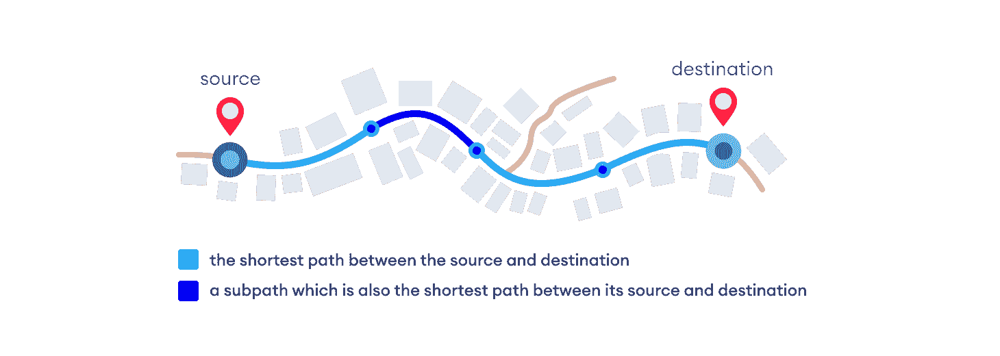
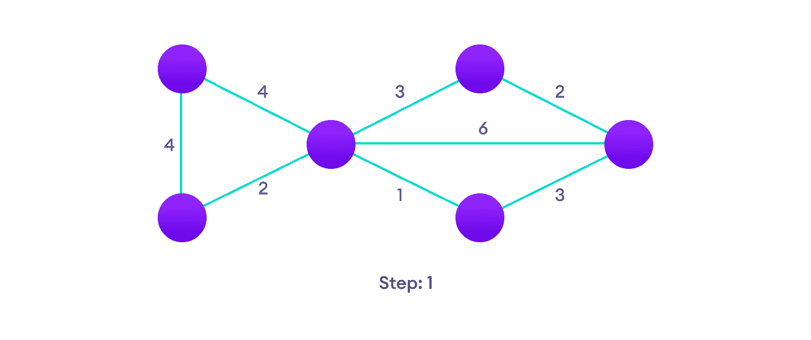
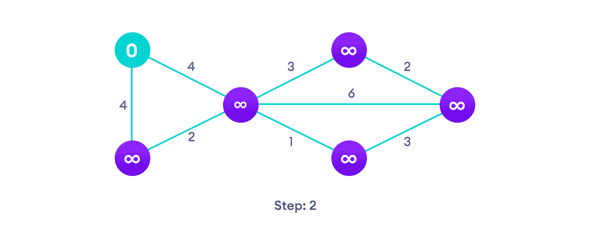
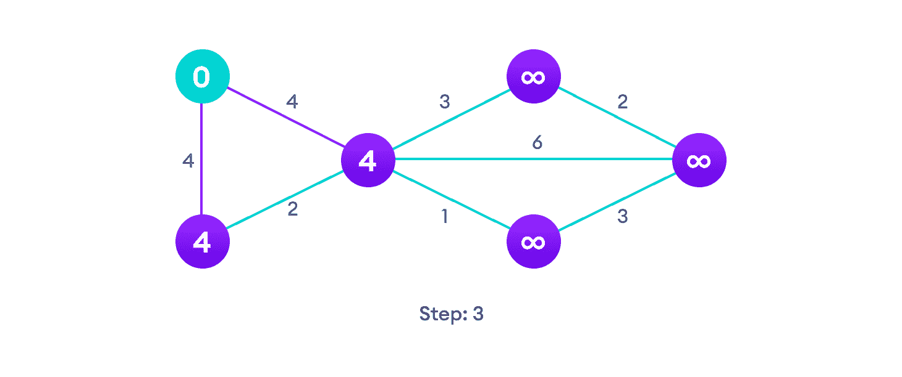
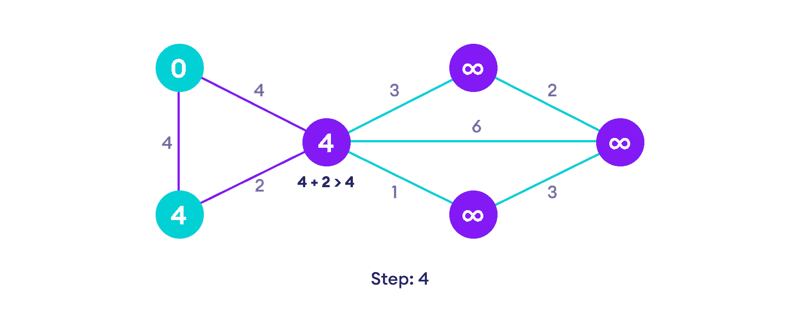
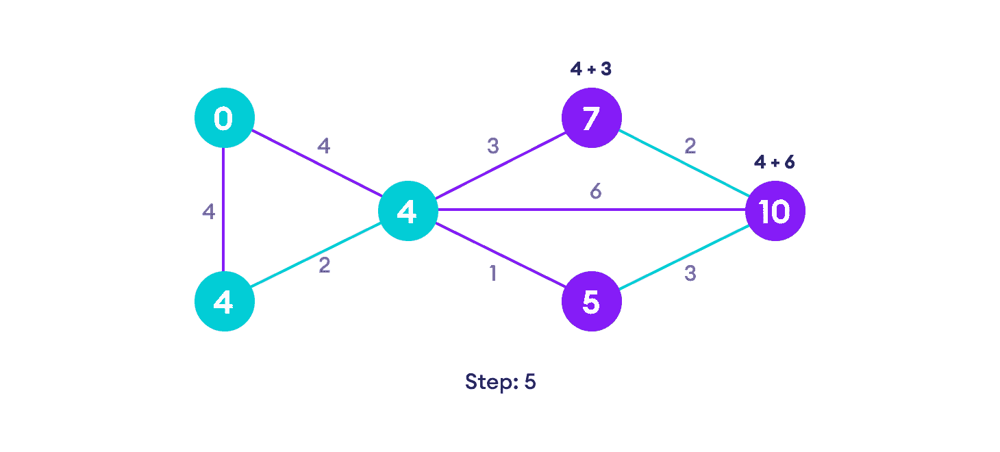
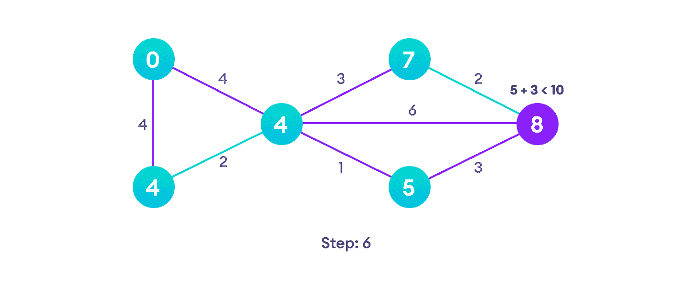
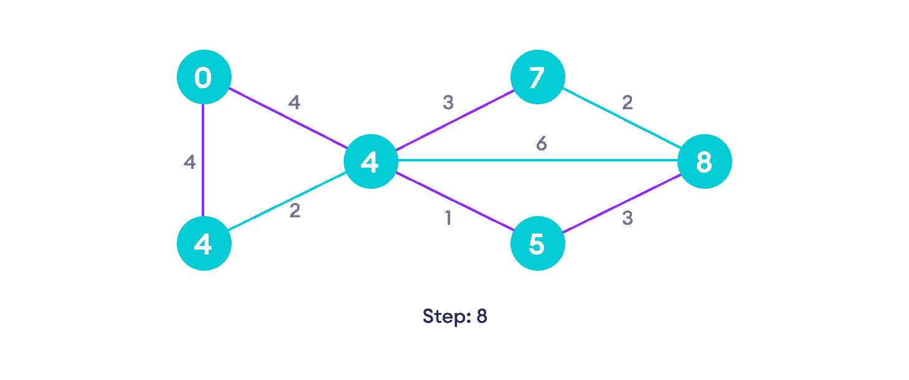

# Dijkstra 的算法

> 原文： [https://www.programiz.com/dsa/dijkstra-algorithm](https://www.programiz.com/dsa/dijkstra-algorithm)

#### Dijkstra 的算法使我们能够找到图形中任意两个顶点之间的最短路径。

它与最小生成树不同，因为两个顶点之间的最短距离可能不包括图形的所有顶点。

* * *

## Dijkstra 算法的工作原理

Dijkstra 的算法的工作原理是，顶点`A`和`D`之间的最短路径`A -> D`的任何子路径`B -> D`也是顶点`B`和`D`之间的最短路径。



Each subpath is the shortest path


Djikstra 在相反的方向上使用了此属性，即我们高估了每个顶点到起始顶点的距离。 然后，我们访问每个节点及其邻居，以找到到这些邻居的最短子路径。

该算法使用贪婪方法，因为我们找到了下一个最佳解决方案，希望最终结果是整个问题的最佳解决方案。

* * *

## Dijkstra 算法的示例

从一个示例开始，然后考虑该算法会更容易。



Start with a weighted graph




Choose a starting vertex and assign infinity path values to all other devices




Go to each vertex and update its path length




If the path length of the adjacent vertex is lesser than new path length, don't update it




Avoid updating path lengths of already visited vertices




After each iteration, we pick the unvisited vertex with the least path length. So we choose 5 before 7


Notice how the rightmost vertex has its path length updated twice




Repeat until all the vertices have been visited


* * *

## Djikstra 的算法伪代码

我们需要保持每个顶点的路径距离。 我们可以将其存储在大小为`v`的数组中，其中`v`是顶点数。

我们还希望能够获得最短路径，不仅知道最短路径的长度。 为此，我们将每个顶点映射到最后更新其路径长度的顶点。

算法结束后，我们可以从目标顶点回溯到源顶点以找到路径。

最小优先级队列可用于以最小路径距离有效接收顶点。

```
function dijkstra(G, S)
    for each vertex V in G
        distance[V] <- infinite
        previous[V] <- NULL
        If V != S, add V to Priority Queue Q
    distance[S] <- 0

    while Q IS NOT EMPTY
        U <- Extract MIN from Q
        for each unvisited neighbour V of U
            tempDistance <- distance[U] + edge_weight(U, V)
            if tempDistance < distance[V]
                distance[V] <- tempDistance
                previous[V] <- U
    return distance[], previous[]
```

* * *

## Dijkstra 算法的代码

下面给出了 Dijkstra 算法在 C++ 中的实现。 可以提高[代码](http://www.reviewmylife.co.uk/blog/2008/07/15/dijkstras-algorithm-code-in-c/)的复杂度，但是抽象方法很容易将代码与算法相关联。

[Python](#python-code)[Java](#java-code)[C](#c-code)[C++](#cpp-code)

```
# Dijkstra's Algorithm in Python

import sys

# Providing the graph
vertices = [[0, 0, 1, 1, 0, 0, 0],
            [0, 0, 1, 0, 0, 1, 0],
            [1, 1, 0, 1, 1, 0, 0],
            [1, 0, 1, 0, 0, 0, 1],
            [0, 0, 1, 0, 0, 1, 0],
            [0, 1, 0, 0, 1, 0, 1],
            [0, 0, 0, 1, 0, 1, 0]]

edges = [[0, 0, 1, 2, 0, 0, 0],
         [0, 0, 2, 0, 0, 3, 0],
         [1, 2, 0, 1, 3, 0, 0],
         [2, 0, 1, 0, 0, 0, 1],
         [0, 0, 3, 0, 0, 2, 0],
         [0, 3, 0, 0, 2, 0, 1],
         [0, 0, 0, 1, 0, 1, 0]]

# Find which vertex is to be visited next
def to_be_visited():
    global visited_and_distance
    v = -10
    for index in range(num_of_vertices):
        if visited_and_distance[index][0] == 0 \
            and (v < 0 or visited_and_distance[index][1] <=
                 visited_and_distance[v][1]):
            v = index
    return v

num_of_vertices = len(vertices[0])

visited_and_distance = [[0, 0]]
for i in range(num_of_vertices-1):
    visited_and_distance.append([0, sys.maxsize])

for vertex in range(num_of_vertices):

    # Find next vertex to be visited
    to_visit = to_be_visited()
    for neighbor_index in range(num_of_vertices):

        # Updating new distances
        if vertices[to_visit][neighbor_index] == 1 and \
                visited_and_distance[neighbor_index][0] == 0:
            new_distance = visited_and_distance[to_visit][1] \
                + edges[to_visit][neighbor_index]
            if visited_and_distance[neighbor_index][1] > new_distance:
                visited_and_distance[neighbor_index][1] = new_distance

        visited_and_distance[to_visit][0] = 1

i = 0

# Printing the distance
for distance in visited_and_distance:
    print("Distance of ", chr(ord('a') + i),
          " from source vertex: ", distance[1])
    i = i + 1
```

```
// Dijkstra's Algorithm in Java

public class Dijkstra {

  public static void dijkstra(int[][] graph, int source) {
    int count = graph.length;
    boolean[] visitedVertex = new boolean[count];
    int[] distance = new int[count];
    for (int i = 0; i < count; i++) {
      visitedVertex[i] = false;
      distance[i] = Integer.MAX_VALUE;
    }

    // Distance of self loop is zero
    distance[source] = 0;
    for (int i = 0; i < count; i++) {

      // Update the distance between neighbouring vertex and source vertex
      int u = findMinDistance(distance, visitedVertex);
      visitedVertex[u] = true;

      // Update all the neighbouring vertex distances
      for (int v = 0; v < count; v++) {
        if (!visitedVertex[v] && graph[u][v] != 0 && (distance[u] + graph[u][v] < distance[v])) {
          distance[v] = distance[u] + graph[u][v];
        }
      }
    }
    for (int i = 0; i < distance.length; i++) {
      System.out.println(String.format("Distance from %s to %s is %s", source, i, distance[i]));
    }

  }

  // Finding the minimum distance
  private static int findMinDistance(int[] distance, boolean[] visitedVertex) {
    int minDistance = Integer.MAX_VALUE;
    int minDistanceVertex = -1;
    for (int i = 0; i < distance.length; i++) {
      if (!visitedVertex[i] && distance[i] < minDistance) {
        minDistance = distance[i];
        minDistanceVertex = i;
      }
    }
    return minDistanceVertex;
  }

  public static void main(String[] args) {
    int graph[][] = new int[][] { { 0, 0, 1, 2, 0, 0, 0 }, { 0, 0, 2, 0, 0, 3, 0 }, { 1, 2, 0, 1, 3, 0, 0 },
        { 2, 0, 1, 0, 0, 0, 1 }, { 0, 0, 3, 0, 0, 2, 0 }, { 0, 3, 0, 0, 2, 0, 1 }, { 0, 0, 0, 1, 0, 1, 0 } };
    Dijkstra T = new Dijkstra();
    T.dijkstra(graph, 0);
  }
}
```

```
// Dijkstra's Algorithm in C

#include <stdio.h>
#define INFINITY 9999
#define MAX 10

void Dijkstra(int Graph[MAX][MAX], int n, int start);

void Dijkstra(int Graph[MAX][MAX], int n, int start) {
  int cost[MAX][MAX], distance[MAX], pred[MAX];
  int visited[MAX], count, mindistance, nextnode, i, j;

  // Creating cost matrix
  for (i = 0; i < n; i++)
    for (j = 0; j < n; j++)
      if (Graph[i][j] == 0)
        cost[i][j] = INFINITY;
      else
        cost[i][j] = Graph[i][j];

  for (i = 0; i < n; i++) {
    distance[i] = cost[start][i];
    pred[i] = start;
    visited[i] = 0;
  }

  distance[start] = 0;
  visited[start] = 1;
  count = 1;

  while (count < n - 1) {
    mindistance = INFINITY;

    for (i = 0; i < n; i++)
      if (distance[i] < mindistance && !visited[i]) {
        mindistance = distance[i];
        nextnode = i;
      }

    visited[nextnode] = 1;
    for (i = 0; i < n; i++)
      if (!visited[i])
        if (mindistance + cost[nextnode][i] < distance[i]) {
          distance[i] = mindistance + cost[nextnode][i];
          pred[i] = nextnode;
        }
    count++;
  }

  // Printing the distance
  for (i = 0; i < n; i++)
    if (i != start) {
      printf("\nDistance from source to %d: %d", i, distance[i]);
    }
}
int main() {
  int Graph[MAX][MAX], i, j, n, u;
  n = 7;

  Graph[0][0] = 0;
  Graph[0][1] = 0;
  Graph[0][2] = 1;
  Graph[0][3] = 2;
  Graph[0][4] = 0;
  Graph[0][5] = 0;
  Graph[0][6] = 0;

  Graph[1][0] = 0;
  Graph[1][1] = 0;
  Graph[1][2] = 2;
  Graph[1][3] = 0;
  Graph[1][4] = 0;
  Graph[1][5] = 3;
  Graph[1][6] = 0;

  Graph[2][0] = 1;
  Graph[2][1] = 2;
  Graph[2][2] = 0;
  Graph[2][3] = 1;
  Graph[2][4] = 3;
  Graph[2][5] = 0;
  Graph[2][6] = 0;

  Graph[3][0] = 2;
  Graph[3][1] = 0;
  Graph[3][2] = 1;
  Graph[3][3] = 0;
  Graph[3][4] = 0;
  Graph[3][5] = 0;
  Graph[3][6] = 1;

  Graph[4][0] = 0;
  Graph[4][1] = 0;
  Graph[4][2] = 3;
  Graph[4][3] = 0;
  Graph[4][4] = 0;
  Graph[4][5] = 2;
  Graph[4][6] = 0;

  Graph[5][0] = 0;
  Graph[5][1] = 3;
  Graph[5][2] = 0;
  Graph[5][3] = 0;
  Graph[5][4] = 2;
  Graph[5][5] = 0;
  Graph[5][6] = 1;

  Graph[6][0] = 0;
  Graph[6][1] = 0;
  Graph[6][2] = 0;
  Graph[6][3] = 1;
  Graph[6][4] = 0;
  Graph[6][5] = 1;
  Graph[6][6] = 0;

  u = 0;
  Dijkstra(Graph, n, u);

  return 0;
}
```

```
// Dijkstra's Algorithm in C++

#include <iostream>
#include <vector>

#define INT_MAX 10000000

using namespace std;

void DijkstrasTest();

int main() {
  DijkstrasTest();
  return 0;
}

class Node;
class Edge;

void Dijkstras();
vector<Node*>* AdjacentRemainingNodes(Node* node);
Node* ExtractSmallest(vector<Node*>& nodes);
int Distance(Node* node1, Node* node2);
bool Contains(vector<Node*>& nodes, Node* node);
void PrintShortestRouteTo(Node* destination);

vector<Node*> nodes;
vector<Edge*> edges;

class Node {
   public:
  Node(char id)
    : id(id), previous(NULL), distanceFromStart(INT_MAX) {
    nodes.push_back(this);
  }

   public:
  char id;
  Node* previous;
  int distanceFromStart;
};

class Edge {
   public:
  Edge(Node* node1, Node* node2, int distance)
    : node1(node1), node2(node2), distance(distance) {
    edges.push_back(this);
  }
  bool Connects(Node* node1, Node* node2) {
    return (
      (node1 == this->node1 &&
       node2 == this->node2) ||
      (node1 == this->node2 &&
       node2 == this->node1));
  }

   public:
  Node* node1;
  Node* node2;
  int distance;
};

///////////////////
void DijkstrasTest() {
  Node* a = new Node('a');
  Node* b = new Node('b');
  Node* c = new Node('c');
  Node* d = new Node('d');
  Node* e = new Node('e');
  Node* f = new Node('f');
  Node* g = new Node('g');

  Edge* e1 = new Edge(a, c, 1);
  Edge* e2 = new Edge(a, d, 2);
  Edge* e3 = new Edge(b, c, 2);
  Edge* e4 = new Edge(c, d, 1);
  Edge* e5 = new Edge(b, f, 3);
  Edge* e6 = new Edge(c, e, 3);
  Edge* e7 = new Edge(e, f, 2);
  Edge* e8 = new Edge(d, g, 1);
  Edge* e9 = new Edge(g, f, 1);

  a->distanceFromStart = 0;  // set start node
  Dijkstras();
  PrintShortestRouteTo(f);
}

///////////////////

void Dijkstras() {
  while (nodes.size() > 0) {
    Node* smallest = ExtractSmallest(nodes);
    vector<Node*>* adjacentNodes =
      AdjacentRemainingNodes(smallest);

    const int size = adjacentNodes->size();
    for (int i = 0; i < size; ++i) {
      Node* adjacent = adjacentNodes->at(i);
      int distance = Distance(smallest, adjacent) +
               smallest->distanceFromStart;

      if (distance < adjacent->distanceFromStart) {
        adjacent->distanceFromStart = distance;
        adjacent->previous = smallest;
      }
    }
    delete adjacentNodes;
  }
}

// Find the node with the smallest distance,
// remove it, and return it.
Node* ExtractSmallest(vector<Node*>& nodes) {
  int size = nodes.size();
  if (size == 0) return NULL;
  int smallestPosition = 0;
  Node* smallest = nodes.at(0);
  for (int i = 1; i < size; ++i) {
    Node* current = nodes.at(i);
    if (current->distanceFromStart <
      smallest->distanceFromStart) {
      smallest = current;
      smallestPosition = i;
    }
  }
  nodes.erase(nodes.begin() + smallestPosition);
  return smallest;
}

// Return all nodes adjacent to 'node' which are still
// in the 'nodes' collection.
vector<Node*>* AdjacentRemainingNodes(Node* node) {
  vector<Node*>* adjacentNodes = new vector<Node*>();
  const int size = edges.size();
  for (int i = 0; i < size; ++i) {
    Edge* edge = edges.at(i);
    Node* adjacent = NULL;
    if (edge->node1 == node) {
      adjacent = edge->node2;
    } else if (edge->node2 == node) {
      adjacent = edge->node1;
    }
    if (adjacent && Contains(nodes, adjacent)) {
      adjacentNodes->push_back(adjacent);
    }
  }
  return adjacentNodes;
}

// Return distance between two connected nodes
int Distance(Node* node1, Node* node2) {
  const int size = edges.size();
  for (int i = 0; i < size; ++i) {
    Edge* edge = edges.at(i);
    if (edge->Connects(node1, node2)) {
      return edge->distance;
    }
  }
  return -1;  // should never happen
}

// Does the 'nodes' vector contain 'node'
bool Contains(vector<Node*>& nodes, Node* node) {
  const int size = nodes.size();
  for (int i = 0; i < size; ++i) {
    if (node == nodes.at(i)) {
      return true;
    }
  }
  return false;
}

///////////////////

void PrintShortestRouteTo(Node* destination) {
  Node* previous = destination;
  cout << "Distance from start: "
     << destination->distanceFromStart << endl;
  while (previous) {
    cout << previous->id << " ";
    previous = previous->previous;
  }
  cout << endl;
}

// these two not needed
vector<Edge*>* AdjacentEdges(vector<Edge*>& Edges, Node* node);
void RemoveEdge(vector<Edge*>& Edges, Edge* edge);

vector<Edge*>* AdjacentEdges(vector<Edge*>& edges, Node* node) {
  vector<Edge*>* adjacentEdges = new vector<Edge*>();

  const int size = edges.size();
  for (int i = 0; i < size; ++i) {
    Edge* edge = edges.at(i);
    if (edge->node1 == node) {
      cout << "adjacent: " << edge->node2->id << endl;
      adjacentEdges->push_back(edge);
    } else if (edge->node2 == node) {
      cout << "adjacent: " << edge->node1->id << endl;
      adjacentEdges->push_back(edge);
    }
  }
  return adjacentEdges;
}

void RemoveEdge(vector<Edge*>& edges, Edge* edge) {
  vector<Edge*>::iterator it;
  for (it = edges.begin(); it < edges.end(); ++it) {
    if (*it == edge) {
      edges.erase(it);
      return;
    }
  }
}
```

* * *

## Dijkstra 的算法复杂度

时间复杂度：`O(E Log V)`

其中，`E`是边数，`V`是顶点数。

空间复杂度：`O(V)`

* * *

## Dijkstra 的算法应用

*   寻找最短路径
*   在社交网络中的应用
*   在电话网中
*   在地图上查找位置