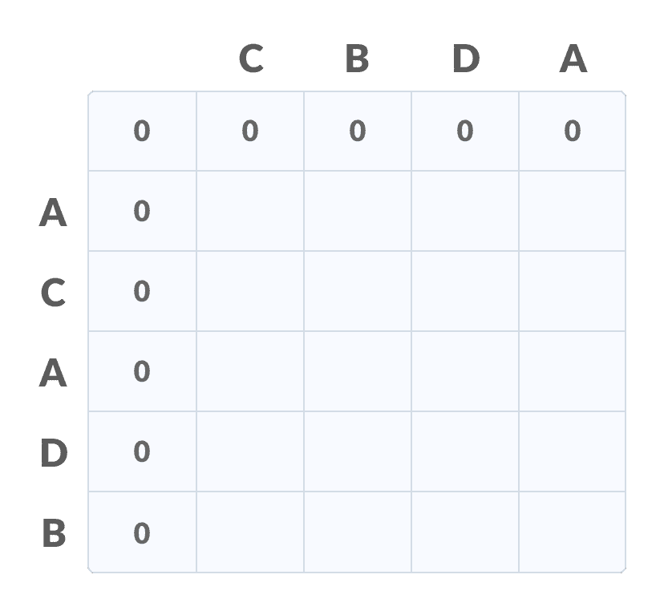
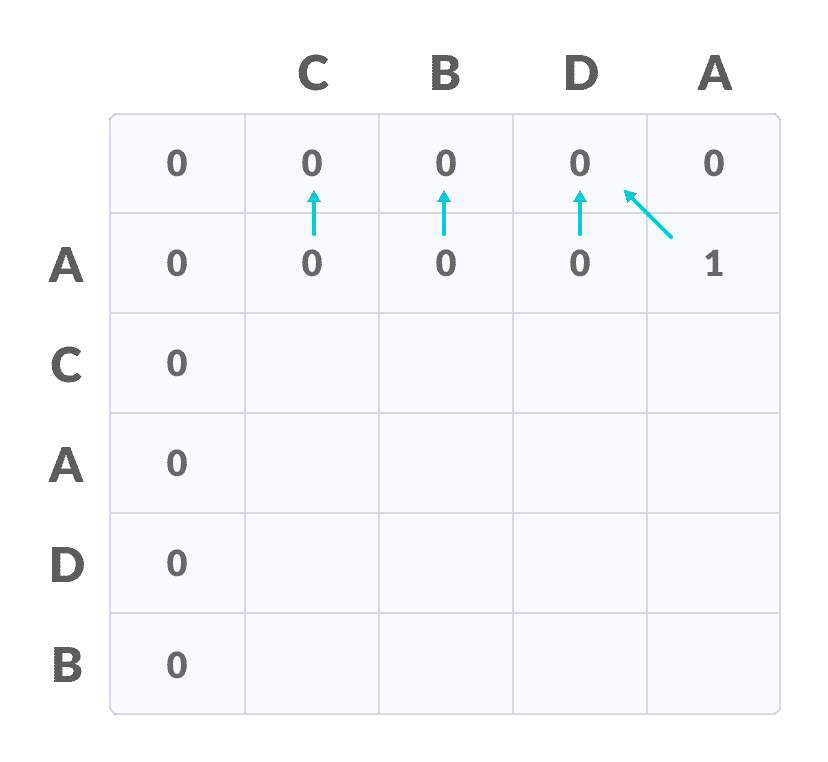
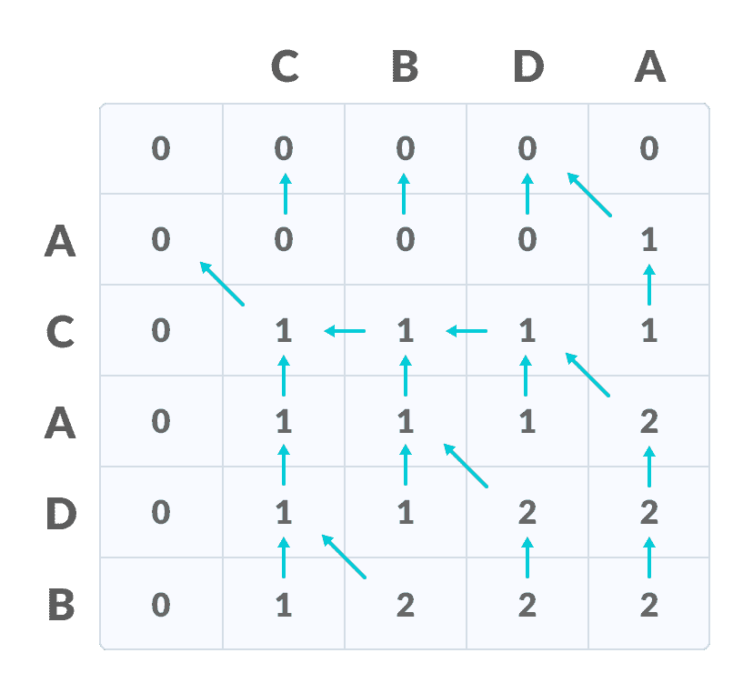
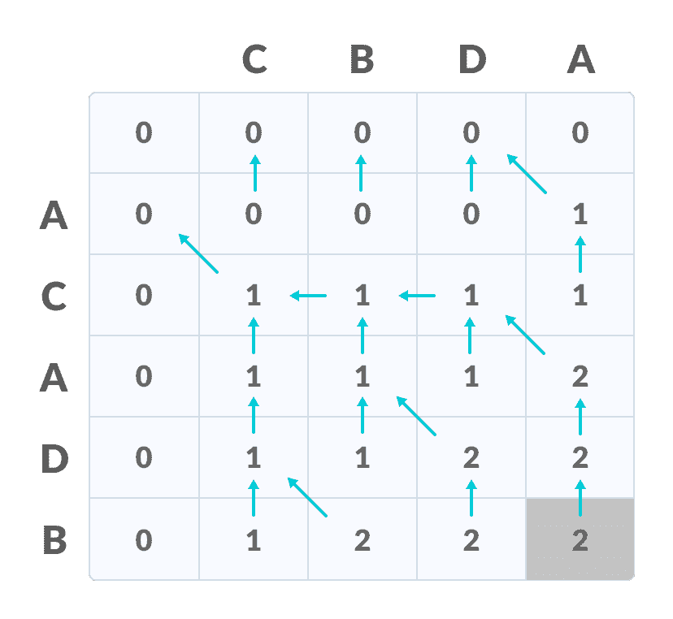
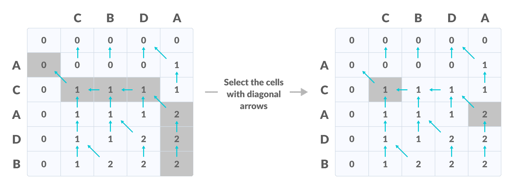

# 最长公共子序列

> 原文： [https://www.programiz.com/dsa/longest-common-subsequence](https://www.programiz.com/dsa/longest-common-subsequence)

#### 在本教程中，您将学习如何找到最长的公共子序列。 此外，您还将找到 C，C++ ，Java 和 Python 中最长的公共子序列的工作示例。

最长公共子序列（LCS）定义为所有给定序列共有的最长子序列，条件是该子序列的元素不需要占据原始序列内的连续位置。

如果`S1`和`S2`是两个给定的序列，则`Z`是`S1`和`S2`的共同子序列 如果`Z`是`S1`和`S2`的子序列。 此外，`Z`必须是`S1`和`S2`的索引的**严格增加的序列**。

在严格增加的序列中，从原始序列中选择的元素的索引必须在`Z`中按升序排列。

如果

```
S1 = {B, C, D, A, A, C, D}
```

然后，`{A, D, B}`不能是`S1`的子序列，因为元素的顺序不相同（即，不是严格递增的序列）。

* * *

让我们通过一个例子来了解 LCS。

If

```
S1 = {B, C, D, A, A, C, D}
S2 = {A, C, D, B, A, C}
```

然后，常见的子序列是`{B, C}, {C, D, A, C}, {D, A, C}, {A, A, C}, {A, C}, {C, D}, ...`

在这些子序列中，`{C, D, A, C}`是最长的公共子序列。 我们将使用动态编程来找到这个最长的公共子序列。

在继续进行之前，如果您还不了解动态编程，请进行[动态编程](/dsa/dynamic-programming)。

* * *

## 使用动态编程查找 LCS

让我们采取两个顺序：


The first sequence


Second Sequence


按照以下步骤查找最长的公共子序列。

1.  创建一个大小为`n+1*m+1`的表，其中`n`和`m`分别为`X`和`Y`的长度。 第一行和第一列用零填充。

    

    初始化表格

    

2.  使用以下逻辑填充表的每个单元格。
3.  如果对应于当前行和当前列的字符匹配，则通过在对角线元素上添加一个来填充当前单元格。 用箭头指向对角线单元。
4.  否则，取前一列和前一行元素中的最大值以填充当前单元格。 用箭头指向具有最大值的单元格。 如果它们相等，则指向它们中的任何一个。

    

    填写值

    

5.  **重复步骤 2** ，直到填满表格。

    

    填写所有值

    

6.  最后一行和最后一列中的值是最长公共子序列的长度。

    

    右下角是 LCS 的长度

    

7.  为了找到最长的公共子序列，请从最后一个元素开始并遵循箭头的方向。 与（）符号相对应的元素形成最长的公共子序列。

    

    根据箭头

    

    创建路径

因此，最长的公共子序列是`CD`。


LCS


* * *

**在解决 LCS 问题时，动态编程算法比递归算法效率如何？**

动态编程的方法减少了函数调用的次数。 它存储每个函数调用的结果，以便可以在以后的调用中使用它，而无需冗余调用。

在上述动态算法中，将从`X`的元素与`Y`的元素之间的每次比较获得的结果存储在表中，以便可以在将来的计算中使用。

因此，动态方法所花费的时间就是填写表格所花费的时间（即`O(mn)`）。 而递归算法的复杂度为`2^max(m, n)`。

* * *

## 最长公共子序列算法

```
X and Y be two given sequences
Initialize a table LCS of dimension X.length * Y.length
X.label = X
Y.label = Y
LCS[0][] = 0
LCS[][0] = 0
Start from LCS[1][1]
Compare X[i] and Y[j]
    If X[i] = Y[j]
        LCS[i][j] = 1 + LCS[i-1, j-1]   
        Point an arrow to LCS[i][j]
    Else
        LCS[i][j] = max(LCS[i-1][j], LCS[i][j-1])
        Point an arrow to max(LCS[i-1][j], LCS[i][j-1])
```

* * *

## Python，Java 和 C/C++ 示例

[Python](#python-code)[Java](#java-code)[C](#c-code)[C++](#cpp-code)

```
# The longest common subsequence in Python

# Function to find lcs_algo
def lcs_algo(S1, S2, m, n):
    L = [[0 for x in range(n+1)] for x in range(m+1)]

    # Building the mtrix in bottom-up way
    for i in range(m+1):
        for j in range(n+1):
            if i == 0 or j == 0:
                L[i][j] = 0
            elif S1[i-1] == S2[j-1]:
                L[i][j] = L[i-1][j-1] + 1
            else:
                L[i][j] = max(L[i-1][j], L[i][j-1])

    index = L[m][n]

    lcs_algo = [""] * (index+1)
    lcs_algo[index] = ""

    i = m
    j = n
    while i > 0 and j > 0:

        if S1[i-1] == S2[j-1]:
            lcs_algo[index-1] = S1[i-1]
            i -= 1
            j -= 1
            index -= 1

        elif L[i-1][j] > L[i][j-1]:
            i -= 1
        else:
            j -= 1

    # Printing the sub sequences
    print("S1 : " + S1 + "\nS2 : " + S2)
    print("LCS: " + "".join(lcs_algo))

S1 = "ACADB"
S2 = "CBDA"
m = len(S1)
n = len(S2)
lcs_algo(S1, S2, m, n)
```

```
// The longest common subsequence in Java

class LCS_ALGO {
  static void lcs(String S1, String S2, int m, int n) {
    int[][] LCS_table = new int[m + 1][n + 1];

    // Building the mtrix in bottom-up way
    for (int i = 0; i <= m; i++) {
      for (int j = 0; j <= n; j++) {
        if (i == 0 || j == 0)
          LCS_table[i][j] = 0;
        else if (S1.charAt(i - 1) == S2.charAt(j - 1))
          LCS_table[i][j] = LCS_table[i - 1][j - 1] + 1;
        else
          LCS_table[i][j] = Math.max(LCS_table[i - 1][j], LCS_table[i][j - 1]);
      }
    }

    int index = LCS_table[m][n];
    int temp = index;

    char[] lcs = new char[index + 1];
    lcs[index] = '\0';

    int i = m, j = n;
    while (i > 0 && j > 0) {
      if (S1.charAt(i - 1) == S2.charAt(j - 1)) {
        lcs[index - 1] = S1.charAt(i - 1);

        i--;
        j--;
        index--;
      }

      else if (LCS_table[i - 1][j] > LCS_table[i][j - 1])
        i--;
      else
        j--;
    }

    // Printing the sub sequences
    System.out.print("S1 : " + S1 + "\nS2 : " + S2 + "\nLCS: ");
    for (int k = 0; k <= temp; k++)
      System.out.print(lcs[k]);
    System.out.println("");
  }

  public static void main(String[] args) {
    String S1 = "ACADB";
    String S2 = "CBDA";
    int m = S1.length();
    int n = S2.length();
    lcs(S1, S2, m, n);
  }
}
```

```
// The longest common subsequence in C

#include <stdio.h>
#include <string.h>

int i, j, m, n, LCS_table[20][20];
char S1[20] = "ACADB", S2[20] = "CBDA", b[20][20];

void lcsAlgo() {
  m = strlen(S1);
  n = strlen(S2);

  // Filling 0's in the matrix
  for (i = 0; i <= m; i++)
    LCS_table[i][0] = 0;
  for (i = 0; i <= n; i++)
    LCS_table[0][i] = 0;

  // Building the mtrix in bottom-up way
  for (i = 1; i <= m; i++)
    for (j = 1; j <= n; j++) {
      if (S1[i - 1] == S2[j - 1]) {
        LCS_table[i][j] = LCS_table[i - 1][j - 1] + 1;
      } else if (LCS_table[i - 1][j] >= LCS_table[i][j - 1]) {
        LCS_table[i][j] = LCS_table[i - 1][j];
      } else {
        LCS_table[i][j] = LCS_table[i][j - 1];
      }
    }

  int index = LCS_table[m][n];
  char lcsAlgo[index + 1];
  lcsAlgo[index] = '\0';

  int i = m, j = n;
  while (i > 0 && j > 0) {
    if (S1[i - 1] == S2[j - 1]) {
      lcsAlgo[index - 1] = S1[i - 1];
      i--;
      j--;
      index--;
    }

    else if (LCS_table[i - 1][j] > LCS_table[i][j - 1])
      i--;
    else
      j--;
  }

  // Printing the sub sequences
  printf("S1 : %s \nS2 : %s \n", S1, S2);
  printf("LCS: %s", lcsAlgo);
}

int main() {
  lcsAlgo();
  printf("\n");
}
```

```
// The longest common subsequence in C++

#include <iostream>
using namespace std;

void lcsAlgo(char *S1, char *S2, int m, int n) {
  int LCS_table[m + 1][n + 1];

  // Building the mtrix in bottom-up way
  for (int i = 0; i <= m; i++) {
    for (int j = 0; j <= n; j++) {
      if (i == 0 || j == 0)
        LCS_table[i][j] = 0;
      else if (S1[i - 1] == S2[j - 1])
        LCS_table[i][j] = LCS_table[i - 1][j - 1] + 1;
      else
        LCS_table[i][j] = max(LCS_table[i - 1][j], LCS_table[i][j - 1]);
    }
  }

  int index = LCS_table[m][n];
  char lcsAlgo[index + 1];
  lcsAlgo[index] = '\0';

  int i = m, j = n;
  while (i > 0 && j > 0) {
    if (S1[i - 1] == S2[j - 1]) {
      lcsAlgo[index - 1] = S1[i - 1];
      i--;
      j--;
      index--;
    }

    else if (LCS_table[i - 1][j] > LCS_table[i][j - 1])
      i--;
    else
      j--;
  }

  // Printing the sub sequences
  cout << "S1 : " << S1 << "\nS2 : " << S2 << "\nLCS: " << lcsAlgo << "\n";
}

int main() {
  char S1[] = "ACADB";
  char S2[] = "CBDA";
  int m = strlen(S1);
  int n = strlen(S2);

  lcsAlgo(S1, S2, m, n);
}
```

* * *

## 最长的通用子序列应用

1.  在压缩基因组重排数据中
2.  通过空中签名在手机中验证用户身份