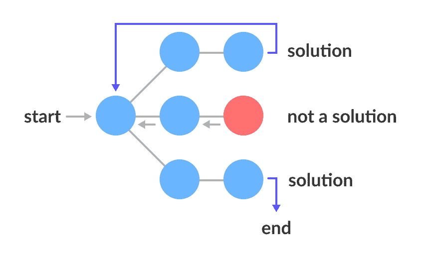
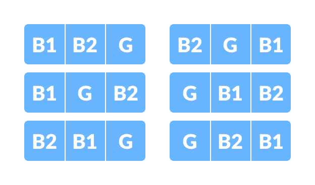
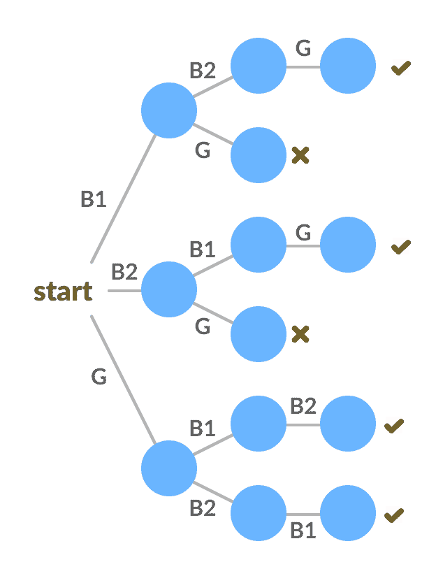

# 回溯算法

> 原文： [https://www.programiz.com/dsa/backtracking-algorithm](https://www.programiz.com/dsa/backtracking-algorithm)

#### 在本教程中，您将学习什么是回溯算法。 此外，您还将找到回溯方法的示例。

回溯算法是一种解决问题的算法，它使用**蛮力方法**来查找所需的输出。

蛮力方法会尝试所有可能的解决方案，然后选择所需/最佳解决方案。

术语“回溯”表示如果当前解决方案不合适，则回溯并尝试其他解决方案。 因此，在此方法中使用了递归。

此方法用于解决具有多种解决方案的问题。 如果需要最佳解决方案，则必须进行[动态编程](/dsa/dynamic-programming)。

* * *

## 状态空间树

空间状态树是表示问题的所有可能状态（解决方案或非解决方案）的树，该问题从根作为初始状态到叶作为终端状态。



State Space Tree


* * *

## 回溯算法

```
Backtrack(x)
    if x is not a solution
        return false
    if x is a new solution
        add to list of solutions
    backtrack(expand x)
```

* * *

## 回溯方法示例

问题：您想找到所有可能的方式在 3 个长凳上安排 2 个男孩和 1 个女孩。 约束：女孩不应该坐在中间的长凳上。

解决方案：共有`3! = 6`种可能性。 我们将尝试所有可能性并获得可能的解决方案。 我们递归地尝试所有可能性。

所有可能性是：



All the possibilities


以下[状态空间树](http://None)显示了可能的解决方案。



State tree with all the solutions


* * *

## 回溯算法应用

1.  查找图中存在的所有[哈密顿路径](https://en.wikipedia.org/wiki/Hamiltonian_path_problem)。
2.  [解决 N 皇后问题](https://en.wikipedia.org/wiki/Eight_queens_puzzle)。
3.  [解决迷宫问题](https://en.wikipedia.org/wiki/Maze_solving_algorithm)。
4.  [骑士的旅行问题](https://en.wikipedia.org/wiki/Knight%27s_tour)。