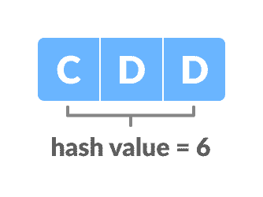
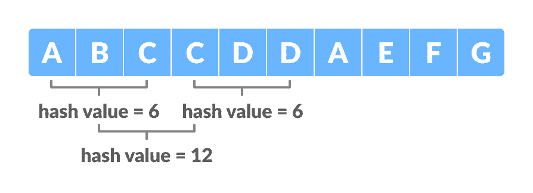

# Rabin-Karp 算法

> 原文： [https://www.programiz.com/dsa/rabin-karp-algorithm](https://www.programiz.com/dsa/rabin-karp-algorithm)

#### 在本教程中，您将学习什么是 rabin-karp 算法。 此外，您还将在 C，C++ ，Java 和 Python 中找到 rabin-karp 算法的工作示例。

Rabin-Karp 算法是一种用于使用哈希函数搜索/匹配文本中的模式的算法。 与朴素的字符串匹配算法不同，它在初始阶段不会遍历每个字符，而是过滤不匹配的字符，然后执行比较。

哈希函数是一种将较大的输入值映射到较小的输出值的工具。 此输出值称为哈希值。

* * *

## Rabin-Karp 算法如何工作？

采取一系列字符并检查是否存在所需字符串。 如果找到了可能性，则执行字符匹配。

让我们通过以下步骤来了解算法：

1.  假设文本为：

    

    文本

    

    ，并且要在上述文本中搜索的字符串为：

    

    模式

    

2.  让我们为问题中要使用的字符分配一个数值（`v`）/权重。 在这里，我们仅采用了前十个字母（即 A 到 J）。

    

    文本权重

    

3.  `m`是图案的长度，`n`是文本的长度。 在此，`m = 10 and n = 3.`
    令`d`为输入集中的字符数。 在这里，我们采用了输入集`{A, B, C, ..., J}`。 因此，`d = 10`。 您可以为`d`假定任何合适的值。
4.  让我们计算模式的哈希值。

    

    文本的哈希值

    

```
hash value for pattern(p) = Σ(v * dm-1) mod 13 
                      = ((3 * 102) + (4 * 101) + (4 * 100)) mod 13 
                      = 344 mod 13 
                      = 6
```

在上面的计算中，选择质数（此处为 13），以便我们可以使用单精度算术执行所有计算。

[计算模量的原因在之下给出](/dsa/rabin-karp-algorithm#limitations)。

5.  计算大小为`m`的文本窗口的哈希值。

```
For the first window ABC,
hash value for text(t) = Σ(v * dn-1) mod 13 
                  = ((1 * 102) + (2 * 101) + (3 * 100)) mod 13 
                  = 123 mod 13  
                  = 6
```

6.  将模式的哈希值与文本的哈希值进行比较。 如果它们匹配，则执行字符匹配。
    在上面的示例中，第一个窗口的哈希值（即`t`）与`p`匹配，因此请在`ABC`和`CDD`之间进行字符匹配。 由于它们不匹配，请转到下一个窗口。
7.  我们通过减去第一项并添加下一项来计算下一个窗口的哈希值，如下所示。

```
t = ((1 * 102) + ((2 * 101) + (3 * 100)) * 10 + (3 * 100)) mod 13 
  = 233 mod 13  
  = 12
```

为了优化此过程，我们以以下方式使用先前的哈希值。

```
t = ((d * (t - v[character to be removed] * h) + v[character to be added] ) mod 13  
  = ((10 * (6 - 1 * 9) + 3 )mod 13  
  = 12
Where, h = dm-1 = 103-1 = 100.
```

8.  对于`BCC`，`t = 12`（`≠ 6`）。 因此，转到下一个窗口。
    经过几次搜索，我们将在文本中获得窗口`CDA`的匹配项。

    

    不同窗口的哈希值

    

* * *

## 算法

```
n = t.length
m = p.length
h = dm-1 mod q
p = 0
t0 = 0
for i = 1 to m
    p = (dp + p[i]) mod q
    t0 = (dt0 + t[i]) mod q
for s = 0 to n - m
    if p = ts
        if p[1.....m] = t[s + 1..... s + m]
            print "pattern found at position" s
    If s < n-m
        ts + 1 = (d (ts - t[s + 1]h) + t[s + m + 1]) mod q
```

* * *

## Python，Java 和 C/C++ 示例

[Python](#python-code)[Java](#java-code)[C](#c-code)[C++](#cpp-code)

```
# Rabin-Karp algorithm in python

d = 10

def search(pattern, text, q):
    m = len(pattern)
    n = len(text)
    p = 0
    t = 0
    h = 1
    i = 0
    j = 0

    for i in range(m-1):
        h = (h*d) % q

    # Calculate hash value for pattern and text
    for i in range(m):
        p = (d*p + ord(pattern[i])) % q
        t = (d*t + ord(text[i])) % q

    # Find the match
    for i in range(n-m+1):
        if p == t:
            for j in range(m):
                if text[i+j] != pattern[j]:
                    break

            j += 1
            if j == m:
                print("Pattern is found at position: " + str(i+1))

        if i < n-m:
            t = (d*(t-ord(text[i])*h) + ord(text[i+m])) % q

            if t < 0:
                t = t+q

text = "ABCCDDAEFG"
pattern = "CDD"
q = 13
search(pattern, text, q)
```

```
// Rabin-Karp algorithm in Java

public class RabinKarp {
  public final static int d = 10;

  static void search(String pattern, String txt, int q) {
    int m = pattern.length();
    int n = txt.length();
    int i, j;
    int p = 0;
    int t = 0;
    int h = 1;

    for (i = 0; i < m - 1; i++)
      h = (h * d) % q;

    // Calculate hash value for pattern and text
    for (i = 0; i < m; i++) {
      p = (d * p + pattern.charAt(i)) % q;
      t = (d * t + txt.charAt(i)) % q;
    }

    // Find the match
    for (i = 0; i <= n - m; i++) {
      if (p == t) {
        for (j = 0; j < m; j++) {
          if (txt.charAt(i + j) != pattern.charAt(j))
            break;
        }

        if (j == m)
          System.out.println("Pattern is found at position: " + (i + 1));
      }

      if (i < n - m) {
        t = (d * (t - txt.charAt(i) * h) + txt.charAt(i + m)) % q;
        if (t < 0)
          t = (t + q);
      }
    }
  }

  public static void main(String[] args) {
    String txt = "ABCCDDAEFG";
    String pattern = "CDD";
    int q = 13;
    search(pattern, txt, q);
  }
}
```

```
// Rabin-Karp algorithm in C

#include <stdio.h>
#include <string.h>

#define d 10

void rabinKarp(char pattern[], char text[], int q) {
  int m = strlen(pattern);
  int n = strlen(text);
  int i, j;
  int p = 0;
  int t = 0;
  int h = 1;

  for (i = 0; i < m - 1; i++)
    h = (h * d) % q;

  // Calculate hash value for pattern and text
  for (i = 0; i < m; i++) {
    p = (d * p + pattern[i]) % q;
    t = (d * t + text[i]) % q;
  }

  // Find the match
  for (i = 0; i <= n - m; i++) {
    if (p == t) {
      for (j = 0; j < m; j++) {
        if (text[i + j] != pattern[j])
          break;
      }

      if (j == m)
        printf("Pattern is found at position:  %d \n", i + 1);
    }

    if (i < n - m) {
      t = (d * (t - text[i] * h) + text[i + m]) % q;

      if (t < 0)
        t = (t + q);
    }
  }
}

int main() {
  char text[] = "ABCCDDAEFG";
  char pattern[] = "CDD";
  int q = 13;
  rabinKarp(pattern, text, q);
}
```

```
// Rabin-Karp algorithm in C++

#include <string.h>

#include <iostream>
using namespace std;

#define d 10

void rabinKarp(char pattern[], char text[], int q) {
  int m = strlen(pattern);
  int n = strlen(text);
  int i, j;
  int p = 0;
  int t = 0;
  int h = 1;

  for (i = 0; i < m - 1; i++)
    h = (h * d) % q;

  // Calculate hash value for pattern and text
  for (i = 0; i < m; i++) {
    p = (d * p + pattern[i]) % q;
    t = (d * t + text[i]) % q;
  }

  // Find the match
  for (i = 0; i <= n - m; i++) {
    if (p == t) {
      for (j = 0; j < m; j++) {
        if (text[i + j] != pattern[j])
          break;
      }

      if (j == m)
        cout << "Pattern is found at position: " << i + 1 << endl;
    }

    if (i < n - m) {
      t = (d * (t - text[i] * h) + text[i + m]) % q;

      if (t < 0)
        t = (t + q);
    }
  }
}

int main() {
  char text[] = "ABCCDDAEFG";
  char pattern[] = "CDD";
  int q = 13;
  rabinKarp(pattern, text, q);
}
```

* * *

## Rabin-Karp 算法的局限性

### 虚假命中

当模式的哈希值与文本窗口的哈希值匹配，但该窗口不是实际的模式时，则称为虚假命中。

杂散命中会增加算法的时间复杂度。 为了最小化杂散命中，我们使用模数。 它大大减少了伪造的打击。

* * *

## Rabin-Karp 算法复杂度

Rabin-Karp 算法的平均情况和最佳情况复杂度为`O(m + n)`，最坏情况下的复杂度为`O(mn)`。

当所有窗口出现虚假命中数时，最坏情况下的复杂性就会发生。

* * *

## Rabin-Karp 算法应用

*   用于模式匹配
*   用于在较大的文本中搜索字符串