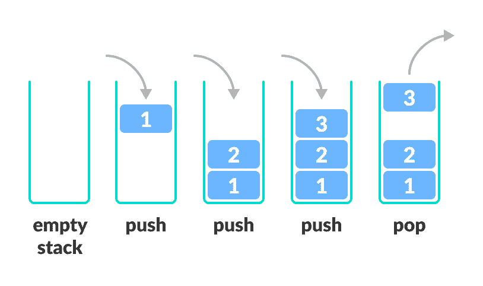
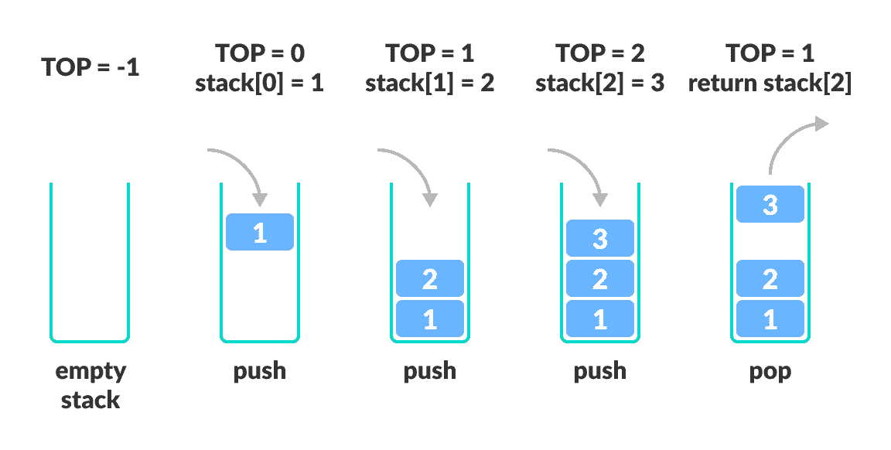

# 栈

> 原文： [https://www.programiz.com/dsa/stack](https://www.programiz.com/dsa/stack)

#### 在本教程中，您将学习什么是栈。 此外，您还将发现使用 C，C++ ，Java 和 Python 实现栈的实现。

栈是编程中有用的数据结构。 就像一堆板子彼此叠放。


Stack representation in the form of pile of plates


想一想用这样一堆盘子可以做的事情

*   在上面放一个新盘子
*   卸下顶板

如果要使板位于底部，则必须先卸下顶部的所有板。 这种安排称为**后进先出**-放置的最后一个项目是第一个要出去的项目。

* * *

## 编程术语中的栈

用编程术语来说，将一个项目放在栈的顶部称为“推”，而将一个项目删除则称为“弹出”。



Stack operations


在上图中，尽管项目 2 保留在最后，但它首先被移除-因此它遵循**后进先出（LIFO）**原则。

我们可以用任何编程语言（例如 C，C++ ，Java，Python 或 C# ）实现栈，但是规范几乎相同。

* * *

## 栈的规范

栈是一个对象，或更具体地说，是一个允许执行以下操作的抽象数据结构（ADT）：

*   `Push`：将元素添加到栈顶部
*   `Pop`：从栈顶部删除元素
*   `IsEmpty`：检查栈是否为空
*   `IsFull`：检查栈是否已满
*   `Peek`：获取顶部元素的值而不删除它

* * *

## 栈如何工作

操作如下：

1.  称为`TOP`的指针用于跟踪栈中的顶部元素。
2.  初始化栈时，我们将其值设置为 -1，以便我们可以通过比较`TOP == -1`来检查栈是否为空。
3.  推入元素时，我们增加`TOP`的值，然后将新元素放置在`TOP`指向的位置。
4.  弹出元素时，我们返回`TOP`指向的元素并减小其值。
5.  推入之前，我们检查栈是否已满
6.  弹出之前，我们检查栈是否已为空



Stack Operations


* * *

## Python，Java 和 C/C++ 示例

最常见的栈实现是使用数组，但也可以使用列表来实现。

[Python](#python-code)[Java](#java-code)[C](#c-code)[C+](#cpp-code)

```
# Stack implementation in python

# Creating a stack
def create_stack():
    stack = []
    return stack

# Creating an empty stack
def check_empty(stack):
    return len(stack) == 0

# Adding items into the stack
def push(stack, item):
    stack.append(item)
    print("pushed item: " + item)

# Removing an element from the stack
def pop(stack):
    if (check_empty(stack)):
        return "stack is empty"

    return stack.pop()

stack = create_stack()
push(stack, str(1))
push(stack, str(2))
push(stack, str(3))
push(stack, str(4))
print("popped item: " + pop(stack))
print("stack after popping an element: " + str(stack)) 
```

```
// Stack implementation in Java

class Stack {
  private int arr[];
  private int top;
  private int capacity;

  // Creating a stack
  Stack(int size) {
    arr = new int[size];
    capacity = size;
    top = -1;
  }

  // Add elements into stack
  public void push(int x) {
    if (isFull()) {
      System.out.println("OverFlow\nProgram Terminated\n");
      System.exit(1);
    }

    System.out.println("Inserting " + x);
    arr[++top] = x;
  }

  // Remove element from stack
  public int pop() {
    if (isEmpty()) {
      System.out.println("STACK EMPTY");
      System.exit(1);
    }
    return arr[top--];
  }

  // Utility function to return the size of the stack
  public int size() {
    return top + 1;
  }

  // Check if the stack is empty
  public Boolean isEmpty() {
    return top == -1;
  }

  // Check if the stack is full
  public Boolean isFull() {
    return top == capacity - 1;
  }

  public void printStack() {
    for (int i = 0; i <= top; i++) {
      System.out.println(arr[i]);
    }
  }

  public static void main(String[] args) {
    Stack stack = new Stack(5);

    stack.push(1);
    stack.push(2);
    stack.push(3);
    stack.push(4);

    stack.pop();
    System.out.println("\nAfter popping out");

    stack.printStack();

  }
}
```

```
// Stack implementation in C

#include <stdio.h>
#include <stdlib.h>

#define MAX 10

int count = 0;

// Creating a stack
struct stack {
  int items[MAX];
  int top;
};
typedef struct stack st;

void createEmptyStack(st *s) {
  s->top = -1;
}

// Check if the stack is full
int isfull(st *s) {
  if (s->top == MAX - 1)
    return 1;
  else
    return 0;
}

// Check if the stack is empty
int isempty(st *s) {
  if (s->top == -1)
    return 1;
  else
    return 0;
}

// Add elements into stack
void push(st *s, int newitem) {
  if (isfull(s)) {
    printf("STACK FULL");
  } else {
    s->top++;
    s->items[s->top] = newitem;
  }
  count++;
}

// Remove element from stack
void pop(st *s) {
  if (isempty(s)) {
    printf("\n STACK EMPTY \n");
  } else {
    printf("Item popped= %d", s->items[s->top]);
    s->top--;
  }
  count--;
  printf("\n");
}

// Print elements of stack
void printStack(st *s) {
  printf("Stack: ");
  for (int i = 0; i < count; i++) {
    printf("%d ", s->items[i]);
  }
  printf("\n");
}

// Driver code
int main() {
  int ch;
  st *s = (st *)malloc(sizeof(st));

  createEmptyStack(s);

  push(s, 1);
  push(s, 2);
  push(s, 3);
  push(s, 4);

  printStack(s);

  pop(s);

  printf("\nAfter popping out\n");
  printStack(s);
}
```

```
// Stack implementation in C++

#include <stdlib.h>
#include <iostream>

using namespace std;

#define MAX 10
int size = 0;

// Creating a stack
struct stack {
  int items[MAX];
  int top;
};
typedef struct stack st;

void createEmptyStack(st *s) {
  s->top = -1;
}

// Check if the stack is full
int isfull(st *s) {
  if (s->top == MAX - 1)
    return 1;
  else
    return 0;
}

// Check if the stack is empty
int isempty(st *s) {
  if (s->top == -1)
    return 1;
  else
    return 0;
}

// Add elements into stack
void push(st *s, int newitem) {
  if (isfull(s)) {
    printf("STACK FULL");
  } else {
    s->top++;
    s->items[s->top] = newitem;
  }
  size++;
}

// Remove element from stack
void pop(st *s) {
  if (isempty(s)) {
    printf("\n STACK EMPTY \n");
  } else {
    printf("Item popped= %d", s->items[s->top]);
    s->top--;
  }
  size--;
  cout << endl;
}

// Print elements of stack
void printStack(st *s) {
  printf("Stack: ");
  for (int i = 0; i < size; i++) {
    cout << s->items[i] << " ";
  }
  cout << endl;
}

// Driver code
int main() {
  int ch;
  st *s = (st *)malloc(sizeof(st));

  createEmptyStack(s);

  push(s, 1);
  push(s, 2);
  push(s, 3);
  push(s, 4);

  printStack(s);

  pop(s);

  cout << "\nAfter popping out\n";
  printStack(s);
}
```

* * *

## 栈复杂度

对于基于数组的栈实现，推入和弹出操作需要固定时间，即`O(1)`，因为在两种情况下都只有指针移动。

* * *

## 栈应用

尽管栈是一个易于实现的简单数据结构，但它非常强大。 栈最常见的用途是：

*   **反转单词**-将所有字母叠放并弹出。 由于栈的 LIFO 顺序，您将获得相反顺序的字母。
*   **在编译器中**-编译器使用栈通过将表达式转换为前缀或后缀形式来计算`2 + 4 / 5 * (7 - 9)`之类的表达式的值。
*   **在浏览器中**-浏览器中的“后退”按钮会将您以前访问过的所有 URL 保存在栈中。 每次您访问新页面时，它都会被添加到栈顶部。 当您按下“后退”按钮时，当前 URL 从栈中删除，并访问前一个 URL。