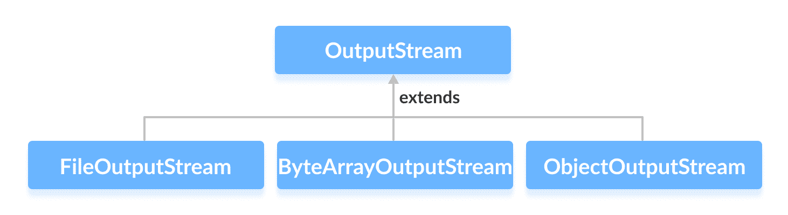

# Java OutputStream 类

> 原文： [https://www.programiz.com/java-programming/outputstream](https://www.programiz.com/java-programming/outputstream)

#### 在本教程中，我们将通过一个示例学习 Java OutputStream 及其方法。

`java.io`包的`OutputStream`类是一个抽象超类，代表字节的输出流。

由于`OutputStream`是抽象类，因此它本身没有用。 但是，其子类可用于写入数据。

* * *

## OutputStream 的子类

为了使用`OutputStream`的功能，我们可以使用其子类。 他们之中有一些是：

*   [FileOutputStream](/java-programming/fileoutputstream "Java FileOutputStream Class")
*   [ByteArrayOutputStream](/java-programming/bytearrayoutputstream "Java ByteArrayOutputStream Class")
*   [ObjectOutputStream](/java-programming/objectoutputstream "Java ObjectOutputStream Class")



在下一个教程中，我们将学习所有这些子类。

* * *

## 创建一个 OutputStream

为了创建一个`OutputStream`，我们必须首先导入`java.io.OutputStream`包。 导入包后，就可以创建输出流。

```java
// Creates an OutputStream
OutputStream object = new FileOutputStream(); 
```

在这里，我们使用`FileOutputStream`创建了一个输出流对象。 因为`OutputStream`是抽象类，所以我们无法创建`OutputStream`的对象。

**注意**：我们也可以从`OutputStream`类的其他子类创建输出流。

* * *

## OutputStream 的方法

`OutputStream`类提供了由其子类实现的不同方法。 以下是一些方法：

*   `write()`-将指定的字节写入输出流
*   `write(byte[] array)`-将指定数组中的字节写入输出流
*   `flush()`-强制将输出流中存在的所有数据写入目标
*   `close()`-关闭输出流

* * *

## 示例：使用 FileOutputStream 的 OutputStream

这是我们可以使用`FileOutputStream`类实现`OutputStream`的方法。

```java
import java.io.FileOutputStream;
import java.io.OutputStream;

public class Main {

    public static void main(String args[]) {
        String data = "This is a line of text inside the file.";

        try {
            OutputStream out = new FileOutputStream("output.txt");

            // Converts the string into bytes
            byte[] dataBytes = data.getBytes();

            // Writes data to the output stream
            out.write(dataBytes);
            System.out.println("Data is written to the file.");

            // Closes the output stream
            out.close();
        }

        catch (Exception e) {
            e.getStackTrace();
        }
    }
} 
```

在上面的示例中，我们使用`FileOutputStream`类创建了一个输出流。 现在，输出流已与文件 **output.txt** 链接。

```java
OutputStream out = new FileOutputStream("output.txt"); 
```

要将数据写入 **output.txt** 文件，我们已经实现了这些方法。

```java
output.write();      // To write data to the file
output.close();      // To close the output stream 
```

当我们运行该程序时， **output.txt** 文件将填充以下内容。

```java
This is a line of text inside the file. 
```

要了解更多信息，请访问 [Java OutputStream（官方 Java 文档）](https://docs.oracle.com/javase/7/docs/api/java/io/OutputStream.html "Java OutputStream (official Java documentation)")。