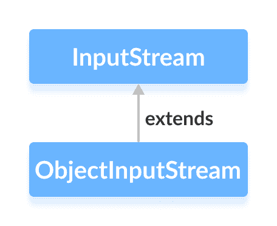

# Java `ObjectInputStream`类

> 原文： [https://www.programiz.com/java-programming/objectinputstream](https://www.programiz.com/java-programming/objectinputstream)

#### 在本教程中，我们将借助示例学习 Java `ObjectOutputStream`及其方法。

`java.io`包的`ObjectInputStream`类可用于读取先前由`ObjectOutputStream`写入的对象。

它扩展了`InputStream`抽象类。



在学习`ObjectInputStream`类之前，请确保您了解[`ObjectOutputStream`类](/java-programming/objectoutputstream "Java ObjectOutputStream Class")。

* * *

## `ObjectInputStream`的工作原理

`ObjectInputStream`主要用于读取`ObjectOutputStream`写入的数据。

基本上，`ObjectOutputStream`将 Java 对象转换为相应的流。 这称为序列化。 这些转换后的流可以存储在文件中，也可以通过网络传输。

现在，如果需要读取这些对象，将使用`ObjectInputStream`将流转换回相应的对象。 这称为反序列化。

* * *

## 创建一个`ObjectInputStream`

为了创建对象输入流，我们必须首先导入`java.io.ObjectInputStream`包。 导入包后，就可以创建输入流。

```java
// Creates a file input stream linked with the specified file
FileInputStream fileStream = new FileInputStream(String file);

// Creates an object input stream using the file input stream
ObjectInputStream objStream = new ObjectInputStream(fileStream); 
```

在上面的示例中，我们创建了一个名为`objStream`的对象输入流，该对象输入流与名为`fileStream`的文件输入流链接在一起。

现在，`objStream`可用于从文件读取对象。

* * *

## `ObjectInputStream`的方法

`ObjectInputStream`类提供`InputStream`类中存在的不同方法的实现。

## `read()`方法

*   `read()` - 从输入流中读取一个字节的数据
*   `readBoolean()` - 以布尔形式读取数据
*   `readChar()` - 以字符形式读取数据
*   `readInt()` - 读取整数形式的数据
*   `readObject()` - 从输入流中读取对象

* * *

### 示例 1：Java `ObjectInputStream`

让我们看看如何使用`ObjectInputStream`类读取由`ObjectOutputStream`类编写的对象。

```java
import java.io.FileInputStream;
import java.io.FileOutputStream;
import java.io.ObjectInputStream;
import java.io.ObjectOutputStream;

class Main {
    public static void main(String[] args) {

        int data1 = 5;
        String data2 = "This is programiz";

        try {
            FileOutputStream file = new FileOutputStream("file.txt");
            ObjectOutputStream output = new ObjectOutputStream(file);

            // Writing to the file using ObjectOutputStream
            output.writeInt(data1);
            output.writeObject(data2);

            FileInputStream fileStream = new FileInputStream("file.txt");
            // Creating an object input stream
            ObjectInputStream objStream = new ObjectInputStream(fileStream);

            //Using the readInt() method
            System.out.println("Integer data :" + objStream.readInt());

            // Using the readObject() method
            System.out.println("String data: " + objStream.readObject());

            output.close();
            objStream.close();
        }
        catch (Exception e) {
            e.getStackTrace();
        }
    }
} 
```

**输出**

```java
Integer data: 5
String data: This is programiz 
```

在上面的示例中，我们使用`readInt()`和`readObject()`方法从文件中读取整数数据和对象数据。

在这里，我们使用`ObjectOutputStream`将数据写入文件。 然后，我们使用`ObjectInputStream`从文件中读取数据。

* * *

### 示例 2：Java `ObjectInputStream`

让我们看另一个实际的例子，

```java
import java.io.FileInputStream;
import java.io.FileOutputStream;
import java.io.ObjectInputStream;
import java.io.ObjectOutputStream;
import java.io.Serializable;

class Dog implements Serializable {

    String name;
    String breed;

    public Dog(String name, String breed) {
        this.name = name;
        this.breed = breed;
    }
}

class Main {
    public static void main(String[] args) {

        // Creates an object of Dog class
        Dog dog = new Dog("Tyson", "Labrador");

        try {
            FileOutputStream file = new FileOutputStream("file.txt");

            // Creates an ObjectOutputStream
            ObjectOutputStream output = new ObjectOutputStream(file);

            // Writes objects to the output stream
            output.writeObject(dog);

            FileInputStream fileStream = new FileInputStream("file.txt");

            // Creates an ObjectInputStream
            ObjectInputStream input = new ObjectInputStream(fileStream);

            // Reads the objects
            Dog newDog = (Dog) input.readObject();

            System.out.println("Dog Name: " + newDog.name);
            System.out.println("Dog Breed: " + newDog.breed);

            output.close();
            input.close();
        }

        catch (Exception e) {
            e.getStackTrace();
        }
    }
} 
```

**输出**：

```java
Dog Name: Tyson
Dog Breed: Labrador 
```

在上面的示例中，我们创建了

*   名为`output`的`ObjectOutputStream`，使用名为`file`的文件
*   名为`input`的`ObjectInputStream`，使用名为`fileStream`的`FileInputStream`
*   `Dog`类的对象`Dog`

在这里，我们然后使用对象输出流将对象写入文件。 并且，对象输入流从文件中读取对象。

**注意**：`Dog`类实现`Serializable`接口。 这是因为`ObjectOutputStream`仅将可序列化的对象写入输出流。

* * *

## `ObjectInputStream`的其他方法

| 方法 | 内容描述 |
| --- | --- |
| `available()` | 返回输入流中的可用字节数 |
| `mark()` | 标记输入流中已读取数据的位置 |
| `reset()` | 将控件返回到输入流中设置了标记的点 |
| `skipBytes()` | 从输入流中跳过并丢弃指定的字节 |
| `close()` | 关闭对象输入流 |

要了解更多信息，请访问 [Java `ObjectInputStream`（官方 Java 文档）](https://docs.oracle.com/javase/7/docs/api/java/io/ObjectInputStream.html "Java ObjectInputStream (official Java documentation)")。