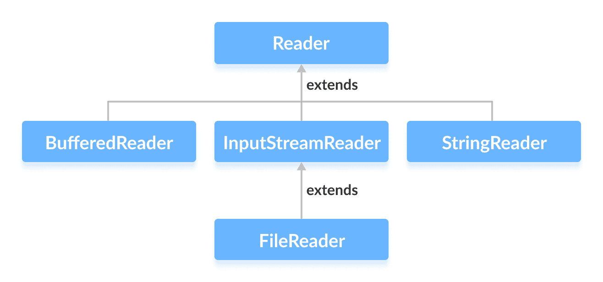

# Java `Reader`类

> 原文： [https://www.programiz.com/java-programming/reader](https://www.programiz.com/java-programming/reader)

#### 在本教程中，我们将通过一个示例来学习 Java `Reader`，其子类及其方法。

`java.io`包的`Reader`类是代表字符流的抽象超类。

由于`Reader`是抽象类，因此它本身没有用。 但是，其子类可用于读取数据。

* * *

## `Reader`的子类

为了使用`Reader`的功能，我们可以使用其子类。 他们之中有一些是：

*   [`BufferedReader`](https://www.programiz.com/java-programming/bufferedreader "Java BufferedReader")
*   [`InputStreamReader`](https://www.programiz.com/java-programming/inputstreamreader "Java InputStreamReader")
*   [`FileReader`](https://www.programiz.com/java-programming/filereader "Java FileReader")
*   [`StringReader`](https://www.programiz.com/java-programming/stringreader "Java StringReader")



在下一个教程中，我们将学习所有这些子类。

* * *

## 创建`Reader`

为了创建一个`Reader`，我们必须首先导入`java.io.Reader`包。 导入包后，就可以创建读取器。

```java
// Creates a Reader
Reader input = new FileReader(); 
```

在这里，我们使用`FileReader`类创建了一个读取器。 这是因为`Reader`是抽象类。 因此，我们无法创建`Reader`的对象。

**注意**：我们也可以从`Reader`的其他子类创建读取器。

* * *

## `Reader`方法

`Reader`类提供了由其子类实现的不同方法。 以下是一些常用方法：

*   `ready()` - 检查读取器是否准备好阅读
*   `read(char[] array)` - 从流中读取字符并将其存储在指定的数组中
*   `read(char[] array, int start, int length)` - 从流中读取等于`length`的字符数，并从`start`开始存储在指定的数组中
*   `mark()` - 标记流中已读取数据的位置
*   `reset()` - 将控件返回到流中设置标记的点
*   `skip()` - 从流中丢弃指定数量的字符

* * *

## 示例：使用`FileReader`的`Reader`

这是我们可以使用`FileReader`类实现`Reader`的方法。

假设我们有一个名为`input.txt`的文件，其内容如下。

```java
This is a line of text inside the file. 
```

让我们尝试使用`FileReader`（`Reader`的子类）读取此文件。

```java
import java.io.Reader;
import java.io.FileReader;

class Main {
    public static void main(String[] args) {

        // Creates an array of character
        char[] array = new char[100];

        try {
            // Creates a reader using the FileReader
            Reader input = new FileReader("input.txt");

            // Checks if reader is ready 
            System.out.println("Is there data in the stream?  " + input.ready());

            // Reads characters
            input.read(array);
            System.out.println("Data in the stream:");
            System.out.println(array);

            // Closes the reader
            input.close();
        }

        catch(Exception e) {
            e.getStackTrace();
        }
    }
} 
```

**输出**

```java
Is there data in the stream?  true
Data in the stream:
This is a line of text inside the file. 
```

在上面的示例中，我们使用`FileReader`类创建了一个读取器。 读取器与文件`input.txt`链接。

```java
Reader input = new FileReader("input.txt"); 
```

要从`input.txt`文件读取数据，我们已经实现了这些方法。

```java
input.read();       // to read data from the reader
input.close();      // to close the reader 
```

要了解更多信息，请访问 [Java `Reader`（Java 官方文档）](https://docs.oracle.com/javase/7/docs/api/java/io/Reader.html "Java Reader (official Java documentation)")。