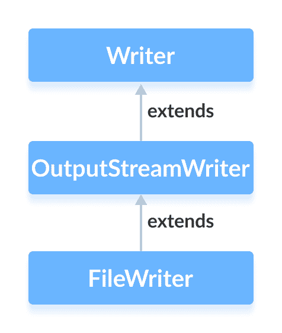

# Java `FileWriter`类

> 原文： [https://www.programiz.com/java-programming/filewriter](https://www.programiz.com/java-programming/filewriter)

#### 在本教程中，我们将借助示例学习 Java `FileWriter`及其方法。

`java.io`包的`FileWriter`类可用于将数据（以字符形式）写入文件。

它扩展了`OutputStreamWriter`类。



在进一步了解`FileWriter`之前，请确保了解 [Java 文件](/java-programming/files "Java Files")。

* * *

## 创建一个`FileWriter`

为了创建文件写入器，我们必须首先导入`Java.io.FileWriter`包。 导入包后，就可以创建文件写入器。

**1.使用文件名**

```java
FileWriter output = new FileWriter(String name); 
```

在这里，我们创建了一个文件写入器，该文件写入器将链接到`name`指定的文件。

**2.使用文件对象**

```java
FileWriter  input = new FileWriter(File fileObj); 
```

在这里，我们创建了一个文件写入器，该文件写入器将链接到文件对象所指定的文件。

在上面的示例中，数据是使用某些默认字符编码存储的。

但是，由于 Java 11，我们也可以指定字符编码的类型（**UTF8** 或 **UTF16**）。

```java
FileWriter input = new FileWriter(String file, Charset cs); 
```

在这里，我们使用`Charset`类指定文件写入器的字符编码。

* * *

## `FileWriter`的方法

`FileWriter`类提供了`Writer`类中存在的不同方法的实现。

### `write()`方法

*   `write()`-向编写者写入一个字符
*   `write(char[] array)`-将指定数组中的字符写入写入器
*   `write(String data)`-将指定的字符串写入写入器

* * *

### 示例：`FileWriter`将数据写入文件

```java
import java.io.FileWriter;

public class Main {

  public static void main(String args[]) {

    String data = "This is the data in the output file";

    try {
      // Creates a FileWriter
      FileWriter output = new FileWriter("output.txt");

      // Writes the string to the file
      output.write(data);

      // Closes the writer
      output.close();
    }

    catch (Exception e) {
      e.getStackTrace();
    }
  }
} 
```

在上面的示例中，我们创建了一个名为`output`的文件写入器。 输出读取器与`output.txt`文件链接。

```java
FileWriter output = new FileWriter("output.txt"); 
```

要将数据写入文件，我们使用了`write()`方法。

在这里，当我们运行程序时，`output.txt`文件填充了以下内容。

```java
This is a line of text inside the file. 
```

* * *

## `getEncoding()`方法

`getEncoding()`方法可用于获取用于写入数据的编码类型。 例如，

```java
import java.io.FileWriter;
import java.nio.charset.Charset;

class Main {
  public static void main(String[] args) {

    String file = "output.txt";

    try {
      // Creates a FileReader with default encoding
      FileWriter output1 = new FileWriter(file);

      // Creates a FileReader specifying the encoding
      FileWriter output2 = new FileWriter(file, Charset.forName("UTF8"));

      // Returns the character encoding of the reader
      System.out.println("Character encoding of output1: " + output1.getEncoding());
      System.out.println("Character encoding of output2: " + output2.getEncoding());

      // Closes the reader
      output1.close();
      output2.close();
    }

    catch(Exception e) {
      e.getStackTrace();
    }
  }
} 
```

**输出**

```java
The character encoding of output1: Cp1252
The character encoding of output2: UTF8 
```

在上面的示例中，我们创建了 2 个文件写入器，分别名为`output1`和`output2`。

*   `output1`未指定字符编码。 因此，`getEncoding()`方法返回默认字符编码。
*   `output2`指定字符编码 **UTF8**。 因此，`getEncoding()`方法返回指定的字符编码。

**注意**：我们已经使用`Charset.forName()`方法来指定字符编码的类型。 要了解更多信息，请访问 [Java `Charset`（Java 官方文档）](https://docs.oracle.com/javase/7/docs/api/java/nio/charset/Charset.html "Java Charset (official Java documentation)")。

* * *

## `close()`方法

要关闭文件写入器，我们可以使用`close()`方法。 调用`close()`方法后，我们将无法使用写入器来写入数据。

* * *

## `FileWriter`的其他方法

| 方法 | 描述 |
| --- | --- |
| `flush()` | 强制将写入器中存在的所有数据写入相应的目的地 |
| `append()` | 将指定字符插入当前作者 |

要了解更多信息，请访问 [Java `FileWriter`（Java 官方文档）](https://docs.oracle.com/en/java/javase/11/docs/api/java.base/java/io/FileWriter.html "Java FileWriter (official Java documentation)")。