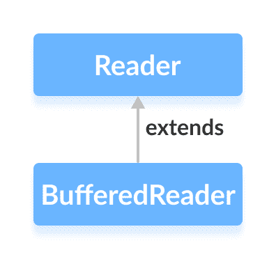

# Java `BufferedReader`类

> 原文： [https://www.programiz.com/java-programming/bufferedreader](https://www.programiz.com/java-programming/bufferedreader)

#### 在本教程中，我们将借助示例学习 Java `BufferedReader`及其方法。

`java.io`包的`BufferedReader`类可与其他读取器一起使用，以更有效地读取数据（以字符为单位）。

它扩展了抽象类`Reader`。



* * *

## `BufferedReader`的工作

`BufferedReader`维护内部**缓冲区，该缓冲区为 8192 个字符**。

在`BufferedReader`中进行读取操作期间，将从磁盘读取一部分字符并将其存储在内部缓冲区中。 并且从内部缓冲区中单独读取字符。

因此，减少了与磁盘的通信次数。 这就是使用`BufferedReader`读取字符更快的原因。

* * *

## 创建一个`BufferedReader`

为了创建一个`BufferedReader`，我们必须首先导入`java.io.BuferedReader`包。 导入软件包后，就可以创建读取器。

```java
// Creates a FileReader
FileReader file = new FileReader(String file);

// Creates a BufferedReader
BufferedReader buffer = new BufferedReader(file); 
```

在上面的示例中，我们使用名为`file`的文件创建了名为`buffer`的`BufferedReader`。

此处，`BufferedReader`的内部缓冲区的默认大小为 8192 个字符。 但是，我们也可以指定内部缓冲区的大小。

```java
// Creates a BufferdReader with specified size internal buffer
BufferedReader buffer = new BufferedReader(file, int size); 
```

缓冲区将有助于更快地从文件中读取字符。

* * *

## `BufferedReader`的方法

`BufferedReader`类提供了`Reader`中存在的不同方法的实现。

### `read()`方法

*   `read()`-从读取器的内部缓冲区读取单个字符
*   `read(char[] array)`-从读取器读取字符并将其存储在指定的数组中
*   `read(char[] array, int start, int length)`-从读取器中读取等于`length`的字符数，并从位置`start`开始存储在指定的数组中

例如，假设我们有一个名为`input.txt`的文件，其内容如下。

```java
This is a line of text inside the file. 
```

让我们尝试使用`BufferedReader`读取文件。

```java
import java.io.FileReader;
import java.io.BufferedReader;

class Main {
  public static void main(String[] args) {

    // Creates an array of character
    char[] array = new char[100];

    try {
      // Creates a FileReader
      FileReader file = new FileReader("input.txt");

      // Creates a BufferedReader
      BufferedReader input = new BufferedReader(file);

      // Reads characters
      input.read(array);
      System.out.println("Data in the file: ");
      System.out.println(array);

      // Closes the reader
      input.close();
    }

    catch(Exception e) {
      e.getStackTrace();
    }
  }
} 
```

**输出**

```java
Data in the file:
This is a line of text inside the file. 
```

在上面的示例中，我们创建了一个名为`input`的缓冲读取器。 缓冲的读取器与 **input.txt** 文件链接。

```java
FileReader file = new FileReader("input.txt");
BufferedReader input = new BufferedReader(file); 
```

在这里，我们已使用`read()`方法从缓冲读取器的内部缓冲区读取字符数组。

* * *

### `skip()`方法

要丢弃并跳过指定数量的字符，可以使用`skip()`方法。 例如，

```java
import java.io.FileReader;
import java.io.BufferedReader;

public class Main {

  public static void main(String args[]) {

    // Creates an array of characters
    char[] array = new char[100];

    try {
      // Suppose, the input.txt file contains the following text
      // This is a line of text inside the file.
      FileReader file = new FileReader("input.txt");

      // Creates a BufferedReader
      BufferedReader input = new BufferedReader(file);

      // Skips the 5 characters
      input.skip(5);

      // Reads the characters
      input.read(array);

      System.out.println("Data after skipping 5 characters:");
      System.out.println(array);

      // closes the reader
      input.close();
    }

    catch (Exception e) {
      e.getStackTrace();
    }
  }
} 
```

**输出**：

```java
Data after skipping 5 characters:
is a line of text inside the file. 
```

在上面的示例中，我们使用`skip()`方法从文件读取器中跳过 5 个字符。 因此，从原始文件中跳过了字符`'T'`，`'h'`，`'i'`，`'s'`和`' '`。

* * *

### `close()`方法

要关闭缓冲的读取器，我们可以使用`close()`方法。 调用`close()`方法后，我们将无法使用读取器读取数据。

* * *

## `BufferedReader`的其他方法

| 方法 | 描述 |
| `ready()` | 检查文件读取器是否准备好阅读 |
| `mark()` | 标记读取器中已读取数据的位置 |
| `reset()` | 将控件返回到读取器中设置标记的位置 |

要了解更多信息，请访问 [Java `BufferedReader`（Java 官方文档）](https://docs.oracle.com/en/java/javase/11/docs/api/java.base/java/io/BufferedReader.html "Java BufferedReader (official Java documentation)")。