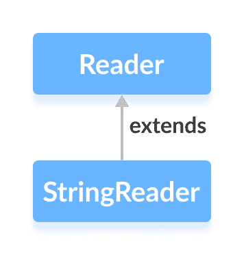

# Java StringReader 类

> 原文： [https://www.programiz.com/java-programming/stringreader](https://www.programiz.com/java-programming/stringreader)

#### 在本教程中，我们将借助示例学习 Java StringReader 及其方法。

`java.io`包的`StringReader`类可用于从字符串读取数据（以字符为单位）。

它扩展了抽象类`Reader`。



**注意**：在`StringReader`中，指定的字符串充当从中单独读取字符的来源。

* * *

## 创建一个 StringReader

为了创建一个`StringReader`，我们必须首先导入`java.io.StringReader`包。 导入包后，就可以创建字符串读取器。

```java
// Creates a StringReader
StringReader input = new StringReader(String data); 
```

在这里，我们创建了一个`StringReader`，它从名为`data`的指定字符串中读取字符。

* * *

## StringReader 的方法

`StringReader`类提供了`Reader`类中存在的不同方法的实现。

### read（）方法

*   `read()`-从字符串读取器读取单个字符
*   `read(char[] array)`-从读取器读取字符并将其存储在指定的数组中
*   `read(char[] array, int start, int length)`-从读取器中读取等于`长度`的字符数，并从位置`开始`开始存储在指定的数组中

* * *

### 示例：Java StringReader

```java
import java.io.StringReader;

public class Main {
  public static void main(String[] args) {

    String data = "This is the text read from StringReader.";

    // Create a character array
    char[] array = new char[100];

    try {
      // Create a StringReader
      StringReader input = new StringReader(data);

      //Use the read method
      input.read(array);
      System.out.println("Data read from the string:");
      System.out.println(array);

      input.close();
    }
    catch(Exception e) {
      e.getStackTrace();
    }
  }
} 
```

**输出**

```java
Data read from the string:
This is the text read from StringReader. 
```

在上面的示例中，我们创建了一个名为`输入`的字符串读取器。 字符串读取器链接到字符串`data`。

```java
String data = "This is a text in the string.";
StringReader input = new StringReader(data); 
```

为了从字符串中读取数据，我们使用了`read()`方法。

在此，该方法从读取器读取一个字符数组，并将其存储在指定的数组中。

* * *

### skip（）方法

要丢弃并跳过指定数量的字符，可以使用`skip()`方法。 例如，

```java
import java.io.StringReader;

public class Main {
  public static void main(String[] args) {

    String data = "This is the text read from StringReader";
    System.out.println("Original data: " + data);

    // Create a character array
    char[] array = new char[100];

    try {
      // Create a StringReader
      StringReader input = new StringReader(data);

      // Use the skip() method
      input.skip(5);

      //Use the read method
      input.read(array);
      System.out.println("Data after skipping 5 characters:");
      System.out.println(array);

      input.close();
    }

    catch(Exception e) {
      e.getStackTrace();
    }
  }
} 
```

**输出**：

```java
Original data: This is the text read from the StringReader
Data after skipping 5 characters:
is the text read from the StringReader 
```

在上面的示例中，我们使用`skip()`方法从字符串读取器中跳过 5 个字符。 因此，从原始字符串读取器中跳过了字符`'T'`，`'h'`，`'i'`，`'s'`和`' '`。

* * *

### close（）方法

要关闭字符串读取器，我们可以使用`close()`方法。 调用`close()`方法后，我们将无法使用读取器从字符串读取数据。

* * *

## StringReader 的其他方法

| 方法 | 描述 |
| `ready()` | 检查字符串读取器是否准备好被读取 |
| `mark()` | 标记读取器中已读取数据的位置 |
| `reset()` | 将控件返回到读取器中设置标记的位置 |

要了解更多信息，请访问 [Java StringReader（Java 官方文档）](https://docs.oracle.com/en/java/javase/13/docs/api/java.base/java/io/StringReader.html "Java StringReader (official Java documentation)")。