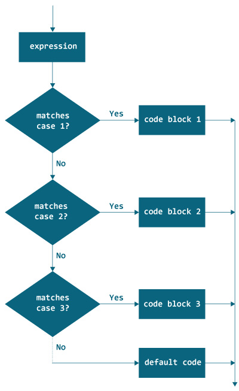

# Java `switch`语句

> 原文： [https://www.programiz.com/java-programming/switch-statement](https://www.programiz.com/java-programming/switch-statement)

#### 在本教程中，您将学习如何使用 Java 中的`switch`语句来控制程序执行的流程

在 Java 中，我们使用[`if..else..if`梯形图](/java-programming/if-else-statement#if-else-ladder "Java if..else..if ladder")在多个块中执行一个代码块。 但是，`if...else...if`梯子的语法太长。

因此，我们可以使用`switch`语句代替长的`if...else...if`梯子。`switch`语句的使用使我们的代码更具可读性。

`switch`语句的语法为：

```java
switch (variable/expression) {
case value1:
   // statements of case1
   break;

case value2:
   // statements of case2
   break;

   .. .. ...
   .. .. ...

default:
   // default statements
} 
```

`switch`语句求值`expression`（主要是`variable`），并将其与每个`case`标签的值（可以是表达式）进行比较。

现在，如果值与某个`case`标签匹配，则将执行所有与`case`标签匹配的语句。

例如，如果`variable/expression`等于`value2`。 在这种情况下，将执行与该`case`相匹配的所有语句（`case2`的语句）。

注意，在每种情况下都使用`break`语句。`break`语句用于终止`switch`语句的执行。

这很重要，因为如果不使用`break`，则匹配大小写之后的所有语句将按顺序执行，直到`switch`语句的结尾。

* * *

## `switch`语句流程图



Flow chart of the Java switch statement


注意：Java `switch`语句仅适用于：

*   [Java 基本数据类型](/java-programming/variables-primitive-data-types#data-types "Java Primitive data types")：字节，短型，字符和整数
*   [Java 枚举类型](/java-programming/enums "Java Enumerated types")
*   [Java 字符串类](/java-programming/string "Java String Class")
*   [Java 包装器类](/java-programming/wrapper "Java Wrapper Classes")：字符，字节，短整数和整数。

* * *

## 示例 1：Java `switch`语句

```java
class Main {
    public static void main(String[] args) {

        int week = 4;
        String day;

        // switch statement to check day
        switch (week) {
            case 1:
                day = "Sunday";
                break;
            case 2:
                day = "Monday";
                break;
            case 3:
                day = "Tuesday";
                break;

            // match the value of week
            case 4:
                day = "Wednesday";
                break;
            case 5:
                day = "Thursday";
                break;
            case 6:
                day = "Friday";
                break;
            case 7:
                day = "Saturday";
                break;
            default:
                day = "Invalid day";
                break;
        }
        System.out.println("The day is " + day);
    }
} 
```

**输出**：

```java
The day is Wednesday 
```

在上面的示例中，我们使用`switch`语句找出星期几。 在这里，我们有一个变量`week`，它保存一个整数值。 将该值与`switch`块内的每个`case`进行比较。

这里，`week`的值是`4`。 因此，它与`case 4`相匹配。 因此，`case 4`内部的语句将被执行。

* * *

## 示例 2：使用`switch`语句制作计算器

下面的程序从用户那里接收三个输入：**一个操作符**和 **2 个数字**。 根据用户提供的运算符，对这些数字进行计算。 然后结果显示在屏幕上。

在执行程序之前，请确保您了解 [Java 扫描器](/java-programming/scanner "Java Scanner")，以接受用户的输入。

```java
import java.util.Scanner;

class Main {
    public static void main(String[] args) {

        char operator;
        Double number1, number2, result;

        // create an object of Scanner class
        Scanner scanner = new Scanner(System.in);
        System.out.print("Enter operator (either +, -, * or /): ");

        // ask user to enter operator
        operator = scanner.next().charAt(0);
        System.out.print("Enter number1 and number2 respectively: ");

        // ask user to enter numbers
        number1 = scanner.nextDouble();
        number2 = scanner.nextDouble();

        switch (operator) {

            // performs addition between numbers
            case '+':
                result = number1 + number2;
                System.out.print(number1 + "+" + number2 + " = " + result);
                break;

            // performs subtraction between numbers
            case '-':
                result = number1 - number2;
                System.out.print(number1 + "-" + number2 + " = " + result);
                break;

            // performs multiplication between numbers
            case '*':
                result = number1 * number2;
                System.out.print(number1 + "*" + number2 + " = " + result);
                break;

            // performs division between numbers
            case '/':
                result = number1 / number2;
                System.out.print(number1 + "/" + number2 + " = " + result);
                break;

            default:
                System.out.println("Invalid operator!");
                break;
        }
    }
} 
```

**输出**：:

```java
Enter operator (either +, -, * or /): *
Enter number1 and number2 respectively: 1.4
-5.3
1.4*-5.3 = -7.419999999999999 
```

在上面的示例中，我们使用`switch`语句创建了一个计算器。 它根据用户提供的运算符执行计算。