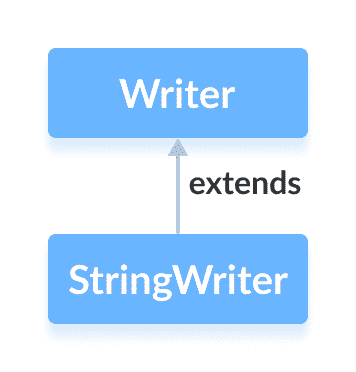

# Java StringWriter 类

> 原文： [https://www.programiz.com/java-programming/stringwriter](https://www.programiz.com/java-programming/stringwriter)

#### 在本教程中，我们将借助示例学习 Java StringWriter 及其子类。

`java.io`包的`StringWriter`类可用于将数据（以字符为单位）写入字符串缓冲区。

它扩展了抽象类`Writer`。



**注意**：在 Java 中，字符串缓冲区被视为可变字符串。 也就是说，我们可以修改字符串缓冲区。 要从字符串缓冲区转换为字符串，我们可以使用`toString()`方法。

* * *

## 创建一个 StringWriter

为了创建一个`StringWriter`，我们必须首先导入`java.io.StringWriter`包。 导入包后，就可以创建字符串编写器了。

```java
// Creates a StringWriter
StringWriter output = new StringWriter(); 
```

在这里，我们创建了具有默认字符串缓冲区容量的字符串编写器。 但是，我们也可以指定字符串缓冲区的容量。

```java
// Creates a StringWriter with specified string buffer capacity
StringWriter output = new StringWriter(int size); 
```

在此，`size`指定字符串缓冲区的容量。

* * *

## StringWriter 的方法

`StringWriter`类提供了`Writer`类中存在的不同方法的实现。

### write（）方法

*   `write()`-向字符串编写器写入一个字符
*   `write(char[] array)`-将指定数组中的字符写入编写器
*   `write(String data)`-将指定的字符串写入编写器

* * *

### 示例：Java StringWriter

```java
import java.io.StringWriter;

public class Main {
  public static void main(String[] args) {

    String data = "This is the text in the string.";

    try {
      // Create a StringWriter with default string buffer capacity
      StringWriter output = new StringWriter();

      // Writes data to the string buffer
      output.write(data);

      // Prints the string writer
      System.out.println("Data in the StringWriter: " + output);

      output.close();
    }

    catch(Exception e) {
      e.getStackTrace();
    }
  }
} 
```

**输出**

```java
Data in the StringWriter: This is the text in the string. 
```

在上面的示例中，我们创建了一个名为`输出`的字符串编写器。

```java
StringWriter output = new StringWriter(); 
```

然后，我们使用`write()`方法将字符串数据写入字符串缓冲区。

**注意**：我们已经使用`toString()`方法从字符串缓冲区的字符串形式获取输出数据。

* * *

### 从 StringBuffer 访问数据

*   `getBuffer()`-返回字符串缓冲区中存在的数据
*   `toString()`-将字符串缓冲区中存在的数据作为字符串返回

例如，

```java
import java.io.StringWriter;

public class Main {
  public static void main(String[] args) {

    String data = "This is the original data";

    try {
      // Create a StringWriter with default string buffer capacity
      StringWriter output = new StringWriter();

      // Writes data to the string buffer
      output.write(data);

      // Returns the string buffer
      StringBuffer stringBuffer = output.getBuffer();
      System.out.println("StringBuffer: " + stringBuffer);

      // Returns the string buffer in string form
      String string = output.toString();
      System.out.println("String: " + string);

      output.close();
    }

    catch(Exception e) {
      e.getStackTrace();
    }
  }
} 
```

**输出**：

```java
StringBuffer: This is the original data
String: This is the original data 
```

在这里，我们使用`getBuffer()`方法获取字符串缓冲区中存在的数据。 同样，方法`toString()`返回字符串缓冲区中存在的数据作为字符串。

* * *

### close（）方法

要关闭字符串编写器，我们可以使用`close()`方法。

但是，`close()`方法在`StringWriter`类中无效。 即使调用了`close()`方法，我们也可以使用此类的方法。

* * *

## StringWriter 的其他方法

| 方法 | 描述 |
| `flush()` | 强制将写入器中存在的所有数据写入字符串缓冲区 |
| `append()` | 将指定字符插入当前作者 |

要了解更多信息，请访问 [Java StringWriter（Java 官方文档）](https://docs.oracle.com/en/java/javase/13/docs/api/java.base/java/io/StringWriter.html "Java StringWriter (official Java documentation)")。