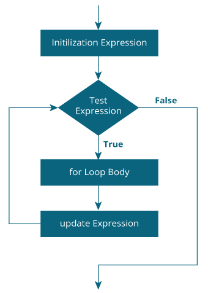

# Java `for`循环

> 原文： [https://www.programiz.com/java-programming/for-loop](https://www.programiz.com/java-programming/for-loop)

#### 在本教程中，我们将借助示例学习如何在 Java 中使用`for`循环，并且还将学习循环在计算机编程中的工作方式。

在计算机编程中，循环用于重复特定的代码块，直到满足特定条件（测试表达式为`false`）为止。 例如，

想象一下，我们需要在屏幕上打印一个句子 50 次。 好吧，我们可以通过使用`print`语句 50 次（不使用循环）来做到这一点。 您需要打印一百万次句子怎么样？ 您需要使用循环。 使用循环，我们可以只编写一次 print 语句，然后运行任意次。

这只是一个简单的示例，显示了循环在计算机编程中的重要性。

* * *

## Java `for`循环

Java 中`for`循环的语法为：

```java
for (initialization; testExpression; update)
{
    // codes inside for loop's body
}
```

### `for`循环的工作

1.  `initialization`表达式只求值一次。
2.  然后，求值`testExpression`表达。 在这里，测试表达式是一个布尔表达式。
3.  如果将测试表达式求值为`true`，则将执行`for`循环体内的
    代码。
    然后执行`update`表达式。
    再次求值测试表达式。
    如果测试表达式为`true`，则执行`for`循环体内的代码，并执行更新表达式。
    继续进行此过程，直到将测试表达式求值为`false`为止。
4.  如果将测试表达式求值为`false`，则`for`循环终止。

* * *

### 用于循环流程图



Working of for loop


* * *

### 示例 1：`for`循环

```java
// Program to print a sentence 10 times

class Loop {
    public static void main(String[] args) {

        for (int i = 1; i <= 10; ++i) {
            System.out.println("Line " + i);
        }
    }
}
```

**输出**：

```java
Line 1
Line 2
Line 3
Line 4
Line 5
Line 6
Line 7
Line 8
Line 9
Line 10
```

在上面的示例中，我们有

*   **初始化表达式**：`int i = 1` 
*   **测试表达式**：`i < = 10`
*   **更新表达式**：`++ i`

在此，最初`i`的值为 1。因此，测试表达式首次求值为`true`。 因此，将执行打印语句。 现在，将求值更新表达式。

每次求值更新表达式时，`i`的值增加 1。再次，求值测试表达式。 并且，重复相同的过程。

该过程一直进行到`i`为 11 时。当`i`为 11 时，测试表达式（`i <= 10`）为`false`，并且`for`循环终止。

要了解有关测试表达式及其求值方式的更多信息，请访问[关系式](/java-programming/operators#equality-relational "Java Relational Operator")和[逻辑运算符](/java-programming/operators#logical "Java Logical Operator")。

* * *

### 示例 2：`for`循环

```java
// Program to find the sum of natural numbers from 1 to 1000.

class Number {
    public static void main(String[] args) {

        int sum = 0;

        for (int i = 1; i <= 1000; ++i) {
            sum += i;     // sum = sum + i
        }

        System.out.println("Sum = " + sum);
    }
}
```

**输出**：

```java
Sum = 500500
```

在这里，我们有一个名为`sum`的变量。 其初始值为`0`。 在`for`循环中，我们初始化了一个名为`i`的变量，其值为 1。

在`for`循环的每次迭代中，

*   `sum`变量被分配了值：`sum + i`
*   `i`的值增加 1

循环一直进行到`i`的值大于 1000 为止。为了获得更好的可视化效果，

```java
1st iteration: i = 1 and sum = 0+1 = 1
2nd iteration: i = 2 and sum = 1+2 = 3
3rd iteration: i = 3 and sum = 3+3 = 6
4th iteration: i = 4 and sum = 6+4 = 10
... .. ...

999th iteration: i = 999 and sum = 498501 + 999 = 499500
1000th iteration: i = 1000 and sum = 499500 + 1000 = 500500
```

* * *

### 无限循环

在使用循环时，我们应始终小心。 这是因为，如果我们错误地设置测试表达式以使其永远不会是`false`，则`for`循环将永远运行。

这称为无限循环。 例如，

```java
// Infinite for Loop

class Infinite {
    public static void main(String[] args) {

        int sum = 0;

        for (int i = 1; i <= 10; --i) {
            System.out.println("Hello");
        }
    }
}
```

在此，测试表达式（`i <= 10`）永远不会是`false`，并且`hello`不会打印无数次（至少在理论上是这样）。

**注意**：`for`语句中使用的初始化，更新和测试表达式是可选的。 这是无限`for`循环的另一个示例。

```java
for ( ; ; ) {

}
```

* * *

### Java `for-each`循环

在 Java 中，有`for`循环的另一种语法可用于 [Java 数组](/java-programming/arrays "Java Arrays")和 [Java 集合](/java-programming/collections "Java Collections")（称为`for-each`循环）。 例如，

```java
for (int a : array) {
    System.out.println(a);
}
```

要了解更多信息，请访问： [Java `for-each`循环](/java-programming/enhanced-for-loop "Java for-each Loop")