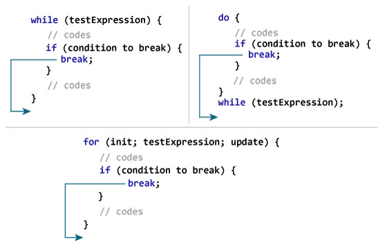
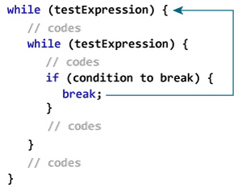
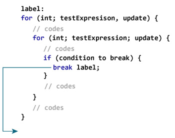

# Java `Break`语句

> 原文： [https://www.programiz.com/java-programming/break-statement](https://www.programiz.com/java-programming/break-statement)

#### 在本教程中，您将借助示例来学习`break`语句，该语句在 Java 中被标记为`break`语句。

在使用循环时，有时希望跳过循环内的某些语句或立即终止循环而不检查测试表达式。

在这种情况下，将使用`break`和`continue`语句。 您将在下一章中了解 [d](/java-programming/continue-statement "Java continue Statement") 。

* * *

Java 中的`break`语句立即终止循环，程序的控制移至循环后的下一条语句。

它几乎总是与决策语句一起使用（ [Java `if...else`语句](/java-programming/if-else-statement)）。

这是 Java 中`break`语句的语法：

```java
break;
```

* * *

## `break`语句如何工作？



Working of Java break Statement


* * *

### 示例 1：Java `break`语句

```java
class Test {
    public static void main(String[] args) {

        // for loop
        for (int i = 1; i <= 10; ++i) {

            // if the value of i is 5 the loop terminates  
            if (i == 5) {
                break;
            }      
            System.out.println(i);
        }   
    }
}
```

**输出**：

```java
1
2
3
4
```

在上面的程序中，我们使用`for`循环在每次迭代中打印`i`的值。 要了解`for`循环的工作方式，请访问 [Java `for`循环](/java-programming/for-loop "Java for Loop")。 在这里，请注意以下声明：

```java
if (i == 5) {
    break;
}
```

这意味着，当`i`的值等于 5 时，循环终止。 因此，我们得到的输出值仅小于 5。

* * *

### 示例 2：Java `break`语句

下面的程序计算用户输入的数字总和，直到用户输入负数。

为了接受用户的输入，我们使用了`Scanner`对象。 要了解有关`Scanner`的更多信息，请访问 [Java Scanner](/java-programming/scanner "Java Scanner") 。

```java
import java.util.Scanner;

class UserInputSum {
    public static void main(String[] args) {

        Double number, sum = 0.0;

        // create an object of Scanner
        Scanner input = new Scanner(System.in);

        while (true) {
            System.out.print("Enter a number: ");

            // takes double input from user
            number = input.nextDouble();

            // if number is negative the loop terminates
            if (number < 0.0) {
                break;
            }

           sum += number;
        }
        System.out.println("Sum = " + sum);
    }
}
```

**输出**：:

```java
Enter a number: 3.2
Enter a number: 5
Enter a number: 2.3
Enter a number: 0
Enter a number: -4.5
Sum = 10.5
```

在上面的程序中，`while`循环的测试表达式始终为`true`。 在这里，请注意这行，

```java
if (number < 0.0) {
    break;
}
```

这意味着当用户输入负数时，`while`循环终止。

* * *

## Java `break`和嵌套循环

在[嵌套循环](/java-programming/nested-loop "Java nested Loop")的情况下，`break`语句终止最里面的循环。



Working of break Statement with Nested Loops


在这里，`break`语句终止最内部的`while`循环，并且控制跳至外部循环。

* * *

## 标记的`break`语句

到目前为止，我们已经使用了未标记的`break`语句。 它终止最里面的循环和`switch`语句。 但是，Java 中还有另一种`break`语句形式，称为带标签的`break`。

我们也可以使用标记的`break`语句终止最外面的循环。



Working of the labeled break statement in Java


如上图所示，我们已经使用`label`标识符来指定外部循环。 现在，注意如何使用`break`语句（`break label;`）。

在这里，`break`语句终止了标记的语句（即外循环）。 然后，程序的控制跳到标记语句之后的语句。

这是另一个例子：

```java
while (testExpression) {
   // codes
   second:
   while (testExpression) {
      // codes
      while(testExpression) {
         // codes
         break second;
      }
   }
   // control jumps here
}
```

在上面的示例中，当执行语句`break second;`时，标记为`second`的`while`循环终止。 并且，程序的控制移至第二个`while`循环之后的语句。

* * *

### 示例 3：带标签的`break`语句

```java
class LabeledBreak {
    public static void main(String[] args) {

        // the for loop is labeled as first   
        first:
        for( int i = 1; i < 5; i++) {

            // the for loop is labeled as second
            second:
            for(int j = 1; j < 3; j ++ ) {
                System.out.println("i = " + i + "; j = " +j);

                // the break statement breaks the first for loop
                if ( i == 2)
                    break first;
            }
        }
    }
}
```

**输出**：:

```java
i = 1; j = 1
i = 1; j = 2
i = 2; j = 1
```

在上面的示例中，`labeled break`语句用于终止标记为`first`的循环。 那是，

```java
first:
for(int i = 1; i < 5; i++) {...}
```

在这里，如果我们将语句`break first;`更改为`break second;`，则程序的行为将有所不同。 在这种情况下，标记为秒的`for`循环将终止。 例如，

```java
class LabeledBreak {
    public static void main(String[] args) {

        // the for loop is labeled as first
        first:
        for( int i = 1; i < 5; i++) {

            // the for loop is labeled as second
            second:
            for(int j = 1; j < 3; j ++ ) {

                System.out.println("i = " + i + "; j = " +j);

                // the break statement terminates the loop labeled as second   
                if ( i == 2)
                    break second;
            }
        }
    }
}
```

**输出**：:

```java
i = 1; j = 1
i = 1; j = 2
i = 2; j = 1
i = 3; j = 1
i = 3; j = 2
i = 4; j = 1
i = 4; j = 2
```

**注意**：`break`语句也用于终止`switch`语句内的大小写。 要了解更多信息，请访问 [Java `switch`语句](/java-programming/switch-statement)。