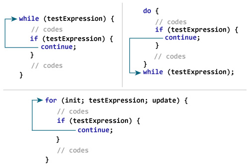
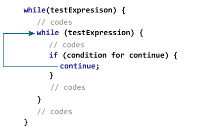
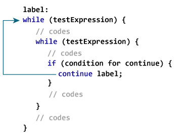

# Java 继续声明

> 原文： [https://www.programiz.com/java-programming/continue-statement](https://www.programiz.com/java-programming/continue-statement)

#### 在本教程中，您将通过示例了解 Java 中的 continue 语句和标记为 continue 的语句。

在使用循环时，有时希望跳过循环内的某些语句或立即终止循环而不检查测试表达式。

在这种情况下，将使用`break`和`continue`语句。 要了解`break`语句，请访问 [Java break](/java-programming/break-statement) 。

* * *

Java 中的`continue`语句跳过循环的当前迭代（`for`，`while`，`do...while`等），并且程序控制移至循环的结尾。 并且，求值循环的测试表达式。

在`for`循环的情况下，update 语句在测试表达式之前执行。

`continue`语句几乎总是用在决策语句中（ [if ... else 语句](/java-programming/if-else-statement)）。 它的语法是：

```java
continue;
```

* * *

## 连续语句如何工作？

<figure>

<figcaption>Working of Java continue statement</figcaption>

</figure>

* * *

### 示例 1：Java 继续语句

```java
class Test {
    public static void main(String[] args) {

        // for loop
        for (int i = 1; i <= 10; ++i) {

            // if value of i is between 4 and 9, continue is executed 
            if (i > 4 && i < 9) {
                continue;
            }      
            System.out.println(i);
        }   
    }
}
```

**输出**：

```java
1
2
​​​​3
4
9
10
```

在上面的程序中，我们使用`for`循环在每次迭代中打印`i`的值。 要了解`for`循环的工作方式，请访问 [Java for 循环](/java-programming/for-loop)。 在这里，请注意以下声明：

```java
if (i > 5 && i < 9) {
    continue;
}
```

这意味着，当`i`的值大于 4 且小于 9 时，将跳过循环内的 print 语句。 因此，我们得到跳过了 5、6、7 和 8 的输出。

* * *

### 示例 2：Java 继续语句

下面的程序计算用户输入的 5 个正数的总和。 如果用户输入负数或零，则将其从计算中跳过。

为了接受用户的输入，我们使用了`Scanner`对象。 要了解有关`Scanner`的更多信息，请访问 [Java Scanner](/java-programming/scanner) 。

```java
import java.util.Scanner;

class AssignmentOperator {
    public static void main(String[] args) {

        Double number, sum = 0.0;
        // create an object of Scanner
        Scanner input = new Scanner(System.in);

        for (int i = 1; i < 6; ++i) {
            System.out.print("Enter a number: ");
            // takes double type input from the user
            number = input.nextDouble();

            // if number is negative, the iteration is skipped
            if (number <= 0.0) {
                continue;
            }

            sum += number;
        }
        System.out.println("Sum = " + sum);
    }
}
```

**Output**:

```java
Enter a number: 2.2
Enter a number: 5.6
Enter a number: 0
Enter a number: -2.4
Enter a number: -3
Sum = 7.8
```

在上面的程序中，请注意以下行：

```java
if (number < 0.0) {
    continue;
}
```

这意味着当用户输入负数时，将跳过循环的当前迭代。 然后开始下一次迭代。

* * *

## Java 继续和嵌套循环

在[嵌套循环](/java-programming/nested-loop)的情况下，`continue`跳过最里面的循环的当前迭代。

<figure>

<figcaption>Working of the continue statement with Nested Loops</figcaption>

</figure>

* * *

## 标有继续声明

到目前为止，我们已经使用了未标记的`continue`语句。 它用于终止最内部的循环和`switch`语句。 但是，Java 中还有另一种`continue`语句形式，称为`labeled contine`。

我们也可以使用`labeled continue`语句终止最外面的循环。

<figure>

<figcaption>Working of the labeled continue Statement in Java</figcaption>

</figure>

如上图所示，我们已经使用`标签`标识符来指定外部循环。 现在，注意如何使用`continue`语句（`continue label;`）。

在这里，`continue`语句正在跳过标记语句的当前迭代（即外循环）。 然后，程序的控制转到标记语句的下一个迭代（外循环）

* * *

### 示例 3：标记为 continue 的语句

```java
class LabeledContinue {
    public static void main(String[] args) {

        // the outer for loop is labeled as label      
        first:
        for (int i = 1; i < 6; ++i) {
            for (int j = 1; j < 5; ++j) {
                if (i == 3 || j == 2)

                    // skips the iteration of label (outer for loop)
                    continue first;
                System.out.println("i = " + i + "; j = " + j); 
            }
        } 
    }
}
```

**Output**:

```java
i = 1; j = 1
i = 2; j = 1
i = 4; j = 1
i = 5; j = 1
```

在上面的示例中，`labeled continue`语句用于先跳过标记为`的循环的当前迭代，再跳过`。

```java
if (i==3 || j==2)
    continue first;
```

在这里，我们可以看到最外面的`for`循环被标记为`首先`，

```java
first:
for (int i = 1; i < 6; ++i) {..}
```

因此，如果`i`的值为 3 或`j`的值为 2，则跳过外部`for`循环的迭代。

**注意**：通常不建议使用带标签的`continue`，因为这会使您的代码难以理解。 如果您必须使用标记为`continue`的情况，请重构代码并尝试以其他方式解决它，以使其更具可读性。