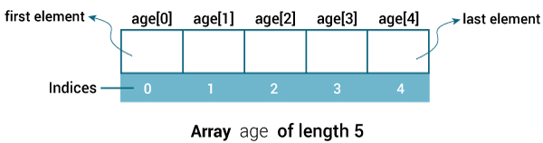
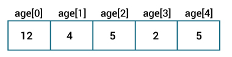

# Java 数组

> 原文： [https://www.programiz.com/java-programming/arrays](https://www.programiz.com/java-programming/arrays)

#### 在本教程中，我们将学习在 Java 中使用数组。 我们将借助示例学习声明，初始化和访问数组元素。

数组是相似类型数据的集合。 它是一个容器，用于保存一种单一类型的数据（值）。 例如，您可以创建一个可以容纳 100 个`int`类型值的数组。

在 Java 中，数组是一种基本结构，可让您方便地存储和访问大量值。

* * *

## 如何声明数组？

在 Java 中，这是我们如何声明数组的方法。

```java
dataType[] arrayName;
```

*   `数据类型`-它可以是[基本数据类型](/java-programming/variables-primitive-data-types#data-types)，例如`int`，`char`，`double`，`byte`等，或 [Java 对象](/java-programming/class-objects)
*   `arrayName` -它是[标识符](/java-programming/keywords-identifiers#identifiers)

让我们举个例子

```java
double[] data;
```

在这里，`data`是一个数组，可以保存`double`类型的值。

**但是，可以容纳多少个元素？**

好问题！ 我们必须为数组分配内存。 内存将定义数组可以容纳的元质数。

```java
data = new Double[10];
```

在这里，数组的大小为 10。这意味着它可以容纳 10 个元素（10 个`double`类型值）。 数组的大小也称为数组的长度。

**注意**：一旦定义了数组的长度，就不能在程序中对其进行更改。

让我们再举一个例子：

```java
int[] age;
age = new int[5];
```

在此，`age`是一个数组。 它可以容纳 5 个`int`类型的值。

在 Java 中，我们可以在一个语句中声明并分配数组的内存。 例如，

```java
int[] age = new int[5];
```

* * *

## Java 数组索引

在 Java 中，数组中的每个元素都与一个数字关联。 该数字称为数组索引。 我们可以使用这些索引访问数组的元素。 例如，

```java
int[] age = new int[5];
```



Java Array Index


在这里，我们有一个长度为 5 的数组。在图中，我们可以看到每个元素都由一个数字（数组索引）组成。 数组索引始终从 0 开始。

现在，我们可以使用索引号访问数组的元素。 例如，访问数组的第一个元素可以使用`age[0]`，第二个元素可以使用`age[1]`进行访问，依此类推。

**注意**：如果数组的长度为`n`，则数组的第一个元素为`arrayName[0]`，最后一个元素为`arrayName[n-1]`。

如果我们没有将任何值存储到数组，则数组将自行存储一些默认值（`int`类型为`0`，`boolean`类型为`false`）。 例如，

```java
class ArrayExample {
    public static void main(String[] args) {

        // create an array of length 5  
        int[] age = new int[5];

        // access each element of the array using the index number 
        System.out.println(age[0]);
        System.out.println(age[1]);
        System.out.println(age[2]);
        System.out.println(age[3]);
        System.out.println(age[4]);
    }
}
```

**输出**：

```java
0
0
0
0
0
```

在上面的示例中，我们创建了一个名为`age`的数组。 但是，我们没有为该数组分配任何值。 因此，当我们访问数组的各个元素时，默认值将显示在屏幕上。

在这里，我们正在单独访问数组的元素。 有一种使用循环（通常为[`for`循环](/java-programming/for-loop)）访问数组元素的更好方法。 例如，

```java
class ArrayExample {
    public static void main(String[] args) {

        // create an array of length 5
        int[] age = new int[5];

        // accessing elements using for loop
        for (int i = 0; i < 5; ++i) {
            System.out.println(age[i]);
        }
    }
}
```

**输出**：:

```java
0
0
0
0
0
```

* * *

## 如何在 Java 中初始化数组？

在 Java 中，我们可以在声明期间初始化数组，也可以根据需要在程序中稍后进行初始化。

### 声明期间初始化数组

这是在声明过程中初始化数组的方法。

```java
int[] age = {12, 4, 5, 2, 5};
```

该语句创建一个名为`age`的数组，并使用大括号中提供的值对其进行初始化。

数组的长度由花括号内用逗号分隔的值的数量确定。 在我们的示例中，`age`的长度为 5。



Java Arrays initialization


让我们编写一个简单的程序来打印此数组的元素。

```java
class ArrayExample {
    public static void main(String[] args) {

        // create an array 
        int[] age = {12, 4, 5, 2, 5};

        // access elements of tha arau
        for (int i = 0; i < 5; ++i) {
            System.out.println("Element at index " + i +": " + age[i]);
        }
    }
}
```

**输出**：:

```java
Element at index 0: 12
Element at index 1: 4
Element at index 2: 5
Element at index 3: 2
Element at index 4: 5
```

* * *

## 如何访问数组元素？

如前所述，我们可以使用数字索引轻松访问和更改数组的元素。 例如，

```java
class ArrayExample {
    public static void main(String[] args) {

        int[] age = new int[5];

        // insert 14 to third element
        age[2] = 14;

        // insert 34 to first element
        age[0] = 34;

        for (int i = 0; i < 5; ++i) {
            System.out.println("Element at index " + i +": " + age[i]);
        }
    }
}
```

**输出**：:

```java
Element at index 0: 34
Element at index 1: 0
Element at index 2: 14
Element at index 3: 0
Element at index 4: 0
```

* * *

## 示例：Java 数组

下面的程序计算存储在`int`类型的数组中的值的总和和平均值。

```java
class SumAverage {
    public static void main(String[] args) {

        int[] numbers = {2, -9, 0, 5, 12, -25, 22, 9, 8, 12};
        int sum = 0;
        Double average;

        // for each loop is used to access elements 
        for (int number: numbers) {
            sum += number;
        }

        int arrayLength = numbers.length;

        // Change sum and arrayLength to double as average is in double
        average =  ((double)sum / (double)arrayLength);

        System.out.println("Sum = " + sum);
        System.out.println("Average = " + average);
    }
}
```

**输出**：:

```java
Sum = 36
Average = 3.6
```

在上面的示例中，我们创建了一个名为`number`的数组。 我们已经使用`for...each`循环来访问数组的每个元素。 要了解有关`for...each`循环的更多信息，请访问 [Java `for...each`循环](/java-programming/enhanced-for-loop)。

在循环内部，我们正在计算每个元素的总和。 注意这一行，

```java
int arrayLength = number.length;
```

在这里，我们使用数组的[长度属性](http://stackoverflow.com/questions/8755812/array-length-in-java)计算数组的大小。 然后，我们使用以下公式计算平均值：

```java
average = ((double)sum / (double)arrayLength);
```

如您所见，我们正在将`int`值转换为`double`。 在 Java 中，这称为类型转换。 要了解有关类型转换的更多信息，请访问 [Java Type Casting](/java-programming/typecasting) 。

_______________________________________________________________________

### 多维数组

到目前为止，我们提到的数组称为一维数组。 但是，我们可以用 Java 声明多维数组。

多维数组是数组的数组。 也就是说，多维数组的每个元素都是数组本身。 例如，

```java
double[][] matrix = {{1.2, 4.3, 4.0}, 
      {4.1, -1.1}
};
```

在这里，我们创建了一个名为矩阵的多维数组。 它是一个二维数组。 要了解更多信息，请访问 [Java 多维数组](/java-programming/multidimensional-array)。

* * *

还请查看以下来源：

*   *Java 复制数组*
*   *Java 数组方法*
*   *Java `ArrayList`和列表到数组*
*   *Java 字符串数组*
*   *Java `int`数组*
*   *Java `double`数组*
*   *Java 对象数组*
*   *Java 字符串到数组和数组到字符串的转换*
*   *如何使用 Java 打印数组？*
*   *在 Java 中数组是否可以具有动态长度？*