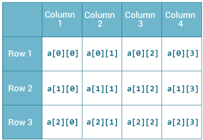
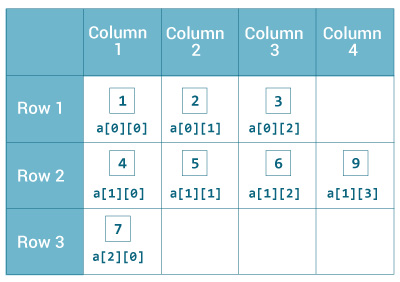

# Java 多维数组

> 原文： [https://www.programiz.com/java-programming/multidimensional-array](https://www.programiz.com/java-programming/multidimensional-array)

#### 在本教程中，我们将借助示例学习使用 2 维数组和 3 维数组的 Java 多维数组。

在学习多维数组之前，请确保您了解 [Java 数组](/java-programming/arrays "Java Arrays")。

多维数组是数组的数组。 多维数组的每个元素都是数组本身。 例如，

```java
int[][] a = new int[3][4];
```

在这里，我们创建了一个名为`和`的多维数组。 它是一个二维数组，最多可容纳 12 个元​​素，

<figure>

<figcaption>2-dimensional Array</figcaption>

</figure>

请记住，Java 使用基于零的索引，即 Java 中数组的索引以 0 而不是 1 开头。

让我们再举一个多维数组的例子。 这次我们将创建一个 3 维数组。 例如，

```java
String[][][] data = new String[3][4][2];
```

在此，`数据`是 3d 数组，最多可容纳`String`类型的 24（3 * 4 * 2）个元素。

* * *

## 如何在 Java 中初始化 2D 数组？

这是我们如何在 Java 中初始化二维数组。

```java
int[][] a = {
      {1, 2, 3}, 
      {4, 5, 6, 9}, 
      {7}, 
};
```

如我们所见，多维数组的每个元素都是数组本身。 而且，与 C / C ++不同，Java 中多维数组的每一行可以具有不同的长度。

<figure>

<figcaption>Initialization of 2-dimensional Array</figcaption>

</figure>

### 示例：二维数组

```java
class MultidimensionalArray {
    public static void main(String[] args) {

        // create a 2d array
        int[][] a = {
            {1, 2, 3}, 
            {4, 5, 6, 9}, 
            {7}, 
        };

        // calculate the length of each row
        System.out.println("Length of row 1: " + a[0].length);
        System.out.println("Length of row 2: " + a[1].length);
        System.out.println("Length of row 3: " + a[2].length);
    }
}
```

**输出**：

```java
Length of row 1: 3
Length of row 2: 4
Length of row 3: 1
```

在上面的示例中，我们正在创建一个名为`和`的多维数组。 由于多维数组的每个分量也是数组（`a[0]`，`a[1]`和`a[2]`也是数组）。

在这里，我们使用`length`属性来计算每行的长度。

* * *

### 示例：使用循环打印 2d 数组的所有元素

```java
class MultidimensionalArray {
    public static void main(String[] args) {

        int[][] a = {
            {1, -2, 3}, 
            {-4, -5, 6, 9}, 
            {7}, 
        };

        for (int i = 0; i < a.length; ++i) {
            for(int j = 0; j < a[i].length; ++j) {
                System.out.println(a[i][j]);
            }
        }
    }
}
```

**Output**:

```java
1
-2
3
-4
-5
6
9
7
```

我们还可以将[用于...每个循环](/java-programming/enhanced-for-loop "Java for..each Loop")，以访问多维数组的元素。 例如，

```java
class MultidimensionalArray {
    public static void main(String[] args) {

        // create a 2d array
        int[][] a = {
            {1, -2, 3}, 
            {-4, -5, 6, 9}, 
            {7}, 
        };

        // first for...each loop access the individual array
        // inside the 2d array
        for (int[] innerArray: a) {
            // second for...each loop access each element inside the row
            for(int data: innerArray) {
                System.out.println(data);
            }
        }
    }
}
```

**Output**:

```java
1
-2
3
-4
-5
6
9
7
```

在上面的示例中，我们创建了一个名为`和`的二维数组。 然后，我们使用`for`循环和`for...each`循环访问数组的每个元素。

* * *

## 如何在 Java 中初始化 3D 数组？

让我们看看如何在 Java 中使用 3d 数组。 我们可以初始化类似于 2d 数组的 3d 数组。 例如，

```java
// test is a 3d array
int[][][] test = {
        {
          {1, -2, 3}, 
          {2, 3, 4}
        }, 
        { 
          {-4, -5, 6, 9}, 
          {1}, 
          {2, 3}
        } 
};
```

基本上，3d 数组是 2d 数组的数组。 3d 阵列的行的长度也可以像 2d 阵列一样变化。

* * *

### 示例：3 维数组

```java
class ThreeArray {
    public static void main(String[] args) {

        // create a 3d array
        int[][][] test = {
            {
              {1, -2, 3}, 
              {2, 3, 4}
            }, 
            { 
              {-4, -5, 6, 9}, 
              {1}, 
              {2, 3}
            } 
        };

        // for..each loop to iterate through elements of 3d array
        for (int[][] array2D: test) {
            for (int[] array1D: array2D) {
                for(int item: array1D) {
                    System.out.println(item);
                }
            }
        }
    }
}
```

**Output**:

```java
1
-2
3
2
3
4
-4
-5
6
9
1
2
3
```