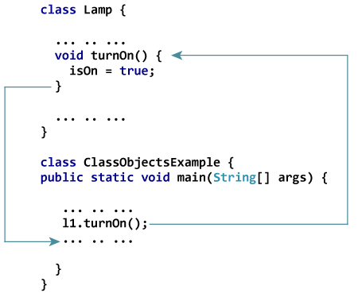

# Java 类和对象

> 原文： [https://www.programiz.com/java-programming/class-objects](https://www.programiz.com/java-programming/class-objects)

#### 在本教程中，您将学习 Java 中的面向对象编程，并借助示例来学习 Java 类和对象。

Java 是一种面向对象的编程语言。 它基于对象的概念。

这些对象具有两个特征：

*   状态（字段）
*   行为（方法）

例如，

1.  `灯`是对象
    **状态**：`处于`或`处于关闭状态`
    **行为**：`打开`或`关闭`
2.  `自行车`是对象
    **状态**：`当前齿轮`，`两个车轮`，`齿轮数`等
    **行为**：`制动`，`加速`，`换档`等

* * *

### 面向对象编程的原理：

*   [封装](/java-programming/encapsulation "Java Encapsulation")
*   [继承](/java-programming/inheritance "Java Inheritance")
*   [多态](/java-programming/polymorphism "Java Polymorphism")

面向对象编程的重点是将复杂的编程任务分解为包含字段（用于存储数据）和方法（用于对字段执行操作）的对象。

* * *

## Java 类

在用 Java 创建对象之前，需要定义一个类。 类是对象的蓝图。

我们可以将类视为房子的草图（原型）。 它包含有关地板，门，窗户等的所有详细信息。基于这些描述，我们建造了房屋。 房子是对象。

由于可以用相同的描述制作许多房屋，因此我们可以根据一个类创建许多对象。

* * *

## 如何用 Java 定义类？

这是我们可以在 Java 中定义类的方法：

```java
class ClassName {
   // variables
   // methods
}
```

例如：

```java
class Lamp {

  // instance variable
  private boolean isOn;

  // method
  public void turnOn() {
    isOn = true;
  }

  // method
  public void turnOff() {
  	isOn = false;
  }
}
```

在这里，我们创建了一个名为`Lamp`的类。

该类具有一个名为`isOn`的变量，以及两种方法`turnOn()`和`turnOff()`。 在类中定义的这些变量和方法称为该类的**成员**。

在上面的示例中，我们使用了关键字`private`和`public`。 这些被称为访问修饰符。 要了解更多信息，请访问 [Java 访问修饰符](/java-programming/access-modifiers "Java Access Modifiers")。

* * *

## Java 对象

对象称为类的实例。 例如，假设`Animal`是一类，则可以将`猫`，`Dog`，`马`等视为`的对象 ]动物`类。

这是我们如何用 Java 创建对象的方法：

```java
className object = new className();
```

在这里，我们使用构造器`className()`创建对象。 构造器与类具有相同的名称，并且与方法类似。 要了解有关 Java 构造器的更多信息，请访问 [Java 构造器](/java-programming/constructors "Java Constructors")。

让我们看看如何创建`Lamp`类的对象。

```java
// l1 object
Lamp l1 = new Lamp();
// l2 object
Lamp l2 = new Lamp();
```

在这里，我们使用`Lamp`类（`Lamp()`）的构造器创建了名为`l1`和`l2`的对象。

对象用于访问类的成员。 让我们创建`Lamp`类的对象

* * *

### 如何访问会员？

对象用于访问类的成员。 我们可以使用`.`运算符访问成员（调用方法和访问实例变量）。 例如，

```java
class Lamp {
    turnOn() {...}
}

// create object
Lamp l1 = new Lamp();

// access method turnOn()
l1.turnOn();
```

该语句在`l1`对象的`Lamp`类内调用`turnOn()`方法。

我们已经多次提到**方法**这个词。 在下一章中，您将详细了解 [Java 方法](/java-programming/methods "Java Methods")。 这是您现在需要知道的：

当使用上述语句调用该方法时，将执行`turnOn()`方法主体内的所有语句。 然后，程序的控制跳回到`l1.turnOn()`之后的语句；



Working of Methods in Java


同样，可以通过以下方式访问实例变量：

```java
class Lamp {
    boolean isOn;
}

// create object
Lamp l1 = new Lamp();

// access method turnOn()
l1.isOn = true;
```

* * *

## 示例：Java 类和对象

```java
class Lamp {
    boolean isOn;

    void turnOn() {
        // initialize variable with value true
        isOn = true;
        System.out.println("Light on? " + isOn);

    }

    void turnOff() {
        // initialize variable with value false
        isOn = false;
        System.out.println("Light on? " + isOn);
    }
}

class Main {
    public static void main(String[] args) {

        // create objects l1 and l2
        Lamp l1 = new Lamp();
        Lamp l2 = new Lamp();

        // call methods turnOn() and turnOff()
        l1.turnOn();
        l2.turnOff();
    }
}
```

**输出**：

```java
Light on? true
Light on? false
```

在上面的程序中

1.  我们创建了一个名为`Lamp`的类。
2.  该类具有一个实例变量`isOn`和两个方法`turnOn()`和`turnOff()`。
3.  在`Main`类中，我们创建了`Lamp`类的两个对象`l1`和`l2`。
4.  然后我们使用`l1`对象调用`turnOn()`，并使用`l2`对象调用`turnOff()`：
    。

    ```java
    l1.turnOn();
    l2.turnOff();
    ```

5.  `turnOn()`方法将`l1`对象的`isOn`变量设置为`true`。 并打印输出。 同样，`turnOff()`方法将`l2`对象的`isOn`变量设置为`false`并打印输出。

**注意**：由于某种原因，在类内部定义的变量称为实例变量。 创建对象时，它称为类的实例。

每个实例都包含自己在类内部定义的变量的副本。 因此，称为实例变量。 例如，对象`l1`和`l2`的`isOn`变量不同。

在接下来的教程中，我们将探索有关 Java 的面向对象编程的更多信息。