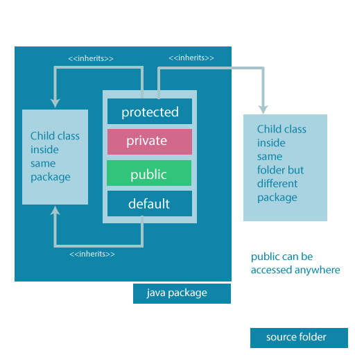

# Java 访问修饰符

> 原文： [https://www.programiz.com/java-programming/access-modifiers](https://www.programiz.com/java-programming/access-modifiers)

#### 在本教程中，我们将在示例的帮助下了解 Java 访问修饰符，其类型以及如何使用它们。

## 什么是访问修饰符？

在 Java 中，访问修饰符用于设置类，接口，变量，方法，构造器，数据成员和设置器方法的可访问性（可见性）。 例如，

```java
class Animal {
    public void method1() {...}

   private void method2() {...}
}
```

在上面的示例中，我们声明了 2 个方法：`method1()`和`method2()`。 这里，

*   `method1`是`public`-这意味着可以由其他类访问。
*   `method2`为`private`-这意味着其他类无法访问它。

注意关键字`public`和`private`。 这些是 Java 中的访问修饰符。 它们也称为可见性修改器。

**注意**：您无法设置获取器方法的访问修饰符。

* * *

## 访问修饰符的类型

在学习访问修饰符的类型之前，请确保您了解 [Java 包](/java-programming/packages-import "Java Packages")。

Java 中有四个访问修饰符关键字，它们是：

| **修饰符** | **说明** |
| --- | --- |
| 默认 | 声明仅在包中可见（包私有） |
| `private` | 声明仅在类中可见 |
| `protected` | 声明在包或所有子类中均可见 |
| `public` | 声明随处可见 |

* * *

## 默认访问修饰符

如果我们未为类，方法，变量等明确指定任何访问修饰符，则默认情况下将考虑默认访问修饰符。 例如，

```java
package defaultPackage;
class Logger {
    void message(){
        System.out.println("This is a message");
    }
}
```

此处，`Logger`类具有默认的访问修饰符。 并且该类对属于`defaultPackage`包的所有类都是可见的。 但是，如果尝试在`defaultPackage`之外的另一个类中使用`Logger`类，则会出现编译错误。

* * *

## 私有访问修饰符

声明变量和方法`private`时，不能在类外部访问它们。 例如，

```java
class Data {
    // private variable
    private String name;
}

public class Main {
    public static void main(String[] main){

        // create an object of Data
        Data d = new Data();

        // access private variable and field from another class
        d.name = "Programiz";
    }
}
```

在上面的示例中，我们声明了一个名为`name`的私有变量，和一个名为`display()`的私有方法。 运行程序时，将出现以下错误：

```java
Main.java:18: error: name has private access in Data
        d.name = "Programiz";
         ^
```

产生错误是因为我们试图从`Main`类访问`Data`类的私有变量和私有方法。

您可能想知道我们是否需要访问这些私有变量。 在这种情况下，我们可以使用获取器和设置器方法。 例如，

```java
class Data {
    private String name;

    // getter method
    public String getName() {
        return this.name;
    }
    // setter method
    public void setName(String name) {
        this.name= name;
    }
}
public class Main {
    public static void main(String[] main){
        Data d = new Data();

        // access the private variable using the getter and setter
        d.setName("Programiz");
        System.out.println(d.getName());
    }
}
```

**输出**：

```java
The name is Programiz
```

在上面的示例中，我们有一个名为`name`的私有变量。 为了从外部类访问变量，我们使用了方法：`getName()`和`setName()`。 这些方法在 Java 中称为获取器和设置器。

在这里，我们使用了设置器方法（`setName()`）将值分配给变量，并使用获取器方法（`getName()`）来访问变量。

我们在`setName()`中使用了`this`关键字来引用该类的变量。 要了解有关`this`关键字的更多信息，请访问 [Java `this`关键字](/java-programming/this-keyword "Java this Keyword")。

**注意**：我们无法在 Java 中声明私有的类和接口。 但是，可以将嵌套类声明为私有。 要了解更多信息，请访问 [Java 嵌套和内部类](/java-programming/nested-inner-class "Java Nested and Inner Class")。

* * *

### 受保护访问修饰符

当方法和数据成员被声明为`protected`时，我们可以在同一包中以及从子类中访问它们。 例如，

```java
class Animal {
    // protected method
    protected void display() {
        System.out.println("I am an animal");
    }
}

class Dog extends Animal {
    public static void main(String[] args) {

        // create an object of Dog class
        Dog dog = new Dog();
         // access protected method
        dog.display();
    }
}
```

**输出**：

```java
I am an animal
```

在上面的示例中，我们在`Animal`类中有一个名为`display()`的受保护方法。`Animal`类由`Dog`类继承。 要了解有关继承的更多信息，请访问 [Java 继承](/java-programming/inheritance "Java Inheritance")。

然后，我们创建了`Dog`类的对象`Dog`。 使用该对象，我们尝试访问父类的受保护方法。

由于可以从子类访问受保护的方法，因此我们可以从`Dog`类访问`Animal`类的方法。

**注意**：我们无法在 Java 中声明类或接口`protected`。

* * *

### 公共访问修饰符

当方法，变量，类等被声明为`public`时，我们可以从任何地方访问它们。 公共访问修饰符没有范围限制。 例如，

```java
// Animal.java file
// public class
public class Animal {
    // public variable
    public int legCount;

    // public method
    public void display() {
        System.out.println("I am an animal.");
        System.out.println("I have " + legCount + " legs.");
    }
}

// Main.java
public class Main {
    public static void main( String[] args ) {
        // accessing the public class
        Animal animal = new Animal();

        // accessing the public variable
        animal.legCount = 4;
        // accessing the public method
        animal.display();
    }
}
```

**输出**：

```java
I am an animal.
I have 4 legs.
```

这里，

*   可从`Main`类访问公共类`Animal`。
*   可从`Main`类访问公共变量`legCount`。
*   可从`Main`类访问公共方法`display()`。

* * *

## 一图概述访问修饰符



Accessibility of all Access Modifiers in Java


访问修饰符主要用于封装。 我可以帮助我们控制程序的哪些部分可以访问类的成员。 这样就可以防止滥用数据。 要了解有关封装的更多信息，请访问 [Java 封装](/java-programming/encapsulation "Java Encapsulation")。