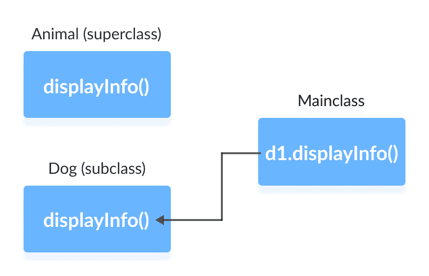

# Java 方法覆盖

> 原文： [https://www.programiz.com/java-programming/method-overriding](https://www.programiz.com/java-programming/method-overriding)

#### 在本教程中，我们将借助示例学习 Java 中的方法覆盖。

在上一教程中，我们了解了继承。 继承是一个 OOP 属性，它使我们可以从现有的类（超类）派生一个新的类（子类）。 子类继承超类的属性和方法。

现在，如果在超类类和子类类中都定义了相同的方法，则子类类的方法将覆盖超类的方法。 这称为方法覆盖。

* * *

### 示例 1：方法覆盖

```java
class Animal {
   public void displayInfo() {
      System.out.println("I am an animal.");
   }
}

class Dog extends Animal {
   @Override
   public void displayInfo() {
      System.out.println("I am a dog.");
   }
}

class Main {
   public static void main(String[] args) {
      Dog d1 = new Dog();
      d1.displayInfo();
   }
} 
```

**输出**：

```java
I am a dog. 
```

在上述程序中，`Animal`超类和`Dog`子类中都存在`displayInfo()`方法。

当我们使用`d1`对象（子类的对象）调用`displayInfo()`时，将调用子类`Dog`内部的方法。 子类的`displayInfo()`方法将覆盖超类的相同方法。



注意在我们的示例中使用了`@Override`注解。 在 Java 中，注解是我们用来向编译器提供信息的元数据。 在此，`@Override`注解指定编译器，该注解之后的方法将覆盖超类的方法。

使用`@Override`不是强制性的。 但是，当我们使用此方法时，该方法应遵循所有覆盖规则。 否则，编译器将生成错误。

* * *

## Java 覆盖规则

*   父类和子类都必须具有相同的方法名称，相同的返回类型和相同的参数列表。
*   我们不能覆盖声明为`final`和`static`的方法。
*   我们应该始终覆盖超类的抽象方法（将在以后的教程中进行讨论）。

* * *

## Java 覆盖中的`super`关键字

在 Java 中执行覆盖时出现的一个常见问题是：

**覆盖后可以访问超类的方法吗？**

好吧，答案是**是**。 要从子类访问超类的方法，我们使用`super`关键字。

### 示例 2：使用`super`关键字

```java
class Animal {
   public void displayInfo() {
      System.out.println("I am an animal.");
   }
}

class Dog extends Animal {
   public void displayInfo() {
      super.displayInfo();
      System.out.println("I am a dog.");
   }
}

class Main {
   public static void main(String[] args) {
      Dog d1 = new Dog();
      d1.displayInfo();
   }
} 
```

**输出**：

```java
I am an animal.
I am a dog. 
```

在上面的示例中，子类`Dog`覆盖了超类`Animal`的方法`displayInfo()`。

当我们使用`Dog`子类的`d1`对象调用方法`displayInfo()`时，将调用`Dog`子类内部的方法； 不会调用超类内部的方法。

在`Dog`子类的`displayInfo()`内部，我们使用`super.displayInfo()`调用超类的`displayInfo()`。

* * *

重要的是要注意，Java 中的构造器不会被继承。 因此，在 Java 中不存在构造器覆盖这样的事情。

但是，我们可以从其子类中调用超类的构造器。 为此，我们使用`super()`。 要了解更多信息，请访问 [Java `super`关键字](/java-programming/super-keyword "Java super keyword")。

* * *

## 方法覆盖中的访问说明符

在超类及其子类中声明的相同方法可以具有不同的访问说明符。 但是，有一个限制。

我们只能在提供比超类的访问说明符更大的访问权限的子类中使用那些访问说明符。 例如，

假设将超类中的方法`myClass()`声明为`protected`。 然后，子类中的相同方法`myClass()`可以是`public`或`protected`，但不能是`private`。

### 示例 3：覆盖中的访问说明符

```java
class Animal {
   protected void displayInfo() {
      System.out.println("I am an animal.");
   }
}

class Dog extends Animal {
   public void displayInfo() {
      System.out.println("I am a dog.");
   }
}

class Main {
   public static void main(String[] args) {
      Dog d1 = new Dog();
      d1.displayInfo();
   }
} 
```

**输出**：

```java
I am a dog. 
```

In the above example, the subclass `Dog` overrides the method `displayInfo()` of the superclass `Animal`.

每当我们使用`d1`（子类的对象）调用`displayInfo()`时，就会调用子类内部的方法。

请注意，在`Animal`超类中将`displayInfo()`声明为`protected`。 相同的方法在`Dog`子类中具有`public`访问说明符。 这是可能的，因为`public`提供的访问权限大于`protected`。

* * *

## 覆盖抽象方法

在 Java 中，抽象类被创建为其他类的超类。 并且，如果类包含抽象方法，则必须覆盖它。

在后面的教程中，我们将学习有关抽象类和抽象方法的覆盖的更多信息。