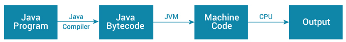
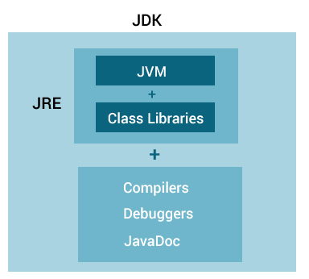

# Java JDK，JRE 和 JVM

> 原文： [https://www.programiz.com/java-programming/jvm-jre-jdk](https://www.programiz.com/java-programming/jvm-jre-jdk)

#### 在本教程中，您将了解 JDK，JRE 和 JVM。 您还将学习它们之间的主要区别。

## 什么是 JVM？

JVM（Java 虚拟机）是使您的计算机运行 Java 程序的抽象机。

运行 Java 程序时，Java 编译器首先将 Java 代码编译为字节码。 然后，JVM 将字节码转换为本地机器代码（计算机 CPU 直接执行的指令集）。

Java 是与平台无关的语言。 这是因为当您编写 Java 代码时，它最终是为 JVM 而不是物理机（计算机）编写的。 由于 JVM 执行与平台无关的 Java 字节码，因此 Java 与平台无关。

Working of Java Program

如果您对学习 JVM 体系结构感兴趣，请访问 [JVM 体系结构说明](https://dzone.com/articles/jvm-architecture-explained)。

* * *

## 什么是 JRE？

JRE（Java 运行时环境）是一个包，提供 Java 类库，Java 虚拟机（JVM）和运行 Java 应用程序所需的其他组件。

JRE 是 JVM 的超集。

Java Runtime Environment

如果您需要运行 Java 程序而不是开发它们，则需要 JRE。 您可以从 [Java SE Runtime Environment 8 下载](http://www.oracle.com/technetwork/java/javase/downloads/jre8-downloads-2133155.html)页面下载 JRE。

* * *

## 什么是 JDK？

JDK（Java 开发套件）是使用 Java 开发应用程序所需的软件开发套件。 当您下载 JDK 时，还将同时下载 JRE。

除了 JRE，JDK 还包含许多开发工具（编译器，JavaDoc，Java Debugger 等）。

Java Development Kit

如果要开发 Java 应用程序，请[下载 JDK](http://www.oracle.com/technetwork/java/javase/downloads/index-jsp-138363.html) 。

* * *

## JVM，JRE 和 JDK 之间的关系。

Relationship between JVM, JRE, and JDK

