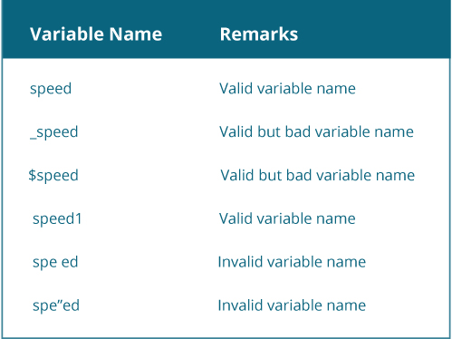

# Java 变量和（原始）数据类型

> 原文： [https://www.programiz.com/java-programming/variables-primitive-data-types](https://www.programiz.com/java-programming/variables-primitive-data-types)

#### 在本教程中，您将了解变量，如何创建变量以及 Java 编程语言支持的用于创建变量的不同数据类型。

## Java 变量

变量是内存中用于存储数据的位置（存储区域）。

为了指示存储区域，应该为每个变量赋予唯一的名称（标识符）。 了解有关 [Java 标识符](/java-programming/keywords-identifiers "Java identifiers")的更多信息。

* * *

### 如何在 Java 中声明变量？

这是在 Java 中声明变量的示例。

```java
int speedLimit = 80; 
```

在此，`speedLimit`是`int`数据类型的变量，并分配了值 80。这意味着`speedLimit`变量可以存储整数值。 您将在本文稍后详细了解 Java 数据类型。

在示例中，我们在声明期间为变量分配了值。 但是，这不是强制性的。 您可以在不分配值的情况下声明变量，以后可以根据需要存储值。 例如，

```java
int speedLimit;
speedLimit = 80;

```

变量的值可以在程序中更改，因此名称为“变量”。 例如，

```java
int speedLimit = 80;
... .. ...
speedLimit = 90; 

```

Java 是一种静态类型的语言。 这意味着必须先声明所有变量，然后才能使用它们。

同样，您不能在同一范围内更改 Java 中变量的数据类型。 **变量范围是什么？** 暂时不要担心。 现在，请记住您不能做这样的事情。

```java
int speedLimit = 80;
... .. ...
float speedLimit;

```

要了解更多信息，请访问：[我可以更改 Java 中变量的声明类型吗？](http://stackoverflow.com/questions/27092245/can-i-change-declaration-type-for-a-variable-in-java "Can I change declaration type for a variable in Java?")

* * *

### Java 中的变量命名规则

Java 编程语言具有一套自己的变量命名规则和约定。 这是您需要了解的内容：

*   Java 中的变量区分大小写。
*   变量的名称是 Unicode 字母和数字的序列。 它可以以字母`$`或`_`开头。 但是，习惯上以字母开头的变量名。 同样，变量名称不能在 Java 中使用空格。

    

    变量命名约定

    

*   创建变量时，请选择一个有意义的名称。 例如，`score`，`number`，`level`比诸如`s`，`n`等变量名更有意义。 和`1`。
*   如果选择一字变量名称，请使用所有小写字母。 例如，最好使用`speed`而不是`SPEED`或`sPEED`。
*   如果选择具有多个单词的变量名，请为第一个单词使用所有小写字母，并大写每个后续单词的第一个字母。 例如，`speedLimit`。

* * *

Java 编程语言中有 4 种类型的变量：

*   实例变量（非静态字段）
*   类变量（静态字段）
*   局部变量
*   参量

您将在后面的章节中学习。 如果您有兴趣现在了解更多信息，请访问 [Java Variable Types](https://docs.oracle.com/javase/tutorial/java/nutsandbolts/variables.html "Java Variable Types") 。

* * *

## Java 原始数据类型

如上所述，Java 是一种静态类型的语言。 这意味着必须先声明所有变量，然后才能使用它们。

```java
int speed;

```

在此，`speed`是变量，并且变量的数据类型是`int`。`int`数据类型确定`speed`变量只能包含整数。

简单来说，变量的数据类型决定了变量可以存储的值。 Java 编程语言中预定义了 8 种数据类型，称为原始数据类型。

除了原始数据类型外，Java 中还引用了数据类型（您将在后面的章节中了解到）。

## 8 种原始数据类型

### 布尔值

*   `boolean`数据类型具有两个可能的值，即`true`或`false`。
*   默认值：`false`。
*   它们通常用于对/错条件。 例如，

```java
class BooleanExample {
    public static void main(String[] args) {

        boolean flag = true;
        System.out.println(flag);
    }
} 
```

**输出**：

* * *

```java
true 
```

### 字节

*   `byte`数据类型的值可以从 -128 到 127（8 位带符号二进制补码整数）。
*   如果可以确定变量的值在`[-128, 127]`之内，则可以用它代替`int`或其他整数数据类型来节省内存。
*   默认值：0
*   例：

```java
class ByteExample {
    public static void main(String[] args) {

        byte range;
        range = 124;
        System.out.println(range);
    }
} 
```

**输出**：:

* * *

```java
124 
```

### 短

*   `short`数据类型的值可以从 -32768 到 32767（16 位带符号二进制补码整数）。
*   如果可以确定变量的值在`[-32768, 32767]`之内，那么它将用于代替其他整数数据类型以节省内存。
*   默认值：0
*   例：

```java
class ShortExample {
    public static void main(String[] args) {

        short temperature;
        temperature = -200;
        System.out.println(temperature);
    }
} 
```

运行该程序时，输出为：

* * *

```java
-200 
```

### 整型

*   `int`数据类型的值可以从`-2 ^ 31`到`2 ^ 3 -1`（32 位带符号二进制补码整数）。
*   如果您使用的是 Java 8 或更高版本，则可以使用无符号 32 位整数，最小值为 0，最大值为`2 ^ 32 -1`。 如果您想了解更多有关它的信息，请访问：[如何在 Java 8 中使用无符号整数？](http://stackoverflow.com/questions/25556017/how-to-use-the-unsigned-integer-in-java-8)
*   默认值：0
*   例：

```java
class IntExample {
    public static void main(String[] args) {

        int range = -4250000;
        System.out.println(range);
    }
} 
```

**输出**：:

* * *

```java
-4250000 
```

### long

*   `long`数据类型的值可以从`-2 ^ 63`到`2 ^ 63 -1`（64 位带符号二进制补码整数）。
*   如果您使用的是 Java 8 或更高版本，则可以使用无符号的 64 位整数，其最小值为 0，最大值为`2 ^ 64 -1`。
*   默认值：0
*   例：

```java
class LongExample {
    public static void main(String[] args) {

        long range = -42332200000L;
        System.out.println(range);
    }
} 
```

**输出**：:

```java
-42332200000 
```

注意，在`-42332200000`末尾使用`L`。 这表示它是`long`类型的整数。 您将在本文稍后了解整数。

* * *

### 双

*   `double`数据类型是双精度 64 位浮点。
*   切勿将其用于诸如货币之类的精确值。
*   默认值：0.0（`0.0d`）
*   例：

```java
class DoubleExample {
    public static void main(String[] args) {

        double number = -42.3;
        System.out.println(number);
    }
} 
```

**输出**：:

* * *

```java
-42.3 
```

### 浮动

*   `float`数据类型是单精度 32 位浮点。 如果您有兴趣，请详细了解[单精度和双精度浮点](http://stackoverflow.com/questions/801117/whats-the-difference-between-a-single-precision-and-double-precision-floating-p "single-precision and double-precision floating-point")。
*   切勿将其用于诸如货币之类的精确值。
*   默认值：0.0（`0.0f`）
*   例：

```java
class FloatExample {
    public static void main(String[] args) {

        float number = -42.3f;
        System.out.println(number);
    }
} 
```

**输出**：:

```java
-42.3 
```

请注意，在上述程序中，我们使用`-42.3f`代替`-42.3`。 这是因为`-42.3`是`double`字面值。 要告诉编译器将`-42.3`视为`float`而不是`double`，您需要使用`f`或`F`。

* * *

### 烧焦

*   这是一个 16 位 Unicode 字符。
*   `char`数据类型的最小值为`'\u0000'`（0）。 `char`数据类型的最大值为`'\uffff'`。
*   默认值：`'\u0000'`
*   例：

```java
class CharExample {
    public static void main(String[] args) {

        char letter = '\u0051';
        System.out.println(letter);
    }
} 
```

**输出**：:

```java
Q 
```

因为`Q`的 Unicode 值为`'\u0051'`，所以您得到输出`Q`。

这是另一个示例：

```java
class CharExample {
    public static void main(String[] args) {

        char letter1 = '9';
        System.out.println(letter1);

        char letter2 = 65;
        System.out.println(letter2);

    }
} 
```

**输出**：:

```java
9
A 
```

当您打印`letter1`时，会得到`9`，因为`letter1`被分配了字符`'9'.`

当您打印`letter2`时，会得到`A`，因为`'A'`的 ASCII 值为 65。这是因为 Java 编译器将字符视为整数类型。 要了解有关 ASCII 的更多信息，请访问[什么是 ASCII 代码？](http://www.webopedia.com/TERM/A/ASCII.html "What is ASCII Code?") 。

* * *

### 字符串

Java 还通过`java.lang.String`类提供了对字符串的支持。 您可以在 Java 中创建`String`对象的方法如下：

```java
myString = "Programming is awesome";

```

Java `String`是一个重要的主题，您将在后面的章节中详细学习。 但是，如果您不是编程的新手，现在想学习它，请访问 [Java String](/java-programming/string "Java String") 。

* * *

## Java 字面值

为了理解字面值，让我们举个例子来给变量赋值。

```java
boolean flag = false;

```

这里，

*   `boolean`-是一种数据类型。
*   `flag`-是可变的
*   `false`-是字面值。

字面值是固定值的源代码表示。

直接在程序中出现而无需计算的值`1.5`，`4`，`true`和`'\u0050'`是字面值。

在上面的示例中，`flag`是变量。 由于它是`boolean`类型的变量，因此可以存储`false`或`true`。 为了使编译器理解它，需要进行计算。 但是，诸如`-5`，`'a'`和`true`之类的字面值表示固定值。

* * *

### 整数字面量

*   整数字面值用于初始化整数数据类型`byte`，`short`，`int`和`long`的变量。
*   如果整数字面值以`l`或`L`结尾，则其类型为`long`。 提示：最好使用`L`代替`l`。

    ```java
    // Error! literal 42332200000 of type int is out of range
    int myVariable1 = 42332200000;// 42332200000L is of type long, and it's not out of range
    long myVariable2 = 42332200000L;
    ```

*   整数字面值可以用十进制，十六进制和二进制数字系统表示。
*   以前缀`0x`开头的数字表示十六进制。 同样，以前缀`0b`开头的数字表示二进制。

    ```java
    // decimal
    int decNumber = 34;// 0x represents hexadecimal
    int hexNumber = 0x2F;// 0b represents binary
    int binNumber = 0b10010;
    ```

* * *

### 浮点字面值

*   浮点字面值用于初始化数据类型`float`和`double`的变量。
*   如果浮点字面值以`f`或`F`结尾，则其类型为`float`。 否则，它的类型为`double`。 双重类型可以选择以`D`或`d`结尾。 但是，这不是必需的。
*   它们也可以使用`E`或`e`以科学计数法表示。

```java
 class DoubleExample {
    public static void main(String[] args) {

        double myDouble = 3.4;
        float myFloat = 3.4F;

        // 3.445*10^2
        double myDoubleScientific = 3.445e2;

        System.out.println(myDouble);
        System.out.println(myFloat);
        System.out.println(myDoubleScientific);
    }
} 
```

**输出**：:

* * *

```java
3.4
3.4
344.5 
```

### 字符和字符串字面值

*   它们包含 [Unicode（UTF-16）字符](https://en.wikipedia.org/wiki/List_of_Unicode_characters "Unicode (UTF-16) characters")。
*   对于`char`字面值，使用单引号。 例如`'a'`，`'\u0111'`等。
*   对于`String`字面值，使用双引号。 例如`"programming"`，`"Java 8"`
*   Java 还支持一些特殊的转义序列。 例如，`\b`（空格），`\t`（标签），`\n`（换行），`\f`（换页），`\r`（回车），`\"`（双引号），[ `\'`（单引号）和`\\`（反斜杠）。

```java
class DoubleExample {
    public static void main(String[] args) {

        char myChar = 'g';
        char newLine = '\n';
        String myString = "Java 8";

        System.out.println(myChar);
        System.out.println(newLine);
        System.out.println(myString);
    }
} 
```

**输出**：:

```java
g

Java 8 
```