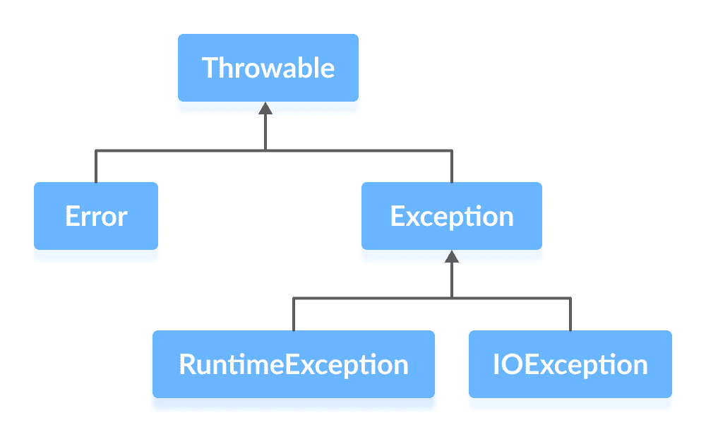

# Java 异常

> 原文： [https://www.programiz.com/java-programming/exceptions](https://www.programiz.com/java-programming/exceptions)

#### 在本教程中，我们将学习 Java 中的异常。 我们将介绍 Java 中的错误，异常和不同类型的异常。

异常是程序执行期间发生的意外事件。 它影响程序指令的流程，这可能导致程序异常终止。

出于多种原因可能会发生异常。 他们之中有一些是：

*   无效的用户输入
*   设备故障
*   网络连接丢失
*   物理限制（磁盘内存不足）
*   代码错误
*   打开一个不可用的文件

* * *

## Java 异常层次结构

这是 Java 中异常层次结构的简化图。

从上图可以看到，`Throwable`类是层次结构中的根类。

请注意，层次结构分为两个分支：错误和异常。

* * *

### 失误

**错误**表示不可恢复的状况，例如 Java 虚拟机（JVM）内存不足，内存泄漏，堆栈溢出错误，库不兼容，无限递归等。

错误通常是程序员无法控制的，我们不应该尝试处理错误。

* * *

### 例外情况

**异常**可以由程序捕获和处理。

当方法内发生异常时，它将创建一个对象。 该对象称为异常对象。

它包含有关异常的信息，例如，异常的名称和说明以及发生异常时程序的状态。

在下一个教程中，我们将学习如何处理这些异常。 在本教程中，我们现在将重点介绍 Java 中不同类型的异常。

* * *

## Java 异常类型

异常层次结构还具有两个分支：`RuntimeException`和`IOException`。

* * *

### 1\. RuntimeException

**运行时异常**由于编程错误而发生。 它们也称为**非受检的异常**。

这些异常不在编译时检查，而是在运行时检查。 一些常见的运行时异常是：

*   API 使用不当-`IllegalArgumentException`
*   空指针访问（缺少变量的初始化）-`NullPointerException`
*   越界数组访问-`ArrayIndexOutOfBoundsException`
*   将数字除以 0-`ArithmeticException`

您可以这样考虑。 “如果是运行时异常，那是您的错”。

如果在使用变量之前检查变量是否已初始化，则`NullPointerException`不会出现。

如果针对数组范围测试了数组索引，则不会出现`ArrayIndexOutOfBoundsException`。

* * *

### 2\. IOException

`IOException`也称为**受检的异常**。 它们由编译器在编译时检查，并提示程序员处理这些异常。

受受检的异常的一些示例是：

*   尝试打开不存在的文件会导致`FileNotFoundException`
*   尝试读取文件末尾

现在我们已经了解了异常，我们将在下一个教程中学习处理[异常](/java-programming/exception-handling "Java exception handling")的知识。