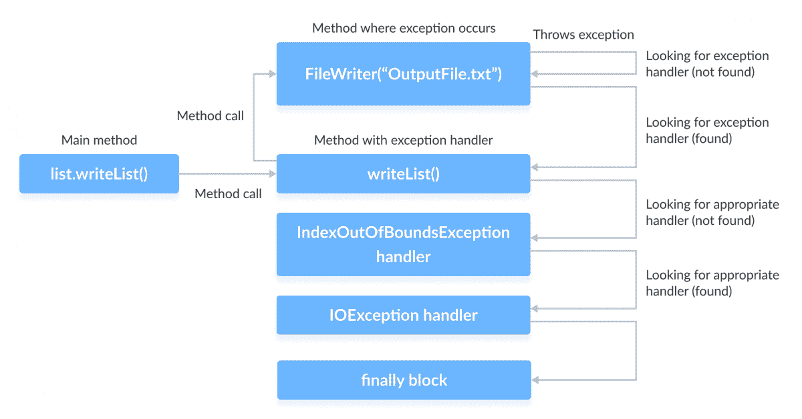

# Java 异常处理

> 原文： [https://www.programiz.com/java-programming/exception-handling](https://www.programiz.com/java-programming/exception-handling)

#### 在本教程中，您将借助示例学习使用 Java 处理异常。 为了处理异常，我们将使用`try...catch...finally` 块。

在上一教程中，我们了解了异常。 异常是程序执行期间发生的意外事件。

* * *

## 捕捉和处理异常

在 Java 中，我们使用异常处理程序组件`try`，`catch`和`finally`块来处理异常。

为了捕获和处理异常，我们将`try...catch...finally`块放置在可能生成异常的代码周围。`finally`块是可选的。

`try...catch...finally`的语法为：

```java
try {
  // code
} catch (ExceptionType e) { 
  // catch block
} finally {
  // finally block
} 
```

* * *

## Java `try...catch`块

可能产生异常的代码位于`try`块中。

每个`try`块后应紧跟`catch`或`finally`块。 发生异常时，它会被紧随其后的`catch`块捕获。

`catch`块不能单独使用，并且必须始终在`try`块之前。

### 示例 1：`try...catch`块

```java
class Main {
  public static void main(String[] args) {

    try {
      int divideByZero = 5 / 0;
      System.out.println("Rest of code in try block");
    } catch (ArithmeticException e) {
      System.out.println("ArithmeticException => " + e.getMessage());
    }

  }
} 
```

**输出**

```java
ArithmeticException => / by zero 
```

在这个例子中

*   我们在`try`块中将数字除以 0。 这产生了`ArithmeticException`。
*   发生异常时，程序将跳过`try`块中的其余代码。
*   在这里，我们创建了一个`catch`块来处理`ArithmeticException`。 因此，将执行`catch`块中的语句。

如果`try`块中的所有语句均未生成异常，则将跳过`catch`块。

* * *

## 多个`catch`块

对于每个`try`块，可以有零个或多个`catch`块。

每个`catch`块的参数类型指示可以处理的异常类型。 多个`catch`块使我们能够以不同方式处理每个异常。

### 示例 2：多个`catch`块

```java
class ListOfNumbers {
  public int[] arrayOfNumbers = new int[10];

  public void writeList() {

    try {
      arrayOfNumbers[10] = 11;
    } catch (NumberFormatException e1) {
      System.out.println("NumberFormatException => " + e1.getMessage());
    } catch (IndexOutOfBoundsException e2) {
      System.out.println("IndexOutOfBoundsException => " + e2.getMessage());
    }

  }
}

class Main {
  public static void main(String[] args) {
    ListOfNumbers list = new ListOfNumbers();
    list.writeList();
  }
} 
```

**输出**：

```java
IndexOutOfBoundsException => Index 10 out of bounds for length 10 
```

在此示例中，我们声明了大小为 10 的整数`arrayOfNumbers`数组。

我们知道数组索引始终从 0 开始。因此，当我们尝试为索引 10 分配值时，会出现`IndexOutOfBoundsException`，因为`arrayOfNumbers`的数组范围是 0 到 9。

当`try`块中发生异常时，

*   异常被引发到第一个`catch`块。 第一个`catch`块不处理`IndexOutOfBoundsException`，因此将其传递到下一个`catch`块。
*   上面示例中的第二个`catch`块是适当的异常处理程序，因为它处理`IndexOutOfBoundsException`。 因此，它被执行。

* * *

## Java `finally`块

对于每个`try`块，只能有一个`finally`块。

`finally`块是可选的。 但是，如果已定义，它将始终执行（即使不会发生异常）。

如果发生异常，则在`try...catch`块之后执行该异常。 如果没有异常发生，则在`try`块之后执行。

`finally`块的基本语法为：

```java
try {
  //code
} catch (ExceptionType1 e1) { 
  // catch block
} catch (ExceptionType1 e2) {
 // catch block
} finally {
  // finally block always executes
} 
```

* * *

### 示例 3：`finally`块

```java
class Main {
  public static void main(String[] args) {
    try {
      int divideByZero = 5 / 0;
    } catch (ArithmeticException e) {
      System.out.println("ArithmeticException => " + e.getMessage());
    } finally {
      System.out.println("Finally block is always executed");
    }
  }
} 
```

**输出**：

```java
ArithmeticException => / by zero
Finally block is always executed 
```

在此示例中，我们将数字除以 0。这将引发`ArithmeticException`，该`ArithmeticException`被`catch`块捕获。`finally`块始终执行。

拥有`finally`块被认为是一个好习惯。 这是因为它包含重要的清除代码，例如：

*   `return`，`continue`或`break`语句可能意外跳过的代码
*   关闭文件或连接

我们已经提到，最后总是执行，通常就是这种情况。 但是，在某些情况下，`finally`块不执行：

*   使用`System.exit()`方法
*   `finally`块中发生异常
*   线程的死亡

* * *

### 示例 4：`try-catch-finally`

让我们举一个例子，我们尝试使用`FileWriter`创建一个新文件，然后使用`PrintWriter`向其中写入数据。

```java
import java.io.*;

class ListOfNumbers {
  private int[] list = new int[10];

  public ListOfNumbers() {
    // storing integer values in the list array
    for (int i = 0; i < 10; i++) {
      list[i] = i;
    } 	
  }

}

  public void writeList() {
    PrintWriter out = null;

    try {
      System.out.println("Entering try statement");

      // creating a new file OutputFile.txt
      out = new PrintWriter(new FileWriter("OutputFile.txt"));

      // writing values from list array to the new created file
      for (int i = 0; i < 10; i++) {
        out.println("Value at: " + i + " = " + list[i]);
      }
    } catch (IndexOutOfBoundsException e1) {
      System.out.println("IndexOutOfBoundsException => " + e1.getMessage());
    } catch (IOException e2) {
      System.out.println("IOException => " + e2.getMessage());
    } finally {
      // checking if PrintWriter has been opened
      if (out != null) {
        System.out.println("Closing PrintWriter");
        out.close();
      } else {
        System.out.println("PrintWriter not open");
      }
    }

  }
}

class Main {
  public static void main(String[] args) {
    ListOfNumbers list = new ListOfNumbers();
    list.writeList();
  }
} 
```

运行此程序时，可能会发生两种情况：

1.  `try`块中发生异常
2.  `try`块正常执行

创建新的`FileWriter`时可能会发生异常。 如果指定的文件无法创建或写入，则抛出`IOException`。

当发生异常时，我们将获得以下输出。

```java
Entering try statement
IOException => OutputFile.txt
PrintWriter not open 
```

当没有异常发生并且`try`块正常执行时，我们将获得以下输出。

```java
Entering try statement
Closing PrintWriter 
```

创建了`OutputFile.txt`，它将具有以下内容：

```java
Value at: 0 = 0
Value at: 1 = 1
Value at: 2 = 2
Value at: 3 = 3
Value at: 4 = 4
Value at: 5 = 5
Value at: 6 = 6
Value at: 7 = 7
Value at: 8 = 8
Value at: 9 = 9 
```

* * *

### `try...catch...finally`的详细原理

让我们尝试在上述示例的帮助下详细了解异常处理的流程。



上图描述了在创建新的`FileWriter`时发生异常时的程序执行流程。

*   为了进入发生异常的方法，主方法调用`writeList()`方法，然后调用`FileWriter()`方法来创建新的`OutputFile.txt`文件。
*   发生异常时，运行系统将跳过`try`块中的其余代码。
*   它开始以相反的顺序搜索调用栈，以找到合适的异常处理程序。
*   这里`FileWriter`没有异常处理程序，因此运行时系统检查调用栈中的下一个方法，即`writeList`。
*   `writeList`方法有两个异常处理程序：一个处理`IndexOutOfBoundsException`，另一个处理`IOException`。
*   然后，系统依次处理这些处理程序。
*   此示例中的第一个处理程序处理`IndexOutOfBoundsException`。 这与`try`块引发的`IOException`不匹配。
*   因此，检查下一个处理程序是`IOException`处理程序。 这与引发的异常类型匹配，因此将执行`catch`块中的代码。
*   执行异常处理程序后，将执行`finally`块。
*   在这种情况下，由于`FileWriter`中发生异常，因此中的`PrintWriter`对象从未被打开，因此不需要关闭。`

现在，让我们假设在运行该程序时未发生异常，并且`try`块正常执行。 在这种情况下，将创建并写入一个`OutputFile.txt`。

众所周知，无论异常处理如何，都会执行`finally`块。 由于没有异常发生，因此`PrintWriter`是打开的，需要关闭。 这是通过`finally`块中的`out.close()`语句完成的。

* * *

### 捕获多个异常

从 Java SE 7 和更高版本开始，我们现在可以使用一个`catch`块捕获不止一种类型的异常。

这样可以减少代码重复并提高代码的简单性和效率。

`catch`块可以处理的每种异常类型都使用竖线`|`分隔。

其语法为：

```java
try {
  // code
} catch (ExceptionType1 | Exceptiontype2 ex) { 
  // catch block
} 
```

要了解更多信息，请访问 [Java 捕获多个异常](/java-programming/multiple-exceptions)。

* * *

### `try-with-resources`语句

`try-with-resources`语句是一种`try`语句，具有一个或多个资源声明。

它的语法是：

```java
try (resource declaration) {
  // use of the resource
} catch (ExceptionType e1) {
  // catch block
} 
```

资源是在程序结束时要关闭的对象。 必须在`try`语句中声明和初始化它。

让我们举个例子。

```java
try (PrintWriter out = new PrintWriter(new FileWriter(“OutputFile.txt”)) {
  // use of the resource
} 
```

`try-with-resources`语句也称为**自动资源管理**。 该语句在语句末尾自动关闭所有资源。

要了解更多信息，请访问 [Java `try-with-resources`语句](/java-programming/try-with-resources "Java try-with-resources")。