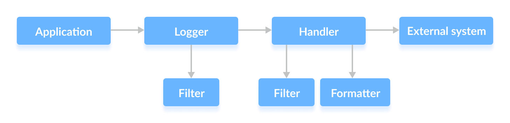

# Java 记录

> 原文： [https://www.programiz.com/java-programming/logging](https://www.programiz.com/java-programming/logging)

#### 在本教程中，我们将借助示例学习 Java 日志记录及其各种组件。

Java 允许我们通过日志记录过程来创建和捕获日志消息和文件。

在 Java 中，日志记录需要框架和 API。 Java 在`java.util.logging`软件包中具有内置的日志记录框架。

我们还可以将第三方框架（例如 Log4j，Logback 等）用于记录目的。

* * *

## Java 记录组件

下图表示 Java 日志记录 API（`java.util.logging`）的核心组件和控制流程。

<figure>

<figcaption>Java Logging</figcaption>

</figure>

### 1.记录仪

`Logger`类提供了记录方法。 我们可以从`Logger`类实例化对象并调用其方法以进行记录。

让我们举个例子。

```java
Logger logger = Logger.getLogger("newLoggerName"); 
```

`Logger`类的`getLogger()`方法用于查找或创建新的`Logger`。 字符串参数定义记录器的名称。

在这里，这将创建一个新的`Logger`对象或返回一个具有相同名称的现有`Logger`。

约定使用`class.getName()`在当前类之后定义`Logger`。

```java
Logger logger = Logger.getLogger(MyClass.class.getName()); 
```

**注意：**如果传递的名称为`null`，则此方法将抛出`NullPointerException`。

每个`Logger`都有一个级别，该级别确定日志消息的重要性。 有 7 个基本日志级别：

| 日志级别（降序） | 用 |
| **严重** | 严重失败 |
| **警告** | 警告消息，潜在问题 |
| **信息** | 常规运行时信息 |
| **配置** | 配置信息 |
| **精细** | 常规开发人员信息（跟踪消息） |
| **FINER** | 详细的开发人员信息（跟踪消息） |
| **最高** | 高度详细的开发人员信息（跟踪消息） |
| **关** | 关闭所有级别的日志记录（不捕获任何内容） |
| **全部** | 打开所有级别的日志记录（捕获所有内容） |

除了两个特殊的日志级别`OFF`和`ALL`之外，每个日志级别都有一个确定其严重性的整数值。

* * *

### 记录消息

默认情况下，始终会记录前三个日志级别。 要设置其他级别，我们可以使用以下代码：

```java
logger.setLevel(Level.LogLevel);

// example
logger.setLevel(Level.FINE); 
```

在此示例中，仅级别`FINE`及其之上的级别被设置为记录。 所有其他日志消息均被删除。

现在要记录一条消息，我们使用`log()`方法。

```java
logger.log(Level.LogLevel, "log message");

// example
logger.log(Level.INFO, "This is INFO log level message"); 
```

有一些用于记录所需级别的速记方法。

```java
logger.info( "This is INFO log level message");
logger.warning( "This is WARNING log level message"); 
```

然后，已通过设置的日志级别的所有日志请求都将转发到 **LogRecord** 。

**注意：**如果记录器的级别设置为`null`，则其级别将从其父级继承，依此类推。

* * *

### 2.筛选器

筛选器（如果存在）确定是否应转发 **LogRecord** 。 顾名思义，它会根据特定条件过滤日志消息。

**LogRecord** 仅在通过指定条件时才从记录器传递到日志处理程序，并从日志处理程序传递到外部系统。

```java
// set a filter
logger.setFilter(filter);

// get a filter
Filter filter = logger.getFilter(); 
```

* * *

### 3.处理程序（追加者）

日志处理程序或附加程序将接收 **LogRecord** ，并将其导出到各种目标。

Java SE 提供了 5 个内置处理程序：

| 处理程序 | Use |
| `StreamHandler` | 写入`OutputStream` |
| `ConsoleHandler` | 写入控制台 |
| `FileHandler` | 写入文件 |
| `SocketHandler` | 写入远程 TCP 端口 |
| `MemoryHandler` | 写入内存 |

处理程序可以将 **LogRecord** 传递给过滤器，以再次确定是否可以将其转发到外部系统。

要添加新的处理程序，我们使用以下代码：

```java
logger.addHandler(handler);

// example
Handler handler = new ConsoleHandler();
logger.addHandler(handler); 
```

要删除处理程序，我们使用以下代码：

```java
logger.removeHandler(handler);

// example
Handler handler = new ConsoleHandler();
logger.addHandler(handler);
logger.removeHandler(handler); 
```

一个记录器可以有多个处理程序。 要获取所有处理程序，我们使用以下代码：

```java
Handler[] handlers = logger.getHandlers(); 
```

* * *

### 4.格式化程序

处理程序还可以使用**格式化程序**将 **LogRecord** 对象格式化为字符串，然后再将其导出到外部系统。

Java SE 具有两个内置的**格式化程序**：

| 格式化程序 | Use |
| `SimpleFormatter` | 将 **LogRecord** 格式化为字符串 |
| `XMLFormatter` | 将 **LogRecord** 格式转换为 XML 格式 |

我们可以使用以下代码来格式化处理程序：

```java
// formats to string form
handler.setFormatter(new SimpleFormatter());

// formats to XML form
handler.setFormatter(new XMLFormatter()); 
```

* * *

## 日志管理器

**LogManager** 对象跟踪全局日志记录信息。 它读取并维护日志记录配置和记录器实例。

日志管理器是单例，这意味着仅实例化了一个实例。

要获取日志管理器实例，我们使用以下代码：

```java
LogManager manager = new LogManager(); 
```

* * *

## 记录的优点

这是使用 Java 登录的一些优点。

*   帮助监控程序的流程
*   帮助捕获可能发生的任何错误
*   为问题诊断和调试提供支持