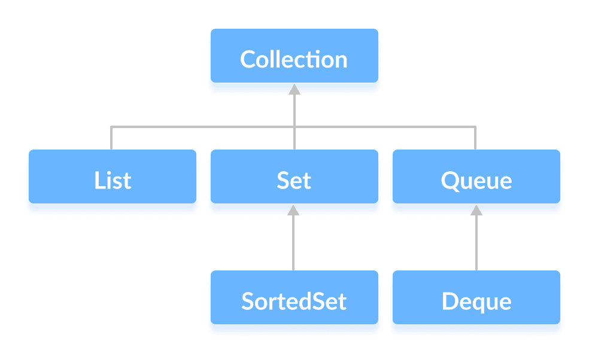

# Java `Collection`接口

> 原文： [https://www.programiz.com/java-programming/collection-interface](https://www.programiz.com/java-programming/collection-interface)

#### 在本教程中，我们将学习 Java `Collection`接口及其子接口。

`Collection`接口是 Java 集合框架的根接口。

此接口没有直接实现。 但是，它是通过其`List`，`Set`和`Queue`子接口实现的。

例如，`ArrayList`类实现了`List`接口，它是`Collection`接口的子接口。

* * *

## 集合的子接口

如上所述，`Collection`接口包括由 Java 中的各种类实现的子接口。

### 1.`List`接口

`List`接口是一个有序的集合，允许我们添加和删除元素（如数组）。 要了解更多信息，请访问： [Java List Interface](https://www.programiz.com/java-programming/list) 。

### 2.`Set`接口

`Set`接口允许我们将元素存储在不同的集合中，类似于数学中的集合。 它不能有重复的元素。 要了解更多信息，请访问： [Java Set Interface](https://www.programiz.com/java-programming/set) 。

### 3.`Queue`接口

当我们要以**先进先出（FIFO）**的方式存储和访问元素时，将使用`Queue`接口。 要了解更多信息，请访问： [Java `Queue`接口](https://www.programiz.com/java-programming/queue) 。

* * *

## 集合方法

`Collection`接口包括各种可用于对对象执行不同操作的方法。 这些方法在其所有子接口中均可用。

*   `add()` - 将指定的元素插入到集合中
*   `size()` - 返回集合的大小
*   `remove()` - 从集合中删除指定的元素
*   `iterator()` - 返回一个迭代器以访问集合的元素
*   `addAll()` - 将指定集合的​​所有元素添加到集合中
*   `removeAll()` - 从集合中移除指定集合的​​所有元素
*   `clear()` - 删除集合中的所有元素