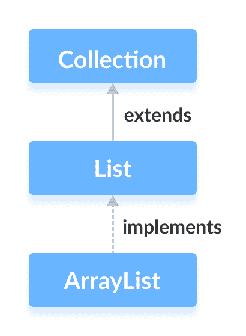

# Java `ArrayList`类

> 原文： [https://www.programiz.com/java-programming/arraylist](https://www.programiz.com/java-programming/arraylist)

#### 在本教程中，我们将学习 Java `ArrayList`类。 我们将借助示例学习不同的`ArrayList`操作和方法。

`ArrayList`类是`List`接口的实现，允许我们创建可调整大小的数组。



* * *

## Java 数组与`ArrayList`

在 Java 中，我们需要先声明数组的大小，然后才能使用它。 一旦声明了数组的大小，就很难更改它。

要解决此问题，我们可以使用`ArrayList`类。`java.util`包中的`ArrayList`类允许我们创建可调整大小的数组。

与数组不同，当我们从`ArrayList`中添加或删除元素时，`ArrayList`（`ArrayList`类的对象）可以自动调整其容量。 因此，`ArrayList`也称为动态数组。

* * *

### 创建一个`ArrayList`

这是我们可以用 Java 创建`ArrayList`的方法：

```java
ArrayList<Type> arrayList= new ArrayList<>(); 
```

在此，`Type`表示`ArrayList`的类型。 例如，

```java
// create Integer type arraylist
ArrayList<Integer> arrayList = new ArrayList<>();

// create String type arraylist
ArrayList<String> arrayList = new ArrayList<>(); 
```

在上面的程序中，我们使用了`Integer`和`String`。 在此，`Integer`是`int`类型的对应包装类。

包装器类是包装原始数据类型的类。 例如，`Integer`类包装`int`类型，`Float`类包装`float`类型，依此类推。

**注意**：我们无法创建原始数据类型（如`int`，`float`，`char`等）的`ArrayList`。相反，我们必须使用它们对应的包装器类。

对于字符串，`String`是一个类，没有包装器类。 因此，我们按原样使用`String`。

* * *

我们还可以使用`List`接口创建`ArrayList`。 这是因为`ArrayList`类实现了`List`接口。

```java
List<String> list = new ArrayList<>(); 
```

* * *

## `ArrayList`的方法

`ArrayList`提供了允许我们执行`ArrayList`操作的各种方法。

* * *

### 将元素添加到`ArrayList`

**1.使用`add()`方法**

要将单个元素添加到`ArrayList`，我们使用`add()`方法。 例如，

```java
import java.util.ArrayList;

class Main {
    public static void main(String[] args){
        ArrayList<String> animals = new ArrayList<>();

        // Add elements
        animals.add("Dog");
        animals.add("Cat");
        animals.add("Horse");
        System.out.println("ArrayList: " + animals);
    }
} 
```

**输出**

```java
ArrayList: [Dog, Cat, Horse] 
```

**2.使用索引号**

我们还可以使用索引将元素添加到`ArrayList`中。 例如，

```java
import java.util.ArrayList;

class Main {
    public static void main(String[] args){
        ArrayList<String> animals = new ArrayList<>();

        // Add elements
        animals.add(0,"Dog");
        animals.add(1,"Cat");
        animals.add(2,"Horse");
        System.out.println("ArrayList: " + animals);
    }
} 
```

**输出**：

```java
ArrayList: [Dog, Cat, Horse] 
```

**3.将一个`ArrayList`的元素添加到另一个`ArrayList`**

要将`ArrayList`的所有元素添加到新`ArrayList`中，我们使用`addAll()`方法。 例如，

```java
import java.util.ArrayList;

class Main {
    public static void main(String[] args){
        ArrayList<String> mammals = new ArrayList<>();
        mammals.add("Dog");
        mammals.add("Cat");
        mammals.add("Horse");
        System.out.println("Mammals: " + mammals);

        ArrayList<String> animals = new ArrayList<>();
        animals.add("Crocodile");

        // Add all elements of mammals in animals
        animals.addAll(mammals);
        System.out.println("Animals: " + animals);
    }
} 
```

**输出**：

```java
Mammals: [Dog, Cat, Horse]
Animals: [Crocodile, Dog, Cat, Horse] 
```

* * *

## 使用`asList()`初始化`ArrayList`

与数组不同，我们不能直接初始化`ArrayList`。 但是，我们可以使用`Arrays`类的`asList()`方法来达到相同的效果。

为了使用`asList()`方法，我们必须首先导入`java.util.Arrays`包。

例如，

```java
import java.util.ArrayList;
import java.util.Arrays;

class Main {
    public static void main(String[] args) {
        // Creating an array list
        ArrayList<String> animals = new ArrayList<>(Arrays.asList("Cat", "Cow", "Dog"));
        System.out.println("ArrayList: " + animals);

        // Access elements of the array list
        String element = animals.get(1);
        System.out.println("Accessed Element: " + element);
    }
} 
```

**输出**：

```java
ArrayList: [Cat, Cow, Dog]
Accessed Elemenet: Cow 
```

在上面的示例中，请注意以下表达式：

```java
new ArrayList<>(Arrays.asList(("Cat", "Cow", "Dog")); 
```

在这里，我们首先创建了一个由 3 个元素组成的数组：`"Cat"`，`"Cow"`和`"Dog"`。 然后，`asList()`方法用于将数组转换为`ArrayList`。

要了解有关初始化`ArrayList`的不同方法的更多信息，请访问：[在一行](https://stackoverflow.com/questions/1005073/initialization-of-an-arraylist-in-one-line "Initialization of an ArrayList")中初始化`ArrayList`。

* * *

### 访问`ArrayList`元素

**1.使用`get()`方法**

要随机访问`ArrayList`的元素，我们使用`get()`方法。 例如，

```java
import java.util.ArrayList;

class Main {
    public static void main(String[] args) {
        ArrayList<String> animals= new ArrayList<>();

        // Add elements in the array list
        animals.add("Dog");
        animals.add("Horse");
        animals.add("Cat");
        System.out.println("ArrayList: " + animals);

        // Get the element from the array list
        String str = animals.get(0);
        System.out.print("Element at index 0: " + str);
    }
} 
```

**输出**：

```java
ArrayList: [Dog, Horse, Cat]
Element at index 0: Dog 
```

**2.使用`iterator()`方法**

要顺序访问`ArrayList`的元素，我们使用`iterator()`方法。 我们必须导入`java.util.Iterator`包才能使用此方法。 例如，

```java
import java.util.ArrayList;
import java.util.Iterator;

class Main {
    public static void main(String[] args){
        ArrayList<String> animals = new ArrayList<>();

        // Add elements in the array list
        animals.add("Dog");
        animals.add("Cat");
        animals.add("Horse");
        animals.add("Zebra");

        // Create an object of Iterator
        Iterator<String> iterate = animals.iterator();
        System.out.print("ArrayList: ");

        // Use methods of Iterator to access elements
        while(iterate.hasNext()){
            System.out.print(iterate.next());
            System.out.print(", ");
        }
    }
} 
```

**输出**：

```java
ArrayList: Dog, Cat, Horse, Zebra, 
```

**注意**：

*   如果`ArrayList`中存在下一个元素，则`hasNext()`返回`true`。
*   `next()`返回`ArrayList`中的下一个元素

* * *

### 更改`ArrayList`元素

要更改`ArrayList`的元素，我们可以使用`set()`方法。 例如，

```java
import java.util.ArrayList;

class Main {
    public static void main(String[] args) {
        ArrayList<String> animals= new ArrayList<>();
        // Add elements in the array list
        animals.add("Dog");
        animals.add("Cat");
        animals.add("Horse");
        System.out.println("ArrayList: " + animals);

        // Change the element of the array list
        animals.set(2, "Zebra");
        System.out.println("Modified ArrayList: " + animals);
    }
} 
```

**输出**：

```java
ArrayList: [Dog, Cat, Horse]
Modified ArrayList: [Dog, Cat, Zebra] 
```

* * *

### 删除`ArrayList`元素

**1.使用`remove()`方法**

要从`ArrayList`中删除一个元素，我们可以使用`remove()`方法。 例如，

```java
import java.util.ArrayList;

class Main {
    public static void main(String[] args) {
        ArrayList<String> animals = new ArrayList<>();

        // Add elements in the array list
        animals.add("Dog");
        animals.add("Cat");
        animals.add("Horse");
        System.out.println("Initial ArrayList: " + animals);

        // Remove element from index 2
        String str = animals.remove(2);
        System.out.println("Final ArrayList: " + animals);
        System. out.println("Removed Element: " + str);
    }
} 
```

**输出**：

```java
Initial ArrayList: [Dog, Cat, Horse]
Final ArrayList: [Dog, Cat]
Removed Element: Horse 
```

* * *

**2.使用`removeAll()`方法**

要从`ArrayList`中删除所有元素，我们使用`removeAll()`方法。 例如，

```java
import java.util.ArrayList;

class Main {
    public static void main(String[] args) {
        ArrayList<String> animals = new ArrayList<>();

        // Add elements in the ArrayList
        animals.add("Dog");
        animals.add("Cat");
        animals.add("Horse");
        System.out.println("Initial ArrayList: " + animals);

        // Remove all the elements
        animals.removeAll(animals);
        System.out.println("Final ArrayList: " + animals);
    }
} 
```

**输出**：

```java
Initial ArrayList: [Dog, Cat, Horse]
Final ArrayList: [] 
```

* * *

**3.使用`clear()`方法**

我们还可以使用`clear()`方法从`ArrayList`中删除所有元素。 例如，

```java
import java.util.ArrayList;

class Main {
    public static void main(String[] args) {
        ArrayList<String> animals= new ArrayList<>();

        // Add elements in the array list
        animals.add("Dog");
        animals.add("Cat");
        animals.add("Horse");
        System.out.println("Initial ArrayList: " + animals);

        // Remove all the elements
        animals.clear();
        System.out.println("Final ArrayList: " + animals);
    }
} 
```

**输出**：

```java
Initial ArrayList: [Dog, Cat, Horse]
Final ArrayList: [] 
```

**注意**： `clear()`方法比`removeAll()`方法更有效。

* * *

## 遍历`ArrayList`

**1.使用`for`循环**

```java
import java.util.ArrayList;

class Main {
    public static void main(String[] args) {
        // Creating an array list
        ArrayList<String> animals = new ArrayList<>();
        animals.add("Cow");
        animals.add("Cat");
        animals.add("Dog");
        System.out.println("ArrayList: " + animals);

        // Using for loop
        System.out.println("Accessing individual elements: ");

        for(int i = 0; i < animals.size(); i++) {
            System.out.print(animals.get(i));
            System.out.print(", ");
        }
    }
} 
```

**输出**：

```java
ArrayList: [Cow, Cat, Dog]
Accessing individual elements:
Cow, Cat, Dog, 
```

* * *

**2.使用`forEach`循环**

```java
import java.util.ArrayList;

class Main {
    public static void main(String[] args) {
        // Creating an array list
        ArrayList<String> animals = new ArrayList<>();
        animals.add("Cow");
        animals.add("Cat");
        animals.add("Dog");
        System.out.println("ArrayList: " + animals);

        // Using forEach loop
        System.out.println("Accessing individual elements:  ");
        for(String animal : animals) {
            System.out.print(animal);
            System.out.print(", ");
        }
    }
} 
```

**输出**：

```java
ArrayList: [Cow, Cat, Dog]
Accessing individual elements:
Cow, Cat, Dog, 
```

在两个示例中，我们都使用循环访问了`ArrayList`的各个元素。

* * *

## 获取`ArrayList`的长度

要获取`ArrayList`的长度，我们使用`size()`方法。 例如，

```java
import java.util.ArrayList;

class Main {
    public static void main(String[] args) {
        ArrayList<String> animals= new ArrayList<>();

        // Adding elements in the arrayList
        animals.add("Dog");
        animals.add("Horse");
        animals.add("Cat");
        System.out.println("ArrayList: " + animals);

        // getting the size of the arrayList
        System.out.println("Size: " + animals.size());
    }
} 
```

**输出**：

```java
ArrayList: [Dog, Horse, Cat]
Size: 3 
```

* * *

## 对`ArrayList`的元素进行排序

要对`ArrayList`的元素进行排序，我们使用`Collections`类的`sort()`方法。 为了使用它，我们必须首先导入`java.util.Collections`包。

默认情况下，排序以字母或数字升序进行。 例如，

```java
import java.util.ArrayList;
import java.util.Collections;

class Main {
    public static void main(String[] args){
        ArrayList<String> animals= new ArrayList<>();

        // Add elements in the array list
        animals.add("Horse");
        animals.add("Zebra");
        animals.add("Dog");
        animals.add("Cat");

        System.out.println("Unsorted ArrayList: " + animals);

        // Sort the array list
        Collections.sort(animals);
        System.out.println("Sorted ArrayList: " + animals);
    }
} 
```

**输出**：

```java
Unsorted ArrayList: [Horse, Zebra, Dog, Cat]
Sorted ArrayList: [Cat, Dog, Horse, Zebra] 
```

要了解有关对`ArrayList`进行排序的更多信息，请访问 Java `ArrayList`排序。

* * *

## Java `ArrayList`转数组

在 Java 中，我们可以使用`toArray()`方法将`ArrayList`转换为数组。 例如，

```java
import java.util.ArrayList;

class Main {
    public static void main(String[] args) {
        ArrayList<String> animals= new ArrayList<>();

        // Add elements in the array list
        animals.add("Dog");
        animals.add("Cat");
        animals.add("Horse");
        System.out.println("ArrayList: " + animals);

        // Create a new array of String type
        String[] arr = new String[animals.size()];

        // Convert ArrayList into an array
        animals.toArray(arr);
        System.out.print("Array: ");
        for(String item:arr) {
            System.out.print(item+", ");
        }
    }
} 
```

**输出**：

```java
ArrayList: [Dog, Cat, Horse]
Array: Dog, Cat, Horse,

```

* * *

## Java 数组到`ArrayList`

我们还可以将数组转换为`ArrayList`。 为此，我们可以使用`Arrays`类的`asList()`方法。

要使用`asList()`，我们必须首先导入`java.util.Arrays`包。 例如，

```java
import java.util.ArrayList;
import java.util.Arrays;

class Main {
    public static void main(String[] args) {
        // Create an array of String type
        String[] arr = {"Dog", "Cat", "Horse"};
        System.out.print("Array: ");

        // Print array
        for(String str: arr) {
            System.out.print(str);
            System.out.print(" ");
        }

        // Create an ArrayList from an array
        ArrayList<String> animals = new ArrayList<>(Arrays.asList(arr));
        System.out.println("\nArrayList: " + animals);
    }
} 
```

**输出**：

```java
Array: Dog, Cat, Horse
ArrayList: [Dog, Cat, Horse] 
```

在上面的程序中，我们首先创建了`String`类型的数组`arr`。

然后，我们使用`asList()`方法将数组转换为`ArrayList`。

* * *

## Java `ArrayList`转换为字符串

要将`ArrayList`转换为`String`，我们可以使用`toString()`方法。 例如，

```java
import java.util.ArrayList;

class Main {
    public static void main(String[] args) {
        ArrayList<String> animals = new ArrayList<>();

        // Add elements in the ArrayList
        animals.add("Dog");
        animals.add("Cat");
        animals.add("Horse");
        System.out.println("ArrayList: " + animals);

        // Convert ArrayList into an String
        String str = animals.toString();
        System.out.println("String: " + str);
    }
} 
```

**输出**：

```java
ArrayList: [Dog, Cat, Horse]
String: [Dog, Cat, Horse] 
```

**注意**： `toString()`将整个`ArrayList`转换为单个`String`。

* * *

## 其他`ArrayList`方法

| 方法 | 内容描述 |
| --- | --- |
| `clone()` | 用相同的元素，大小和容量创建一个新的`ArrayList`。 |
| `contains()` | 在`ArrayList`中搜索指定的元素，并返回布尔结果。 |
| `ensureCapacity()` | 指定`ArrayList`可以包含的总元素。 |
| `isEmpty()` | 检查`ArrayList`是否为空。 |
| `indexOf()` | 在`ArrayList`中搜索指定的元素，并返回该元素的索引。 |
| `trimToSize()` | 将`ArrayList`的容量减少到当前大小。 |