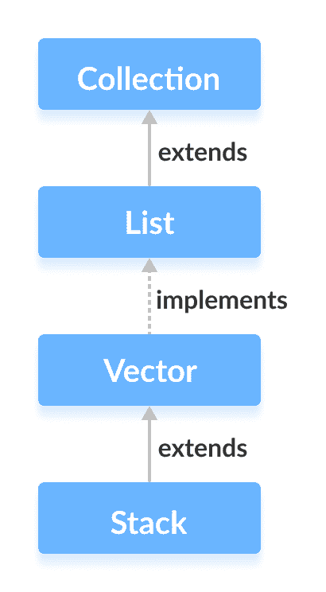
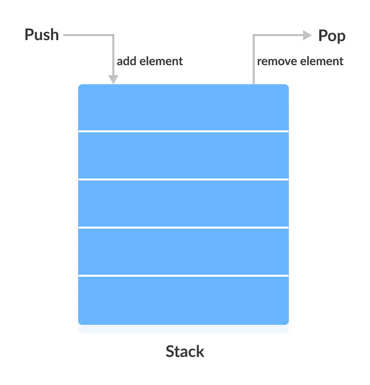

# Java `Stack`类

> 原文： [https://www.programiz.com/java-programming/stack](https://www.programiz.com/java-programming/stack)

#### 在本教程中，我们将借助示例学习 Java `Stack`类及其方法。

Java 集合框架具有一个名为`Stack`的类，该类提供栈数据结构的功能。

`Stack`类扩展了`Vector`类。



* * *

## `Stack`实现

在栈中，元素以**后进先出**的方式存储和访问。 即，元素被添加到栈的顶部，并从栈的顶部移除。



* * *

## 创建`Stack`

为了创建栈，我们必须首先导入`java.util.Stack`包。 导入包后，就可以使用 Java 创建栈。

```java
Stack<Type> stacks = new Stack<>(); 
```

此处，`Type`表示栈的类型。 例如，

```java
// Create Integer type stack
Stack<Integer> stacks = new Stack<>();

// Create String type stack
Stack<String> stacks = new Stack<>(); 
```

* * *

## `Stack`方法

由于`Stack`扩展了`Vector`类，因此它继承了所有方法`Vector`。 要了解不同的`Vector`方法，请访问 [Java Vector Class](/java-programming/vector "Java Vector Class") 。

除了这些方法之外，`Stack`类还包括 5 个与`Vector`区别的方法。

* * *

### `push()`方法

要将元素添加到栈的顶部，我们使用`push()`方法。 例如，

```java
import java.util.Stack;

class Main {
    public static void main(String[] args) {
        Stack<String> animals= new Stack<>();

        // Add elements to Stack
        animals.push("Dog");
        animals.push("Horse");
        animals.push("Cat");

        System.out.println("Stack: " + animals);
    }
} 
```

**输出**

```java
Stack: [Dog, Horse, Cat] 
```

* * *

### `pop()`方法

要从栈顶部删除元素，我们使用`pop()`方法。 例如，

```java
import java.util.Stack;

class Main {
    public static void main(String[] args) {
        Stack<String> animals= new Stack<>();

        // Add elements to Stack
        animals.push("Dog");
        animals.push("Horse");
        animals.push("Cat");
        System.out.println("Initial Stack: " + animals);

        // Remove element stacks
        String element = animals.pop();
        System.out.println("Removed Element: " + element);
    }
} 
```

**输出**：

```java
Initial Stack: [Dog, Horse, Cat]
Removed Element: Cat 
```

* * *

### `peek()`方法

`peek()`方法从栈顶部返回一个对象。 例如，

```java
import java.util.Stack;

class Main {
    public static void main(String[] args) {
        Stack<String> animals= new Stack<>();

        // Add elements to Stack
        animals.push("Dog");
        animals.push("Horse");
        animals.push("Cat");
        System.out.println("Stack: " + animals);

        // Access element from the top
        String element = animals.peek();
        System.out.println("Element at top: " + element);

    }
} 
```

**输出**：

```java
Stack: [Dog, Horse, Cat]
Element at top: Cat 
```

* * *

### `search()`方法

要搜索栈中的元素，我们使用`search()`方法。 它从栈顶部返回元素的位置。 例如，

```java
import java.util.Stack;

class Main {
    public static void main(String[] args) {
        Stack<String> animals= new Stack<>();

        // Add elements to Stack
        animals.push("Dog");
        animals.push("Horse");
        animals.push("Cat");
        System.out.println("Stack: " + animals);

        // Search an element
        int position = animals.search("Horse");
        System.out.println("Position of Horse: " + position);
    }
} 
```

**输出**：

```java
Stack: [Dog, Horse, Cat]
Position of Horse: 2 
```

* * *

### `empty()`方法

要检查栈是否为空，我们使用`empty()`方法。 例如，

```java
import java.util.Stack;

class Main {
    public static void main(String[] args) {
        Stack<String> animals= new Stack<>();

        // Add elements to Stack
        animals.push("Dog");
        animals.push("Horse");
        animals.push("Cat");
        System.out.println("Stack: " + animals);

        // Check if stack is empty
        boolean result = animals.empty();
        System.out.println("Is the stack empty? " + result);
    }
} 
```

**输出**：

```java
Stack: [Dog, Horse, Cat]
Is the stack empty? false 
```

* * *

## 使用`ArrayDeque`而不是`Stack`

`Stack`类提供栈数据结构的直接实现。 但是，建议不要使用它。 而是使用`ArrayDeque`类（实现`Deque`接口）在 Java 中实现栈数据结构。

要了解更多信息，请访问：

*   [Java `ArrayDeque`](/java-programming/arraydeque "Java ArrayDeque Class")
*   [为什么在栈上使用双端队列？](https://stackoverflow.com/questions/12524826/why-should-i-use-deque-over-stack)