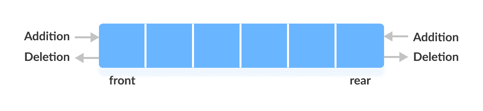
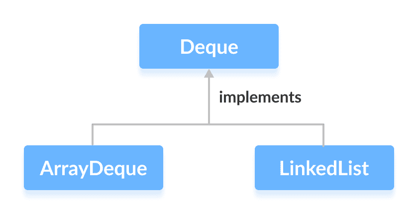

# Java `Deque`接口

> 原文： [https://www.programiz.com/java-programming/deque](https://www.programiz.com/java-programming/deque)

#### 在本教程中，我们将学习`Deque`接口，如何使用它及其方法。

Java 集合框架的`Deque`接口提供双端队列的功能。 它扩展了`Queue`接口。

* * *

## 双端队列的工作原理

在常规队列中，元素是从后面添加的，而从前面删除的。 但是，在双端队列中，我们可以**从前面和后面**插入和删除元素。



* * *

## `Deque`实现类

为了使用`Deque`接口的功能，我们需要使用实现它的类：

*   [`ArrayDeque`](/java-programming/arraydeque "Java ArrayDeque")
*   [`LinkedList`](/java-programming/linkedlist "Java LinkedList")



* * *

## 如何使用`Deque`？

在 Java 中，我们必须导入`java.util.Deque`包才能使用`Deque`。

```java
// Array implementation of Deque
Deque<String> animal1 = new ArrayDeque<>();

// LinkedList implementation of Deque
Deque<String> animal2 = new LinkedList<>(); 
```

在这里，我们分别创建了`ArrayDeque`和`LinkedList`类的对象`animal1`和`animal2`。 这些对象可以使用`Deque`接口的功能。

* * *

## `Deque`方法

由于`Deque`扩展了`Queue`接口，因此它继承了[`Queue`接口](/java-programming/queue "Java Queue interface")的所有方法。

除了`Queue`接口中可用的方法外，`Deque`接口还包括以下方法：

*   **`addFirst()`** - 在双端队列的开头添加指定的元素。 如果双端队列已满，则引发异常。
*   **`addLast()`** - 在双端队列的末尾添加指定的元素。 如果双端队列已满，则引发异常。
*   **`offerFirst()`** - 在双端队列的开头添加指定的元素。 如果双端队列已满，则返回`false`。
*   **`offerLast()`** - 在双端队列的末尾添加指定的元素。 如果双端队列已满，则返回`false`。
*   **`getFirst()`** - 返回双端队列的第一个元素。 如果双端队列为空，则引发异常。
*   **`getLast()`** - 返回双端队列的最后一个元素。 如果双端队列为空，则引发异常。
*   **`peekFirst()`** - 返回双端队列的第一个元素。 如果双端队列为空，则返回`null`。
*   **`peekLast()`** - 返回双端队列的最后一个元素。 如果双端队列为空，则返回`null`。
*   **`removeFirst()`** - 返回并删除双端队列的第一个元素。 如果双端队列为空，则引发异常。
*   **`removeLast()`** - 返回并删除双端队列的最后一个元素。 如果双端队列为空，则引发异常。
*   **`pollFirst()`** - 返回并删除双端队列的第一个元素。 如果双端队列为空，则返回`null`。
*   **`pollLast()`** - 返回并删除双端队列的最后一个元素。 如果双端队列为空，则返回`null`。

* * *

## 双端队列作为栈数据结构

Java `Collections`框架的`Stack`类提供了栈的实现。

但是，建议使用`Deque`作为栈，而不是[栈类](/java-programming/stack "Java Stack class")。 这是因为`Stack`的方法是同步的。

以下是`Deque`接口提供的实现栈的方法：

*   `push()` - 在双端队列的开头添加一个元素
*   `pop()` - 从双端队列的开头删除元素
*   `peek()` - 从双端队列的开头返回一个元素

* * *

## `ArrayDeque`类中`Deque`的实现

```java
import java.util.Deque;
import java.util.ArrayDeque;

class Main {

    public static void main(String[] args) {
        // Creating Deque using the ArrayDeque class
        Deque<Integer> numbers = new ArrayDeque<>();

        // add elements to the Deque
        numbers.offer(1);
        numbers.offerLast(2);
        numbers.offerFirst(3);
        System.out.println("Deque: " + numbers);

        // Access elements of the Deque
        int firstElement = numbers.peekFirst();
        System.out.println("First Element: " + firstElement);

        int lastElement = numbers.peekLast();
        System.out.println("Last Element: " + lastElement);

        // Remove elements from the Deque
        int removedNumber1 = numbers.pollFirst();
        System.out.println("Removed First Element: " + removedNumber1);

        int removedNumber2 = numbers.pollLast();
        System.out.println("Removed Last Element: " + removedNumber2);

        System.out.println("Updated Deque: " + numbers);
    }
} 
```

**输出**

```java
Deque: [3, 1, 2]
First Element: 3
Last Element: 2
Removed First Element: 3
Removed Last Element: 2
Updated Deque: [1] 
```

要了解更多信息，请访问 [Java ArrayDeque](/java-programming/arraydeque "Java ArrayDeque") 。