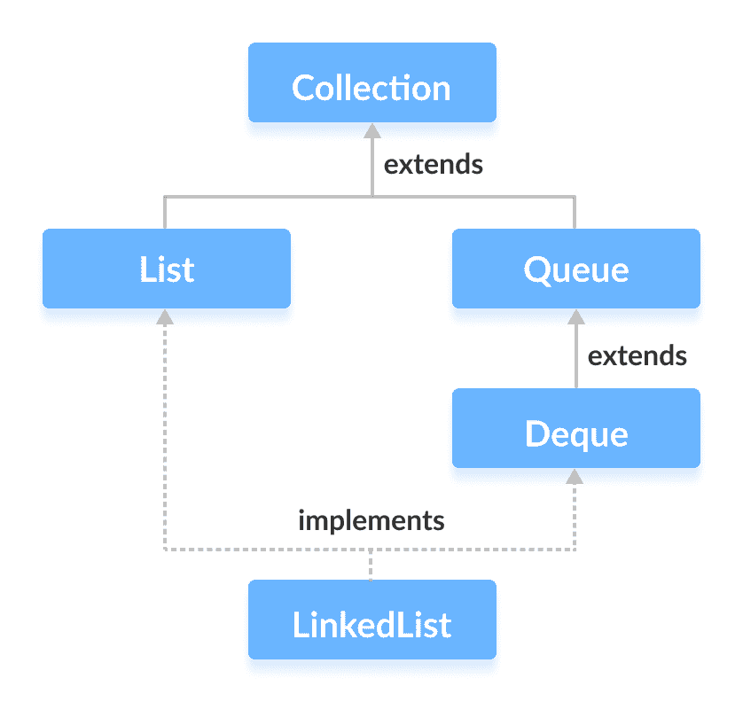
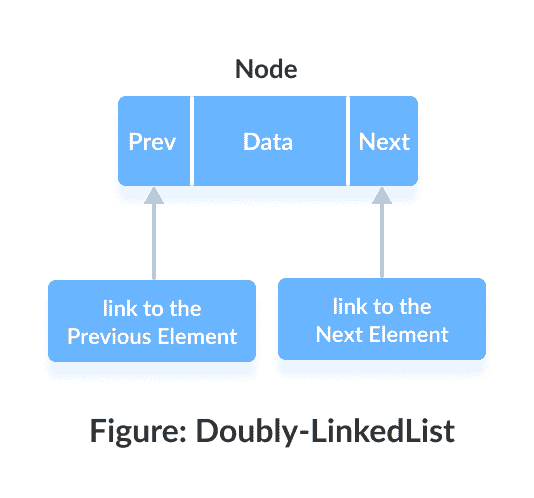
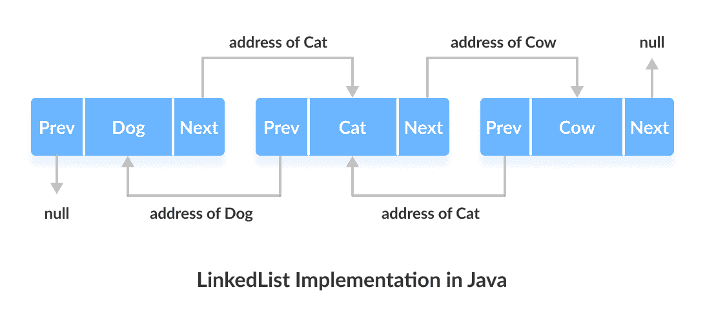

# Java `LinkedList`

> 原文： [https://www.programiz.com/java-programming/linkedlist](https://www.programiz.com/java-programming/linkedlist)

#### 在本教程中，我们将通过许多示例详细了解`LinkedList`类。

Java 集合框架的`LinkedList`类提供了链表数据结构的功能。

* * *

## 由`LinkedList`实现的接口

*   [Java `List`接口](/java-programming/list "Java List interface")
*   [Java `Queue`接口](/java-programming/queue "Java Queue interface")
*   [Java `Deque`接口](/java-programming/deque "Java Deque interface")



* * *

## Java 中的`LinkedList`实现

Java `LinkedList`类提供了一个双向链表实现。



链表中的每个元素称为**节点**。 它包含 3 个字段：

*   **上一个** - 将上一个元素的地址存储在列表中。 第一个元素为`null`。
*   **下一个** - 在列表中存储下一个元素的地址。 最后一个元素为`null`。
*   **数据** - 存储实际数据。

链接列表中的元素未按顺序存储。 相反，它们分散并通过链接（上一个和下一个）连接。



在这里，链表中有 3 个元素。

*   `Dog` - 它是第一个将`null`作为先前地址并将`Cat`作为下一个地址的元素
*   `Cat` - 它是持有`Dog`作为先前地址的地址以及`Cow`作为下一地址的地址的第二个元素
*   `Cow` - 它是保留`Cat`地址作为前一个地址，而`null`作为下一个元素的最后一个元素

* * *

## 创建一个`LinkedList`

这是我们如何用 Java 创建链接列表的方法：

```java
LinkedList<Type> linkedList = new LinkedList<>(); 
```

在此，`Type`表示链接列表的类型。 例如，

```java
// create Integer type linked list
LinkedList<Integer> linkedList = new LinkedList<>();

// create String type linked list
LinkedList<String> linkedList = new LinkedList<>(); 
```

* * *

## 使用接口创建`LinkedList`

让我们举个例子。

```java
List<String> animals1 = new LinkedList<>(); 
```

在这里，我们使用`List`接口声明了一个链表`animals1`。 链表只能访问`List`接口的方法。

让我们再举一个例子。

```java
Queue<String> animals2 = new LinkedList<>();
Deque<String> animals3 = new LinkedList<>(); 
```

在这里，`animals2`可以访问`Queue`接口的方法。

但是，`animals3`只能访问`Deque`和`Queue`接口的方法。 这是因为`Deque`是`Queue`的子接口。

* * *

## `LinkedList`的方法

`LinkedList`提供了多种方法，可让我们在链表中执行不同的操作。

* * *

### 将元素添加到`LinkedList`

**1.添加元素：使用`add()`方法**

要将元素（节点）添加到链表的末尾，我们使用`add()`方法。 例如，

```java
import java.util.LinkedList;

class Main {
    public static void main(String[] args){
        LinkedList<String> animals = new LinkedList<>();

        // Add elements to LinkedList
        animals.add("Dog");
        animals.add("Cat");
        animals.add("Horse");
        System.out.println("LinkedList: " + animals);
    }
} 
```

**输出**

```java
LinkedList: [Dog, Cat, Horse] 
```

* * *

**2.添加元素：使用索引号**

我们还可以使用索引将元素添加到链表中。 例如，

```java
import java.util.LinkedList;

class Main {
    public static void main(String[] args){
        LinkedList<String> animals = new LinkedList<>();

        // Add elements using indexes
        animals.add(0,"Dog");
        animals.add(1,"Cat");
        animals.add(2,"Horse");

        System.out.println("LinkedList: " + animals);
    }
} 
```

**输出**：

```java
LinkedList: [Dog, Cat, Horse] 
```

* * *

**3.添加元素：一个链表到另一个链表**

要将链接列表的所有元素添加到另一个链接列表，我们使用`addAll()`方法。 例如，

```java
import java.util.LinkedList;

class Main {
    public static void main(String[] args){
        LinkedList<String> mammals = new LinkedList<>();

        mammals.add("Dog");
        mammals.add("Cat");
        mammals.add("Horse");
        System.out.println("Mammals: " + mammals);

        LinkedList<String> animals = new LinkedList<>();
        animals.add("Crocodile");

        // Add all elements of mammals in animals
        animals.addAll(mammals);
        System.out.println("Animals: " + animals);
    }
} 
```

**输出**：

```java
Mammals: [Dog, Cat, Horse]
Animals: [Crocodile, Dog, Cat, Horse] 
```

* * *

**4.添加元素：使用`listIterator()`方法**

我们还可以使用`listsIterator()`方法将元素添加到链接列表中。 要使用它，我们必须导入`java.util.ListIterator`包。 例如，

```java
import java.util.ArrayList;
import java.util.ListIterator;

class Main {
    public static void main(String[] args) {
        ArrayList<String> animals= new ArrayList<>();

        // Creating an object of ListIterator
        ListIterator<String> listIterate = animals.listIterator();
        listIterate.add("Dog");
        listIterate.add("Cat");

        System.out.println("LinkedList: " + animals);
    }
} 
```

**输出**：

```java
LinkedList: [Dog, Cat] 
```

* * *

### 访问`LinkedList`元素

**1.访问元素：使用`get()`方法**

要访问链表中的元素，我们可以使用`get()`方法。 例如，

```java
import java.util.LinkedList;

class Main {
    public static void main(String[] args) {
        LinkedList<String> animals= new LinkedList<>();

        // Add elements in the linked list
        animals.add("Dog");
        animals.add("Horse");
        animals.add("Cat");
        System.out.println("LinkedList: " + animals);

        // Get the element from the linked list
        String str = animals.get(1);
        System.out.print("Element at index 1: " + str);
    }
} 
```

**输出**：

```java
LinkedList: [Dog, Horse, Cat]
Element at index 1: Horse 
```

* * *

**2.访问元素：使用`iterator()`方法**

要遍历链接列表的元素，我们可以使用`iterator()`方法。 我们必须导入`java.util.Iterator`包才能使用此方法。 例如，

```java
import java.util.LinkedList;
import java.util.Iterator;

class Main {
    public static void main(String[] args) {
        LinkedList<String> animals= new LinkedList<>();

        // Add elements in LinkedList
        animals.add("Dog");
        animals.add("Horse");
        animals.add("Cat");

        // Creating an object of Iterator
        Iterator<String> iterate = animals.iterator();
        System.out.print("LinkedList: ");

        while(iterate.hasNext()) {
            System.out.print(iterate.next());
            System.out.print(", ");
        }
    }
} 
```

**输出**：

```java
LinkedList: Dog, Cat, Horse, 
```

这里，

*   `hasNext()` - 如果存在下一个元素，则返回`true`
*   `next()` - 返回下一个元素

要了解有关`Iterator`的更多信息，请访问 Java `Iterator`接口。

* * *

**3.访问元素：使用`listIterator()`方法**

我们还可以使用`listIterator()`方法来迭代链接列表的元素。 要使用此方法，我们必须导入`java.util.ListIterator`包。

在链接列表中，`listsIterator()`方法更为可取。 这是因为`listIterator()`的对象也可以向后迭代。 例如，

```java
import java.util.LinkedList;
import java.util.ListIterator;

class Main {
    public static void main(String[] args) {
        LinkedList<String> animals= new LinkedList<>();

        // Add elements in LinkedList
        animals.add("Dog");
        animals.add("Horse");
        animals.add("Cat");

        // Create an object of ListIterator
        ListIterator<String> listIterate = animals.listIterator();
        System.out.print("LinkedList: ");

        while(listIterate.hasNext()) {
            System.out.print(listIterate.next());
            System.out.print(", ");
        }

        // Iterate backward
        System.out.print("\nReverse LinkedList: ");

        while(listIterate.hasPrevious()) {
            System.out.print(listIterate.previous());
            System.out.print(", ");
        }
    }
} 
```

**输出**：

```java
LinkedList: Dog, Horse, Cat,
Reverse LinkedList: Cat, Horse, Dog, 
```

Here,

*   `hasNext()` - 如果存在下一个元素，则返回`true`
*   `next()` - 返回下一个元素
*   `hasPrevious()` - 如果先前存在元素，则返回`true`
*   `previous()` - 返回上一个元素

要了解有关`ListIterator`的更多信息，请访问 Java `ListIterator`接口。

* * *

### 搜索`LinkedList`元素

**1.搜索元素：使用`contains()`方法**

要检查链接列表是否包含特定元素，我们使用`contains()`方法。 例如，

```java
import java.util.LinkedList;

class Main {
    public static void main(String[] args) {
        LinkedList<String> animals= new LinkedList<>();

        // Add elements in the linked list
        animals.add("Dog");
        animals.add("Horse");
        animals.add("Cat");
        System.out.println("LinkedList: " + animals);

        // Checks if Dog is in the linked list
        if(animals.contains("Dog")) {
            System.out.println("Dog is in LinkedList.");
        }
    }
} 
```

**输出**：

```java
LinkedList: [Dog, Horse, Cat]
Dog is in LinkedList. 
```

* * *

**2.搜索元素：使用`indexOf()`方法**

*   `indexOf()` - 返回元素首次出现的索引
*   `lastIndexOf()` - 返回元素最后一次出现的索引

例如，

```java
import java.util.LinkedList;

class Main {
    public static void main(String[] args) {
        LinkedList<String> animals= new LinkedList<>();

        // Add elements in the linked list
        animals.add("Dog");
        animals.add("Horse");
        animals.add("Cat");
        animals.add("Dog");
        System.out.println("LinkedList: " + animals);

        // First Occurrence of Dog
        int index1 = animals.indexOf("Dog");
        System.out.println("First Occurrence of Dog: " + index1);

        // Last Occurrence of Dog
        int index2 = animals.lastIndexOf("Dog");
        System.out.println("Last Occurrence of Dog: " + index2);
    }
} 
```

**输出**：

```java
LinkedList: [Dog, Horse, Cat, Dog]
First Occurrence of Dog: 0
Last Occurrence of Dog: 3 
```

**注意**：如果找不到指定的元素，则`indexOf()`和`lastIndexOf()`都返回`-1`。

* * *

### 更改`LinkedList`元素

**1.更改元素：使用`set()`方法**

要更改链接列表的元素，可以使用`set()`方法。 例如，

```java
import java.util.LinkedList;

class Main {
    public static void main(String[] args) {
        LinkedList<String> animals= new LinkedList<>();

        // Add elements in the linked list
        animals.add("Dog");
        animals.add("Horse");
        animals.add("Cat");
        animals.add("Dog");
        System.out.println("LinkedList: " + animals);

        // Change elements at index 3
        animals.set(3, "Zebra");
        System.out.println("New LinkedList: " + animals);
    }
} 
```

**输出**：

```java
LinkedList: [Dog, Horse, Cat, Dog]
New LinkedList: [Dog, Horse, Cat, Zebra] 
```

* * *

**2.更改元素：使用`listIterator()`方法**

我们还可以使用`listIterator()`方法更改链接列表中的元素。 例如，

```java
import java.util.ArrayList;
import java.util.ListIterator;

class Main {
    public static void main(String[] args) {
        ArrayList<String> animals= new ArrayList<>();

        // Add elements
        animals.add("Dog");
        animals.add("Cat");
        animals.add("Horse");
        System.out.println("LinkedList: " + animals);

        // Creating an object of ListIterator
        ListIterator<String> listIterate = animals.listIterator();
        listIterate.next();

        // Change element returned by next()
        listIterate.set("Cow");
        System.out.println("New LinkedList: " + animals);
    }
} 
```

**输出**：

```java
LinkedList: [Dog, Cat, Horse]
New LinkedList: [Cow, Cat, Horse] 
```

* * *

### 删除`LinkedList`元素

**1.删除元素：使用`remove()`方法**

要从链表中删除一个元素，我们可以使用`remove()`方法。 例如，

```java
import java.util.LinkedList;

class Main {
    public static void main(String[] args) {
        LinkedList<String> animals= new LinkedList<>();

        // Add elements in LinkedList
        animals.add("Dog");
        animals.add("Horse");
        animals.add("Cat");
        animals.add("Zebra");
        System.out.println("LinkedList: " + animals);

        // Remove elements from index 1
        String str = animals.remove(1);
        System.out.println("Removed Element: " + str);

        System.out.println("New LinkedList: " + animals);
    }
} 
```

**输出**：

```java
LinkedList : [Dog, Horse, Cat, Zebra]
Removed Element: Horse
New LinkedList: [Dog, Cat, Zebra] 
```

* * *

**2.删除元素：使用`listIterator()`方法**

我们还可以使用`listsIterator()`方法从链接列表中删除元素。 例如，

```java
import java.util.ArrayList;
import java.util.ListIterator;

class Main {
    public static void main(String[] args) {
        ArrayList<String> animals= new ArrayList<>();

        // Add elements
        animals.add("Dog");
        animals.add("Cat");
        animals.add("Horse");
        System.out.println("LinkedList: " + animals);

        // Creating an object of ListIterator
        ListIterator<String> listIterate = animals.listIterator();
        listIterate.next();

        // Remove element returned by next()
        listIterate.remove();
        System.out.println("New LinkedList: " + animals);
    }
} 
```

**输出**：

```java
LinkedList: [Dog, Cat, Horse]
New LinkedList: [Cat, Horse] 
```

* * *

**3.删除元素：使用`clear()`方法**

要从链接列表中删除所有元素，我们使用`clear()`方法。 例如，

```java
import java.util.LinkedList;

class Main {
    public static void main(String[] args) {
        LinkedList<String> animals= new LinkedList<>();

        // Add elements in LinkedList
        animals.add("Dog");
        animals.add("Cat");
        animals.add("Horse");
        System.out.println("LinkedList: " + animals);

        // Remove all the elements
        animals.clear();
        System.out.println("New LinkedList: " + animals);
    }
} 
```

**输出**：

```java
LinkedList: [Dog, Cat, Horse]
New LinkedList: [] 
```

**注意**：我们也可以使用`removeAll()`方法删除所有元素。 但是，`clear()`方法被认为比`removeAll()`方法更有效。

* * *

**4.删除元素：使用`removeIf()`方法**

如果元素满足特定条件，我们也可以从链表中删除它们。 为此，我们使用`removeIf ()`方法。 例如，

```java
import java.util.LinkedList;

class Main {
    public static void main(String[] args) {
        LinkedList<Integer> animals= new LinkedList<>();

        // Add elements in LinkedList
        animals.add(2);
        animals.add(3);
        animals.add(4);
        animals.add(5);
        System.out.println("LinkedList: " + animals);

        // Remove all elements less than 4
        animals.removeIf((Integer i)->i < 4);
        System.out.println("New LinkedList: " + animals);

       /** Here we have used the lambda expression
         * For now just remember
         * parameter inside removeIf() is a condition
         */
    }
} 
```

**输出**：

```java
LinkedList: [2, 3, 4, 5]
New LinkedList: [4, 5] 
```

**注意**： `(Integer i)->i<4`是 lambda 表达式。 要了解 lambda 表达式，请访问 [Java Lambda 表达式](https://www.programiz.com/java-programming/lambda-expression)。

* * *

## `LinkedList`作为双端队列和队列

由于`LinkedList`类还实现了`Queue`和`Deque`接口，因此它也可以实现这些接口的方法。 以下是一些常用方法：

* * *

### `addFirst()`和`addLast()`方法

*   `addFirst()` - 在链接列表的开头添加指定的元素
*   `addLast()` - 将指定的元素添加到链接列表的末尾

例如：

```java
import java.util.LinkedList;
import java.util.Deque;

class Main {
    public static void main(String[] args){
        Deque<String> animals = new LinkedList<>();

        // Add element at starting of LinkedList
        animals.addFirst("Cow");
        animals.addFirst("Dog");
        animals.addFirst("Cat");
        System.out.println("LinkedList: " + animals);

        // Add elements at the end of LinkedList
        animals.addLast("Zebra");
        System.out.println("New LinkedList: " + animals);
    }
} 
```

**输出**：

```java
LinkedList: [Cat, Dog, Cow]
New LinkedList: [Cat, Dog, Cow, Zebra] 
```

* * *

### `getFirst()`和`getLast()`方法

*   `getFirst()` - 返回第一个元素
*   `getLast()` - 返回最后一个元素

例如：

```java
import java.util.LinkedList;
import java.util.Deque;

class Main {
    public static void main(String[] args) {
        Deque<String> animals= new LinkedList<>();

        // Add elements in the linked list
        animals.add("Dog");
        animals.add("Horse");
        animals.add("Cat");
        System.out.println("LinkedList: " + animals);

        // Get the first element from the linked list
        String str1 = animals.getFirst();
        System.out.println("First Element: " + str1);

        // Get the last element from the linked list
        String str2 = animals.getLast();
        System.out.println("Last Element: " + str2);
    }
} 
```

**输出**：

```java
LinkedList: [Dog, Horse, Cat]
First Element: Dog
Last Element: Cat 
```

* * *

### `removeFirst()`和`removeLast()`方法

*   `removeFirst()` - 删除第一个元素
*   `removeLast()` - 删除最后一个元素

例如：

```java
import java.util.LinkedList;
import java.util.Deque;

class Main {
    public static void main(String[] args) {
        Deque<String> animals= new LinkedList<>();

        // Add elements in LinkedList
        animals.add("Dog");
        animals.add("Horse");
        animals.add("Cat");
        System.out.println("LinkedList: " + animals);

        // Remove the first element from LinkedList
        String str1 = animals.removeFirst();
        System.out.println("Removed Element: " + str1);

        // Remove the last element from LinkedList
        String str2 = animals.removeLast();
        System.out.println("Removed Element: " + str2);

        System.out.println("New LinkedList: " + animals);
    }
} 
```

**输出**：

```java
LinkedList: [Dog, Horse, Cat]
Removed Element: Dog
Removed Element: Cat
New LinkedList: [Horse] 
```

* * *

### `peek()`方法

`peek()`方法返回链表的第一个元素（头）。 例如，

```java
import java.util.LinkedList;
import java.util.Queue;

class Main {
    public static void main(String[] args) {
        Queue<String> animals= new LinkedList<>();

        // Add elements in LinkedList
        animals.add("Dog");
        animals.add("Horse");
        animals.add("Cat");
        System.out.println("LinkedList: " + animals);

        // Access the first element of LinkedList
        String str = animals.peek();
        System.out.println("Element Accessed: " + str);
        System.out.println("New LinkedList: " + animals);
    }
} 
```

**输出**：

```java
LinkedList: [Dog, Horse, Cat]
Element Accessed: Dog
New LinkedList: [Dog, Horse, Cat] 
```

* * *

### `poll()`方法

`poll()`方法返回并从链表中删除第一个元素。 例如，

```java
import java.util.LinkedList;
import java.util.Queue;

class Main {
    public static void main(String[] args) {
        Queue<String> animals= new LinkedList<>();

        // Add elements in LinkedList
        animals.add("Dog");
        animals.add("Horse");
        animals.add("Cat");
        System.out.println("LinkedList: " + animals);

        // Returns and removes the first element
        String str = animals.poll();
        System.out.println("Removed Element: " + str);
        System.out.println("New LinkedList: " + animals);
    }
} 
```

**输出**：

```java
LinkedList: [Dog, Horse, Cat]
Removed Element: Dog
New LinkedList: [Horse, Cat] 
```

### `offer()`方法

`offer()`方法将指定的元素添加到链接列表的末尾。 例如，

```java
import java.util.LinkedList;
import java.util.Queue;

class Main {
    public static void main(String[] args) {
        Queue<String> animals= new LinkedList<>();

        // Add elements in LinkedList
        animals.add("Dog");
        animals.add("Horse");
        System.out.println("LinkedList: " + animals);

        // Adds element at the end of LinkedList
        animals.offer("Cat");
        System.out.println("New LinkedList: " + animals);
    }
} 
```

**输出**：

```java
LinkedList: [Dog, Horse]
New LinkedList: [Dog, Horse, Cat] 
```

* * *

## 迭代`LinkedList`

**1.使用`forEach`循环**

```java
import java.util.LinkedList;

class Main {
    public static void main(String[] args) {
        // Creating a linked list
        LinkedList<String> animals = new LinkedList<>();
        animals.add("Cow");
        animals.add("Cat");
        animals.add("Dog");
        System.out.println("LinkedList: " + animals);

        // Using forEach loop
        System.out.println("Accessing linked list elements:");
        for(String animal: animals) {
            System.out.print(animal);
            System.out.print(", ");
        }
    }
} 
```

**输出**：

```java
LinkedList: [Cow, Cat, Dog]
Accessing linked list elements:
Cow, Cat, Dog, 
```

* * *

**2.使用`for`循环**

```java
import java.util.LinkedList;

class Main {
    public static void main(String[] args) {
        // Creating a linked list
        LinkedList<String> animals = new LinkedList<>();
        animals.add("Cow");
        animals.add("Cat");
        animals.add("Dog");
        System.out.println("LinkedList: " + animals);

        // Using for loop
        System.out.println("Accessing linked list elements:");
        for(int i=0; i < animals.size(); i++) {
            System.out.print(animals.get(i));
            System.out.print(", ");
        }
    }
} 
```

**输出**：

```java
LinkedList: [Cow, Cat, Dog]
Accessing linked list elements:
Cow, Cat, Dog, 
```

在两个示例中，我们都使用循环访问了链表的各个元素。

* * *

**3.使用`iterator()`方法**

我们可以使用`iterator()`方法访问链表的元素。 为了使用此方法，我们必须导入`java.util.Iterator`包。

```java
import java.util.LinkedList;
import java.util.Iterator;

class Main {
    public static void main(String[] args) {
        // Creating a linked list
        LinkedList<String> animals = new LinkedList<>();
        animals.add("Cow");
        animals.add("Cat");
        animals.add("Dog");
        System.out.println("LinkedList: " + animals);

        // Using the iterator() method
        System.out.println("LinkedList using the iterator() method:");
        Iterator<String> iterate = animals.iterator();
        while(iterate.hasNext()) {
            System.out.print(iterate.next());
            System.out.print(", ");
        }
    }
} 
```

**输出**：

```java
LinkedList: [Cow, Cat, Dog]
LinkedList using the iterator() method:
Cow, Cat, Dog, 
```

* * *

## `LinkedList`与`ArrayList`

`LinkedList`和`ArrayList`都实现`Collections`框架的`List`接口。 但是，它们之间存在一些差异。

| `LinkedList` | `ArrayList` |
| --- | --- |
| 在单个位置存储 3 个值（**前一个地址**，**数据**和**下一个地址**） | 将单个值存储在单个位置 |
| 提供`List`的双链表实现 | 提供可调整大小的数组实现 |
| 每当添加元素时，`prev`和`next`地址都会更改 | 每当添加元素时，该位置之后的所有元素都会移动 |
| 要访问元素，我们需要从头开始迭代到元素 | 可以使用索引随机访问元素。 |