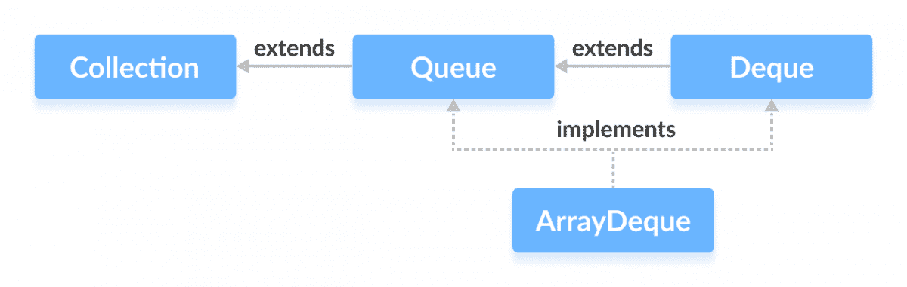

# Java ArrayDeque

> 原文： [https://www.programiz.com/java-programming/arraydeque](https://www.programiz.com/java-programming/arraydeque)

#### 在本教程中，我们将借助示例学习 ArrayDeque 类及其方法。 此外，我们还将学习使用数组双端队列来实现堆栈。

在 Java 中，我们可以使用`ArrayDeque`类使用数组实现队列和双端队列数据结构。

* * *

## 由 ArrayDeque 实现的接口

`ArrayDeque`类实现以下两个接口：

*   [Java 队列接口](https://www.programiz.com/java-programming/queue "Java Queue Interface")
*   [Java 双端队列接口](https://www.programiz.com/java-programming/deque "Java Deque Interface")



* * *

## 创建 ArrayDeque

为了创建数组双端队列，我们​​必须导入`java.util.ArrayDeque`包。

这是我们可以用 Java 创建数组双端队列的方法：

```java
ArrayDeque<Type> animal = new ArrayDeque<>(); 
```

在此，`类型`表示阵列双端队列的类型。 例如，

```java
// Creating String type ArrayDeque
ArrayDeque<String> animals = new ArrayDeque<>();

// Creating Integer type ArrayDeque
ArrayDeque<Integer> age = new ArrayDeque<>(); 
```

* * *

## ArrayDeque 方法

`ArrayDeque`类提供了`Queue`和`Deque`接口中存在的所有方法的实现。

* * *

### 将元素插入双端队列

**1.使用 add（），addFirst（）和 addLast（）添加元素**

*   `add()`-在数组双端队列的末尾插入指定的元素
*   `addFirst()`-将指定的元素插入数组双端队列的开头
*   `addLast()`-在数组双端队列的末尾插入指定的内容（相当于`add()`）

**注意：**如果数组双端队列已满，则所有这些方法`add()`，`addFirst()`和`addLast()`都会抛出`IllegalStateException`。

例如，

```java
import java.util.ArrayDeque;

class Main {
    public static void main(String[] args) {
        ArrayDeque<String> animals= new ArrayDeque<>();

        // Using add()
        animals.add("Dog");

        // Using addFirst()
        animals.addFirst("Cat");

        // Using addLast()
        animals.addLast("Horse");
        System.out.println("ArrayDeque: " + animals);
    }
} 
```

**输出**

```java
ArrayDeque: [Cat, Dog, Horse] 
```

**2.使用 offer（），offerFirst（）和 offerLast（）插入元素**

*   `offer()`-在数组双端队列的末尾插入指定的元素
*   `offerFirst()`-将指定的元素插入数组双端队列的开头
*   `offerLast()`-在数组双端队列的末尾插入指定的元素

**注意：如果成功插入元素，则** `offer()`，`offerFirst()`和`offerLast()`返回`true`； 如果数组双端队列已满，则这些方法返回`false`。

For example,

```java
import java.util.ArrayDeque;

class Main {
    public static void main(String[] args) {
        ArrayDeque<String> animals= new ArrayDeque<>();
        // Using offer()
        animals.offer("Dog");

        // Using offerFirst()
        animals.offerFirst("Cat");

        // Using offerLast()
        animals.offerLast("Horse");
        System.out.println("ArrayDeque: " + animals);
    }
} 
```

**Output**

```java
ArrayDeque: [Cat, Dog, Horse] 
```

**注意：**如果阵列双端队列已满

*   `add()`方法将引发异常
*   `offer()`方法返回`false`

* * *

### 访问 ArrayDeque 元素

**1.使用 getFirst（）和 getLast（）访问元素**

*   `getFirst()`-返回数组双端队列的第一个元素
*   `getLast()`-返回数组双端队列的最后一个元素

**注意：**如果数组双端队列为空，则`getFirst()`和`getLast()`抛出`NoSuchElementException`。

For example,

```java
import java.util.ArrayDeque;

class Main {
    public static void main(String[] args) {
        ArrayDeque<String> animals= new ArrayDeque<>();
        animals.add("Dog");
        animals.add("Cat");
        animals.add("Horse");
        System.out.println("ArrayDeque: " + animals);

        // Get the first element
        String firstElement = animals.getFirst();
        System.out.println("First Element: " + firstElement);

        // Get the last element
        String lastElement = animals.getLast();
        System.out.println("Last Element: " + lastElement);
    }
} 
```

**Output**

```java
ArrayDeque: [Dog, Cat, Horse]
First Element: Dog
Last Element: Horse 
```

**2.使用 peek（），peekFirst（）和 peekLast（）方法访问元素**

*   `peek()`-返回数组双端队列的第一个元素
*   `peekFirst()`-返回数组双端队列的第一个元素（相当于`peek()`）
*   `peekLast()`-返回数组双端队列的最后一个元素

For example,

```java
import java.util.ArrayDeque;

class Main {
    public static void main(String[] args) {
        ArrayDeque<String> animals= new ArrayDeque<>();
        animals.add("Dog");
        animals.add("Cat");
        animals.add("Horse");
        System.out.println("ArrayDeque: " + animals);

        // Using peek()
        String element = animals.peek();
        System.out.println("Head Element: " + element);

        // Using peekFirst()
        String firstElement = animals.peekFirst();
        System.out.println("First Element: " + firstElement);

        // Using peekLast
        String lastElement = animals.peekLast();
        System.out.println("Last Element: " + lastElement);
    }
} 
```

**Output**

```java
ArrayDeque: [Dog, Cat, Horse]
Head Element: Dog
First Element: Dog
Last Element: Horse 
```

**注意：**如果数组双端队列为空，则`peek()`，`peekFirst()`和`getLast()`抛出`NoSuchElementException`。

* * *

### 删除 ArrayDeque 元素

**1.使用 remove（），removeFirst（）和 removeLast（）方法删除元素**

*   `remove()`-从数组双端队列的第一个元素中返回并删除一个元素
*   `remove(element)`-从数组双端队列的头部返回并删除指定的元素
*   `removeFirst()`-返回并从数组双端队列中删除第一个元素（等效于`remove()`）
*   `removeLast()`-返回并删除数组双端队列中的最后一个元素

**注意：**如果数组双端队列为空，则`remove()`，`removeFirst()`和`removeLast()`方法将引发异常。 另外，如果找不到该元素，则`remove(element)`会引发异常。

For example,

```java
import java.util.ArrayDeque;

class Main {
    public static void main(String[] args) {
        ArrayDeque<String> animals= new ArrayDeque<>();
        animals.add("Dog");
        animals.add("Cat");
        animals.add("Cow");
        animals.add("Horse");
        System.out.println("ArrayDeque: " + animals);

        // Using remove()
        String element = animals.remove();
        System.out.println("Removed Element: " + element);

        System.out.println("New ArrayDeque: " + animals);

        // Using removeFirst()
        String firstElement = animals.removeFirst();
        System.out.println("Removed First Element: " + firstElement);

        // Using removeLast()
        String lastElement = animals.removeLast();
        System.out.println("Removed Last Element: " + lastElement);
    }
} 
```

**Output**

```java
ArrayDeque: [Dog, Cat, Cow, Horse]
Removed Element: Dog
New ArrayDeque: [Cat, Cow, Horse]
Removed First Element: Cat
Removed Last Element: Horse 
```

**2.使用 poll（），pollFirst（）和 pollLast（）方法删除元素**

*   `poll()`-返回并删除数组双端队列的第一个元素
*   `pollFirst()`-返回并删除数组双端队列的第一个元素（相当于`poll()`）
*   `pollLast()`-返回并删除数组双端队列的最后一个元素

**注意：**如果数组双端队列为空，则如果找不到该元素，则`poll()`，`pollFirst()`和`pollLast()`返回`null`。

For example,

```java
import java.util.ArrayDeque;

class Main {
    public static void main(String[] args) {
        ArrayDeque<String> animals= new ArrayDeque<>();
        animals.add("Dog");
        animals.add("Cat");
        animals.add("Cow");
        animals.add("Horse");
        System.out.println("ArrayDeque: " + animals);

        // Using poll()
        String element = animals.poll();
        System.out.println("Removed Element: " + element);
        System.out.println("New ArrayDeque: " + animals);

        // Using pollFirst()
        String firstElement = animals.pollFirst();
        System.out.println("Removed First Element: " + firstElement);

        // Using pollLast()
        String lastElement = animals.pollLast();
        System.out.println("Removed Last Element: " + lastElement);
    }
} 
```

**Output**

```java
ArrayDeque: [Dog, Cat, Cow, Horse]
Removed Element: Dog
New ArrayDeque: [Cat, Cow, Horse]
Removed First Element: Cat
Removed Last Element: Horse 
```

**3.删除元素：使用 clear（）方法**

要从数组双端队列中删除所有元素，我们使用`clear()`方法。 例如，

```java
import java.util.ArrayDeque;

class Main {
    public static void main(String[] args) {
        ArrayDeque<String> animals= new ArrayDeque<>();
        animals.add("Dog");
        animals.add("Cat");
        animals.add("Horse");
        System.out.println("ArrayDeque: " + animals);

        // Using clear()
        animals.clear();

        System.out.println("New ArrayDeque: " + animals);
    }
} 
```

**Output**

```java
ArrayDeque: [Dog, Cat, Horse]
New ArrayDeque: [] 
```

* * *

### 迭代 ArrayDeque

*   `iterator()`-返回可用于遍历数组双端队列的迭代器
*   `descendingIterator()`-返回一个迭代器，该迭代器可用于以相反顺序遍历数组双端队列

为了使用这些方法，我们必须导入`java.util.Iterator`包。 例如，

```java
import java.util.ArrayDeque;
import java.util.Iterator;

class Main {
    public static void main(String[] args) {
        ArrayDeque<String> animals= new ArrayDeque<>();
        animals.add("Dog");
        animals.add("Cat");
        animals.add("Horse");

        System.out.print("ArrayDeque: ");

        // Using iterator()
        Iterator<String> iterate = animals.iterator();
        while(iterate.hasNext()) {
            System.out.print(iterate.next());
            System.out.print(", ");
        }

        System.out.print("\nArrayDeque in reverse order: ");
        // Using descendingIterator()
        Iterator<String> desIterate = animals.descendingIterator();
        while(desIterate.hasNext()) {
            System.out.print(desIterate.next());
            System.out.print(", ");
        }
    }
} 
```

**Output**

```java
ArrayDeque: [Dog, Cat, Horse]
ArrayDeque in reverse order: [Horse, Cat, Dog] 
```

* * *

## 其他方法

| 方法 | 内容描述 |
| `element()` | 从数组双端队列的头部返回一个元素。 |
| `contains(element)` | 在数组双端队列中搜索指定的元素。
如果找到该元素，则返回`true`，否则返回`false`。 |
| `size()` | 返回数组双端队列的长度。 |
| `toArray()` | 将数组双端队列转换为数组并返回。 |
| `clone()` | 创建数组双端队列的副本并返回它。 |

* * *

## ArrayDeque 作为堆栈

要在 Java 中实现 **LIFO（后进先出）**堆栈，建议在[堆栈类](/java-programming/stack "Java Stack Class")上使用双端队列。`ArrayDeque`类可能比`Stack`类快。

`ArrayDeque`提供了以下可用于实现堆栈的方法。

*   `push()`-将元素添加到堆栈顶部
*   `peek()`-从堆栈顶部返回一个元素
*   `pop()`-返回并从堆栈顶部删除元素

For example,

```java
import java.util.ArrayDeque;

class Main {
    public static void main(String[] args) {
        ArrayDeque<String> stack = new ArrayDeque<>();

        // Add elements to stack
        stack.push("Dog");
        stack.push("Cat");
        stack.push("Horse");
        System.out.println("Stack: " + stack);

        // Access element from top of stack
        String element = stack.peek();
        System.out.println("Accessed Element: " + element);

        // Remove elements from top of stack
        String remElement = stack.pop();
        System.out.println("Removed element: " + remElement);
    }
} 
```

**Output**

```java
Stack: [Horse, Cat, Dog]
Accessed Element: Horse
Removed Element: Horse

```

* * *

## ArrayDeque 与 LinkedList 类

`ArrayDeque`和 [Java LinkedList](/java-programming/linkedlist "Java LinkedList") 都实现了`Deque`接口。 但是，它们之间存在一些差异。

*   `LinkedList`支持`null`元素，而`ArrayDeque`不支持。
*   链表中的每个节点都包含指向其他节点的链接。 这就是`LinkedList`比`ArrayDeque`需要更多存储空间的原因。
*   如果要实现队列或双端队列数据结构，则`ArrayDeque`可能比`LinkedList`快。