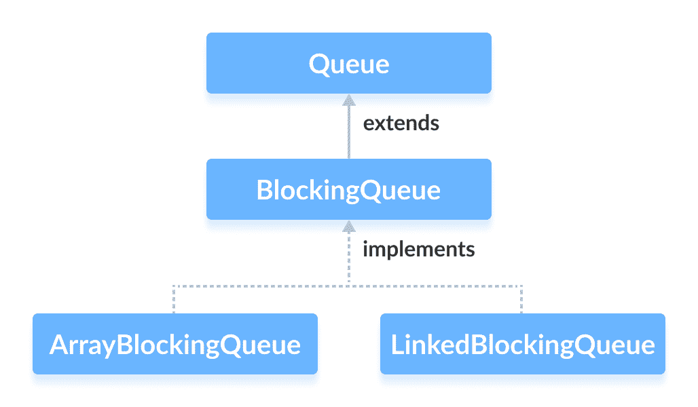

# Java `ArrayBlockingQueue`

> 原文： [https://www.programiz.com/java-programming/arrayblockingqueue](https://www.programiz.com/java-programming/arrayblockingqueue)

#### 在本教程中，我们将借助示例学习`ArrayBlockingQueue`类及其方法。

Java 集合框架的`ArrayBlockingQueue`类使用数组提供阻塞队列实现。

它实现了 [Java `BlockingQueue`接口](/java-programming/blockingqueue "Java BlockingQueue Interface")。



* * *

## 创建`ArrayBlockingQueue`

为了创建一个数组阻止队列，我们​​必须导入`java.util.concurrent.ArrayBlockingQueue`包。

导入包后，可以使用以下方法在 Java 中创建数组阻止队列：

```java
ArrayBlockingQueue<Type> animal = new ArrayBlockingQueue<>(int capacity); 
```

这里，

*   `Type`-数组阻止队列的类型
*   `容量`-数组阻塞队列的大小

例如，

```java
// Creating String type ArrayBlockingQueue with size 5
ArrayBlockingQueue<String> animals = new ArrayBlockingQueue<>(5);

// Creating Integer type ArrayBlockingQueue with size 5
ArrayBlockingQueue<Integer> age = new ArrayBlockingQueue<>(5); 
```

**注意**：必须提供数组的大小。

* * *

## `ArrayBlockingQueue`的方法

`ArrayBlockingQueue`类提供`BlockingQueue`接口中所有方法的实现。

这些方法用于从数组阻止队列中插入，访问和删除元素。

另外，我们还将学习两种支持数组阻塞队列中阻塞操作的方法`put()`和`take()`。

这两种方法将数组阻塞队列与其他典型队列区分开。

* * *

### 插入元素

*   `add()`-将指定的元素插入数组阻止队列。 如果队列已满，它将引发异常。
*   `offer()`-将指定的元素插入数组阻止队列。 如果队列已满，则返回`false`。

例如：

```java
import java.util.concurrent.ArrayBlockingQueue;

class Main {
    public static void main(String[] args) {
        ArrayBlockingQueue<String> animals = new ArrayBlockingQueue<>(5);

        // Using add()
        animals.add("Dog");
        animals.add("Cat");

        // Using offer()
        animals.offer("Horse");
        System.out.println("ArrayBlockingQueue: " + animals);
    }
} 
```

**输出**

```java
ArrayBlockingQueue: [Dog, Cat, Horse] 
```

* * *

### 访问元素

*   `peek()`-从数组阻止队列的前面返回一个元素。 如果队列为空，则返回`null`。
*   `iterator()`-返回一个迭代器对象，以顺序访问数组阻止队列中的元素。 如果队列为空，则抛出异常。 我们必须导入`java.util.Iterator`包才能使用它。

例如：

```java
import java.util.concurrent.ArrayBlockingQueue;
import java.util.Iterator;

class Main {
    public static void main(String[] args) {
        ArrayBlockingQueue<String> animals = new ArrayBlockingQueue<>(5);

        // Add elements
        animals.add("Dog");
        animals.add("Cat");
        animals.add("Horse");
        System.out.println("ArrayBlockingQueue: " + animals);

        // Using peek()
        String element = animals.peek();
        System.out.println("Accessed Element: " + element);

        // Using iterator()
        Iterator<String> iterate = animals.iterator();
        System.out.print("ArrayBlockingQueue Elements: ");

        while(iterate.hasNext()) {
            System.out.print(iterate.next());
            System.out.print(", ");
        }
    }
} 
```

**输出**：

```java
ArrayBlockingQueue: [Dog, Cat, Horse]
Accessed Element: Dog
ArrayBlockingQueue Elements: Dog, Cat, Horse, 
```

* * *

### 删除元素

*   `remove()`-返回并从数组阻止队列中删除指定的元素。 如果队列为空，则抛出异常。
*   `poll()`-返回并从数组阻止队列中删除指定的元素。 如果队列为空，则返回`null`。
*   `clear()`-从数组阻止队列中删除所有元素。

例如：

```java
import java.util.concurrent.ArrayBlockingQueue;

class Main {
    public static void main(String[] args) {
        ArrayBlockingQueue<String> animals = new ArrayBlockingQueue<>(5);

        animals.add("Dog");
        animals.add("Cat");
        animals.add("Horse");
        System.out.println("ArrayBlockingQueue: " + animals);

        // Using remove()
        String element1 = animals.remove();
        System.out.println("Removed Element:");
        System.out.println("Using remove(): " + element1);

        // Using poll()
        String element2 = animals.poll();
        System.out.println("Using poll(): " + element2);

        // Using clear()
        animals.clear();
        System.out.println("Updated ArrayBlockingQueue: " + animals);
    }
} 
```

**输出**：

```java
ArrayBlockingQueue: [Dog, Cat, Horse]
Removed Elements:
Using remove(): Dog
Using poll(): Cat
Updated ArrayBlockingQueue: [] 
```

* * *

## `put()`和`take()`方法

在多线程进程中，我们可以使用`put()`和`take()`阻止一个线程的操作，使其与另一个线程同步。 这些方法将等待直到可以成功执行。

* * *

### `put()`方法

要将元素添加到数组阻塞队列的末尾，可以使用`put()`方法。

如果数组阻塞队列已满，它将等待直到数组阻塞队列中有空间添加元素。

例如：

```java
import java.util.concurrent.ArrayBlockingQueue;

class Main {
    public static void main(String[] args) {
        ArrayBlockingQueue<String> animals = new ArrayBlockingQueue<>(5);

       try {
        // Add elements to animals
           animals.put("Dog");
           animals.put("Cat");
           System.out.println("ArrayBlockingQueue: " + animals);
        }
        catch(Exception e) {
            System.out.println(e);
        }
    }
} 
```

**输出**：

```java
ArrayBlockingQueue: [Dog, Cat] 
```

在此，如果`InterruptedException`方法在等待时被中断，则可能会抛出`InterruptedException`。 因此，我们必须将其封装在`try..catch`块内。

* * *

### `take()`方法

要从数组阻塞队列的前面返回并删除一个元素，我们可以使用`take()`方法。

如果数组阻塞队列为空，它将等待，直到数组阻塞队列中有要删除的元素为止。

例如：

```java
import java.util.concurrent.ArrayBlockingQueue;

class Main {
    public static void main(String[] args) {
        ArrayBlockingQueue<String> animals = new ArrayBlockingQueue<>(5);

       try {
           //Add elements to animals
           animals.put("Dog");
           animals.put("Cat");
           System.out.println("ArrayBlockingQueue: " + animals);

           // Remove an element
           String element = animals.take();
           System.out.println("Removed Element: " + element);
        }
        catch(Exception e) {
            System.out.println(e);
        }
    }
} 
```

**输出**：

```java
ArrayBlockingQueue: [Dog, Cat]
Removed Element: Dog 
```

在这里，如果`take()`方法在等待时被中断，则会抛出`InterrupedException`。 因此，我们必须将其封装在[H​​TG2]块内。

* * *

## 其他方法

| 方法 | 内容描述 |
| `contains(element)` | 在数组阻止队列中搜索指定的元素。 <be>如果找到该元素，则返回`true`，否则返回`false`。</be> |
| `size()` | 返回数组阻塞队列的长度。 |
| `toArray()` | 将数组阻塞队列转换为数组并返回它。 |
| `toString()` | 将数组阻止队列转换为字符串 |

* * *

## 为什么要使用`ArrayBlockingQueue`？

`ArrayBlockingQueue`使用数组作为其内部存储。

它被视为**线程安全的**集合。 因此，它通常用于多线程应用程序中。

假设一个线程正在将元素插入队列，而另一个线程正在从队列中删除元素。

现在，如果第一个线程比第二个线程慢，那么数组阻塞队列可使第二个线程等待，直到第一个线程完成其操作。