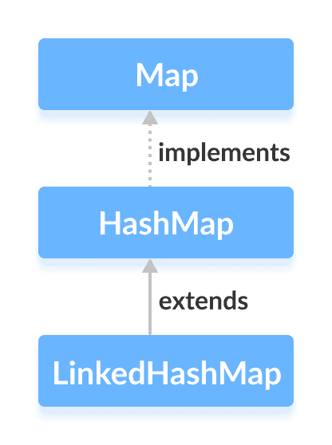

# Java LinkedHashMap

> 原文： [https://www.programiz.com/java-programming/linkedhashmap](https://www.programiz.com/java-programming/linkedhashmap)

#### 在本教程中，我们将借助示例学习 Java LinkedHashMap 类及其操作。

Java 集合框架的`LinkedHashMap`类提供 [Map 接口](/java-programming/map "Java Map interface")的哈希表和链表实现。

`LinkedHashMap`接口扩展了 [HashMap](/java-programming/hashmap) 类，以将其条目存储在哈希表中。 它在内部维护所有条目之间的双向链接列表，以对条目进行排序。



* * *

## 创建一个 LinkedHashMap

为了创建链接的哈希图，我们必须首先导入`java.util.LinkedHashMap`包。 导入程序包后，可以使用以下方法在 Java 中创建链接的哈希表。

```java
// LinkedHashMap with initial capacity 8 and load factor 0.6
LinkedHashMap<Key, Value> numbers = new LinkedHashMap<>(8, 0.6f); 
```

在上面的代码中，我们创建了一个名为`数字`的链接哈希图。

这里，

*   `键`-用于关联地图中每个元素（值）的唯一标识符
*   `值`-由映射中的键关联的元素

注意部分`new LinkedHashMap<>(8, 0.6)`。 在此，第一个参数是**容量**，第二个参数是 **loadFactor** 。

*   **容量**-此链接的哈希图的容量为 8。意味着，它可以存储 8 个条目。
*   **loadFactor** -此链接的哈希图的负载因子为 0.6。 这意味着，只要我们的哈希图填充了 60%，条目就会被移到新哈希表中，该哈希表的大小是原始哈希表的两倍。

**默认容量和负载系数**

无需定义其容量和负载因子就可以创建链接的哈希图。 例如，

```java
//LinkedHashMap with default capacity and load factor
LinkedHashMap<Key, Value> numbers1 = new LinkedHashMap<>(); 
```

默认，

*   链接的哈希图的容量将为 16
*   负载系数将为 0.75

**注意**：`LinkedHashMap`类还允许我们定义其条目的顺序。 例如

```java
// LinkedHashMap with specified order
LinkedHashMap<Key, Value> numbers2 = new LinkedHashMap<>(capacity, loadFactor, accessOrder); 
```

此处，`accessOrder`是布尔值。 其默认值为`false`。 在这种情况下，链接的哈希图中的条目将根据其插入顺序进行排序。

但是，如果将`true`作为`accessOrder`传递，则链接的哈希图中的条目将按从最近访问到最近访问的顺序排序。

* * *

## 从其他地图创建 LinkedHashMap

这是我们如何创建一个包含其他地图所有元素的链接哈希表。

```java
import java.util.LinkedHashMap;

class Main {
    public static void main(String[] args) {
        // Creating a LinkedHashMap of even numbers
        LinkedHashMap<String, Integer> evenNumbers = new LinkedHashMap<>();
        evenNumbers.put("Two", 2);
        evenNumbers.put("Four", 4);
        System.out.println("LinkedHashMap1: " + evenNumbers);

        // Creating a LinkedHashMap from other LinkedHashMap
        LinkedHashMap<String, Integer> numbers = new LinkedHashMap<>(evenNumbers);
        numbers.put("Three", 3);
        System.out.println("LinkedHashMap2: " + numbers);
    }
} 
```

**输出**

```java
LinkedHashMap1: {Two=2, Four=4}
LinkedHashMap2: {Two=2, Four=4, Three=3} 
```

* * *

## LinkedHashMap 的方法

`LinkedHashMap`类提供允许我们在地图上执行各种操作的方法。

* * *

## 将元素插入 LinkedHashMap

*   `put()`-将指定的键/值映射插入到映射中
*   `putAll()`-将指定映射中的所有条目插入此映射中
*   `putIfAbsent()`-如果映射中不存在指定的键，则将指定的键/值映射插入到映射中

例如，

```java
 import java.util.LinkedHashMap;

class Main {
    public static void main(String[] args) {
        // Creating LinkedHashMap of even numbers
        LinkedHashMap<String, Integer> evenNumbers = new LinkedHashMap<>();

        // Using put()
        evenNumbers.put("Two", 2);
        evenNumbers.put("Four", 4);
        System.out.println("Original LinkedHashMap: " + evenNumbers);

        // Using putIfAbsent()
        evenNumbers.putIfAbsent("Six", 6);
        System.out.println("Updated LinkedHashMap(): " + evenNumbers);

        //Creating LinkedHashMap of numbers
        LinkedHashMap<String, Integer> numbers = new LinkedHashMap<>();
        numbers.put("One", 1);

        // Using putAll()
        numbers.putAll(evenNumbers);
        System.out.println("New LinkedHashMap: " + numbers);
    }
} 
```

**Output**

```java
Original LinkedHashMap: {Two=2, Four=4}
Updated LinkedHashMap: {Two=2, Four=4, Six=6}
New LinkedHashMap: {One=1, Two=2, Four=4, Six=6} 
```

* * *

## 访问 LinkedHashMap 元素

**1.使用 entrySet（），keySet（）和 values（）**

*   `entrySet()`-返回一组所有键/值映射的映射
*   `keySet()`-返回地图的所有键的集合
*   `values()`-返回一组所有映射值

For example,

```java
import java.util.LinkedHashMap;

class Main {
    public static void main(String[] args) {
        LinkedHashMap<String, Integer> numbers = new LinkedHashMap<>();

        numbers.put("One", 1);
        numbers.put("Two", 2);
        numbers.put("Three", 3);
        System.out.println("LinkedHashMap: " + numbers);

        // Using entrySet()
        System.out.println("Key/Value mappings: " + numbers.entrySet());

        // Using keySet()
        System.out.println("Keys: " + numbers.keySet());

        // Using values()
        System.out.println("Values: " + numbers.values());
    }
} 
```

**Output**

```java
LinkedHashMap: {One=1, Two=2, Three=3}
Key/Value mappings: [One=1, Two=2, Three=3]
Keys: [One, Two, Three]
Values: [1, 2, 3] 
```

**2.使用 get（）和 getOrDefault（）**

*   `get()`-返回与指定键关联的值。 如果找不到密钥，则返回`null`。
*   `getOrDefault()`-返回与指定键关联的值。 如果找不到该密钥，它将返回指定的默认值。

For example,

```java
import java.util.LinkedHashMap;

class Main {
    public static void main(String[] args) {

        LinkedHashMap<String, Integer> numbers = new LinkedHashMap<>();
        numbers.put("One", 1);
        numbers.put("Two", 2);
        numbers.put("Three", 3);
        System.out.println("LinkedHashMap: " + numbers);

        // Using get()
        int value1 = numbers.get("Three");
        System.out.println("Returned Number: " + value1);

        // Using getOrDefault()
        int value2 = numbers.getOrDefault("Five", 5);
        System.out.println("Returned Number: " + value2);
    }
} 
```

**Output**

```java
LinkedHashMap: {One=1, Two=2, Three=3}
Returned Number: 3
Returned Number: 5 
```

* * *

## 删除了 LinkedHashMap 元素

*   `remove(key)`-返回并从映射中删除与指定的`键`相关的条目
*   `remove(key, value)`-仅当将指定的`键`映射为指定的`值`并返回布尔值时，才从映射中删除条目

For example,

```java
import java.util.LinkedHashMap;

class Main {
    public static void main(String[] args) {

        LinkedHashMap<String, Integer> numbers = new LinkedHashMap<>();
        numbers.put("One", 1);
        numbers.put("Two", 2);
        numbers.put("Three", 3);
        System.out.println("LinkedHashMap: " + numbers);

        // remove method with single parameter
        int value = numbers.remove("Two");
        System.out.println("Removed value: " + value);

        // remove method with two parameters
        boolean result = numbers.remove("Three", 3);
        System.out.println("Is the entry Three removed? " + result);

        System.out.println("Updated LinkedHashMap: " + numbers);
    }
} 
```

**Output**

```java
LinkedHashMap: {One=1, Two=2, Three=3}
Removed value: 2
Is the entry {Three=3} removed? True
Updated LinkedHashMap: {One=1} 
```

* * *

## LinkedHashMap 的其他方法

| 方法 | 描述 |
| `clear()` | 从地图中删除所有条目 |
| `containsKey()` | 检查地图是否包含指定的键并返回布尔值 |
| `containsValue()` | 检查地图是否包含指定的值并返回布尔值 |
| `size()` | 返回地图的大小 |
| `isEmpty()` | 检查地图是否为空，并返回布尔值 |

* * *

## LinkedHashMap 与。 哈希图

`LinkedHashMap`和`HashMap`都实现`Map`接口。 但是，它们之间存在一些差异。

*   `LinkedHashMap`在内部维护一个双向链接列表。 因此，它保持其元素的插入顺序。
*   `LinkedHashMap`类比`HashMap`需要更多的存储空间。 这是因为`LinkedHashMap`内部维护链接列表。
*   `LinkedHashMap`的性能比`HashMap`慢。