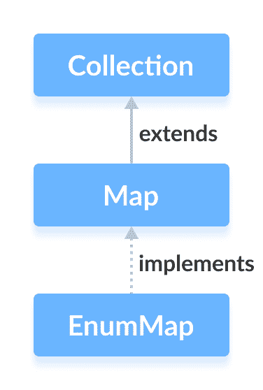

# Java EnumMap

> 原文： [https://www.programiz.com/java-programming/enummap](https://www.programiz.com/java-programming/enummap)

#### 在本教程中，我们将借助示例学习 Java EnumMap 类及其操作。

Java 集合框架的`EnumMap`类为枚举的元素提供了映射实现。

在`EnumMap`中，枚举元素用作**键**。 它实现了 [Map 接口](/java-programming/map "Java Map Interface")。



在学习`EnumMap`之前，请确保了解 [Java 枚举](/java-programming/enums "Java Enums")。

* * *

## 创建一个 EnumMap

为了创建一个枚举映射，我们必须首先导入`java.util.EnumMap`包。 导入包后，可以使用以下方法在 Java 中创建枚举映射。

```java
enum Size {
    SMALL, MEDIUM, LARGE, EXTRALARGE
}

EnumMap<Size, Integer> sizes = new EnumMap<>(Size.class); 
```

在上面的示例中，我们创建了一个名为`，大小为`的枚举映射。

这里，

*   `size`-映射到值的枚举的**键**
*   `整数`-与相应键关联的枚举映射的**值**

* * *

## EnumMap 的方法

`EnumMap`类提供了允许我们在枚举映射上执行各种元素的方法。

* * *

## 将元素插入 EnumMap

*   `put()`-将指定的键/值映射（条目）插入到枚举映射中
*   `putAll()`-将指定映射的所有条目插入此映射

例如，

```java
import java.util.EnumMap;

class Main {

    enum Size {
        SMALL, MEDIUM, LARGE, EXTRALARGE
    }
    public static void main(String[] args) {

        // Creating an EnumMap of the Size enum
        EnumMap<Size, Integer> sizes1 = new EnumMap<>(Size.class);

        // Using the put() Method
        sizes1.put(Size.SMALL, 28);
        sizes1.put(Size.MEDIUM, 32);
        System.out.println("EnumMap1: " + sizes1);

        EnumMap<Size, Integer> sizes2 = new EnumMap<>(Size.class);

        // Using the putAll() Method
        sizes2.putAll(sizes1);
        sizes2.put(Size.LARGE, 36);
        System.out.println("EnumMap2: " + sizes2);
    }
} 
```

**输出**

```java
EnumMap1: {SMALL=28, MEDIUM=32}
EnumMap2: {SMALL=28, MEDIUM=32, LARGE=36} 
```

在上面的示例中，我们使用`putAll()`方法将枚举映射`size1`的所有元素插入到`size2`的枚举图中。

也可以使用`putAll()`将元素从其他映射（例如`HashMap`，`TreeMap`等）插入到枚举映射中。 但是，所有映射都应具有相同的枚举类型。

* * *

## 访问 EnumMap 元素

**1.使用 entrySet（），keySet（）和 values（）**

*   `entrySet()`-返回一个枚举映射的所有键/值映射（条目）的集合
*   `keySet()`-返回一个枚举映射的所有键的集合
*   `values()`-返回一个枚举映射的所有值的集合

For example,

```java
import java.util.EnumMap;

class Main {

    enum Size {
        SMALL, MEDIUM, LARGE, EXTRALARGE
    }
    public static void main(String[] args) {

        // Creating an EnumMap of the Size enum
        EnumMap<Size, Integer> sizes = new EnumMap<>(Size.class);
        sizes.put(Size.SMALL, 28);
        sizes.put(Size.MEDIUM, 32);
        sizes.put(Size.LARGE, 36);
        sizes.put(Size.EXTRALARGE, 40);
        System.out.println("EnumMap: " + sizes);

        // Using the entrySet() Method
        System.out.println("Key/Value mappings: " + sizes.entrySet());

        // Using the keySet() Method
        System.out.println("Keys: " + sizes.keySet());

        // Using the values() Method
        System.out.println("Values: " + sizes.values());
    }
} 
```

**Output**

```java
EnumMap: {SMALL=28, MEDIUM=32, LARGE=36, EXTRALARGE=40}
Key/Value mappings: [SMALL=28, MEDIUM=32, LARGE=36, EXTRALARGE=40]
Keys: [SMALL, MEDIUM, LARGE, EXTRALARGE]
Values: [28, 32, 36, 40] 
```

**2.使用 get（）方法**

`get()`方法返回与指定键关联的值。 如果找不到指定的密钥，则返回`null`。

For example,

```java
import java.util.EnumMap;

class Main {

    enum Size {
        SMALL, MEDIUM, LARGE, EXTRALARGE
    }
    public static void main(String[] args) {

        // Creating an EnumMap of the Size enum
        EnumMap<Size, Integer> sizes = new EnumMap<>(Size.class);
        sizes.put(Size.SMALL, 28);
        sizes.put(Size.MEDIUM, 32);
        sizes.put(Size.LARGE, 36);
        sizes.put(Size.EXTRALARGE, 40);
        System.out.println("EnumMap: " + sizes);

        // Using the get() Method
        int value = sizes.get(Size.MEDIUM);
        System.out.println("Value of MEDIUM: " + value);
    }
} 
```

**Output**

```java
EnumMap: {SMALL=28, MEDIUM=32, LARGE=36, EXTRALARGE=40}
Value of MEDIUM: 32 
```

* * *

## 删除 EnumMap 元素

*   `remove(key)`-返回并从映射中删除与指定键关联的条目
*   `remove(key, value)`-仅当指定键映射到指定值并返回布尔值时，才从映射中删除条目

For example,

```java
import java.util.EnumMap;

class Main {

    enum Size {
        SMALL, MEDIUM, LARGE, EXTRALARGE
    }
    public static void main(String[] args) {

        // Creating an EnumMap of the Size enum
        EnumMap<Size, Integer> sizes = new EnumMap<>(Size.class);
        sizes.put(Size.SMALL, 28);
        sizes.put(Size.MEDIUM, 32);
        sizes.put(Size.LARGE, 36);
        sizes.put(Size.EXTRALARGE, 40);
        System.out.println("EnumMap: " + sizes);

        // Using the remove() Method
        int value = sizes.remove(Size.MEDIUM);
        System.out.println("Removed Value: " + value);

        boolean result = sizes.remove(Size.SMALL, 28);
        System.out.println("Is the entry {SMALL=28} removed? " + result);

        System.out.println("Updated EnumMap: " + sizes);
    }
} 
```

**Output**

```java
EnumMap: {SMALL=28, MEDIUM=32, LARGE=36, EXTRALARGE=40}
Removed Value: 32
Is the entry {SMALL=28} removed? True
Updated EnumMap: {LARGE=36, EXTRALARGE=40} 
```

* * *

## 替换 EnumMap 元素

*   `replace(key, value)`-用新的`值`替换与指定的`键`相关的值
*   `replace(key, old, new)`-仅当`旧`值已与指定的`键`关联时，才用`新`值替换`旧`值。
*   `replaceAll(function)`-用指定的`函数`的结果替换映射的每个值

```java
import java.util.EnumMap;

class Main {

    enum Size {
        SMALL, MEDIUM, LARGE, EXTRALARGE
    }
    public static void main(String[] args) {

        // Creating an EnumMap of the Size enum
        EnumMap<Size, Integer> sizes = new EnumMap<>(Size.class);
        sizes.put(Size.SMALL, 28);
        sizes.put(Size.MEDIUM, 32);
        sizes.put(Size.LARGE, 36);
        sizes.put(Size.EXTRALARGE, 40);
        System.out.println("EnumMap: " + sizes);

        // Using the replace() Method
        sizes.replace(Size.MEDIUM, 30);
        sizes.replace(Size.LARGE, 36, 34);
        System.out.println("EnumMap using replace(): " + sizes);

        // Using the replaceAll() Method
        sizes.replaceAll((key, oldValue) -> oldValue + 3);
        System.out.println("EnumMap using replaceAll(): " + sizes);
    }
} 
```

**Output**

```java
EnumMap: {SMALL=28, MEDIUM=32, LARGE=36, EXTRALARGE=40}
EnumMap using replace(): {SMALL=28, MEDIUM=30, LARGE=34, EXTRALARGE=40}
EnumMap using replaceAll(): {SMALL=31, MEDIUM=33, LARGE=37, EXTRALARGE=43} 
```

在上面的程序中，请注意以下语句

```java
sizes.replaceAll((key, oldValue) -> oldValue + 3); 
```

在此，该方法访问地图的所有条目。 然后，它将所有值替换为 [lambda 表达式](/java-programming/lambda-expression "Java lambda")提供的新值。

* * *

## 其他方法

| 方法 | 描述 |
| `clone()` | 创建`EnumMap`的副本 |
| `containsKey()` | 在`EnumMap`中搜索指定的键，并返回布尔结果 |
| `containsValue()` | 在`EnumMap`中搜索指定的值并返回布尔结果 |
| `size()` | 返回`EnumMap`的大小 |
| `clear()` | 从`EnumMap`中删除所有条目 |

* * *

## EnumSet 与 枚举地图

[EnumSet](/java-programming/enumset "Java EnumSet Class") 和`EnumMap`类都提供用于存储枚举值的数据结构。 但是，它们之间存在一些主要差异。

*   枚举集在内部以位序列表示，而枚举图在内部以数组表示。
*   枚举集是使用其预定义方法（例如`allOf()`，`noneOf()`，`of()`等）创建的。但是，枚举映射是使用其构造器创建的。

* * *

## 可克隆和可序列化的接口

`EnumMap`类还实现`Cloneable`和`Serializable`接口。

**可克隆的接口**

它允许`EnumMap`类制作该类实例的副本。

**可序列化接口**

每当需要通过网络传输 Java 对象时，就需要将对象转换为位或字节。 这是因为 Java 对象无法通过网络传输。

`Serializable`接口允许对类进行序列化。 这意味着可以将实现`Serializable`的类的对象转换为位或字节。