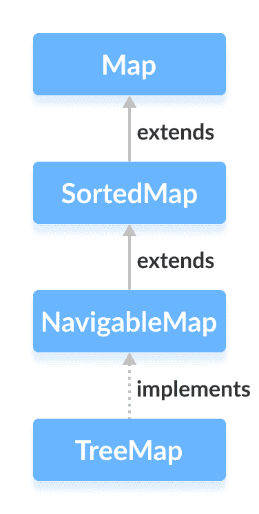

# Java TreeMap

> 原文： [https://www.programiz.com/java-programming/treemap](https://www.programiz.com/java-programming/treemap)

#### 在本教程中，我们将借助示例学习 Java `TreeMap`类及其操作。

Java 集合框架的`TreeMap`类提供树数据结构的实现。

它实现了[`NavigableMap`接口](/java-programming/navigablemap "Java NavigableMap Interface")。



* * *

## 创建一个`TreeMap`

为了创建一个`TreeMap`，我们必须首先导入`java.util.TreeMap`包。 导入包后，可以使用以下方法在 Java 中创建`TreeMap`。

```java
TreeMap<Key, Value> numbers = new TreeMap<>(); 
```

在上面的代码中，我们创建了一个名为`number`的`TreeMap`，没有任何参数。 在这种情况下，`TreeMap`中的元素会自然排序（升序）。

但是，我们可以使用`Comparator`接口自定义元素的排序。 我们将在本教程的后面部分中学习它。

这里，

*   `key`-用于关联映射中每个元素（值）的唯一标识符
*   `value`-映射中与按键相关联的元素

* * *

## `TreeMap`的方法

`TreeMap`类提供了各种方法，可让我们在映射上执行操作。

* * *

## 将元素插入`TreeMap`

*   `put()`-将指定的键/值映射（条目）插入到映射中
*   `putAll()`-将指定映射中的所有条目插入此映射中
*   `putIfAbsent()`-如果映射中不存在指定的键，则将指定的键/值映射插入到映射中

例如，

```java
import java.util.TreeMap;

class Main {
    public static void main(String[] args) {
        // Creating TreeMap of even numbers
        TreeMap<String, Integer> evenNumbers = new TreeMap<>();

        // Using put()
        evenNumbers.put("Two", 2);
        evenNumbers.put("Four", 4);

        // Using putIfAbsent()
        evenNumbers.putIfAbsent("Six", 6);
        System.out.println("TreeMap of even numbers: " + evenNumbers);

        //Creating TreeMap of numbers
        TreeMap<String, Integer> numbers = new TreeMap<>();
        numbers.put("One", 1);

        // Using putAll()
        numbers.putAll(evenNumbers);
        System.out.println("TreeMap of numbers: " + numbers);
    }
} 
```

**输出**

```java
TreeMap of even numbers: {Four=4, Six=6, Two=2}
TreeMap of numbers: {Four=4, One=1, Six=6, Two=2} 
```

* * *

## 访问`TreeMap`元素

**1.使用`entrySet()`，`keySet()`和`values()`**

*   `entrySet()`-返回树形图的所有键/值映射（条目）的集合
*   `keySet()`-返回树形图的所有键的集合
*   `values()`-返回树形图的所有图的集合

例如：

```java
import java.util.TreeMap;

class Main {
    public static void main(String[] args) {
        TreeMap<String, Integer> numbers = new TreeMap<>();

        numbers.put("One", 1);
        numbers.put("Two", 2);
        numbers.put("Three", 3);
        System.out.println("TreeMap: " + numbers);

        // Using entrySet()
        System.out.println("Key/Value mappings: " + numbers.entrySet());

        // Using keySet()
        System.out.println("Keys: " + numbers.keySet());

        // Using values()
        System.out.println("Values: " + numbers.values());
    }
} 
```

**输出**：

```java
TreeMap: {One=1, Three=3, Two=2}
Key/Value mappings: [One=1, Three=3, Two=2]
Keys: [One, Three, Two]
Values: [1, 3, 2] 
```

**2.使用`get()`和`getOrDefault()`**

*   `get()`-返回与指定键关联的值。 如果找不到密钥，则返回`null`。
*   `getOrDefault()`-返回与指定键关联的值。 如果找不到密钥，则返回指定的默认值。

例如：

```java
import java.util.TreeMap;

class Main {
    public static void main(String[] args) {

        TreeMap<String, Integer> numbers = new TreeMap<>();
        numbers.put("One", 1);
        numbers.put("Two", 2);
        numbers.put("Three", 3);
        System.out.println("TreeMap: " + numbers);

        // Using get()
        int value1 = numbers.get("Three");
        System.out.println("Using get(): " + value1);

        // Using getOrDefault()
        int value2 = numbers.getOrDefault("Five", 5);
        System.out.println("Using getOrDefault(): " + value2);
    }
} 
```

**输出**：

```java
TreeMap: {One=1, Three=3, Two=2}
Using get(): 3
Using getOrDefault(): 5 
```

在此，`getOrDefault()`方法找不到键`Five`。 因此，它返回指定的默认值`5`。

* * *

## 删除`TreeMap`元素

*   `remove(key)`-返回并从`TreeMap`中删除与指定键关联的条目
*   `remove(key, value)`-仅在指定键与指定值相关联并返回布尔值时，才从映射中删除条目

例如：

```java
import java.util.TreeMap;

class Main {
    public static void main(String[] args) {

        TreeMap<String, Integer> numbers = new TreeMap<>();
        numbers.put("One", 1);
        numbers.put("Two", 2);
        numbers.put("Three", 3);
        System.out.println("TreeMap: " + numbers);

        // remove method with single parameter
        int value = numbers.remove("Two");
        System.out.println("Removed value: " + value);

        // remove method with two parameters
        boolean result = numbers.remove("Three", 3);
        System.out.println("Is the entry {Three=3} removed? " + result);

        System.out.println("Updated TreeMap: " + numbers);
    }
} 
```

**输出**：

```java
TreeMap: {One=1, Three=3, Two=2}
Removed value = 2
Is the entry {Three=3} removed? True
Updated TreeMap: {One=1} 
```

* * *

## 替换`TreeMap`元素

*   `replace(key, value)`-用新的`value`替换由指定的`key`映射的值
*   `replace(key, old, new)`-仅当旧值已与指定键关联时，才用新值替换旧值
*   `replaceAll(function)`-用指定的`function`的结果替换映射的每个值

例如：

```java
import java.util.TreeMap;

class Main {
    public static void main(String[] args) {

        TreeMap<String, Integer> numbers = new TreeMap<>();
        numbers.put("First", 1);
        numbers.put("Second", 2);
        numbers.put("Third", 3);
        System.out.println("Original TreeMap: " + numbers);

        // Using replace()
        numbers.replace("Second", 22);
        numbers.replace("Third", 3, 33);
        System.out.println("TreeMap using replace: " + numbers);

        // Using replaceAll()
        numbers.replaceAll((key, oldValue) -> oldValue + 2);
        System.out.println("TreeMap using replaceAll: " + numbers);
    }
} 
```

**输出**：

```java
Original TreeMap: {First=1, Second=2, Third=3}
TreeMap using replace(): {First=1, Second=22, Third=33}
TreeMap using replaceAll(): {First=3, Second=24, Third=35} 
```

在上述程序中，声明

```java
numbers.replaceAll((key, oldValue) -> oldValue + 2); 
```

在这里，我们传递了 [lambda 表达式](/java-programming/lambda-expression "Java lambda")作为参数。

`replaceAll()`方法访问映射的所有条目。 然后，它将所有元素替换为新值（从 lambda 表达式返回）。

* * *

## 用于导航的方法

由于`TreeMap`类实现了`NavigableMap`，因此它提供了多种方法来浏览树图的元素。

### 1.首先和最后的方法

*   `firstKey()`-返回映射的第一个键
*   `firstEntry()`-返回映射的第一个键的键/值映射
*   `lastKey()`-返回映射的最后一个键
*   `lastEntry()`-返回映射的最后一个键的键/值映射

例如：

```java
import java.util.TreeMap;

class Main {
    public static void main(String[] args) {
        TreeMap<String, Integer> numbers = new TreeMap<>();
        numbers.put("First", 1);
        numbers.put("Second", 2);
        numbers.put("Third", 3);
        System.out.println("TreeMap: " + numbers);

        // Using the firstKey() method
        String firstKey = numbers.firstKey();
        System.out.println("First Key: " + firstKey);

        // Using the lastKey() method
        String lastKey = numbers.lastKey();
        System.out.println("Last Key: " + lastKey);

        // Using firstEntry() method
        System.out.println("First Entry: " + numbers.firstEntry());

        // Using the lastEntry() method
        System.out.println("Last Entry: " + numbers.lastEntry());
    }
} 
```

**输出**：

```java
TreeMap: {First=1, Second=2, Third=3}
First Key: First
Last Key: Third
First Entry: First=1
Last Entry: Third=3 
```

* * *

### 2.上限，下限，上下限方法

*   **`upperKey()`** - 返回大于指定键的那些键中的最低键。
*   **`upperEntry()`** - 返回与所有大于指定键的键中最低的键相关的条目。
*   **`lowerKey()`** - 返回所有小于指定键的最大键。
*   **`lowerEntry()`** - 返回与所有小于指定键的键中最大的键关联的条目。
*   **`ceilingKey()`** - 返回大于指定键的那些键中的最低键。 如果映射中存在作为参数传递的键，则它将返回该键。
*   **`ceilingEntry()`** - 返回与大于指定键的那些键中最低的键相关联的条目。 如果映射中存在与传递给自变量的键关联的条目，则它返回与该键关联的条目。
*   **`floorKey()`** - 返回小于指定键的那些键中最大的键。 如果存在作为参数传递的键，它将返回该键。
*   **`floorEntry()`** - 返回与小于指定键的那些键中最大的键关联的条目。 如果存在作为参数传递的键，它将返回该键。

例如：

```java
import java.util.TreeMap;

class Main {
    public static void main(String[] args) {

        TreeMap<String, Integer> numbers = new TreeMap<>();
        numbers.put("First", 1);
        numbers.put("Second", 5);
        numbers.put("Third", 4);
        numbers.put("Fourth", 6);
        System.out.println("TreeMap: " + numbers);

        // Using higher()
        System.out.println("Using higherKey(): " + numbers.higherKey("Fourth"));
        System.out.println("Using higherEntry(): " + numbers.higherEntry("Fourth"));

        // Using lower()
        System.out.println("\nUsing lowerKey(): " + numbers.lowerKey("Fourth"));
        System.out.println("Using lowerEntry(): " + numbers.lowerEntry("Fourth"));

        // Using ceiling()
        System.out.println("\nUsing ceilingKey(): " + numbers.ceilingKey("Fourth"));
        System.out.println("Using ceilingEntry(): " + numbers.ceilingEntry("Fourth"));

        // Using floor()
        System.out.println("\nUsing floorKey(): " + numbers.floorKey("Fourth"));
        System.out.println("Using floorEntry(): " + numbers.floorEntry("Fourth"));

    }
} 
```

**输出**：

```java
TreeMap: {First=1, Fourth=6, Second=5, Third=4}
Using higherKey(): Second
Using higherEntry(): Second=5

Using lowerKey(): First
Using lowerEntry(): First=1

Using ceilingKey(): Fourth
Using ceilingEntry(): Fourth=6

Using floorkey(): Fourth
Using floorEntry(): Fourth=6 
```

* * *

### 3\. `pollFirstEntry()`和`pollLastEntry()`方法

*   `pollFirstEntry()`-返回并删除与映射的第一个键关联的条目
*   `pollLastEntry()`-返回并删除与映射的最后一个键关联的条目

例如：

```java
import java.util.TreeMap;

class Main {
    public static void main(String[] args) {

        TreeMap<String, Integer> numbers = new TreeMap<>();
        numbers.put("First", 1);
        numbers.put("Second", 2);
        numbers.put("Third", 3);
        System.out.println("TreeMap: " + numbers);

        //Using the pollFirstEntry() method
        System.out.println("Using pollFirstEntry(): " + numbers.pollFirstEntry());

        // Using the pollLastEntry() method
        System.out.println("Using pollLastEntry(): " + numbers.pollLastEntry());

        System.out.println("Updated TreeMap: " + numbers);

    }
} 
```

**输出**：

```java
TreeMap: {First=1, Second=2, Third=3}
Using pollFirstEntry(): First=1
Using pollLastEntry(): Third=3
Updated TreeMap: {Second=2} 
```

* * *

### 4\. `headMap()`，`tailMap()`和`subMap()`方法

**`headMap(key, booleanValue)`**

`headMap()`方法返回指定的`key`（作为参数传递）之前的树图的所有键/值对。

`booleanValue`参数是可选的。 其默认值为`false`。

如果`true`作为`booleanValue`传递，则该方法还包括`key`的键/值对，该键/值对作为参数传递。

例如：

```java
import java.util.TreeMap;

class Main {
    public static void main(String[] args) {

        TreeMap<String, Integer> numbers = new TreeMap<>();
        numbers.put("First", 1);
        numbers.put("Second", 2);
        numbers.put("Third", 3);
        numbers.put("Fourth", 4);
        System.out.println("TreeMap: " + numbers);

        System.out.println("\nUsing headMap() Method:");
        // Using headMap() with default booleanValue
        System.out.println("Without boolean value: " + numbers.headMap("Fourth"));

        // Using headMap() with specified booleanValue
        System.out.println("With boolean value: " + numbers.headMap("Fourth", true));

    }
} 
```

**输出**：

```java
TreeMap: {First=1, Fourth=4, Second=2, Third=3}

Using headMap() Method: 
Without boolean value: {First=1}
With boolean value: {First=1, Fourth=4} 
```

**`tailMap(key, booleanValue)`**

`tailMap()`方法返回从指定的`key`（作为参数传递）开始的树形图的所有键/值对。

`booleanValue`是可选参数。 其默认值为`true`。

如果`false`作为`booleanValue`传递，则该方法不包括指定的`key`的键/值对。

例如：

```java
import java.util.TreeMap;

class Main {
    public static void main(String[] args) {

        TreeMap<String, Integer> numbers = new TreeMap<>();
        numbers.put("First", 1);
        numbers.put("Second", 2);
        numbers.put("Third", 3);
        numbers.put("Fourth", 4);
        System.out.println("TreeMap: " + numbers);

        System.out.println("\nUsing tailMap() Method:");
        // Using tailMap() with default booleanValue
        System.out.println("Without boolean value: " + numbers.tailMap("Second"));

        // Using tailMap() with specified booleanValue
        System.out.println("With boolean value: " + numbers.tailMap("Second", false));

    }
} 
```

**输出**：

```java
TreeMap: {First=1, Fourth=4, Second=2, Third=3}

Using tailMap() Method:
Without boolean value: {Second=2, Third=3}
With boolean value: {Third=3} 
```

**`subMap(k1, bV1, k2, bV2)`**

`subMap()`方法返回与`k1`和`k2`之间的键相关联的所有条目，包括`k1`的条目。

`bV1`和`bV2`是可选的布尔参数。`bV1`的默认值是`true`，`bV2`的默认值是`false`。

如果`false`作为`bV1`传递，则该方法返回与`k1`和`k2`之间的键相关联的所有条目，而不包括`k1 [`。

如果将`true`作为`bV2`传递，则该方法返回与`k1`和`k2`之间的键相关联的所有条目，包括`k2`的条目 ]。

例如：

```java
import java.util.TreeMap;

class Main {
    public static void main(String[] args) {

        TreeMap<String, Integer> numbers = new TreeMap<>();
        numbers.put("First", 1);
        numbers.put("Second", 2);
        numbers.put("Third", 3);
        numbers.put("Fourth", 4);
        System.out.println("TreeMap: " + numbers);

        System.out.println("\nUsing subMap() Method:");
        // Using subMap() with default booleanValue
        System.out.println("Without boolean value: " + numbers.subMap("Fourth", "Third"));

        // Using subMap() with specified booleanValue
        System.out.println("With boolean value: " + numbers.subMap("Fourth", false, "Third", true));

    }
} 
```

**输出**：

```java
TreeMap: {First=1, Fourth=2, Second=2, Third=3}

Using subMap() Method:
Without boolean value: {Fourth=4, Second=2}
With boolean value: {Second=2, Third=3} 
```

* * *

## `TreeMap`的其他方法

| 方法 | 描述 |
| --- | --- |
| `clone()` | 创建`TreeMap`的副本 |
| `containsKey()` | 在`TreeMap`中搜索指定的键，并返回布尔结果 |
| `containsValue()` | 在`TreeMap`中搜索指定的值并返回布尔结果 |
| `size()` | 返回`TreeMap`的大小 |
| `clear()` | 从`TreeMap`中删除所有条目 |

* * *

## `TreeMap`比较器

在以上所有示例中，`treemap`元素都自然排序（以升序排列）。 但是，我们也可以自定义键的顺序。

为此，我们需要基于对树图中的键进行排序的方式来创建自己的比较器类。 例如，

```java
import java.util.TreeMap;
import java.util.Comparator;

class Main {
    public static void main(String[] args) {

        // Creating a treemap with a customized comparator
        TreeMap<String, Integer> numbers = new TreeMap<>(new CustomComparator());

        numbers.put("First", 1);
        numbers.put("Second", 2);
        numbers.put("Third", 3);
        numbers.put("Fourth", 4);
        System.out.println("TreeMap: " + numbers);
    }

    // Creating a comparator class
    public static class CustomComparator implements Comparator<String> {

        @Override
        public int compare(String number1, String number2) {
            int value =  number1.compareTo(number2);

            // elements are sorted in reverse order
            if (value > 0) {
                return -1;
            }
            else if (value < 0) {
                return 1;
            }
            else {
                return 0;
            }
        }
    }
} 
```

**输出**：

```java
TreeMap: {Third=3, Second=2, Fourth=4, First=1} 
```

在上面的示例中，我们创建了一个树形图，将`CustomComparator`类作为参数传递。

`CustomComparator`类实现`Comparator`接口。

然后，我们覆盖`compare()`方法以按相反顺序对元素进行排序。

要了解更多信息，请访问 [Java `Comparator`（Java 官方文档）](https://docs.oracle.com/javase/8/docs/api/java/util/Comparator.html)。