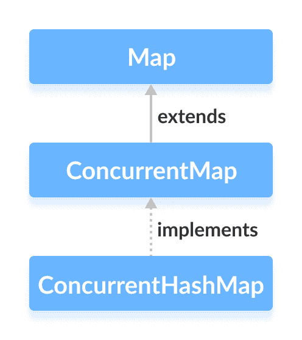

# Java ConcurrentHashMap

> 原文： [https://www.programiz.com/java-programming/concurrenthashmap](https://www.programiz.com/java-programming/concurrenthashmap)

#### 在本教程中，我们将借助示例学习 Java ConcurrentHashMap 类及其操作。

Java 集合框架的`ConcurrentHashMap`类提供了线程安全的映射。 也就是说，多个线程可以一次访问该映射，而不会影响映射中条目的一致性。

它实现了 [ConcurrentMap 接口](/java-programming/concurrentmap "Java ConcurrentMap Interface")。



* * *

## 创建一个 ConcurrentHashMap

为了创建并发的哈希图，我们必须首先导入`java.util.concurrent.ConcurrentHashMap`包。 导入包后，就可以在 Java 中创建并发哈希图。

```java
// ConcurrentHashMap with capacity 8 and load factor 0.6
ConcurrentHashMap<Key, Value> numbers = new ConcurrentHashMap<>(8, 0.6f); 
```

在上面的代码中，我们创建了一个名为`number`的并发哈希图。

这里，

*   `键`-用于关联地图中每个元素（值）的唯一标识符
*   `值`-地图中与按键相关联的元素

注意部分`new ConcurrentHashMap<>(8, 0.6)`。 在此，第一个参数是**容量**，第二个参数是 **loadFactor** 。

*   **容量**-此映射的容量为 8。意味着，它可以存储 8 个条目。
*   **loadFactor** -此映射的负载因子为 0.6。 这意味着，只要我们的哈希表填充了 60%，条目就会移到新哈希表中，其大小是原始哈希表的两倍。

**默认容量和负载系数**

可以在不定义其容量和负载因子的情况下创建并发哈希图。 例如，

```java
// ConcurrentHashMap with default capacity and load factor
ConcurrentHashMap<Key, Value> numbers1 = new ConcurrentHashMap<>(); 
```

默认，

*   地图的容量将为 16
*   负载系数将为 0.75

* * *

## 从其他地图创建 ConcurrentHashMap

这是我们如何创建包含其他映射的所有元素的并发哈希映射。

```java
import java.util.concurrent.ConcurrentHashMap;
import java.util.HashMap;

class Main {
    public static void main(String[] args) {

        // Creating a hashmap of even numbers
        HashMap<String, Integer> evenNumbers = new HashMap<>();
        evenNumbers.put("Two", 2);
        evenNumbers.put("Four", 4);
        System.out.println("HashMap: " + evenNumbers);

        // Creating a concurrent hashmap from other map
        ConcurrentHashMap<String, Integer> numbers = new ConcurrentHashMap<>(evenNumbers);
        numbers.put("Three", 3);
        System.out.println("ConcurrentHashMap: " + numbers);
    }
} 
```

**输出**

```java
HashMap: {Four=4, Two=2}
ConcurrentHashMap: {Four=4, Two=2, Three=3} 
```

* * *

## ConcurrentHashMap 的方法

`ConcurrentHashMap`类提供允许我们在地图上执行各种操作的方法。

* * *

## 将元素插入 ConcurrentHashMap

*   `put()`-将指定的键/值映射插入到映射中
*   `putAll()`-将指定映射中的所有条目插入此映射中
*   `putIfAbsent()`-如果映射中不存在指定的键，则将指定的键/值映射插入到映射中

例如，

```java
import java.util.concurrent.ConcurrentHashMap;

class Main {
    public static void main(String[] args) {
        // Creating ConcurrentHashMap of even numbers
        ConcurrentHashMap<String, Integer> evenNumbers = new ConcurrentHashMap<>();

        // Using put()
        evenNumbers.put("Two", 2);
        evenNumbers.put("Four", 4);

        // Using putIfAbsent()
        evenNumbers.putIfAbsent("Six", 6);
        System.out.println("ConcurrentHashMap of even numbers: " + evenNumbers);

        //Creating ConcurrentHashMap of numbers
        ConcurrentHashMap<String, Integer> numbers = new ConcurrentHashMap<>();
        numbers.put("One", 1);

        // Using putAll()
        numbers.putAll(evenNumbers);
        System.out.println("ConcurrentHashMap of numbers: " + numbers);
    }
} 
```

**Output**

```java
ConcurrentHashMap of even numbers: {Six=6, Four=4, Two=2}
ConcurrentHashMap of numbers: {Six=6, One=1, Four=-4, Two=2} 
```

* * *

## 访问 ConcurrentHashMap 元素

**1.使用 entrySet（），keySet（）和 values（）**

*   `entrySet()`-返回一组所有键/值映射的映射
*   `keySet()`-返回地图的所有键的集合
*   `values()`-返回一组所有映射值

For example,

```java
import java.util.concurrent.ConcurrentHashMap;

class Main {
    public static void main(String[] args) {
        ConcurrentHashMap<String, Integer> numbers = new ConcurrentHashMap<>();

        numbers.put("One", 1);
        numbers.put("Two", 2);
        numbers.put("Three", 3);
        System.out.println("ConcurrentHashMap: " + numbers);

        // Using entrySet()
        System.out.println("Key/Value mappings: " + numbers.entrySet());

        // Using keySet()
        System.out.println("Keys: " + numbers.keySet());

        // Using values()
        System.out.println("Values: " + numbers.values());
    }
} 
```

**Output**

```java
ConcurrentHashMap: {One=1, Two=2, Three=3}
Key/Value mappings: [One=1, Two=2, Three=3]
Keys: [One, Two, Three]
Values: [1, 2, 3] 
```

**2.使用 get（）和 getOrDefault（）**

*   `get()`-返回与指定键关联的值。 如果找不到密钥，则返回`null`。
*   `getOrDefault()`-返回与指定键关联的值。 如果找不到密钥，则返回指定的默认值。

For example,

```java
import java.util.concurrent.ConcurrentHashMap;

class Main {
    public static void main(String[] args) {

        ConcurrentHashMap<String, Integer> numbers = new ConcurrentHashMap<>();
        numbers.put("One", 1);
        numbers.put("Two", 2);
        numbers.put("Three", 3);
        System.out.println("ConcurrentHashMap: " + numbers);

        // Using get()
        int value1 = numbers.get("Three");
        System.out.println("Using get(): " + value1);

        // Using getOrDefault()
        int value2 = numbers.getOrDefault("Five", 5);
        System.out.println("Using getOrDefault(): " + value2);
    }
} 
```

**Output**

```java
ConcurrentHashMap: {One=1, Two=2, Three=3}
Using get(): 3
Using getOrDefault(): 5 
```

* * *

## 删除 ConcurrentHashMap 元素

*   `remove(key)`-返回并从映射中删除与指定键关联的条目
*   `remove(key, value)`-仅当指定键映射到指定值并返回布尔值时，才从映射中删除条目

For example,

```java
import java.util.concurrent.ConcurrentHashMap;

class Main {
    public static void main(String[] args) {

        ConcurrentHashMap<String, Integer> numbers = new ConcurrentHashMap<>();
        numbers.put("One", 1);
        numbers.put("Two", 2);
        numbers.put("Three", 3);
        System.out.println("ConcurrentHashMap: " + numbers);

        // remove method with single parameter
        int value = numbers.remove("Two");
        System.out.println("Removed value: " + value);

        // remove method with two parameters
        boolean result = numbers.remove("Three", 3);
        System.out.println("Is the entry {Three=3} removed? " + result);

        System.out.println("Updated ConcurrentHashMap: " + numbers);
    }
} 
```

**Output**

```java
ConcurrentHashMap: {One=1, Two=2, Three=3}
Removed value: 2
Is the entry {Three=3} removed? True
Updated ConcurrentHashMap: {One=1} 
```

* * *

## 批量 ConcurrentHashMap 操作

`ConcurrentHashMap`类提供了可以安全地应用于并发映射的不同批量操作。

### 1\. forEach（）方法

`forEach()`方法遍历我们的条目并执行指定的功能。

它包括两个参数。

*   `parallelismThreshold` -它指定在映射中有多少个元素运算之后并行执行。
*   `转换器`-在将数据传递到指定功能之前，它将转换数据。

For example,

```java
import java.util.concurrent.ConcurrentHashMap;

class Main {
    public static void main(String[] args) {

        ConcurrentHashMap<String, Integer> numbers = new ConcurrentHashMap<>();
        numbers.put("One", 1);
        numbers.put("Two", 2);
        numbers.put("Three", 3);
        System.out.println("ConcurrentHashMap: " + numbers);

        // forEach() without transformer function
        numbers.forEach(4, (k, v) -> System.out.println("key: " + k + " value: " + v));

        // forEach() with transformer function
        System.out.print("Values are ");
        numbers.forEach(4, (k, v) -> v, (v) -> System.out.print(v + ", "));
    }
} 
```

**Output**

```java
ConcurrentHashMap: {One = 1, Two = 2, Three = 3}
key: One value: 1
key: Two value: 2
key: Three value: 3
Values are 1, 2, 3, 
```

在上面的程序中，我们使用了并行阈值 **4** 。 这意味着，如果映射包含 4 个条目，则该操作将并行执行。

**forEach（）方法**的变体

*   `forEachEntry()`-为每个条目执行指定的功能
*   `forEachKey()`-为每个键执行指定的功能
*   `forEachValue()`-为每个值执行指定的功能

* * *

### 2\. search（）方法

`search()`方法基于指定的函数搜索地图并返回匹配的条目。

在此，指定的功能确定要搜索的条目。

它还包括一个可选参数`parallelThreshold`。 并行阈值指定在映射中有多少个元素之后并行执行该操作。

For example,

```java
import java.util.concurrent.ConcurrentHashMap;

class Main {
    public static void main(String[] args) {

        ConcurrentHashMap<String, Integer> numbers = new ConcurrentHashMap<>();
        numbers.put("One", 1);
        numbers.put("Two", 2);
        numbers.put("Three", 3);
        System.out.println("ConcurrentHashMap: " + numbers);

        // Using search()
        String key = numbers.search(4, (k, v) -> {return v == 3 ? k: null;});
        System.out.println("Searched value: " + key);

    }
} 
```

**Output**

```java
ConcurrentHashMap: {One=1, Two=2, Three=3}
Searched value: Three 
```

**search（）方法**的变体

*   `searchEntries()`-搜索功能应用于键/值映射
*   `searchKeys()`-搜索功能仅适用于按键
*   `searchValues()`-搜索功能仅应用于值

* * *

### 3\. reduce（）方法

`reduce()`方法累积（聚集）映射中的每个条目。 当我们需要所有条目来执行一项共同任务（例如添加地图的所有值）时，可以使用此方法。

It includes two parameters.

*   `parallelismThreshold` -它指定在映射了几个元素之后，并行执行映射中的操作。
*   `转换器`-在将数据传递到指定功能之前，它将转换数据。

For example,

```java
import java.util.concurrent.ConcurrentHashMap;

class Main {
    public static void main(String[] args) {

        ConcurrentHashMap<String, Integer> numbers = new ConcurrentHashMap<>();
        numbers.put("One", 1);
        numbers.put("Two", 2);
        numbers.put("Three", 3);
        System.out.println("ConcurrentHashMap: " + numbers);

        // Using search()
        int sum = numbers.reduce(4, (k, v) -> v, (v1, v2) -> v1 + v2);
        System.out.println("Sum of all values: " + sum);

    }
} 
```

**Output**

```java
ConcurrentHashMap: {One=1, Two=2, Three=3}
Sum of all values: 6 
```

在上面的程序中，请注意以下语句

```java
numbers.reduce(4, (k, v) -> v, (v1, v2) -> v1+v2); 
```

Here,

*   4 是并行阈值
*   `（k，v）-> v`是一种转换器功能。 它将键/值映射仅转换为值。
*   `（v1，v2）-> v1 + v2`是归约器功能。 它收集所有值并添加所有值。

**reduce（）方法**的变体

*   `reduceEntries()`-使用指定的 reducer 函数返回收集所有条目的结果
*   `reduceKeys()`-使用指定的 reducer 函数返回收集所有键的结果
*   `reduceValues()`-使用指定的 reducer 函数返回收集所有值的结果

* * *

## ConcurrentHashMap 和 HashMap

这是`ConcurrentHashMap`和 [HashMap](/java-programming/hashmap "Java HashMap Class") 之间的一些区别，

*   `ConcurrentHashMap`是**线程安全的**集合。 也就是说，多个线程可以同时访问和修改它。
*   `ConcurrentHashMap`提供用于批量操作的方法，例如`forEach()`，`search()`和`reduce()`。

* * *

## 为什么选择 ConcurrentHashMap？

*   `ConcurrentHashMap`类允许多个线程同时访问其条目。
*   默认情况下，并发哈希图分为 **16 个段**。 这就是为什么允许 16 个线程同时并发修改映射的原因。 但是，任何数量的线程一次都可以访问该映射。
*   如果指定的键已经存在，则`putIfAbsent()`方法将不会覆盖映射中的条目。
*   它提供自己的同步。