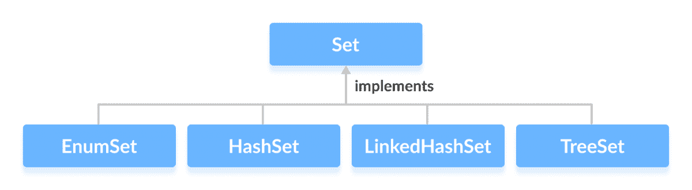
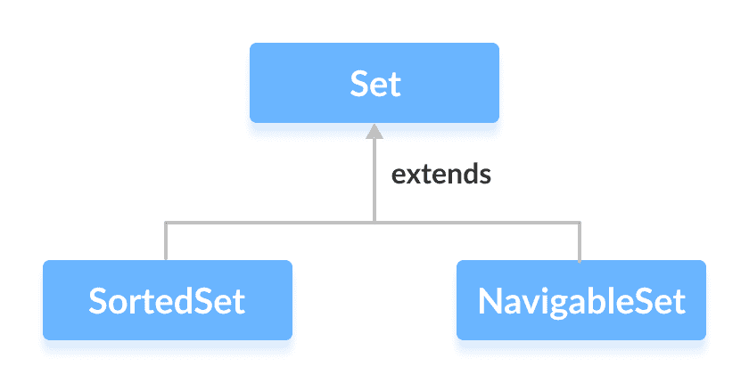

# Java Set 接口

> 原文： [https://www.programiz.com/java-programming/set](https://www.programiz.com/java-programming/set)

#### 在本教程中，我们将学习 Java 中的 Set 接口及其方法。

Java `Collections`框架的`Set`接口提供 Java 中数学集的功能。 它扩展了`Collection`接口。

与`List`接口不同，集合不能包含重复的元素。

* * *

## 实现 Set 的类

由于`Set`是一个接口，因此我们无法从中创建对象。

为了使用`Set`接口的功能，我们可以使用以下类：

*   [哈希集](/java-programming/hashset "Java HashSet class")
*   [LinkedHashSet](/java-programming/linkedhashset "Java LinkedHashSet class")
*   [EnumSet](/java-programming/enumset "Java EnumSet Class")
*   [树集](/java-programming/treeset "Java TreeSet class")

这些类在`Collections`框架中定义，并实现`Set`接口。



* * *

## 扩展 Set 的接口

`Set`接口还通过以下子接口扩展：

*   [SortedSet](/java-programming/sortedset "Java SortedSet Interface")
*   [NavigableSet](/java-programming/navigableset "Java NavigableSet Interface")



* * *

## 如何使用 Set？

在 Java 中，必须导入`java.util.Set`包才能使用`Set`。

```java
// Set implementation using HashSet
Set<String> animals = new HashSet<>(); 
```

在这里，我们创建了一个名为`动物`的`Set`。 我们已经使用`HashSet`类来实现`Set`接口。

* * *

## 设置方法

`Set`接口包含`Collection`接口的所有方法。 这是因为`Collection`是`Set`的超级接口。

`Set`界面中还提供了`Collection`界面的一些常用方法：

*   **add（）**-将指定的元素添加到集合中
*   **addAll（）**-将指定集合的​​所有元素添加到集合中
*   **iterator（）**-返回一个迭代器，该迭代器可用于顺序访问集合中的元素
*   **remove（）**-从集合中移除指定的元素
*   **removeAll（）**-从另一个指定集合中存在的集合中删除所有元素
*   **keepAll（）**-保留集合中所有还存在于另一个指定集合中的所有元素
*   **clear（）**-从集合中删除所有元素
*   **size（）**-返回集合的长度（元素数）
*   **toArray（）**-返回包含集合中所有元素的数组
*   **contains（）**-如果集合包含指定的元素，则返回`true`
*   **containsAll（）**-如果集合包含指定集合的​​所有元素，则返回`true`
*   **hashCode（）**-返回哈希码值（集合中元素的地址）

要了解`Set`接口的更多方法，请访问 [Java Set（Java 官方文档）](https://docs.oracle.com/javase/7/docs/api/java/util/Set.html)。

* * *

## 设定作业

Java `Set`接口允许我们执行基本的数学集合运算，例如并集，交集和子集。

*   **联合**-要获得两组 `x` 和 `y` 的联合，我们可以使用`x.addAll(y)`
*   **交集**-要获得两组 `x` 和 `y` 的交集，我们可以使用`x.retainAll(y)`
*   **子集**-检查 `x` 是否是 `y` 的子集，我们可以使用`y.containsAll(x)`

* * *

## Set 接口的实现

**1.实现 HashSet 类**

```java
import java.util.Set;
import java.util.HashSet;

class Main {

    public static void main(String[] args) {
        // Creating a set using the HashSet class
        Set<Integer> set1 = new HashSet<>();

        // Add elements to the set1
        set1.add(2);
        set1.add(3);
        System.out.println("Set1: " + set1);

        // Creating another set using the HashSet class
        Set<Integer> set2 = new HashSet<>();

        // Add elements
        set2.add(1);
        set2.add(2);
        System.out.println("Set2: " + set2);

        // Union of two sets
        set2.addAll(set1);
        System.out.println("Union is: " + set2);
    }
} 
```

**输出**

```java
Set1: [2, 3]
Set2: [1, 2]
Union is: [1, 2, 3] 
```

要了解有关`HashSet`的更多信息，请访问 [Java HashSet](/java-programming/hashset "Java HashSet Class") 。

* * *

**2.实现 TreeSet 类**

```java
import java.util.Set;
import java.util.TreeSet;
import java.util.Iterator;

class Main {

    public static void main(String[] args) {
        // Creating a set using the TreeSet class
        Set<Integer> numbers = new TreeSet<>();

        // Add elements to the set
        numbers.add(2);
        numbers.add(3);
        numbers.add(1);
        System.out.println("Set using TreeSet: " + numbers);

        // Access Elements using iterator()
        System.out.print("Accessing elements using iterator(): ");
        Iterator<Integer> iterate = numbers.iterator();
        while(iterate.hasNext()) {
            System.out.print(iterate.next());
            System.out.print(", ");
        }

    }
} 
```

**Output**

```java
Set using TreeSet: [1, 2, 3]
Accessing elements using iterator(): 1, 2, 3, 
```

要了解有关`TreeSet`的更多信息，请访问 [Java TreeSet](/java-programming/treeset "Java TreeSet Class") 。

* * *

现在我们知道了`Set`是什么，我们将在接下来的教程中在`EnumSet`，`HashSet`，`LinkedHashSet`和`TreeSet`等类中看到其实现。