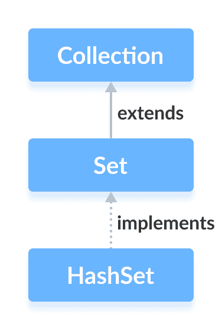

# Java `HashSet`类

> 原文： [https://www.programiz.com/java-programming/hashset](https://www.programiz.com/java-programming/hashset)

#### 在本教程中，我们将学习 Java `HashSet`类。 我们将借助示例学习不同的哈希集方法和操作。

Java 集合框架的`HashSet`类提供了哈希表数据结构的功能。

它实现了[`Set`接口](/java-programming/set "Java Set Interface")。



* * *

## 创建一个`HashSet`

为了创建哈希集，我们必须首先导入`java.util.HashSet`包。

导入包后，就可以使用 Java 创建哈希集。

```java
// HashSet with 8 capacity and 0.75 load factor
HashSet<Integer> numbers = new HashSet<>(8, 0.75); 
```

在这里，我们创建了一个名为`numbers`的哈希集。

注意，新的`HashSet<>(8, 0.75)`部分。 在此，第一个参数是`capcity`，第二个参数是`loadFactor`。

*   **`capcity`** - 此哈希集的容量为 8。意味着，它可以存储 8 个元素。
*   **`loadFactor`** - 此哈希集的负载因子为 0.6。 这意味着，只要我们的哈希集填充了 60%，元素就会移到新哈希表中，该哈希表的大小是原始哈希表的两倍。

**默认容量和负载系数**

创建哈希表而不定义其容量和负载因子是可能的。 例如，

```java
// HashSet with default capacity and load factor
HashSet<Integer> numbers1 = new HashSet<>(); 
```

默认，

*   哈希集的容量将为 16
*   负载系数将为 0.75

* * *

## `HashSet`的方法

`HashSet`类提供了各种方法，使我们可以对设备执行各种操作。

* * *

## 将元素插入`HashSet`

*   `add()`-将指定的元素插入到集合中
*   `addAll()`-将指定集合的​​所有元素插入集合

例如，

```java
import java.util.HashSet;

class Main {
    public static void main(String[] args) {
        HashSet<Integer> evenNumber = new HashSet<>();

        // Using add() method
        evenNumber.add(2);
        evenNumber.add(4);
        evenNumber.add(6);
        System.out.println("HashSet: " + evenNumber);

        HashSet<Integer> numbers = new HashSet<>();

        // Using addAll() method
        numbers.addAll(evenNumber);
        numbers.add(5);
        System.out.println("New HashSet: " + numbers);
    }
} 
```

**输出**

```java
HashSet: [2, 4, 6]
New HashSet: [2, 4, 5, 6] 
```

* * *

## 访问`HashSet`元素

要访问哈希集的元素，我们可以使用`iterator()`方法。 为了使用此方法，我们必须导入`java.util.Iterator`包。 例如，

```java
import java.util.HashSet;
import java.util.Iterator;

class Main {
    public static void main(String[] args) {
        HashSet<Integer> numbers = new HashSet<>();
        numbers.add(2);
        numbers.add(5);
        numbers.add(6);
        System.out.println("HashSet: " + numbers);

        // Calling iterator() method
        Iterator<Integer> iterate = numbers.iterator();
        System.out.print("HashSet using Iterator: ");
        // Accessing elements
        while(iterate.hasNext()) {
            System.out.print(iterate.next());
            System.out.print(", ");
        }
    }
} 
```

**输出**：

```java
HashSet: [2, 5, 6]
HashSet using Iterator: 2, 5, 6, 
```

* * *

## 删除元素

*   `remove()`-从集合中删除指定的元素
*   `removeAll()`-从集合中删除所有元素

例如：

```java
import java.util.HashSet;

class Main {
    public static void main(String[] args) {
        HashSet<Integer> numbers = new HashSet<>();
        numbers.add(2);
        numbers.add(5);
        numbers.add(6);
        System.out.println("HashSet: " + numbers);

        // Using remove() method
        boolean value1 = numbers.remove(5);
        System.out.println("Is 5 removed? " + value1);

        boolean value2 = numbers.removeAll(numbers);
        System.out.println("Are all elements removed? " + value2);
    }
} 
```

**输出**：

```java
HashSet: [2, 5, 6]
Is 5 removed? true
Are all elements removed? true 
```

* * *

## 集的操作

`HashSet`类的各种方法也可以用于执行各种设置操作。

* * *

## 并集

两个执行两个集合之间的联合，我们可以使用`addAll()`方法。 例如，

```java
import java.util.HashSet;

class Main {
    public static void main(String[] args) {
        HashSet<Integer> evenNumbers = new HashSet<>();
        evenNumbers.add(2);
        evenNumbers.add(4);
        System.out.println("HashSet1: " + evenNumbers);

        HashSet<Integer> numbers = new HashSet<>();
        numbers.add(1);
        numbers.add(3);
        System.out.println("HashSet2: " + numbers);

        // Union of two set
        numbers.addAll(evenNumbers);
        System.out.println("Union is: " + numbers);
    }
} 
```

**输出**：

```java
HashSet1: [2, 4]
HashSet2: [1, 3]
Union is: [1, 2, 3, 4] 
```

* * *

## 交集

要执行两个集合之间的相交，我们可以使用`retainAll()`方法。 例如

```java
import java.util.HashSet;

class Main {
    public static void main(String[] args) {
        HashSet<Integer> primeNumbers = new HashSet<>();
        primeNumbers.add(2);
        primeNumbers.add(3);
        System.out.println("HashSet1: " + primeNumbers);

        HashSet<Integer> evenNumbers = new HashSet<>();
        evenNumbers.add(2);
        evenNumbers.add(4);
        System.out.println("HashSet2: " + evenNumbers);

        // Intersection of two sets
        evenNumbers.retainAll(primeNumbers);
        System.out.println("Intersection is: " + evenNumbers);
    }
} 
```

**输出**：

```java
HashSet1: [2, 3]
HashSet2: [2, 4]
Intersection is: [2] 
```

* * *

## 差集

要计算两组之间的差异，我们可以使用`removeAll()`方法。 例如，

```java
import java.util.HashSet;

class Main {
    public static void main(String[] args) {
        HashSet<Integer> primeNumbers = new HashSet<>();
        primeNumbers.add(2);
        primeNumbers.add(3);
        primeNumbers.add(5);
        System.out.println("HashSet1: " + primeNumbers);

        HashSet<Integer> oddNumbers = new HashSet<>();
        oddNumbers.add(1);
        oddNumbers.add(3);
        oddNumbers.add(5);
        System.out.println("HashSet2: " + oddNumbers);

        // Difference between HashSet1 and HashSet2
        primeNumbers.removeAll(oddNumbers);
        System.out.println("Difference : " + primeNumbers);
    }
} 
```

**输出**：

```java
HashSet1: [2, 3, 5]
HashSet2: [1, 3, 5]
Difference: [2] 
```

* * *

## 子集

要检查一个集合是否是另一个集合的子集，我们可以使用`containsAll()`方法。 例如，

```java
import java.util.HashSet;

class Main {
    public static void main(String[] args) {
        HashSet<Integer> numbers = new HashSet<>();
        numbers.add(1);
        numbers.add(2);
        numbers.add(3);
        numbers.add(4);
        System.out.println("HashSet1: " + numbers);

        HashSet<Integer> primeNumbers = new HashSet<>();
        primeNumbers.add(2);
        primeNumbers.add(3);
        System.out.println("HashSet2: " + primeNumbers);

        // Check if primeNumbers is a subset of numbers
        boolean result = numbers.containsAll(primeNumbers);
        System.out.println("Is HashSet2 is subset of HashSet1? " + result);
    }
} 
```

**输出**：

```java
HashSet1: [1, 2, 3, 4]
HashSet2: [2, 3]
Is HashSet2 is a subset of HashSet1? true 
```

* * *

## `HashSet`的其他方法

| 方法 | 描述 |
| --- | --- |
| `clone()` | 创建`HashSet`的副本 |
| `contains()` | 在`HashSet`中搜索指定的元素，并返回布尔结果 |
| `isEmpty()` | 检查`HashSet`是否为空 |
| `size()` | 返回`HashSet`的大小 |
| `clear()` | 从`HashSet`中删除所有元素 |

要了解有关`HashSet`方法的更多信息，请访问 [Java HashSet（Java 官方文档）](https://docs.oracle.com/javase/7/docs/api/java/util/HashSet.html)。

* * *

## 为什么要使用`HashSet`？

在 Java 中，如果我们必须随机访问元素，则通常使用`HashSet`。 这是因为使用哈希码访问哈希表中的元素。

元素的哈希码是唯一的标识，有助于标识哈希表中的元素。

`HashSet`不能包含重复的元素。 因此，每个哈希集元素都有一个唯一的哈希码。

**注意**：哈希集未同步。 也就是说，如果多个线程同时访问哈希集，并且其中一个线程修改了哈希集。 然后，它必须在外部同步。