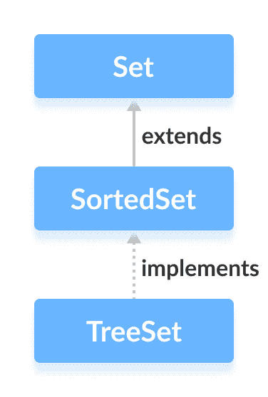

# Java SortedSet 接口

> 原文： [https://www.programiz.com/java-programming/sortedset](https://www.programiz.com/java-programming/sortedset)

#### 在本教程中，我们将通过一个示例来学习 Java 中的 SortedSet 接口及其方法。

Java Collections 框架的`SortedSet`接口用于以一组顺序存储元素。

它扩展了 [Set 接口](/java-programming/set "Java Set Interface")。


* * *

## 实现 SortedSet 的类

为了使用`SortedSet`接口的功能，我们需要使用实现它的`TreeSet`类。



* * *

## 如何使用 SortedSet？

要使用`SortedSet`，我们必须首先导入`java.util.SortedSet`程序包。

```java
// SortedSet implementation by TreeSet class
SortedSet<String> animals = new TreeSet<>(); 
```

我们使用`TreeSet`类创建了一个名为`动物`的排序集。

在这里，我们没有使用任何参数来创建排序集。 因此，该集合将自然排序。

* * *

## SortedSet 的方法

`SortedSet`接口包括 [Set 接口](/java-programming/set "Java Set Interface")的所有方法。 这是因为`Set`是`SortedSet`的超级接口。

除了`Set`接口中包含的方法外，`SortedSet`接口还包括以下方法：

*   **比较器（）**-返回一个比较器，可用于对集合中的元素进行排序
*   **first（）**-返回集合的第一个元素
*   **last（）**-返回集合的最后一个元素
*   **headSet（element）**-返回指定元素之前的所有元素
*   **tailSet（element）**-在指定元素之后（包括指定元素）返回集合中的所有元素
*   **subSet（element1，element2）**-返回`element1`和`element2`之间的所有元素，包括`element1`

* * *

## TreeSet 类中 SortedSet 的实现

```java
import java.util.SortedSet;
import java.util.TreeSet;

class Main {

    public static void main(String[] args) {
        // Creating SortedSet using the TreeSet
        SortedSet<Integer> numbers = new TreeSet<>();

        // Insert elements to the set
        numbers.add(1);
        numbers.add(2);
        numbers.add(3);
        numbers.add(4);
        System.out.println("SortedSet: " + numbers);

        // Access the element
        int firstNumber = numbers.first();
        System.out.println("First Number: " + firstNumber);

        int lastNumber = numbers.last();
        System.out.println("Last Number: " + lastNumber);

        // Remove elements
        boolean result = numbers.remove(2);
        System.out.println("Is the number 2 removed? " + result);
    }
} 
```

**输出**

```java
SortedSet: [1, 2, 3, 4]
First Number: 1
Last Number: 4
Is the number 2 removed? true 
```

要了解有关`TreeSet`的更多信息，请访问 [Java TreeSet](/java-programming/treeset "Java TreeSet Class") 。

* * *

现在我们知道了`SortedSet`接口，我们将使用`TreeSet`类学习其实现。