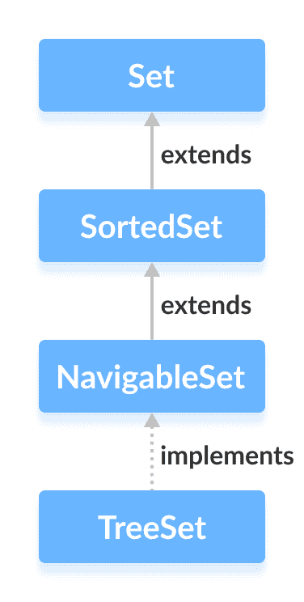

# Java TreeSet

> 原文： [https://www.programiz.com/java-programming/treeset](https://www.programiz.com/java-programming/treeset)

#### 在本教程中，我们将借助示例学习 Java TreeSet 类及其各种操作和方法。

Java 集合框架的`TreeSet`类提供树数据结构的功能。

它扩展了 [NavigableSet 接口](/java-programming/navigableset "Java NavigableSet Interface")。



* * *

## 创建一个树集

为了创建树集，我们必须首先导入`java.util.TreeSet`包。

导入包后，可以使用以下方法在 Java 中创建`TreeSet`。

```java
 TreeSet<Integer> numbers = new TreeSet<>(); 
```

在这里，我们创建了没有任何参数的`TreeSet`。 在这种情况下，`TreeSet`中的元素会自然排序（升序）。

但是，我们可以使用`Comparator`接口自定义元素的排序。 我们将在本教程的后面部分中学习它。

* * *

## TreeSet 的方法

`TreeSet`类提供了各种方法，使我们可以对设备执行各种操作。

* * *

## 将元素插入 TreeSet

*   `add()`-将指定的元素插入到集合中
*   `addAll()`-将指定集合的​​所有元素插入集合

例如，

```java
import java.util.TreeSet;

class Main {
    public static void main(String[] args) {

        TreeSet<Integer> evenNumbers = new TreeSet<>();

        // Using the add() method
        evenNumbers.add(2);
        evenNumbers.add(4);
        evenNumbers.add(6);
        System.out.println("TreeSet: " + evenNumbers);

        TreeSet<Integer> numbers = new TreeSet<>();
        numbers.add(1);

        // Using the addAll() method
        numbers.addAll(evenNumbers);
        System.out.println("New TreeSet: " + numbers);
    }
} 
```

**输出**

```java
TreeSet: [2, 4, 6]
New TreeSet: [1, 2, 4, 6] 
```

* * *

## 访问 TreeSet 元素

要访问树集的元素，我们可以使用`iterator()`方法。 为了使用此方法，我们必须导入`java.util.Iterator`包。 例如，

```java
import java.util.TreeSet;
import java.util.Iterator;

class Main {
    public static void main(String[] args) {
        TreeSet<Integer> numbers = new TreeSet<>();
        numbers.add(2);
        numbers.add(5);
        numbers.add(6);
        System.out.println("TreeSet: " + numbers);

        // Calling iterator() method
        Iterator<Integer> iterate = numbers.iterator();
        System.out.print("TreeSet using Iterator: ");
        // Accessing elements
        while(iterate.hasNext()) {
            System.out.print(iterate.next());
            System.out.print(", ");
        }
    }
} 
```

**Output**

```java
TreeSet: [2, 5, 6]
TreeSet using Iterator: 2, 5, 6, 
```

* * *

## 删除元素

*   `remove()`-从集合中删除指定的元素
*   `removeAll()`-从集合中删除所有元素

For example,

```java
import java.util.TreeSet;

class Main {
    public static void main(String[] args) {
        TreeSet<Integer> numbers = new TreeSet<>();
        numbers.add(2);
        numbers.add(5);
        numbers.add(6);
        System.out.println("TreeSet: " + numbers);

        // Using the remove() method
        boolean value1 = numbers.remove(5);
        System.out.println("Is 5 removed? " + value1);

        // Using the removeAll() method
        boolean value2 = numbers.removeAll(numbers);
        System.out.println("Are all elements removed? " + value2);
    }
} 
```

**Output**

```java
TreeSet: [2, 5, 6]
Is 5 removed? true
Are all elements removed? true 
```

* * *

## 导航方法

由于`TreeSet`类实现了`NavigableSet`，因此它提供了各种方法来浏览树集的元素。

### 1\. first（）和 last（）方法

*   `first()`-返回集合的第一个元素
*   `last()`-返回集合的最后一个元素

For example,

```java
import java.util.TreeSet;

class Main {
    public static void main(String[] args) {
        TreeSet<Integer> numbers = new TreeSet<>();
        numbers.add(2);
        numbers.add(5);
        numbers.add(6);
        System.out.println("TreeSet: " + numbers);

        // Using the first() method
        int first = numbers.first();
        System.out.println("First Number: " + first);

        // Using the last() method
        int last = numbers.last();
        System.out.println("Last Number: " + last);
    }
} 
```

**Output**

```java
TreeSet: [2, 5, 6]
First Number: 2
Last Number: 6 
```

* * *

### 2\. ceiling（），floor（），higher（）和 lower（）方法

*   **upper（element）**-返回大于指定`element`的那些元素中的最低元素。
*   **lower（element）**-返回小于指定`element`的那些元素中最大的元素。
*   **ceiling（element）**-返回大于指定`元素`的那些元素中的最低元素。 如果通过的`元素`存在于树集中，则它返回作为参数传递的`element`。
*   **floor（element）**-返回小于指定`element`的那些元素中最大的元素。 如果传递的`元素`存在于树集中，则它返回作为参数传递的`element`。

For example,

```java
import java.util.TreeSet;

class Main {
    public static void main(String[] args) {
        TreeSet<Integer> numbers = new TreeSet<>();
        numbers.add(2);
        numbers.add(5);
        numbers.add(4);
        numbers.add(6);
        System.out.println("TreeSet: " + numbers);

        // Using higher()
        System.out.println("Using higher: " + numbers.higher(4));

        // Using lower()
        System.out.println("Using lower: " + numbers.lower(4));

        // Using ceiling()
        System.out.println("Using ceiling: " + numbers.ceiling(4));

        // Using floor()
        System.out.println("Using floor: " + numbers.floor(3));

    }
} 
```

**Output**

```java
TreeSet: [2, 4, 5, 6]
Using higher: 5
Using lower: 2
Using ceiling: 4
Using floor: 2 
```

* * *

### 3\. pollfirst（）和 pollLast（）方法

*   `pollFirst()`-返回并从集合中删除第一个元素
*   `pollLast()`-返回并从集合中删除最后一个元素

For example,

```java
import java.util.TreeSet;

class Main {
    public static void main(String[] args) {
        TreeSet<Integer> numbers = new TreeSet<>();
        numbers.add(2);
        numbers.add(5);
        numbers.add(4);
        numbers.add(6);
        System.out.println("TreeSet: " + numbers);

        // Using pollFirst()
        System.out.println("Removed First Element: " + numbers.pollFirst());

        // Using pollLast()
        System.out.println("Removed Last Element: " + numbers.pollLast());

        System.out.println("New TreeSet: " + numbers);
    }
} 
```

**Output**

```java
TreeSet: [2, 4, 5, 6]
Removed First Element: 2
Removed Last Element: 6
New TreeSet: [4, 5] 
```

* * *

### 4\. headSet（），tailSet（）和 subSet（）方法

* * *

### headSet（element，booleanValue）

`headSet()`方法返回指定的`元素`（作为参数传递）之前的树集的所有元素。

`布尔值`参数是可选的。 其默认值为`false`。

如果`true`作为`布尔值`传递，则该方法返回指定元素之前的所有元素，包括指定元素。

For example,

```java
import java.util.TreeSet;

class Main {
    public static void main(String[] args) {
        TreeSet<Integer> numbers = new TreeSet<>();
        numbers.add(2);
        numbers.add(5);
        numbers.add(4);
        numbers.add(6);
        System.out.println("TreeSet: " + numbers);

        // Using headSet() with default boolean value
        System.out.println("Using headSet without boolean value: " + numbers.headSet(5));

        // Using headSet() with specified boolean value
        System.out.println("Using headSet with boolean value: " + numbers.headSet(5, true));
    }
} 
```

**Output**

```java
TreeSet: [2, 4, 5, 6]
Using headSet without boolean value: [2, 4]
Using headSet with boolean value: [2, 4, 5] 
```

* * *

### tailSet（element，booleanValue）

`tailSet()`方法返回包含指定的`元素`的指定`元素`（作为参数传递）之后的树集的所有元素。

`布尔值`参数是可选的。 其默认值为`true`。

如果`false`作为`布尔值`传递，则该方法返回指定的`元素`之后的所有元素，而不包括指定的`元素`。

For example,

```java
import java.util.TreeSet;

class Main {
    public static void main(String[] args) {
        TreeSet<Integer> numbers = new TreeSet<>();
        numbers.add(2);
        numbers.add(5);
        numbers.add(4);
        numbers.add(6);
        System.out.println("TreeSet: " + numbers);

        // Using tailSet() with default boolean value
        System.out.println("Using tailSet without boolean value: " + numbers.tailSet(4));

        // Using tailSet() with specified boolean value
        System.out.println("Using tailSet with boolean value: " + numbers.tailSet(4, false));
    }
} 
```

**Output**

```java
TreeSet: [2, 4, 5, 6]
Using tailSet without boolean value: [4, 5, 6]
Using tailSet with boolean value: [5, 6] 
```

* * *

### subSet（e1，bv1，e2，bv2）

`subSet()`方法返回`e1`和`e2`之间的所有元素，包括`e1`。

`bv1`和`bv2`是可选参数。`bv1`的默认值为`true`，`bv2`的默认值为`false`。

如果`false`作为`bv1`传递，则该方法返回`e1`和`e2`之间的所有元素，但不包括`e1`。

如果`true`作为`bv2`传递，则该方法返回`e1`和`e2`之间的所有元素，包括`e1`。

For example,

```java
import java.util.TreeSet;

class Main {
    public static void main(String[] args) {
        TreeSet<Integer> numbers = new TreeSet<>();
        numbers.add(2);
        numbers.add(5);
        numbers.add(4);
        numbers.add(6);
        System.out.println("TreeSet: " + numbers);

        // Using subSet() with default boolean value
        System.out.println("Using subSet without boolean value: " + numbers.subSet(4, 6));

        // Using subSet() with specified boolean value
        System.out.println("Using subSet with boolean value: " + numbers.subSet(4, false, 6, true));
    }
} 
```

**Output**

```java
TreeSet: [2, 4, 5, 6]
Using subSet without boolean value: [4, 5]
Using subSet with boolean value: [5, 6] 
```

* * *

## 设定作业

`TreeSet`类的方法也可以用于执行各种设置操作。

* * *

### 集联合

为了执行两个集合之间的联合，我们使用`addAll()`方法。 例如，

```java
import java.util.TreeSet;;

class Main {
    public static void main(String[] args) {
        TreeSet<Integer> evenNumbers = new TreeSet<>();
        evenNumbers.add(2);
        evenNumbers.add(4);
        System.out.println("TreeSet1: " + evenNumbers);

        TreeSet<Integer> numbers = new TreeSet<>();
        numbers.add(1);
        numbers.add(2);
        numbers.add(3);
        System.out.println("TreeSet2: " + numbers);

        // Union of two sets
        numbers.addAll(evenNumbers);
        System.out.println("Union is: " + numbers);

    }
} 
```

**Output**

```java
TreeSet1: [2, 4]
TreeSet2: [1, 2, 3]
Union is: [1, 2, 3, 4] 
```

* * *

### 集的交集

为了执行两个集合之间的交集，我们使用`retainAll()`方法。 例如，

```java
import java.util.TreeSet;;

class Main {
    public static void main(String[] args) {
        TreeSet<Integer> evenNumbers = new TreeSet<>();
        evenNumbers.add(2);
        evenNumbers.add(4);
        System.out.println("TreeSet1: " + evenNumbers);

        TreeSet<Integer> numbers = new TreeSet<>();
        numbers.add(1);
        numbers.add(2);
        numbers.add(3);
        System.out.println("TreeSet2: " + numbers);

        // Intersection of two sets
        numbers.retainAll(evenNumbers);
        System.out.println("Intersection is: " + numbers);
    }
} 
```

**Output**

```java
TreeSet1: [2, 4]
TreeSet2: [1, 2, 3]
Intersection is: [2] 
```

* * *

### 集的差异

要计算两组之间的差异，我们可以使用`removeAll()`方法。 例如，

```java
import java.util.TreeSet;;

class Main {
    public static void main(String[] args) {
        TreeSet<Integer> evenNumbers = new TreeSet<>();
        evenNumbers.add(2);
        evenNumbers.add(4);
        System.out.println("TreeSet1: " + evenNumbers);

        TreeSet<Integer> numbers = new TreeSet<>();
        numbers.add(1);
        numbers.add(2);
        numbers.add(3);
        numbers.add(4);
        System.out.println("TreeSet2: " + numbers);

        // Difference between two sets
        numbers.removeAll(evenNumbers);
        System.out.println("Difference is: " + numbers);
    }
} 
```

**Output**

```java
TreeSet1: [2, 4]
TreeSet2: [1, 2, 3, 4]
Difference is: [1, 3] 
```

* * *

### 集合的子集

为了检查一个集合是否是另一个集合的子集，我们使用`containsAll()`方法。 例如，

```java
import java.util.TreeSet;

class Main {
    public static void main(String[] args) {
        TreeSet<Integer> numbers = new TreeSet<>();
        numbers.add(1);
        numbers.add(2);
        numbers.add(3);
        numbers.add(4);
        System.out.println("TreeSet1: " + numbers);

        TreeSet<Integer> primeNumbers = new TreeSet<>();
        primeNumbers.add(2);
        primeNumbers.add(3);
        System.out.println("TreeSet2: " + primeNumbers);

        // Check if primeNumbers is subset of numbers
        boolean result = numbers.containsAll(primeNumbers);
        System.out.println("Is TreeSet2 subset of TreeSet1? " + result);
    }
} 
```

**Output**

```java
TreeSet1: [1, 2, 3, 4]
TreeSet2: [2, 3]
Is TreeSet2 subset of TreeSet1? True 
```

* * *

## TreeSet 的其他方法

| 方法 | 描述 |
| `clone()` | 创建 TreeSet 的副本 |
| `contains()` | 在 TreeSet 中搜索指定的元素并返回布尔结果 |
| `isEmpty()` | 检查`TreeSet`是否为空 |
| `size()` | 返回`TreeSet`的大小 |
| `clear()` | 从`TreeSet`中删除所有元素 |

要了解更多信息，请访问 [Java TreeSet（Java 官方文档）](https://docs.oracle.com/javase/7/docs/api/java/util/TreeSet.html)。

* * *

## 树集与 哈希集

`TreeSet`和`HashSet`都实现`Set`接口。 但是，它们之间存在一些差异。

*   与`HashSet`不同，`TreeSet`中的元素以某种顺序存储。 这是因为`TreeSet`也实现了`SortedSet`接口。
*   `TreeSet`提供了一些易于导航的方法。 例如`first()`，`last()`，`headSet(`，`tailSet()`等。这是因为`TreeSet`也实现了`NavigableSet`接口。
*   对于基本操作（例如添加，删除，包含和调整大小），`HashSet`比`TreeSet`更快。

* * *

## TreeSet 比较器

在以上所有示例中，树集元素都是自然排序的。 但是，我们也可以自定义元素的顺序。

为此，我们需要基于对树集中的哪些元素进行排序来创建自己的比较器类。 例如，

```java
import java.util.TreeSet;
import java.util.Comparator;

class Main {
    public static void main(String[] args) {

        // Creating a tree set with customized comparator
        TreeSet<String> animals = new TreeSet<>(new CustomComparator());

        animals.add("Dog");
        animals.add("Zebra");
        animals.add("Cat");
        animals.add("Horse");
        System.out.println("TreeSet: " + animals);
    }

    // Creating a comparator class
    public static class CustomComparator implements Comparator<String> {

        @Override
        public int compare(String animal1, String animal2) {
            int value =  animal1.compareTo(animal2);

            // elements are sorted in reverse order
            if (value > 0) {
                return -1;
            }
            else if (value < 0) {
                return 1;
            }
            else {
                return 0;
            }
        }
    }
} 
```

**Output**

```java
TreeSet: [Zebra, Horse, Dog, Cat] 
```

在上面的示例中，我们创建了一个树集，将`CustomComparator`类作为参数传递。

`CustomComparator`类实现`Comparator`接口。

然后，我们覆盖`compare()`方法。 现在，该方法将以相反的顺序对元素进行排序。

要了解更多信息，请访问 [Java Comparator（Java 官方文档）](https://docs.oracle.com/javase/8/docs/api/java/util/Comparator.html)。