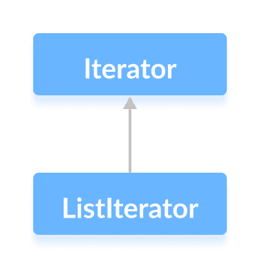

# Java `ListIterator`接口

> 原文： [https://www.programiz.com/java-programming/listiterator](https://www.programiz.com/java-programming/listiterator)

#### 在本教程中，我们将通过一个示例来学习 Java `ListIterator`接口。

Java 集合框架的`ListIterator`接口提供了访问列表元素的功能。

它是双向的。 这意味着它允许我们在两个方向上迭代列表的元素。

它扩展了`Iterator`接口。



`List`接口提供了`listIterator()`方法，该方法返回`ListIterator`接口的实例。

* * *

## `ListIterator`的方法

`ListIterator`接口提供了可用于对列表元素执行各种操作的方法。

*   `hasNext()`-如果列表中存在一个元素，则返回`true`
*   `next()`-返回列表的下一个元素
*   `nextIndex()`返回`next()`方法将返回的元素的索引
*   `previous()`-返回列表的前一个元素
*   `previousIndex()`-返回`previous()`方法将返回的元素的索引
*   `remove()`-删除`next()`或`previous()`返回的元素
*   `set()`-用指定的元素替换`next()`或`previous()`返回的元素

* * *

### 示例 1：`ListIterator`的实现

在下面的示例中，我们在`ArrayList`中实现了`ListIterator`接口的`next()`，`nextIndex()`和`hasNext()`方法。

```java
import java.util.ArrayList;
import java.util.ListIterator;

class Main {
    public static void main(String[] args) {
        // Creating an ArrayList
        ArrayList<Integer> numbers = new ArrayList<>();
        numbers.add(1);
        numbers.add(3);
        numbers.add(2);
        System.out.println("ArrayList: " + numbers);

        // Creating an instance of ListIterator
        ListIterator<Integer> iterate = numbers.listIterator();

        // Using the next() method
        int number1 = iterate.next();
        System.out.println("Next Element: " + number1);

        // Using the nextIndex()
        int index1 = iterate.nextIndex();
        System.out.println("Position of Next Element: " + index1);

        // Using the hasNext() method
        System.out.println("Is there any next element? " + iterate.hasNext());
    }
} 
```

**输出**

```java
ArrayList: [1, 3, 2]
Next Element: 1
Position of Next Element: 1
Is there any next element? true 
```

* * *

### 示例 2：`ListIterator`的实现

在下面的示例中，我们在`ArrayList`中实现了`ListIterator`接口的`previous()`和`previousIndex()`方法。

```java
import java.util.ArrayList;
import java.util.ListIterator;

class Main {
    public static void main(String[] args) {
        // Creating an ArrayList
        ArrayList<Integer> numbers = new ArrayList<>();
        numbers.add(1);
        numbers.add(3);
        numbers.add(2);
        System.out.println("ArrayList: " + numbers);

        // Creating an instance of ListIterator
        ListIterator<Integer> iterate = numbers.listIterator();
        iterate.next();
        iterate.next();

        // Using the previous() method
        int number1 = iterate.previous();
        System.out.println("Previous Element: " + number1);

        // Using the previousIndex()
        int index1 = iterate.previousIndex();
        System.out.println("Position of the Previous element: " + index1);
    }
} 
```

**输出**：

```java
ArrayList: [1, 3, 2]
Previous Element: 3
Position of the Previous Element: 0 
```

在上面的示例中，最初，`Iterator`的实例在 1 之前。由于在 1 之前没有元素，因此调用`previous()`方法将引发异常。

然后，我们使用了`next()`方法两次。 现在`Iterator`实例将在 3 到 2 之间。

因此，`previous()`方法返回 3。