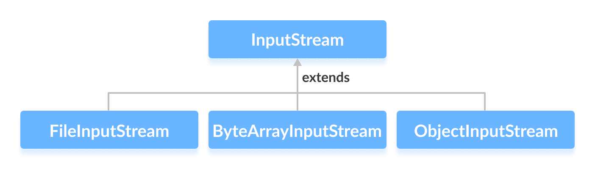

# Java InputStream 类

> 原文： [https://www.programiz.com/java-programming/inputstream](https://www.programiz.com/java-programming/inputstream)

#### 在本教程中，我们将借助一个示例来学习 Java InputStream 类及其方法。

`java.io`程序包的`InputStream`类是一个抽象超类，它表示字节的输入流。

由于`InputStream`是抽象类，因此它本身没有用。 但是，其子类可用于读取数据。

* * *

## InputStream 的子类

为了使用`InputStream`的功能，我们可以使用其子类。 他们之中有一些是：

*   [FileInputStream](/java-programming/fileinputstream "Java FileInputStream Class")
*   [ByteArrayInputStream](/java-programming/bytearrayinputstream "Java ByteArrayInputStream Class")
*   [ObjectInputStream](https://www.programiz.com/java-programming/objectinputstream)



在下一个教程中，我们将学习所有这些子类。

* * *

## 创建一个 InputStream

为了创建 InputStream，我们必须首先导入`java.io.InputStream`包。 导入包后，就可以创建输入流。

```java
// Creates an InputStream
InputStream object1 = new FileInputStream(); 
```

在这里，我们使用`FileInputStream`创建了一个输入流。 这是因为`InputStream`是抽象类。 因此，我们无法创建`InputStream`的对象。

**注意**：我们还可以从`InputStream`的其他子类创建输入流。

* * *

## InputStream 的方法

`InputStream`类提供了由其子类实现的不同方法。 以下是一些常用方法：

*   `read()`-从输入流中读取一个字节的数据
*   `read(byte[] array)`-从流中读取字节并将其存储在指定的数组中
*   `available()`-返回输入流中可用的字节数
*   `mark()`-标记输入流中已读取数据的位置
*   `reset()`-将控件返回到流中设置标记的点
*   `markSupported()`-检查流中是否支持`mark()`和`reset()`方法
*   `skips()`-从输入流中跳过并丢弃指定数量的字节
*   `close()`-关闭输入流

* * *

## 示例：使用 FileInputStream 的 InputStream

这是我们可以使用`FileInputStream`类实现`InputStream`的方法。

假设我们有一个名为 **input.txt** 的文件，其内容如下。

```java
This is a line of text inside the file. 
```

让我们尝试使用`FileInputStream`（`InputStream`的子类）读取此文件。

```java
import java.io.FileInputStream;
import java.io.InputStream;

public class Main {
    public static void main(String args[]) {

        byte[] array = new byte[100];

        try {
            InputStream input = new FileInputStream("input.txt");

            System.out.println("Available bytes in the file: " + input.available());

            // Read byte from the input stream
            input.read(array);
            System.out.println("Data read from the file: ");

            // Convert byte array into string
            String data = new String(array);
            System.out.println(data);

            // Close the input stream
            input.close();
        }
        catch (Exception e) {
            e.getStackTrace();
        }
    }
} 
```

**输出**

```java
Available bytes in the file: 35
Data read from the file:
This is a line of text inside the file 
```

在上面的示例中，我们使用`FileInputStream`类创建了一个输入流。 输入流与文件 **input.txt** 链接。

```java
InputStream input = new FileInputStream("input.txt"); 
```

要从 **input.txt** 文件读取数据，我们实现了这两种方法。

```java
input.read(array);      // to read data from the input stream
input.close();             // to close the input stream 
```

要了解更多信息，请访问 [Java InputStream（官方 Java 文档）](https://docs.oracle.com/javase/7/docs/api/java/io/InputStream.html "Java InputStream (official Java documentation)")。