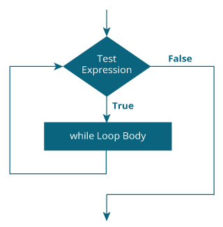

# Kotlin while 和 do...while 循环

> 原文： [https://www.programiz.com/kotlin-programming/while-loop](https://www.programiz.com/kotlin-programming/while-loop)

#### 循环在编程中用于重复特定的代码块。 在本文中，您将学习在 Kotlin 编程中创建 while 和 do...while 循环。

循环在编程中用于重复特定的代码块，直到满足特定条件为止（测试表达式为`false)`）。

循环使计算机成为有趣的机器。 想象一下，您需要在屏幕上打印一个句子 50 次。 好吧，您可以通过使用 print 语句 50 次（不使用循环）来做到这一点。 您需要打印一百万次句子怎么样？ 您需要使用循环。

您将在示例的帮助下了解两个循环`while`和`do..while`。

如果您熟悉 Java 中的 [while 和 do...while 循环，那么您也已经熟悉 Kotlin 中的这些循环。](/java-programming/do-while-loop "Java while and do...while Loop")

* * *

## Kotlin while Loop

`while`循环的语法为：

```kt
while (testExpression) {
    // codes inside body of while loop
}
```

* * *

### `while`循环如何工作？

括号内的测试表达式是[布尔型](/kotlin-programming/variable-types#boolean "Kotlin Boolean type")表达式。

如果测试表达式的计算结果为`true`，

*   `while`循环内的语句被执行。
*   然后，再次求值测试表达式。

该过程一直进行到测试表达式被求值为`false`为止。

如果测试表达式的计算结果为`false`，

*   `while`循环终止。

* * *

### `While`循环流程图



* * *

### 示例：Kotlin `while`循环

```kt
// Program to print line 5 times

fun main(args: Array<String>) {

    var i = 1

    while (i <= 5) {
        println("Line $i")
        ++i
    }
}
```

运行该程序时，输出为：

```kt
Line 1
Line 2
Line 3
Line 4
Line 5
```

注意，`while`循环内的`++i`语句。 在 5 次迭代之后，变量`i`将增加到 6。然后，将测试表达式`i <= 5`求值为`false`，然后循环终止。

* * *

如果循环的主体只有一个语句，则不必使用花括号`{ }`。

* * *

### 示例：计算自然数之和

```kt
// Program to compute the sum of natural numbers from 1 to 100.
fun main(args: Array<String>) {

    var sum = 0
    var i = 100

    while (i != 0) {
        sum += i     // sum = sum + i;
        --i
    }
    println("sum = $sum")
}
```

When you run the program, the output will be:

```kt
sum = 5050
```

在此，变量`sum`初始化为 0，并且`i`初始化为 100。在 while 循环的每次迭代中，变量`sum`被分配为`sum + i`，并且`i`的值减小 1，直到`i`等于 0。

```kt
1st iteration: sum = 0+100 = 100, i = 99
2nd iteration: sum = 100+99 = 199, i = 98
3rd iteration: sum = 199+98 = 297, i = 97
... .. ...
... .. ...
99th iteration: sum = 5047+2 = 5049, i = 1
100th iteration: sum = 5049+1 = 5050, i = 0 (then loop terminates)
```

要了解有关测试表达式及其求值方式的更多信息，请访问[比较](/kotlin-programming/operators#comparison-equality "Kotlin comparison Operators")和[逻辑运算符](/kotlin-programming/operators#logical "Kotlin Logical Operators")。

* * *

## Kotlin `do...while`循环

`do...while`循环类似于`while`循环，但有一个按键差异。 在检查测试表达式之前，`do...while`循环的主体将执行一次。

其语法为：

```kt
do {
   // codes inside body of do while loop
} while (testExpression);
```

* * *

### `do...while`循环如何工作？

`do`构造体内的代码只执行一次（无需检查`testExpression`）。 然后，检查测试表达式。

如果将测试表达式求值为`true`，则执行循环体内的代码，然后再次求值测试表达式。 该过程一直进行到测试表达式被求值为`false`为止。

当测试表达式求值为`false`时，`do..while`循环终止。

* * *

### `do...while`循环的流程图


* * *

### 示例：Kotlin `do...while`循环

下面的程序计算用户输入的数字总和，直到用户输入 0。

要从用户处获取输入，请使用`readline()`函数。 **推荐阅读**： [Kotlin 基本输入](/kotlin-programming/input-output#input)

```kt
fun main(args: Array<String>) {

    var sum: Int = 0
    var input: String

    do {
        print("Enter an integer: ")
        input = readLine()!!
        sum += input.toInt()

    } while (input != "0")

    println("sum = $sum")
}
```

当您运行程序时，输出将类似于：

```kt
Enter an integer: 4
Enter an integer: 3
Enter an integer: 2
Enter an integer: -6
Enter an integer: 0
sum = 3

```